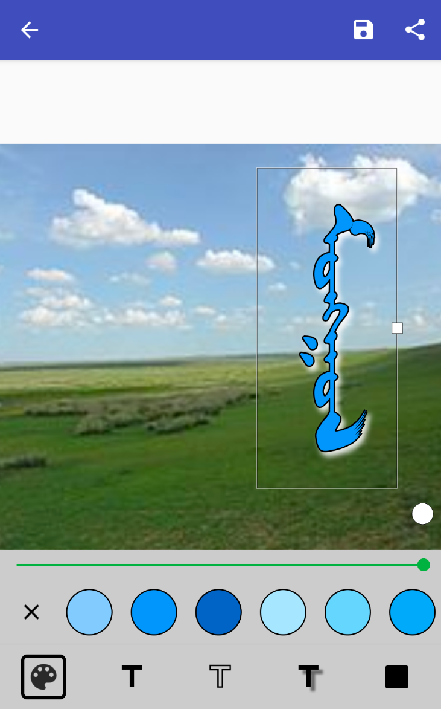

[中文](/apps/chimee/zh/)

## Version 3.3.1

  

  

  

  

The Chimee app allows users to write traditional Mongolian on Android phones and tablets and share it with social networking apps. Android 4.0 or above is required.

## Downloads

- <a href="/static/media/Chimee-3.3.1.apk" download>Download Chimee 3.3 for Android</a>

Also available on [Google Play](https://play.google.com/store/apps/details?id=net.studymongolian.chimee).

## Other links

- [Chimee Help Page](/apps/chimee/chimee-help/)
- <a href="/static/media/Chimee_2.1.0.apk" download>Old Chimee 2.1 version</a> (supports down to Android 2.2)
- [iOS version](https://itunes.apple.com/us/app/chimee/id1061532147) (not being updated)