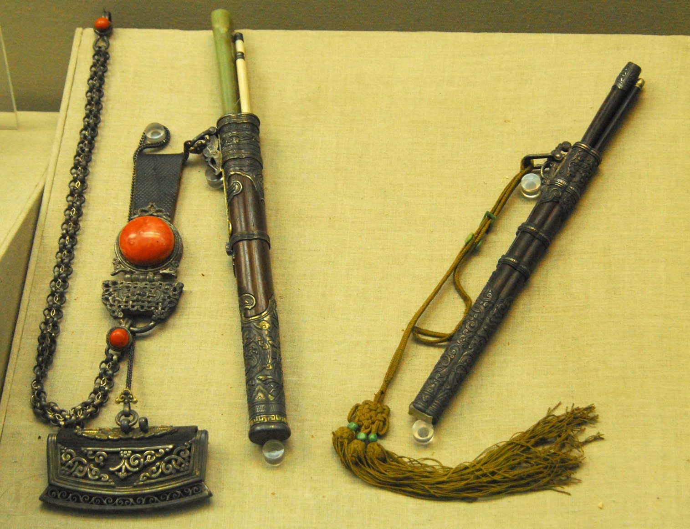
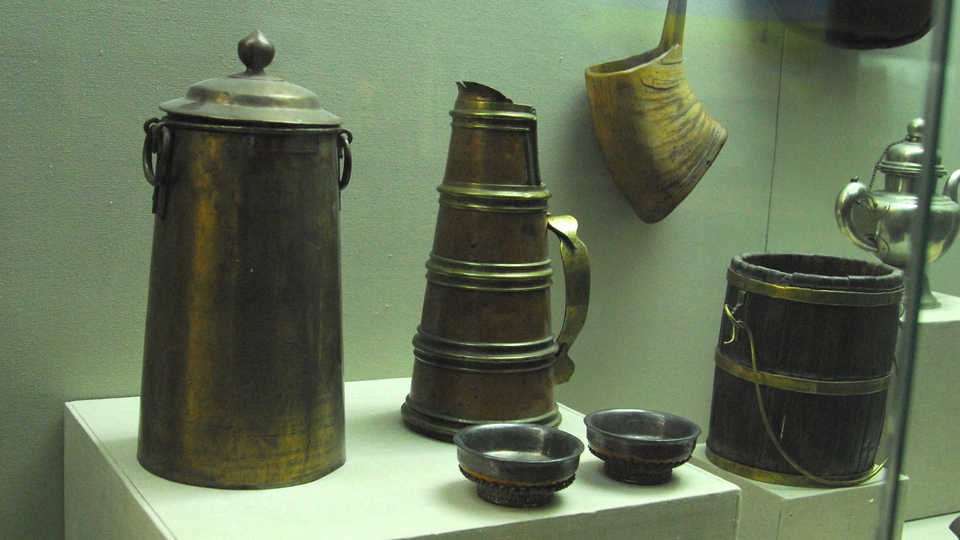

# Mongolian Culture

The Mongolians are spread across northern China. Besides living in the Inner Mongolia Autonomous Region, the Mongolian people also have autonomous counties in Xinjiang, Qinghai, Gansu, and the Northeast.

Although today many Mongolians have exchanged their felt tents for brick homes or city highrises, they are traditionally nomadic herdsmen and many still raise livestock on the grasslands. There are five main kinds of livestock that the Mongolians raise. These "tɑbə̌n xʊʃʊː mɑl" are the horse, camel, cow, sheep, and goat. Probably the most important of these is the horse. The Mongolians are known as the Horseback People, and horses have played an important part in their history and livelihood.

There is a great deal of variety among the Mongolian people. Just because they are all Mongolians doesn't mean that they all talk the same way, have the same customs, or wear the same clothes. In Russia, there are the Buryat Mongols. In Mongolia, there are the Khalkha Mongols, and here in China there are several other different Mongol groups. Here we can see different kinds of headdresses worn by Mongolian women from different places. One of the most famous for its beautiful ornamentation is from Ordos, which we can see here. It is made with precious materials and can be very heavy. Of course, a Mongolian woman would not wear it every day, but only for special occasions like a wedding. If you ever have a chance to go to a Mongolian wedding, you shouldn't miss it.

The bottles you see here are snuff bottles. The custom of taking snuff also gradually developed into a form of greeting. When two people met they would exchange snuff bottles and then return them. Today, though, handshaking is the more common greeting.

This utensil set has a pair of chopsticks, a knife, and a fire-starter. Mongolians would carry it with them so that no matter where they were, it would be convenient to prepare a meal and eat.

The environment in which people live has a major impact on their lifestyle, customs, and possessions. Ceramics and pottery are well known products of China, but you will notice here that Mongolian containers are made of wood, metal, and leather. Ceramic containers break too easily and were not suited to the nomadic life of Mongolians.

Have you had a chance to eat any Mongolian food? As long as you are not a vegetarian, you would probably enjoy it. Because the Mongolians were traditionally nomadic and not farmers, they didn't eat a lot of vegetables. Most of their diet consisted of meat and dairy products. Probably the most typical food is boiled beef or mutton. It is okay to use your hands to eat meat off the bone, but when you cut the meat with a knife you should cut towards yourself and not towards others.

Other foods include blood sausage, butter, milk skin, yogurt, cream, and cheese. There are so many different dairy products that English doesn't even have the words translate them all. The most common Mongolian drink is milk tea. Unlike the sweat milk teas in the West, Mongolian milk tea is usually somewhat salty. Mongolians also like to drink alcohol. The most traditional Mongolian alcohol is made from fermented mare's milk and is called kumis. Marco Polo even described this drink in his book, *The Travels of Marco Polo*. You may think fermented milk doesn't sound very good, but don't misunderstand. It's not rancid milk. It actually has a very mild flavor.

This scene from the museum shows a traditional Mongolian family living on the grassland.

That is somewhat idealized, though. Nowadays your are more likely to see Mongolian herdsmen in China live in a setting something like this:

Below is a model of a Mongolian tent, called a yurt. In some modern English publications it is also called a ger. This word comes directly from the Mongolian word for house or home, which is *ger*. They are more commonly used today in Outer Mongolia, but they have not disappeared from Mongolian life in China, either. The yurt is specially designed to be moved easily. This is due to the fact that as nomads they had to move several times a year to find grass for their livestock to eat. A few people can put up or take down a yurt in less than an hour. The frame of the yurt is made of wood. No nails are used. Instead, leather strips and rope are used to hold everything together. The walls are made from lattice-like sections that can expend and contract. Each section is tied together and attached to a door frame to form the circumference of the yurt. A small yurt might have four of these wall sections. Bigger yurts use six, eight, or even more wall sections. To make the roof, a round skylight frame is held up in the middle. Then wooden beams are placed into the notches that are in the skylight. The other end of the beams hook to the top of the wall. Everything is covered with felt, which is made from wool. When taken down, the yurt can all be loaded very compactly onto a cart and conveniently moved across the grassland.

There are many customs associated with yurts. For example, the door usually faces south or southeast. Men usually sit on the west side and women sit on the east side. Older people sit at the back of the yurt and younger people sit closer to the door. An essential piece of furniture is the fireplace in middle of the yurt. You might wonder what people use to make a fire. You notice that there are not a lot of trees out in the grassland. They don't burn wood. They use dried manure that they collect from their sheep and cows. Contrary to what you might think, after the manure is dry, it doesn't have a bad odor at all.

One word for "woman" in Mongolian is *busgui*. *Bus* is the word for the cloth belt and *ugui* means "without." When a girl marries she no longer wears the cloth belt, so a woman is "one who is without a cloth belt." Compare the woman and the man's clothes in the pictures below.

Today Mongolians in China generally only wear traditional clothes for special events like weddings or festivals. (And contrary to the name, many married women wear the clothe belts.)

In many places across Inner Mongolia you can see piles of rocks with hanging flags. These are called called an *ovoos* (/ɔbɔː/). They are found across the grasslands and on the tops of mountains. The *ovoo* has its roots in shamanism. Shamanism is the belief that everything in nature has a god or spirit. A shaman is a person who communicates between the spirit and human world. The highest god for the Mongolians is the god of the sky, called *Tenger*. The *ovoo* is a place of worship and even today people visit them to pray and make offerings. They walk around the *ovoo* three times in a clockwise direction. Sometimes there are special ceremonies where many people attend.

Another major event that occurs every summer during July or August is the Naadam Festival. There are three main sports that are played during this festival. They are wrestling, horse racing, and archery. These are known as the "three manly sports" (/ər iːn gʊrbə̌n nɑːdə̌m/), although today women also participate in some competitions. At the beginning of a Mongolian wresting match, the wrestlers dance into the ring surrounded by crowds of spectators. There are different styles of dances, but a common one is the lion dance. Then they all pair up two by two, shake hands, and begin to wrestle. The goal is to make your opponent touch the ground first. If any part of your body from your knees up touches the ground then you are out. Each round continues in this manner until there are only two wrestlers left in the final round.

There are other games that the Mongolians like to play, too. These bones here are the ankle bones from a sheep's two back legs. Children have many games that they play with them.

Mongolian chess, or *shatar* (/ʃɑtə̌r/), has basically the same rules as regular chess, but as you can see, the pieces look a little different. Chess itself is thought to have originated in India in the 6th century. From there it spread to Persia. After the Muslim conquest of Persia in the 7th century, chess was called *shatranj*, a name that is very similar to the Mongolian name *shatar*.

The Mongolians are excellent musicians, singers, and dancers. The most well known of the Mongolian instruments is called the horse head fiddle. It gets its name, of course, from the top being carved like a horse's head. Traditionally the two strings were also made from horse's hair, but today they are made from other materials. Unlike a guitar or violin, the strings are not pressed all the way down. Instead, the musician only touches them from above or below while drawing the bow across them.

As was mentioned, Mongolians historically believed in Shamanism. Although at the time of Genghis Khan some of the surrounding nomadic tribes believed in Nestorian Christianity, it was later Tibetan Buddhism that influenced the Mongolians the most. Kublai Khan and later Altan Khan had a big influence in spreading this religion among the Mongolians. Tibetan Buddhist monks are called lamas and can be found in the many temples across Inner Mongolia.

This overview of Mongolian culture is an adaptation of the [tour](http://v.youku.com/v_show/id_XNTA3MjAwNDA4.html) from the Inner Mongolian Museum in Hohhot.

## Comments

**Suragch** - November 4, 2013 at 11:20 pm

Why do Mongolians pile flags on rocks?

This is a Google search term that led someone to this page, but I did not talk about it above.

The flags are prayer flags. They are related to Tibetan Buddhism and often have Tibetan written on them. As I understand it, when the flags blow in the wind, it is like the prayers written on the flags are being prayed. The rocks are ovoos that I talked about above.

---

**Samantha** - March 28, 2015 at 11:46 am

What time period are the cutlery set with chopsticks from, do you know?

> **Suragch** - March 28, 2015 at 2:15 pm
>
> Most of the exhibits in the hall where this picture was taken are relatively recent (i.e. within the last 200 years or so, not Mongol Empire times). I don't have a clear picture of the label so next time I visit the museum I'll try to remember and check.
>
> Update: The plaque lists the date as 近代 (recent times), as opposed to 现代 (modern times). In China, "recent times" refers to the period of time from the first Opium War to the founding of the People's Republic, that is, 1840 to 1949. So the chopsticks/knife holder should date somewhere in that time period.

---

*Do you have a comment or question that would be helpful for others here? Copy the link to this page and [email me](/contact/) your comment or question.*