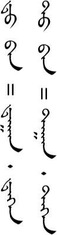

# Pronunciation

Pronunciation of the basic sounds is important to get a grasp on at the beginning of our language study. It isn't easy to distinguish and reproduce these new sounds, but we will have a much better communication experience in the future if we can master them now.

There doesn't seem to be any standard way of romanizing the Mongolian sounds with English letters, so we will be using the International Phonetic Alphabet (IPA) to represent them. (The IPA symbols that are used here are the same as in the *Mongolian in Seven Weeks* textbook. Linguistically speaking, not all of the symbols used are strictly accurate, but as long as we are consistent with ourselves we can learn to pronounce the sounds accurately.) A few of the symbols may look strange at first but you should get used to them fairly quickly. Remember, don't assume that you know what a letter should say. Learn the pronunciation by listening to and repeating our teachers.

### Vowel sounds
The first seven vowels below are the seven basic vowels of Mongolian. (See the section on Mongolian writing.)

| Sound | Listen | Sample words | Listen |
|---|---|---|---|
| ɑ | <AudioPlayer src="/audio/Vowel-1-a.mp3" /> | ɑːb (father), ʧɑg (time) | <AudioPlayer src="/audio/Pronunciation-vowels-words-1a.mp3" /> |
| ə | <AudioPlayer src="/audio/Vowel-2-e.mp3" /> | təgəːd (then), dəːr (before) | <AudioPlayer src="/audio/Pronunciation-vowels-words-2e.mp3" /> |
| i | <AudioPlayer src="/audio/Vowel-3-i.mp3" /> | ʃin (new), ʧiniː (your) | <AudioPlayer src="/audio/Pronunciation-vowels-words-3i.mp3" /> |
| ɔ | <AudioPlayer src="/audio/Vowel-4-o.mp3" /> | tɔm (big), mɔŋgə̌l | <AudioPlayer src="/audio/Pronunciation-vowels-words-4o.mp3" /> |
| ʊ | <AudioPlayer src="/audio/Vowel-5-u.mp3" /> | bʊruː (wrong), sʊː (sit) | <AudioPlayer src="/audio/Pronunciation-vowels-words-5u.mp3" /> |
| o | <AudioPlayer src="/audio/Vowel-6-o.mp3" /> | oːr (other), ondə̌g (egg) | <AudioPlayer src="/audio/Pronunciation-vowels-words-6o.mp3" /> |
| u | <AudioPlayer src="/audio/Vowel-7-u.mp3" /> | juː (what), səruːn (cool) | <AudioPlayer src="/audio/Pronunciation-vowels-words-7u.mp3" /> |
| æ | <AudioPlayer src="/audio/Vowel-8-ae.mp3" /> | sæn (good), ʧæː (tea) | <AudioPlayer src="/audio/Pronunciation-vowels-words-8ae.mp3" /> |
| e | <AudioPlayer src="/audio/Vowel-9-ei.mp3" /> | əərə̌gteː (male), ugue (not) | <AudioPlayer src="/audio/Pronunciation-vowels-words-9e.mp3" /> |
| œ | <AudioPlayer src="/audio/Vowel-10-oe.mp3" /> | œːms (socks), mœr (horse) | <AudioPlayer src="/audio/Pronunciation-vowels-words-10oe.mp3" /> |

It should also be noted that /i/ is sometimes also pronounced /ɪ/ (the sound in the English word "sit"), but we will just use one symbol for both sounds.

### Long Vowels vs. Short Vowels
The length of the vowel sound matters in Mongolian. It can change the meaning of a word. Listen to the difference between long and short vowel sounds.

| Long | Short | Listen |
|---|---|---|
| ʧɑːs (paper) | ʧɑs (snow) | <AudioPlayer src="/audio/Pronunciation-long-short-words-1a.mp3" /> |
| dəːr (above) | dər (pillow) | <AudioPlayer src="/audio/Pronunciation-long-short-words-2e.mp3" /> |
| biːr (pen) | ir (blade) | <AudioPlayer src="/audio/Pronunciation-long-short-words-3i.mp3" /> |
| xɔːl (food) | xɔl (far) | <AudioPlayer src="/audio/Pronunciation-long-short-words-4o.mp3" /> |
| ʊːl (mountain) | ʊl (sole) | <AudioPlayer src="/audio/Pronunciation-long-short-words-5u.mp3" /> |
| oːr (other) | orə̌m (milk skin) | <AudioPlayer src="/audio/Pronunciation-long-short-words-6o.mp3" /> |
| uːd (door) | ud (noon) | <AudioPlayer src="/audio/Pronunciation-long-short-words-7u.mp3" /> |
| æːl (village) | æl (which) | <AudioPlayer src="/audio/Pronunciation-long-short-words-8ae.mp3" /> |
| xœːn (after) | xœn (sheep) | <AudioPlayer src="/audio/Pronunciation-long-short-words-9oe.mp3" /> |

### Weak vowels
The last syllable of a word often has a week vowel sound. Although commonly stressed, it is very short and indistinct. The sound differs slightly according to the vowel in the syllable before it, but for simplicity's sake we are going to use just one symbol to represent this week vowel sound. I've noticed that on some computers this symbol does not display correctly. (It should look like an up-side-down e with a smile on top.) If so, you may need to install a Unicode font on your computer. [You can get directions here.](http://www.unicode.org/help/display_problems.html)

| Sound | Listen | Sample words |
|---|---|---|
| ə̌ | <AudioPlayer src="/audio/Pronunciation-weak-vowels-words.mp3" /> | tɑːnə̌r, sœnə̌n, ɔrə̌s, dəbtə̌r, udə̌ʃ, omə̌n, irə̌x, bæːʃə̌ŋ |

### Diphthongs
These are sounds formed by a combination of two different vowels.

| Sound | Sample words | Listen |
|---|---|---|
| ʊɑ | gʊɑ (mellon) | <AudioPlayer src="/audio/Pronunciation-diphthongs-words-1ua.mp3" /> |
| ʊi | ʊilə̌n (cry), xɑrə̌ŋgʊi (dark) | <AudioPlayer src="/audio/Pronunciation-diphthongs-words-2ui.mp3" /> |
| ue | irə̌x-gue (not come), mədə̌x-gue (not know) | <AudioPlayer src="/audio/Pronunciation-diphthongs-words-3ue.mp3" /> |
| ui | huitə̌n (cold), uilʧlə̌gʧ (waiter, waitress) | <AudioPlayer src="/audio/Pronunciation-diphthongs-words-4ui.mp3" /> |

### Consonants
Listen carefully and don't just assume that you know the sound. Some of these sounds are different than the English ones, especially in middle and at the end of words (note /b/, /l/, /r/ in particular).

| Sound | Listen | Sample words | Listen |
|---|---|---|---|
| n | <AudioPlayer src="/audio/Pronunciation-consonants-1-n.mp3" /> | nar (sun), undəs (root), hun (person) | <AudioPlayer src="/audio/Pronunciation-consonants-words-1n.mp3" /> |
| b | <AudioPlayer src="/audio/Pronunciation-consonants-2-b.mp3" /> | biːr , ɑbə̌g (take), ɑːb (father) | <AudioPlayer src="/audio/Pronunciation-consonants-words-2b.mp3" /> |
| p | <AudioPlayer src="/audio/Pronunciation-consonants-3-p.mp3" /> | pʊː (gun), kɑpitɑl (capital) | <AudioPlayer src="/audio/Pronunciation-consonants-words-3p.mp3" /> |
| x | <AudioPlayer src="/audio/Pronunciation-consonants-4-x.mp3" /> | xʊtə̌g (knife), uxə̌r (cow) | <AudioPlayer src="/audio/Pronunciation-consonants-words-4x.mp3" /> |
| g | <AudioPlayer src="/audio/Pronunciation-consonants-5-g.mp3" /> | gɑr (hand), əgʧ (older sister), ʧɑg (time) | <AudioPlayer src="/audio/Pronunciation-consonants-words-5g.mp3" /> |
| m | <AudioPlayer src="/audio/Pronunciation-consonants-6-m.mp3" /> | mœːr (horse), omə̌n (before), ɑm (mouth) | <AudioPlayer src="/audio/Pronunciation-consonants-words-6m.mp3" /> |
| l | <AudioPlayer src="/audio/Pronunciation-consonants-7-l.mp3" /> | lʊː (dragon), ɑldə̌r (name), ʃol (soup) | <AudioPlayer src="/audio/Pronunciation-consonants-words-7l.mp3" /> |
| s | <AudioPlayer src="/audio/Pronunciation-consonants-8-s.mp3" /> | suː (milk), ɑsə̌r (building), us (hair) | <AudioPlayer src="/audio/Pronunciation-consonants-words-8s.mp3" /> |
| ʃ | <AudioPlayer src="/audio/Pronunciation-consonants-9-sh.mp3" /> | ʃirəː (table), xʊʃʊː (banner), biʃ (no) | <AudioPlayer src="/audio/Pronunciation-consonants-words-9sh.mp3" /> |
| t | <AudioPlayer src="/audio/Pronunciation-consonants-10-t.mp3" /> | təməː (camel), xɑtʊː (hard) | <AudioPlayer src="/audio/Pronunciation-consonants-words-10t.mp3" /> |
| d | <AudioPlayer src="/audio/Pronunciation-consonants-11-d.mp3" /> | dɑrɑː (next), ɑdʊː (horse), xʊrʊːd (cheese) | <AudioPlayer src="/audio/Pronunciation-consonants-words-11d.mp3" /> |
| ʧ | <AudioPlayer src="/audio/Pronunciation-consonants-12-ch.mp3" /> | ʧæː (tea), ʧiʧə̌rlə̌g (park), nʊːʧ (secret) | <AudioPlayer src="/audio/Pronunciation-consonants-words-12ch.mp3" /> |
| ʤ | <AudioPlayer src="/audio/Pronunciation-consonants-13-j.mp3" /> | ʤɑm (road), ɑʤə̌l (work), əːʤ (mother) | <AudioPlayer src="/audio/Pronunciation-consonants-words-13j.mp3" /> |
| j | <AudioPlayer src="/audio/Pronunciation-consonants-14-y.mp3" /> | juː (what), bɑjə̌r (happiness), bəj (body) | <AudioPlayer src="/audio/Pronunciation-consonants-words-14y.mp3" /> |
| r | <AudioPlayer src="/audio/Pronunciation-consonants-15-r.mp3" /> | ɑrɑːʤiʊ (radio), ɑrə̌b (10), oːr (other) | <AudioPlayer src="/audio/Pronunciation-consonants-words-15r.mp3" /> |
| w | <AudioPlayer src="/audio/Pronunciation-consonants-16-w.mp3" /> | wisɑ (visa), wiːtɑːmin (vitamin), təlwis (TV) | <AudioPlayer src="/audio/Pronunciation-consonants-words-16w.mp3" /> |
| f | <AudioPlayer src="/audio/Pronunciation-consonants-17-f.mp3" /> | fəŋʧin (function), fɑrɑːnʦ (France) | <AudioPlayer src="/audio/Pronunciation-consonants-words-17f.mp3" /> |
| k | <AudioPlayer src="/audio/Pronunciation-consonants-18-k.mp3" /> | kilɔːgirɑːm (kilogram), piʣik (physics) | <AudioPlayer src="/audio/Pronunciation-consonants-words-18k.mp3" /> |
| ʦ | <AudioPlayer src="/audio/Pronunciation-consonants-19-ts.mp3" /> | ʦʊː (vinegar), frɑːnʦ (France) | <AudioPlayer src="/audio/Pronunciation-consonants-words-19tz.mp3" /> |
| ʣ | <AudioPlayer src="/audio/Pronunciation-consonants-20-dz.mp3" /> | ʣɑndə̌n (girl's name), piʣik (physics) | <AudioPlayer src="/audio/Pronunciation-consonants-words-20dz.mp3" /> |
| ŋ | <AudioPlayer src="/audio/Pronunciation-consonants-21-ng.mp3" /> | æŋg (class), xobə̌ŋ (cotton) | <AudioPlayer src="/audio/Pronunciation-consonants-words-21ng.mp3" /> |

## Comments

**Cong Nie** November 2, 2014 at 3:05 am

Thank you very much and I found this website really helpful. I just feel a bit confused because my friends in Inner Mongolia seems to use another “way” to express Mongolian. For example, they use “hoyor” to say number two on the internet since they don’t want to used Mogolian script for convicience. But when I type “hoyor” in Word, I cannnot get the correct Mogolian script, instead I get the correct when I type “hwyer”. What’s more, it is also different from the pronounciation you taught us which is “xɔjə̌r”. So I really don’t unterstand where “hoyor” comes from, same questions applies to tons of words like gvrab, dureb, bayartai…I really want to have a clue regarding those words so that I can used those words to talk to them….Thank you for your help!

> **Suragch** November 3, 2014 at 10:32 pm
> 
> This is a good question. The problem comes from English not having enough vowels and consonants to express all of the sounds in Mongolian. And since most people just have keyboards with English characters, they have to make do with that. The main problem are with the “u” vowels, that is, the last four of the seven main Mongolian vowels (4-ɔ, 5-ʊ, 6-o, 7-u). People generally use “o” and “u” to represent them when trying to send messages, but they are used inconsistently. Some people use “o” for the fourth and sixth vowels and “u” for the 5th and 7th. Other people use “o” for the 4th and 5th and “u” for the 6th and 7th. Either way, the the 4th is generally “o” and the 7th is generally “u”. That is why your friends wrote “hoyor”. The second “o” in “hoyor” is a muted or fast “ɔ” sound. This often happens in the final syllable of Mongolian words and this website just uses “ə̌” to represent a muted vowel sound whether it is /ɔ/ or /ɑ/ or /u/ or whatever. It’s not technically correct but it simplifies things. When writing sometimes people get a little more sophisticated and use the umlauts over “o” and “u” to represent the 6th and 7th sounds: o, u, ö, ü. However, these are not easy to write many times.
>
> IMEs (Input Method Editors), on the other hand, require you to specify when sound you want. Because Mongolian doesn’t use “v” and “w” is rare, these are often used for the 5th and 4th vowels respectively.

---

**Cong Nie** November 6, 2014 at 5:07 am

Thanks, your answer helps a lot!!! I am still interested in how you type Mongolian script using English Keybroad. For example, to write “dad” I need to type abu insteand of aab….I just think it is a bit hard because I can’t write the correct Mongolian script only based on pronounciation. I guess that also means that, if I am looking at the Mongolian script and read them using knowledge learned here, I might get some pronouncations wrong also? (so basically I am afraid that pronouciation and writing are not actualy related)…I don’t know, maybe I underestimate Mongolian lol

> **Suragch** November 10, 2014 at 1:22 pm
>
> I wouldn’t go so far as to say that Mongolian traditional writing and the actual pronunciation are unrelated, but (like English) the spellings of many words just have to be memorized apart from their pronunciations. In addition to the “u” vowels, t/d and x(h)/g can look identical in how they are written but are pronounced differently. There are some patterns, though, that you begin to pick up. For example, “-ɑgɑ-” in writing often becomes a long /ɑː/ when pronounced.

---

**Cong Nie** January 26, 2015 at 2:50 am

Sain bain-a uu!

As you can see above, I have been learning Mongolian here since last year and I have learned so much, again thank you for all your lessons!

Just have a few questions recently.

1 Based on my observation, currently there are two ways of writing Mongolian online. Take the sentence “how are your parents” for example, one way is “tanai aab eej qin sain uu”, while the other is “tan-u abu eji qini sain uu” Of course, for beginer like me, it is obviously easier to use the latter way since the spelling is the same as the traditional script. So based on your experience in Inner Mongolia, which way is more popular>

2 I remember you have mentioned that the sign for the present progressive tense is that the verb ends with “-ʤ bæːn” or “-ju bain-a” used the latter way I talked above. My question is why sometimes the “na” sound of it can be dropped, like “Nice to meet you” is “tɑːntæː ʊːlʤsə̌n dɑːn tɔŋ bɑjə̌rlʤ bæːn”

3 For lesson 7, the sentence “mɑnæː gər t ɑːb əːʤ bɔlə̌n duː tæː gəːn dorbuːl”, the grammar particle is still spelled as “ban” and it doesn’t give me any clue about the “g” sound. So in which case the “g” sound will be added？

Thank you very much for your help, I hope to receive your answers soon! 🙂

> **Suragch** January 27, 2015 at 6:38 pm
>
> 1. Honestly, not a lot of Mongolians in Inner Mongolia try to write Mongolian with English letters. Most just write in Chinese. A few do, though. There is not a standard but people try to write according to the pronunciation rather than according to the spelling of the traditional script. Note that this is the strategy that Cyrillic uses in Outer Mongolia. One good thing is that more options are becoming available for writing directly in the traditional script.
>
> 2. It is a characteristic of many Mongolian words (especially verbs and names) that they can be said with or without a long vowel sound at the end. The meaning is the same but perhaps the feeling changes. Examples: bæːn bæːnɑː (verb), bɔlə̌n bɔlnɔː (verb), hurə̌l hurləː (name), and many more. In the case of names, the form with the long vowel at the end is what you would say, for example, if you were calling them from across the field.
>
> 3. The ban/ben (and iyan/iyen) grammar particles ([reflexive suffixes](http://www.studymongolian.net/resources/grammar/spelling/#reflexive-suffix)) have a strange pronunciation, but thankfully it is predictable. They are pronounced ɑːn/əːn/ɔːn/oːn depending on the vowel sounds used in the previous word. And if the previous word ends with a long vowel sound (like “tæː” in your example) then a /g/ is inserted between the vowels.

---

**Cong Nie** February 9, 2015 at 1:50 pm

Thanks. I got one more question. Lately I looked at some Mogolian transcripts and saw some TV programs about learning Mongolian. I suddenly notice that actually people now use “degen/tegen” instead of “du ban/tu ban” written here. I am wondering if they are the same. To be honest, to me the former one is easier to understand because as you taught me before -ege- should prnounce like “-e-” right? So “degen/tegen” will be pronouced like “den/ten” which is exactly the same as the recordings here.

> Suragch
> February 9, 2015 at 2:16 pm
>
> Yes, these are equivalent and are pronounced the same, /dɑːn/dəːn/tɑːn/təːn/. (They differ according to vowel harmony and the last letter of the previous word.) I’m think the single word is more standard and I should probably change the lessons to reflect that. Thanks for your questions pointing this out.

---

**George Arfaras** February 8, 2018 at 7:34 pm

I was wondering if the H in the name Hulagu is silent or pronounce.

> **Suragch** March 1, 2018 at 12:18 am
>
> The Mongolian “h” is pronounced. It is sometimes written “kh” because the Mongolian h is different than the English h. In these lessons we use the IPA symbol /x/ to represent the Mongolian h.

---

**LeAnn** July 29, 2020 at 3:17 pm

I need specific words, like grandmother! How to pronounce.

> **Suragch** August 20, 2020 at 1:22 pm
>
> http://www.bolor-toli.com/ is a good resource for looking up the pronunciation of specific words.

---

**Victor** August 20, 2020 at 10:43 am

As far as I know, Mongolian l is an unvoiced consonant, ofted represented as ɬ or ɮ. Is this the case with the inner Mongolian, which this site’s resources are based on? I am confused because this page only uses /l/ to repersent l.

> **Suragch** August 20, 2020 at 1:28 pm
>
> The Inner Mongolian /l/ is not quite as strong of a lateral fricative as the Mongolian one is. I use /l/ on this site not as an accurate IPA symbol but more generally to represent the Inner Mongolian /l/ sound. I’m not sure if it’s voiced or voiceless. I’d be glad to have someone who is a better linguist than me answer. The sound recordings on this site should be enough to analyze it.

---

*Do you have a comment or question that would be helpful for others here? Copy the link to this page and [email me](/contact/) your comment or question.*