# Writing

Below we will learn the basic letters of the traditional Mongolian alphabet. As you may remember from reading the Background page, the traditional script is what is used in Inner Mongolia (as opposed to the Russian Cyrillic alphabet that is used to write Mongolian in the country of Mongolia). The Mongolians have been using it since the time of Genghis Khan, some 800 years. It is a unique writing system because words are written vertically rather than horizontally. We read from top to bottom and from left to right. As in probably every language, there are exceptions to the rules, but the Mongolian alphabet is fairly logical and systematic. And unlike Chinese, it uses phonetic letters that we can use to read words that we have never seen before.

Note that the letters shown here are in the handwritten form. The printed version that you would see in a book or on a sign looks somewhat different, but close enough that you should still be able to read them.

## Vowels

There are seven basic vowels in Mongolian. Letters are written a little differently according to whether they appear at the beginning, in the middle, or at the end of a word. The first, fourth, and fifth vowels are called masculine vowels. The second, sixth, and seventh vowels are called feminine vowels. Masculine and feminine vowels don't get used together in the same word, so a word can be either masculine or feminine. The third vowel (/i/) is neutral and can go in either masculine or feminine words. You will notice that a number of letters are written the same. That can give us some trouble for reading new words. Knowing whether it is masculine or feminine, though, can give us a clue. Let's not worry too much about reading now, though. First let's just get familiar with the basic letter forms and their sounds.

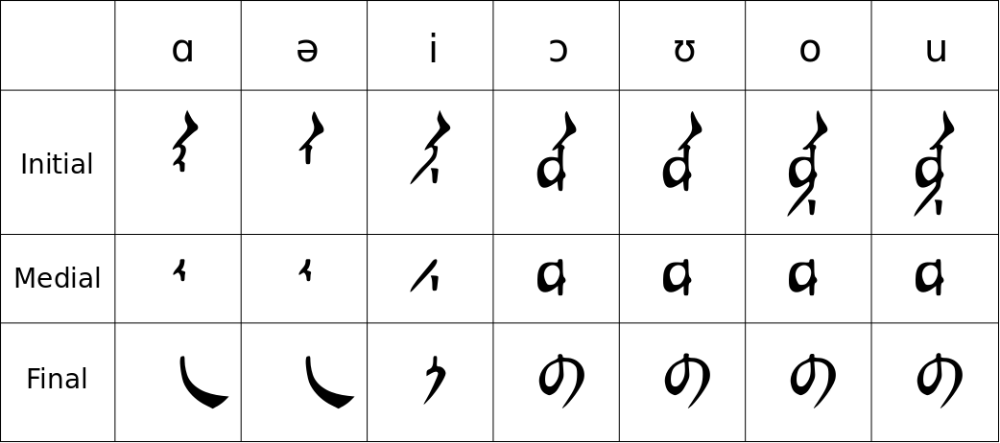

<AudioPlayerSeek src="/audio/sounds-00-vowels.mp3" />

## Consonants
Mongolian consonants come before or after a vowel. Although some words which have been borrowed from other languages may put two consonants next to each other in the same syllable, we won't see that very often. The custom in Inner Mongolia for learning our Mongolian "ABCs" is to pair each consonant with the seven vowels.

The first consonant is /n/. Notice that for /nɑ/ and /nə/ there are two different ways of writing them in the final position. "Spelling" a word differently like this may change the meaning, but the pronunciation is still the same. English does the same thing, right? Think about eye and I, there and their, and weather and whether. The spelling is different but the pronunciation is the same.

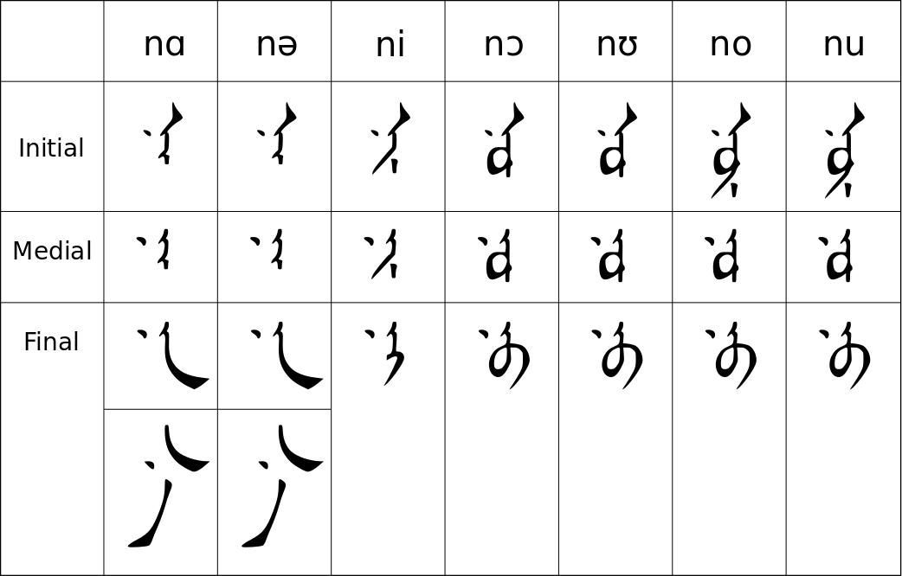

<AudioPlayerSeek src="/audio/sounds-01n.mp3" />

Next is the /b/ sound.

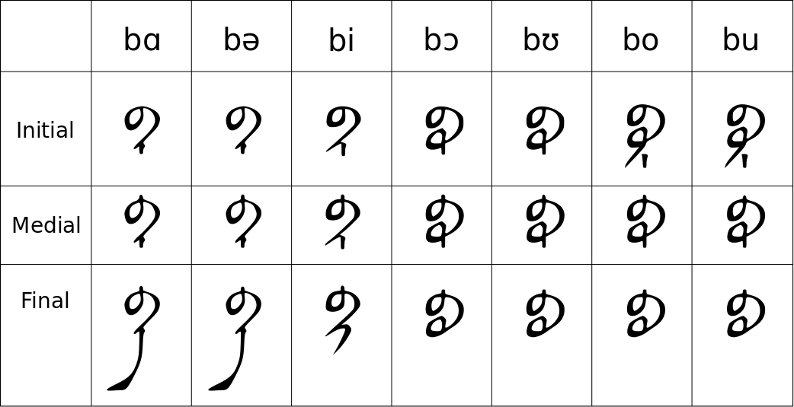

<AudioPlayerSeek src="/audio/sounds-02b.mp3" />

Next is /p/. It may not seem like we are going in order, but we are. It is worth your time to memorize this order because this is the order dictionaries arrange words in. Although p is not grouped with the other "foreign" letters ([see below](#letters-for-foreign-words)), it isn't used in very many Mongolian words and those that do use it are generally transliterated words from other languages. So although the normal written /ə/ is used here, in actual practice the "foreign" /ə/ is usually used in /p/ words.

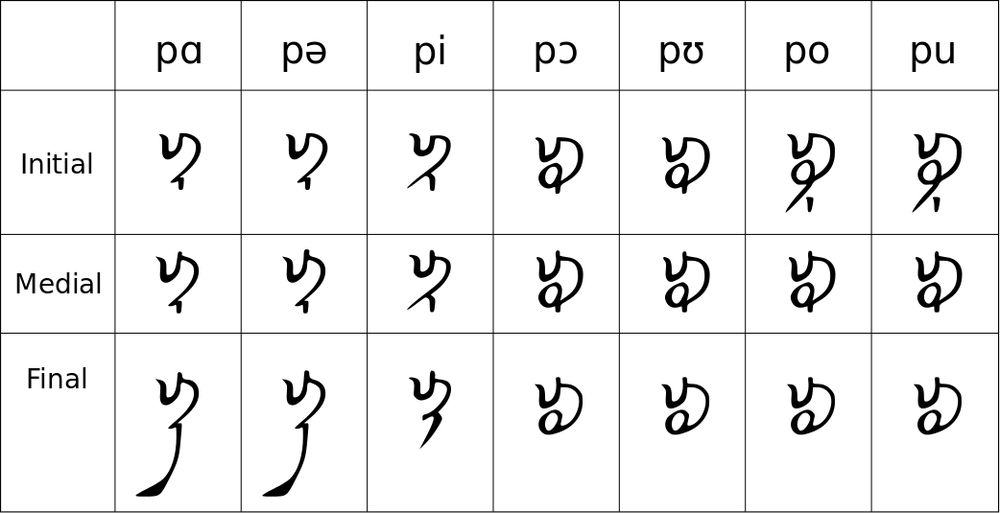

<AudioPlayerSeek src="/audio/sounds-03p.mp3" />

The next sound is /x/. Sometimes it is written as "h" or "kh" in English, as in Genghis Khan. It is a heavy /h/ sound.

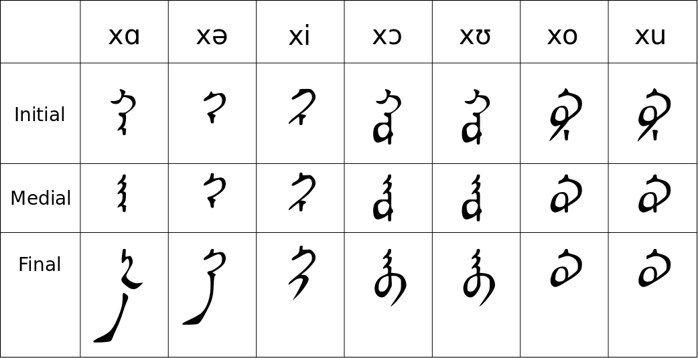

<AudioPlayerSeek src="/audio/sounds-04x.mp3" />

The /g/ sound looks very similar to the /x/ when written. Notice that with feminine vowels, /g/ is written exactly the same as /x/. That can also make it hard to read some new words. But we are going to be learning new words by listening to them first, then learning to write them second, so it shouldn't be a problem for us. Think about how much worse English is with words like champagne, conscience, and knuckle.

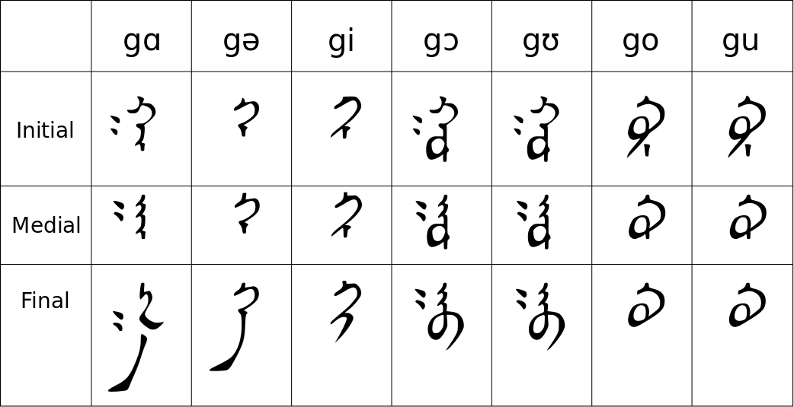

<AudioPlayerSeek src="/audio/sounds-05g.mp3" />

Like with /n/, the /m/ sound has two different final written forms when paired with the first two vowels.

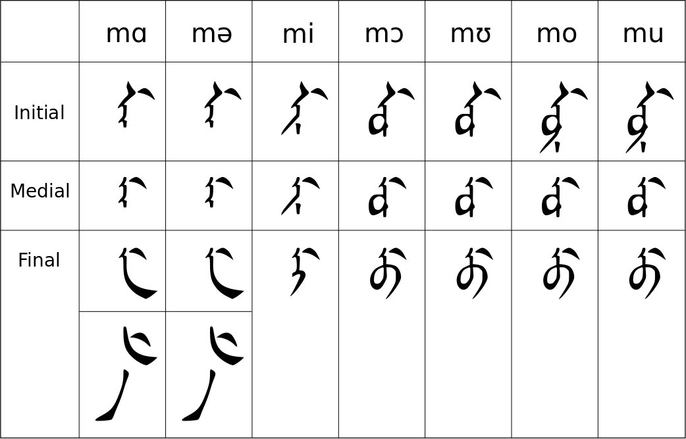

<AudioPlayerSeek src="/audio/sounds-06m1.mp3" />

We are using the IPA symbol /l/ to denote this sound but it is different than the English "l". The tongue is flatter. The difference is easier to hear on the final /l/ below.

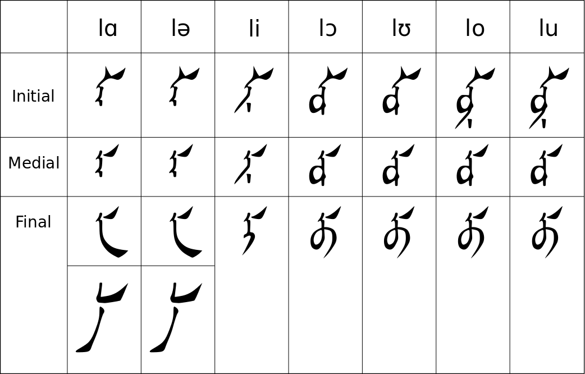

<AudioPlayerSeek src="/audio/sounds-07l1.mp3" />

The interesting characteristic about /s/ is that whenever you have /s/ and /i/ together, it is pronounced /ʃi/.

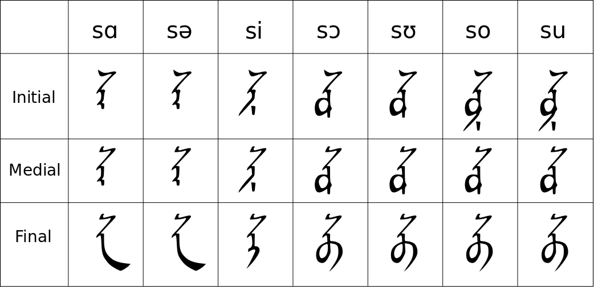

<AudioPlayerSeek src="/audio/sounds-08s.mp3" />

We can see the similarities right away between /s/ and /ʃ/. Just add two dots.

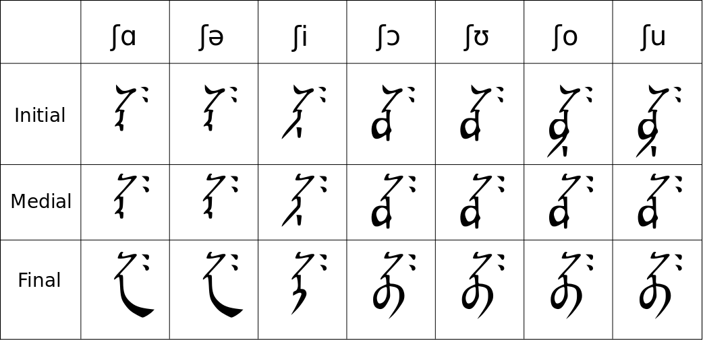

<AudioPlayerSeek src="/audio/sounds-09sh.mp3" />
Here is the /t/ sound.

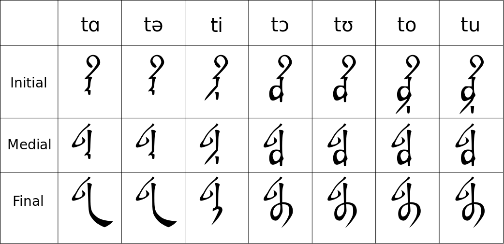

<AudioPlayerSeek src="/audio/sounds-10t.mp3" />

And here is the /d/ sound. Can you find the difference from the written /t/? No? That's because there isn't any. They are written exactly the same (except in some foreign words). That makes it hard to know how to pronounce a new word with a t or d. These words we will just have to memorize as we get to them.

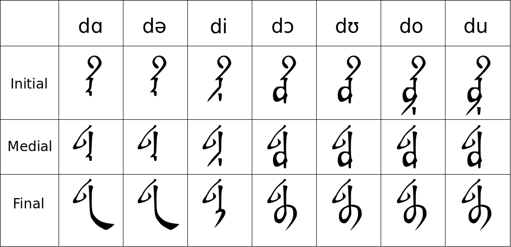

<AudioPlayerSeek src="/audio/sounds-11d.mp3" />

The Mongolian /ʧ/ is similar to the "ch" sound in English. However, we shouldn't curl our tongue back like we do for the English "ch". We should keep our tongues flat. This flat tongue pronunciation is also true for the /ʃ/ sound above and the /ʤ/ sound below.

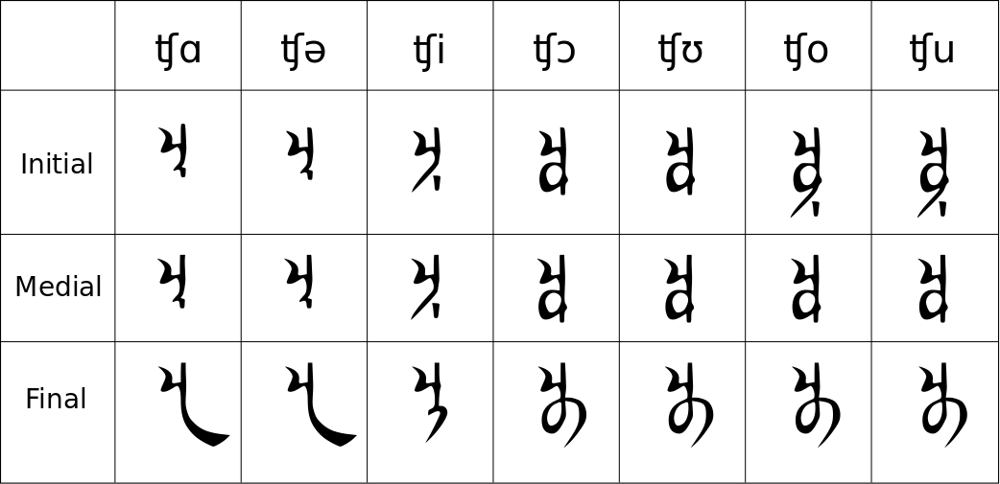

<AudioPlayerSeek src="/audio/sounds-12ch.mp3" />

The Mongolian /ʤ/ is similar to the "j" sound in English. Like I said above, though, we should keep our tongue flat to say it. If you have studied any Mandarin Chinese pronunciation, the Mongolian /ʧ/ and /ʤ/ are like the piyin "q" and "j", and not like the pinyin "ch" and "zh". These two sounds are one of the characteristic pronunciation differences from Outer Mongolian, too. In Outer Mongolia the say them more like /ts/ and /dz/.

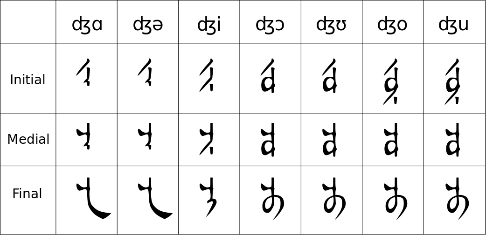

<AudioPlayerSeek src="/audio/sounds-13j.mp3" />

You would think this sound should be written as "y" because it has basically the same sound as the English "y" when it is at the beginning of words. But for whatever reason, the developers of the International Phonetic Alphabet chose to use /j/ as the symbol to represent this sound. With a little practice we'll get used to it. Note that there are two ways of writing the final form in Mongolian for the first two vowels.

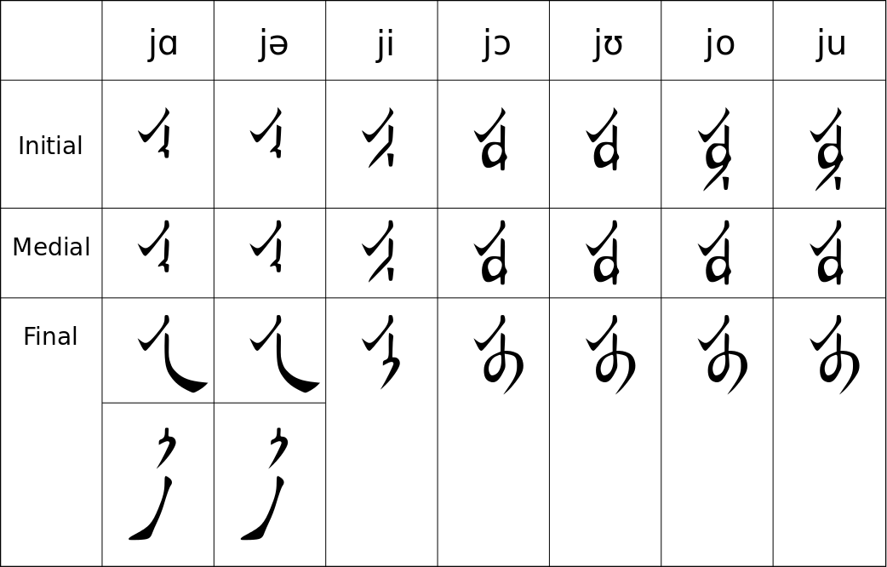

<AudioPlayerSeek src="/audio/sounds-14y.mp3" />

The /r/ sound is different than the English "r". Although you can't tell here, in many words it sounds more like the flap or trilled "r" of Spanish.

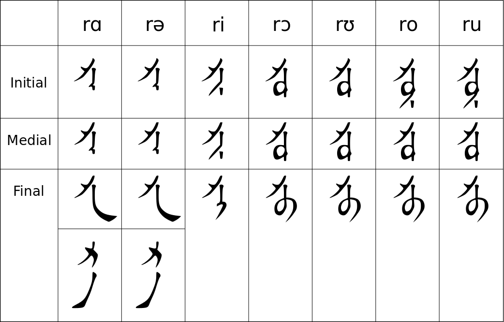

<AudioPlayerSeek src="/audio/sounds-15r.mp3" />

The /w/ sound is the last of the Mongolian consonants that are usually grouped together. You can see that the chart is mostly empty, though. That is because /w/ is not used very much in native Mongolian words. It is actually used a lot more for foreign words so we will repeat the /w/ sound when we get to the foreign letters.

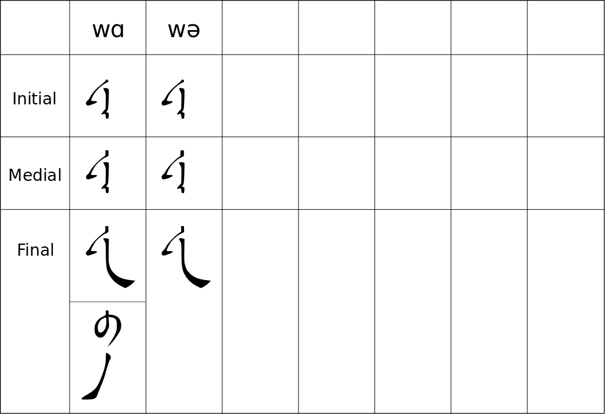

<AudioPlayerSeek src="/audio/sounds-16w.mp3" />

Whole alphabet - male voice

<AudioPlayerSeek src="/audio/sounds-all-male.mp3" />

Whole alphabet - female voice

<AudioPlayerSeek src="/audio/sounds-all-female.mp3" />

Alphabet song

<AudioPlayerSeek src="/audio/alphabet-song.mp3" />

## Final Consonants
Not all syllables in Mongolian end in vowels. There are nine consonants that can come at the end of syllables. They are called cushion letters. The first four below are called soft cushion letters. The next five are called hard cushion letters. Since these consonants can appear either in middle of a word or at the end of a word, there are only two ways of writing them.

### Soft Cushion Final Consonants
The first final consonant we will look at is the /n/ sound. You will notice that it is missing the little dot on the left that makes /n/ distinctive when it is at the beginning of a syllable. Without the dot it looks deceptively like an /ɑ/ or [ə](http://en.wikipedia.org/wiki/Mid-central_vowel). If you count the little "teeth" carefully, though, you will find that there is an extra one. That's the /n/.

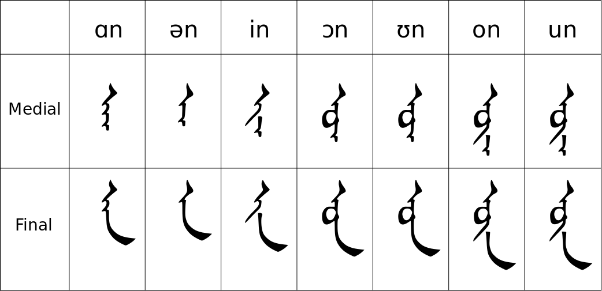

<AudioPlayerSeek src="/audio/sounds-17-n-final.mp3" />

The final /m/ still has the little tail on the right so it is pretty easy so recognize.

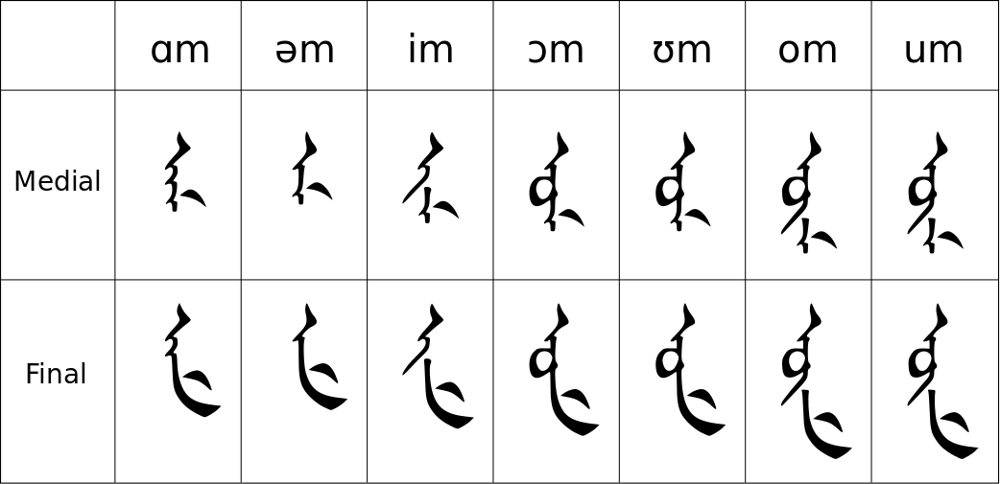

<AudioPlayerSeek src="/audio/sounds-18-m-final.mp3" />

The Mongolian final /l/ is definitely different than the English final "l". You have to leave your tongues flatter and kind of slur the sound out of the sides of your tongue. But listen to our teachers, and just try to say it how they do.

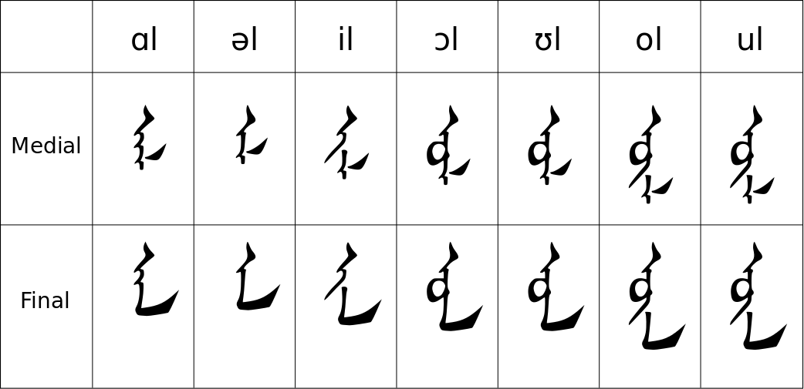

<AudioPlayerSeek src="/audio/sounds-19-l-final.mp3" />

This next one is the same as the "ng" sound of English. The IPA symbol is written /ŋ/.

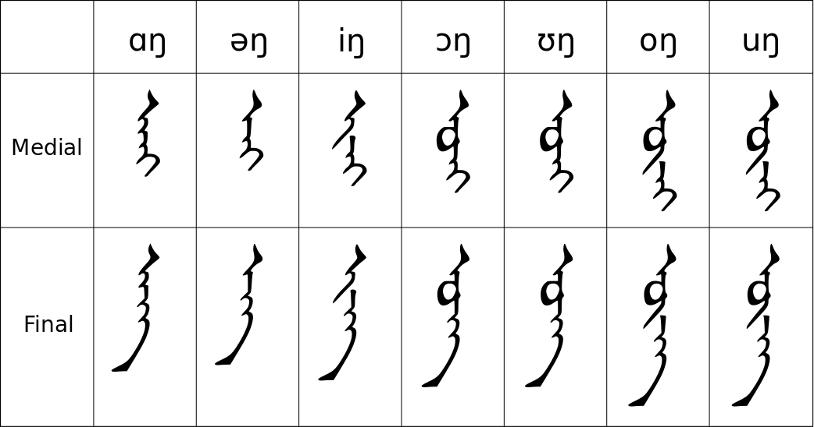

<AudioPlayerSeek src="/audio/sounds-20-ng-final.mp3" />

### Hard Cushion Final Consonants
The final /b/ in Mongolian often seems to let some air out, so that it sounds a little less sharp than the English "b", even like a "v" or "w" sometimes. At other times the final /b/ sounds more like a final English "p".

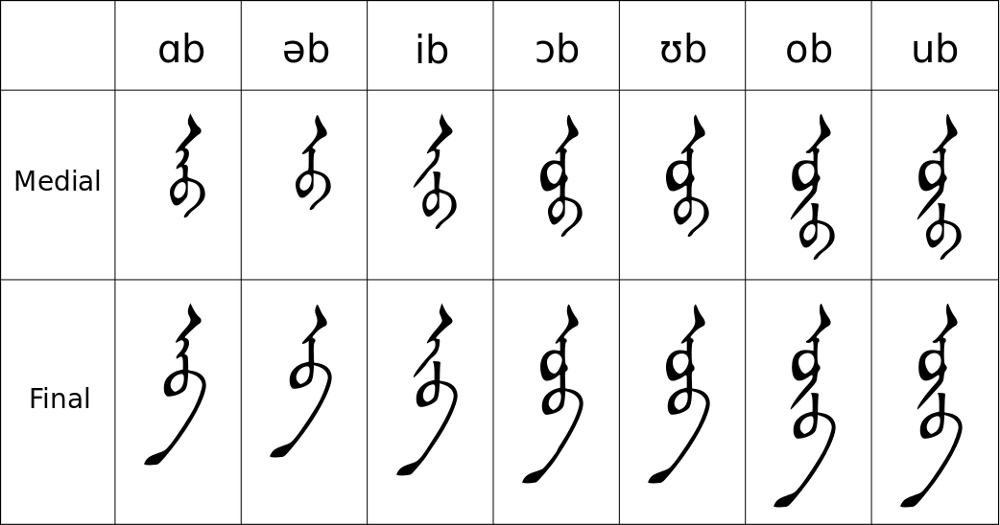

<AudioPlayerSeek src="/audio/sounds-21-b-final.mp3" />

Sometimes ɑ's, ə's, g's, and x's can make a lot of little bumps in a long word. If it is a new word we have to count them carefully to know what we've got. Notice that the final /g/ is written differently when following masculine or feminine vowels. Since /i/ is neutral the /g/ could be written either way after it. It depends on whether the entire word is masculine or feminine.

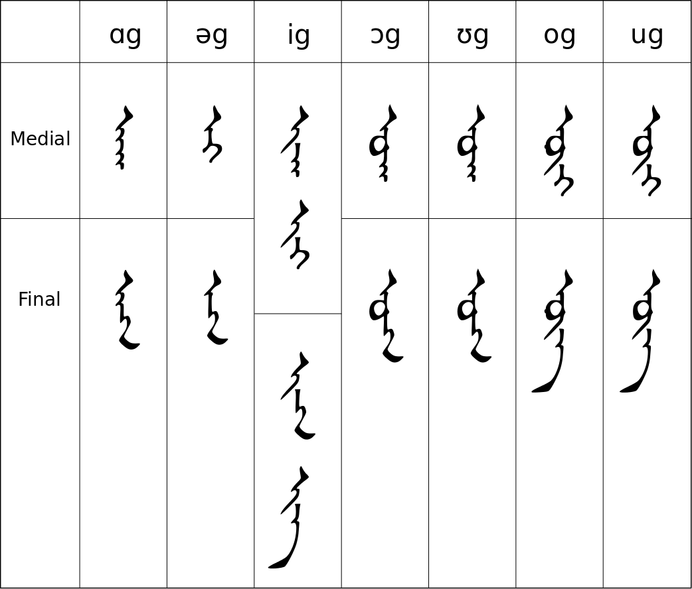

<AudioPlayerSeek src="/audio/sounds-22-g-final.mp3" />

Notice the difference in the final Mongolian /r/ from the final English "r" (of America or Britain).

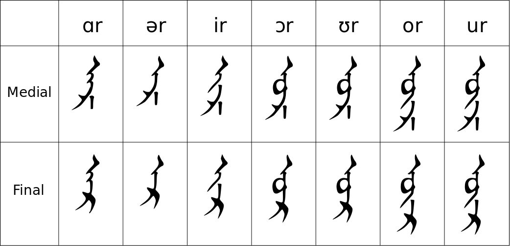

<AudioPlayerSeek src="/audio/sounds-23-r-final.mp3" />

The next one is the final /s/ sound. Be careful not to mistake the written form for a /g/ at the end of a word. It is a little bigger than the final /g/.

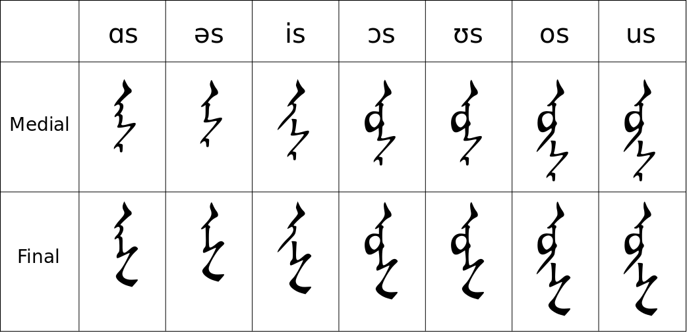

<AudioPlayerSeek src="/audio/sounds-24-s-final.mp3" />

To me sometimes the final Mongolian /d/ sounds more like a /t/, but then, I'm used to the American English "d" with it's long vowel sound in front. The writing is a little hard to recognize, too, because it looks like it could be /ɔn/ or /ʊn/. There has to be another vowel before the final /d/, though, so that is a clue that there isn't an /n/ here.

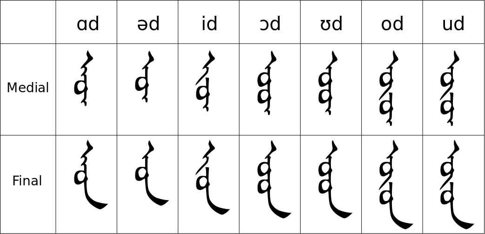

<AudioPlayerSeek src="/audio/sounds-25-d-final.mp3" />

The vowels can also be followed by another "i" or "o" vowel. This can create new vowel sounds or diphthongs (one vowel that slides into another vowel). In the recording our teachers say them all as diphthongs (except for /i/), but /ɑi/ often becomes /æ/ or /e/ and /ɔi/ often becomes /œ/. To to the [pronunciation page](/lessons/basics/pronunciation/) to hear these new vowel sounds.

As we learned on the pronunciation page, Mongolian vowels can be long or short. Often words that are written with double vowels or with a /g/ are said with a long vowel sound.

First we will look at the final /i/.

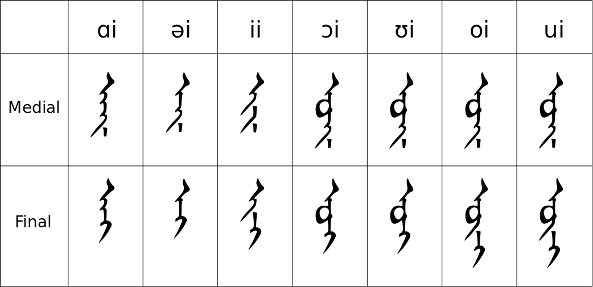

<AudioPlayerSeek src="/audio/sounds-26-diphthongs-with-i.mp3" />

Here is the final "o".

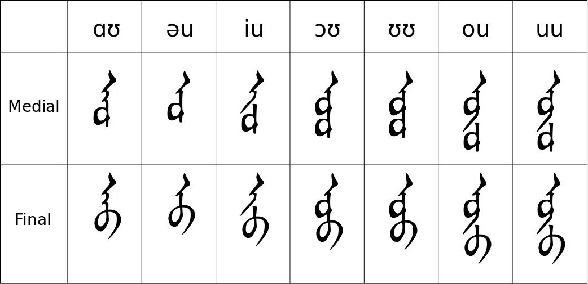

<AudioPlayerSeek src="/audio/sounds-27-diphthongs-with-u.mp3" />

## Letters for Foreign Words
Every language borrows words from other languages. It is a lot easier than creating new words. The problem, though, is that languages usually don't share all of the same sounds. That makes writing those sounds a little tricky. The letters above are used to write the sounds of Mongolian words, but they aren't flexible enough to express some of the sounds found in other languages. For that purpose there are a few more letters that are used.

Although we don't have a special chart for the second vowel /ə/, you will notice that it looks different in these charts than it does in the ones above. This is the version of /ə/ used to write foreign words. This is convenient because it is easy to distinguish it from the /ɑ/ that way. The pronunciation is still the same.

I mentioned before that /p/ and /w/ are often used to write foreign words. Let's take another look at /w/ as it is used to transcribe foreign words. It is used to substitute for a "v" from languages like English. Also note the similarity in writing to the foreign /ə/. The /w/ isn't a very common sound in Mongolian so I don't know if all of these syllables actually occur but I will include the full chart for completeness. The "full chart" for the foreign letters just uses five vowels.

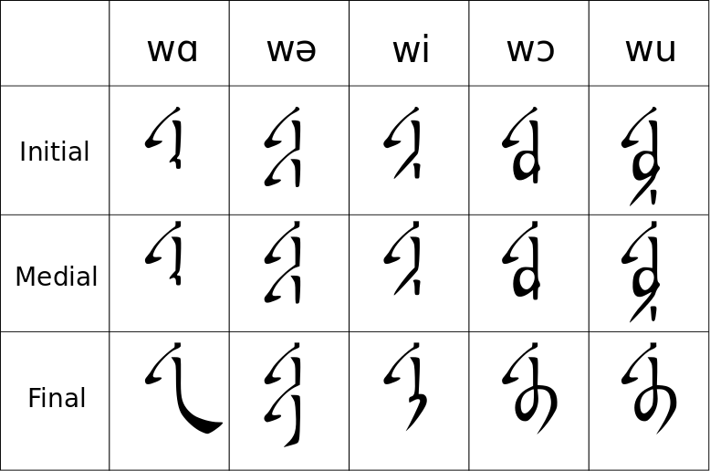

<AudioPlayerSeek src="/audio/sounds-28-w-foreign.mp3" />

Here is the first of the letters that is normally considered a foreign letter, the letter for the /f/ sound. Note the similarity to /p/.

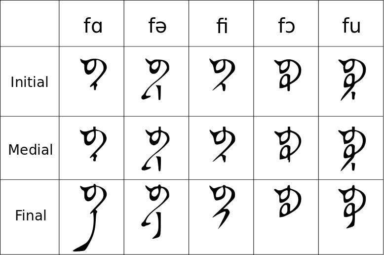

<AudioPlayerSeek src="/audio/sounds-29-f-foreign.mp3" />

The next one is /k/. Note the similarity to the feminine /g/.

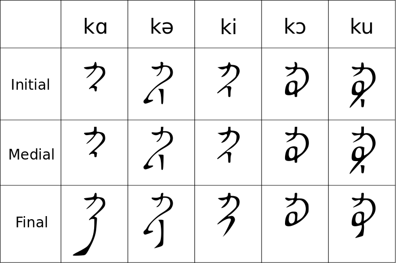

<AudioPlayerSeek src="/audio/sounds-30-k-foreign.mp3" />

For the next two sounds, you will notice the similarity in writing to the /ʧ/ we studied already. This one is /ts/.

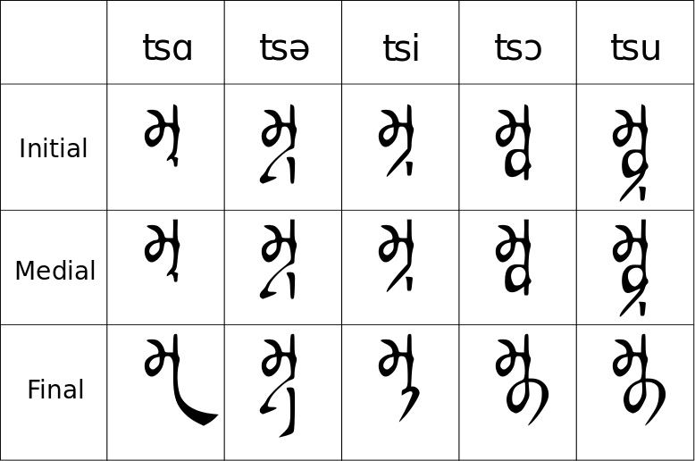

<AudioPlayerSeek src="/audio/sounds-31-ts-foreign.mp3" />

The next one is /dz/. Because neither this one nor /ts/ are used very often and because they are written nearly alike, it is easy to forget which is which. (It is for me, anyway.) I hope as we study more I will remember these basics a little better.

<AudioPlayerSeek src="/audio/sounds-32-dz-foreign.mp3" />

This is the /h/ sound for writing foreign words. According to our teachers, it is pronounced the same as the /x/ sound. It seems to me that it is unnecessary to have a whole new letter, but I suppose there is a a historical reason for it. I am using "h" here just to differentiate it from /x/.

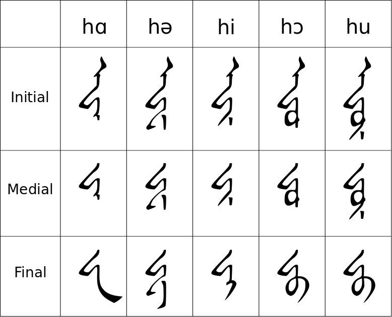

<AudioPlayerSeek src="/audio/sounds-33-h-foreign.mp3" />

As you can see from the nearly empty chart /ɬ/ isn't used very much. Apparently it is used mostly for writing Tibetan words. (Lhasa, for instance.) Our teachers tell me that it is pronounced the same as the normal Mongolian /l/ that we studied above.

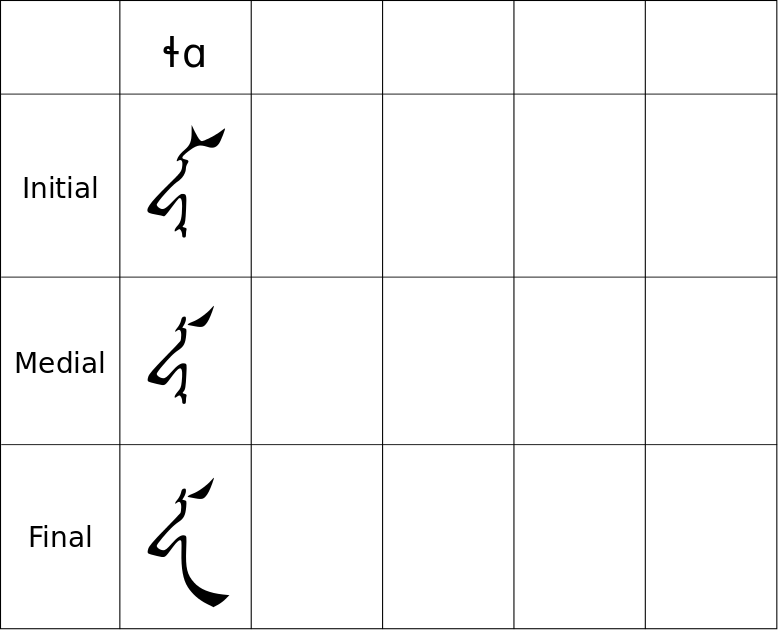

<AudioPlayerSeek src="/audio/sounds-34-l-foreign.mp3" />

The *Mongolian in Seven Weeks* book writes this next one as /[ʐ](http://en.wikipedia.org/wiki/Voiced_retroflex_sibilant)/ in IPA so that is what I am using. It is used for writing the Chinese "r".

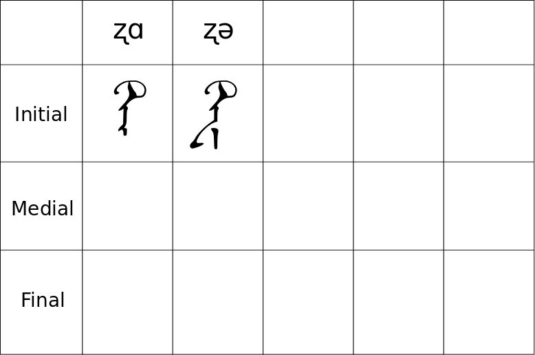

<AudioPlayerSeek src="/audio/sounds-35-r-foreign.mp3" />

There are just a few more special forms that are used to write the Chinese syllables ri, chi, and zhi. The labels are the Chinese pinyin, not the phonetic alphabet.

<AudioPlayerSeek src="/audio/sounds-36-ri-chi-zhi.mp3" />

Finally! We've studied all of the letters and sounds! Keep coming back and reviewing them (check out the Anki flashcards [Anki flashcards](/resources/anki-flashcards/)), but don't feel like you have to master them all before going on to [lesson one](/lessons/lesson-1/). As we hear the sounds and see the letters in context we will continue to improve in our pronunciation and understanding of the written words.