# Writing

Below we will learn the basic letters of the traditional Mongolian alphabet. As you may remember from reading the Background page, the traditional script is what is used in Inner Mongolia (as opposed to the Russian Cyrillic alphabet that is used to write Mongolian in the country of Mongolia). The Mongolians have been using it since the time of Genghis Khan, some 800 years. It is a unique writing system because words are written vertically rather than horizontally. We read from top to bottom and from left to right. As in probably every language, there are exceptions to the rules, but the Mongolian alphabet is fairly logical and systematic. And unlike Chinese, it uses phonetic letters that we can use to read words that we have never seen before.

Note that the letters shown here are in the handwritten form. The printed version that you would see in a book or on a sign looks somewhat different, but close enough that you should still be able to read them.

## Vowels

There are seven basic vowels in Mongolian. Letters are written a little differently according to whether they appear at the beginning, in the middle, or at the end of a word. The first, fourth, and fifth vowels are called masculine vowels. The second, sixth, and seventh vowels are called feminine vowels. Masculine and feminine vowels don't get used together in the same word, so a word can be either masculine or feminine. The third vowel (/i/) is neutral and can go in either masculine or feminine words. You will notice that a number of letters are written the same. That can give us some trouble for reading new words. Knowing whether it is masculine or feminine, though, can give us a clue. Let's not worry too much about reading now, though. First let's just get familiar with the basic letter forms and their sounds.

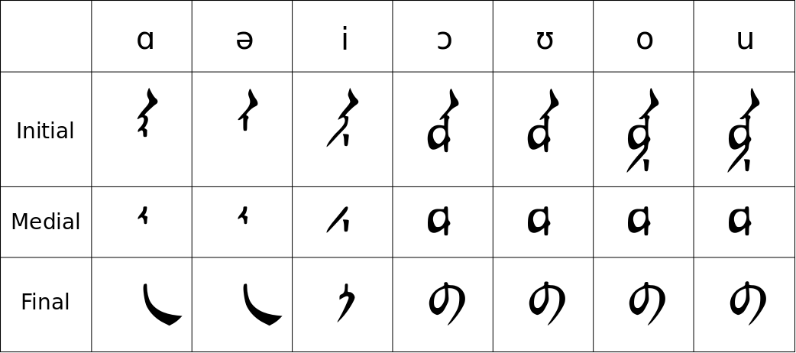

<AudioPlayerSeek src="/audio/sounds-00-vowels.mp3" />

## Consonants
Mongolian consonants come before or after a vowel. Although some words which have been borrowed from other languages may put two consonants next to each other in the same syllable, we won't see that very often. The custom in Inner Mongolia for learning our Mongolian "ABCs" is to pair each consonant with the seven vowels.

The first consonant is /n/. Notice that for /nɑ/ and /nə/ there are two different ways of writing them in the final position. "Spelling" a word differently like this may change the meaning, but the pronunciation is still the same. English does the same thing, right? Think about eye and I, there and their, and weather and whether. The spelling is different but the pronunciation is the same.

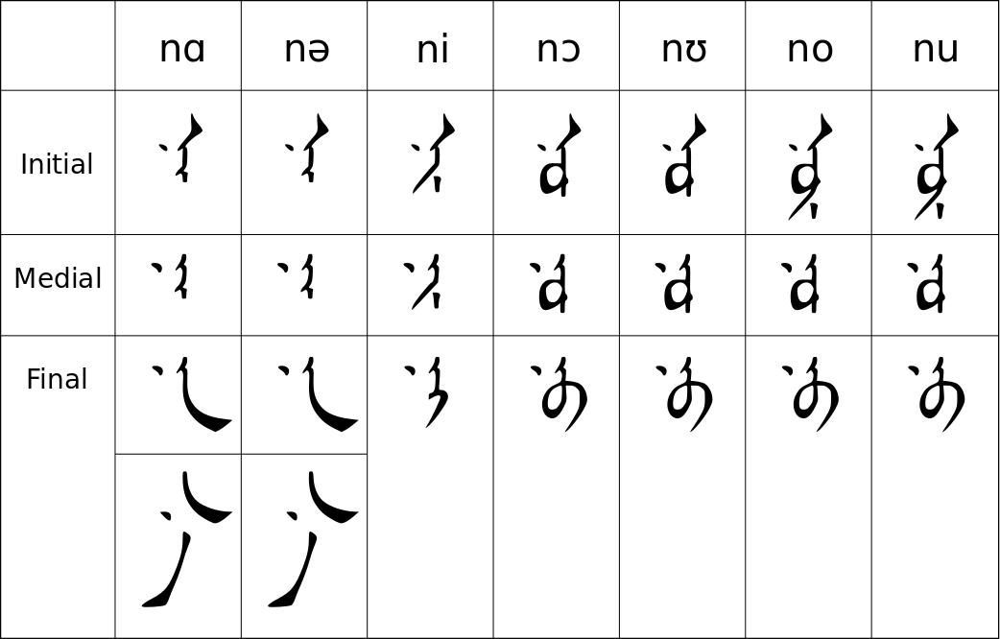

<AudioPlayerSeek src="/audio/sounds-01n.mp3" />

Next is the /b/ sound.

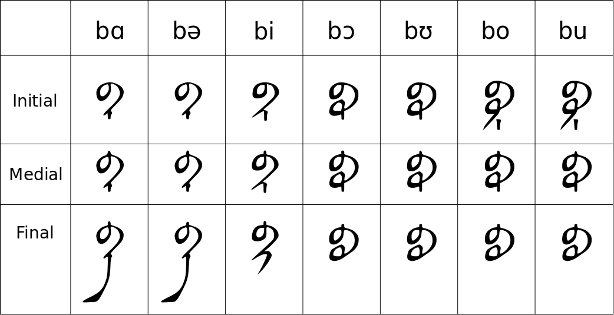

<AudioPlayerSeek src="/audio/sounds-02b.mp3" />

Next is /p/. It may not seem like we are going in order, but we are. It is worth your time to memorize this order because this is the order dictionaries arrange words in. Although p is not grouped with the other "foreign" letters ([see below](#letters-for-foreign-words)), it isn't used in very many Mongolian words and those that do use it are generally transliterated words from other languages. So although the normal written /ə/ is used here, in actual practice the "foreign" /ə/ is usually used in /p/ words.

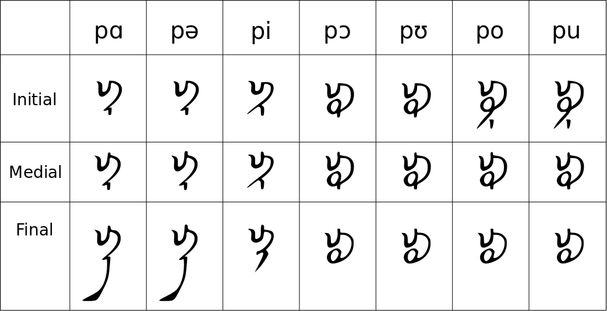

<AudioPlayerSeek src="/audio/sounds-03p.mp3" />

The next sound is /x/. Sometimes it is written as "h" or "kh" in English, as in Genghis Khan. It is a heavy /h/ sound.

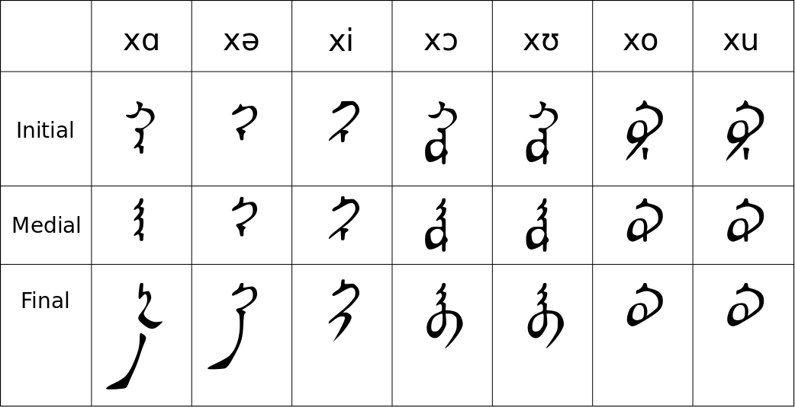

<AudioPlayerSeek src="/audio/sounds-04x.mp3" />

The /g/ sound looks very similar to the /x/ when written. Notice that with feminine vowels, /g/ is written exactly the same as /x/. That can also make it hard to read some new words. But we are going to be learning new words by listening to them first, then learning to write them second, so it shouldn't be a problem for us. Think about how much worse English is with words like champagne, conscience, and knuckle.

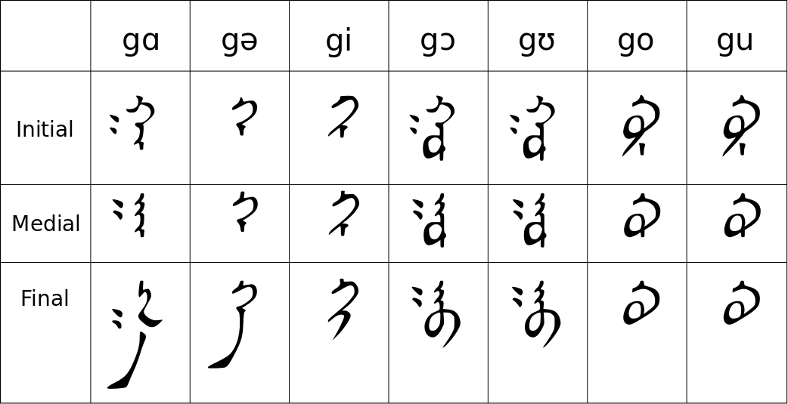

<AudioPlayerSeek src="/audio/sounds-05g.mp3" />

Like with /n/, the /m/ sound has two different final written forms when paired with the first two vowels.

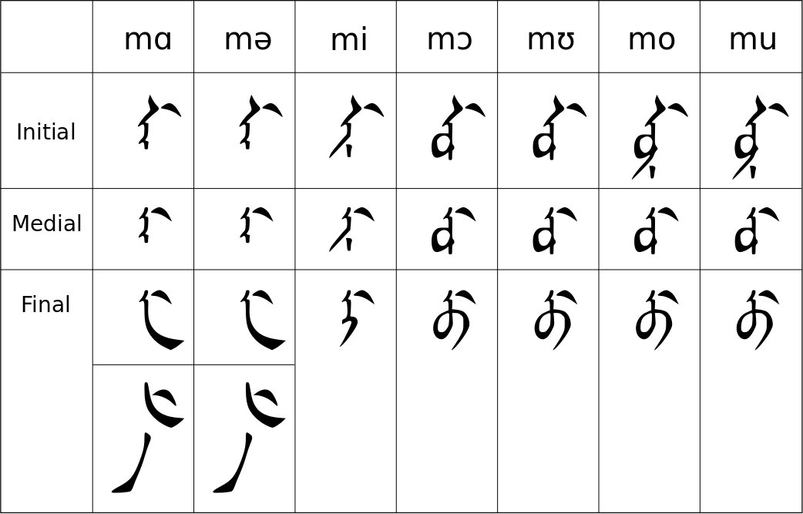

<AudioPlayerSeek src="/audio/sounds-06m1.mp3" />

We are using the IPA symbol /l/ to denote this sound but it is different than the English "l". The tongue is flatter. The difference is easier to hear on the final /l/ below.

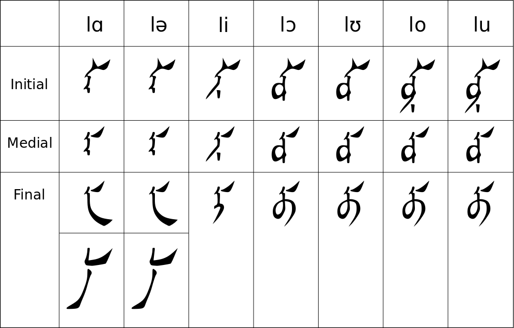

<AudioPlayerSeek src="/audio/sounds-07l1.mp3" />

The interesting characteristic about /s/ is that whenever you have /s/ and /i/ together, it is pronounced /ʃi/.

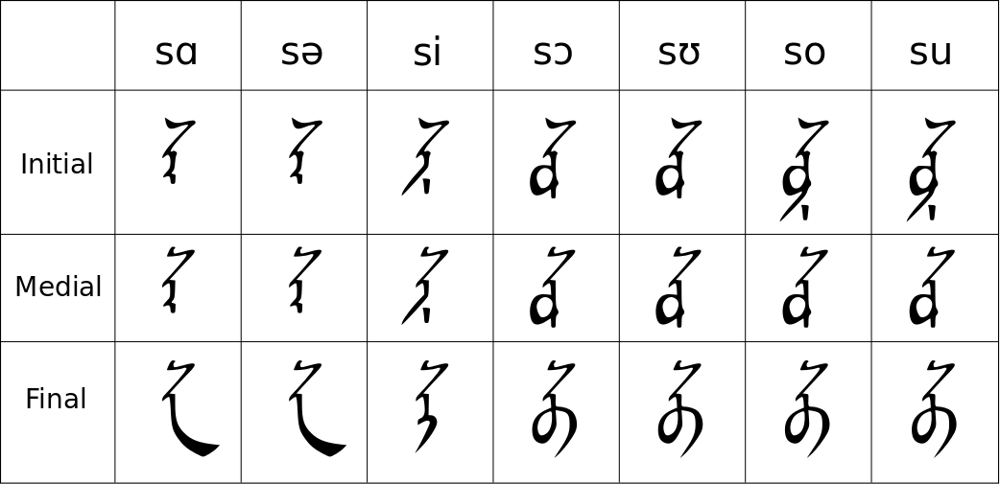

<AudioPlayerSeek src="/audio/sounds-08s.mp3" />

We can see the similarities right away between /s/ and /ʃ/. Just add two dots.

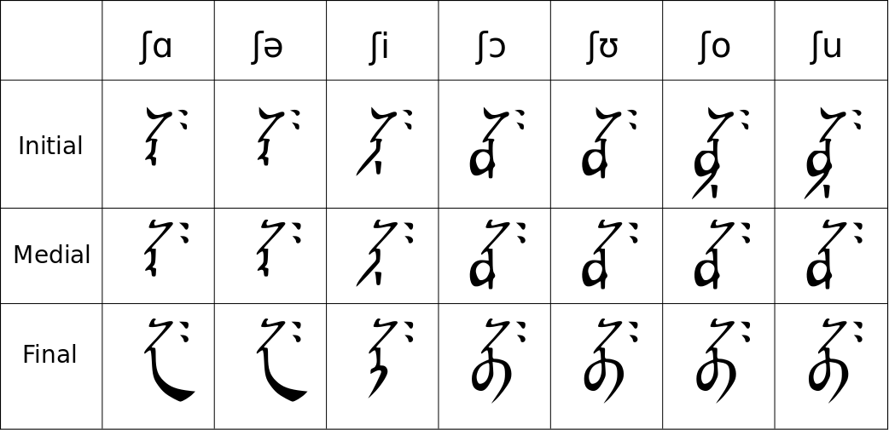

<AudioPlayerSeek src="/audio/sounds-09sh.mp3" />
Here is the /t/ sound.

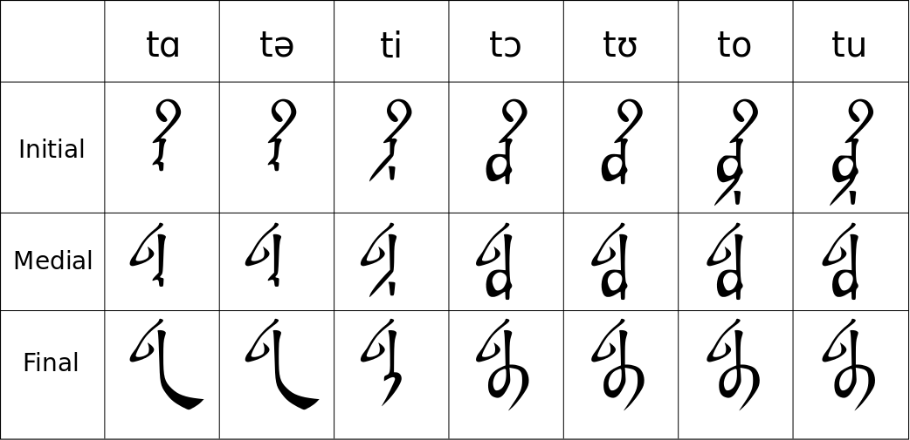

<AudioPlayerSeek src="/audio/sounds-10t.mp3" />

And here is the /d/ sound. Can you find the difference from the written /t/? No? That's because there isn't any. They are written exactly the same (except in some foreign words). That makes it hard to know how to pronounce a new word with a t or d. These words we will just have to memorize as we get to them.

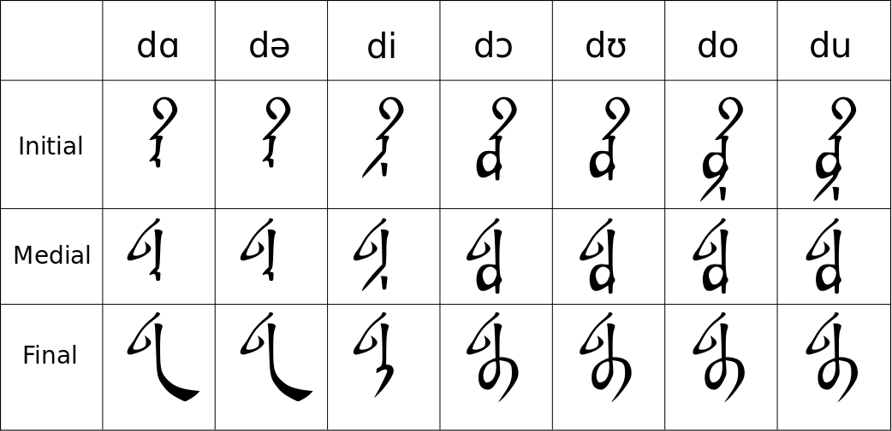

<AudioPlayerSeek src="/audio/sounds-11d.mp3" />

The Mongolian /ʧ/ is similar to the "ch" sound in English. However, we shouldn't curl our tongue back like we do for the English "ch". We should keep our tongues flat. This flat tongue pronunciation is also true for the /ʃ/ sound above and the /ʤ/ sound below.

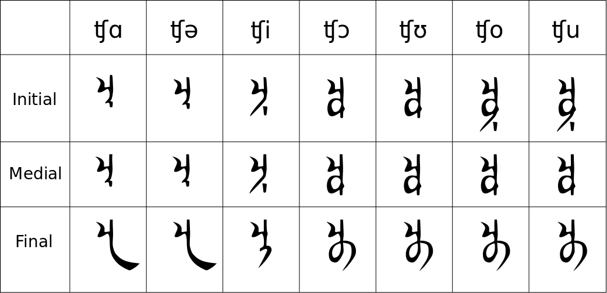

<AudioPlayerSeek src="/audio/sounds-12ch.mp3" />

The Mongolian /ʤ/ is similar to the "j" sound in English. Like I said above, though, we should keep our tongue flat to say it. If you have studied any Mandarin Chinese pronunciation, the Mongolian /ʧ/ and /ʤ/ are like the piyin "q" and "j", and not like the pinyin "ch" and "zh". These two sounds are one of the characteristic pronunciation differences from Outer Mongolian, too. In Outer Mongolia the say them more like /ts/ and /dz/.

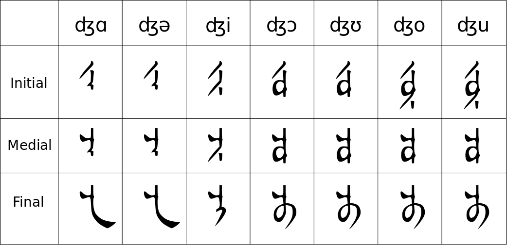

<AudioPlayerSeek src="/audio/sounds-13j.mp3" />

You would think this sound should be written as "y" because it has basically the same sound as the English "y" when it is at the beginning of words. But for whatever reason, the developers of the International Phonetic Alphabet chose to use /j/ as the symbol to represent this sound. With a little practice we'll get used to it. Note that there are two ways of writing the final form in Mongolian for the first two vowels.

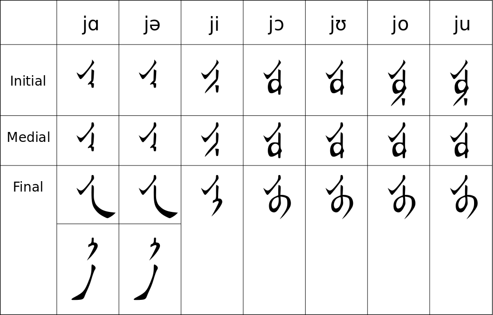

<AudioPlayerSeek src="/audio/sounds-14y.mp3" />

The /r/ sound is different than the English "r". Although you can't tell here, in many words it sounds more like the flap or trilled "r" of Spanish.

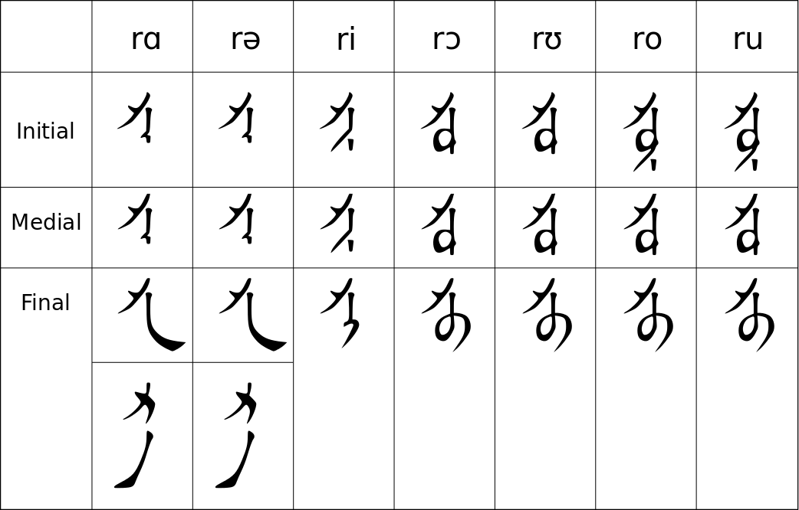

<AudioPlayerSeek src="/audio/sounds-15r.mp3" />

The /w/ sound is the last of the Mongolian consonants that are usually grouped together. You can see that the chart is mostly empty, though. That is because /w/ is not used very much in native Mongolian words. It is actually used a lot more for foreign words so we will repeat the /w/ sound when we get to the foreign letters.

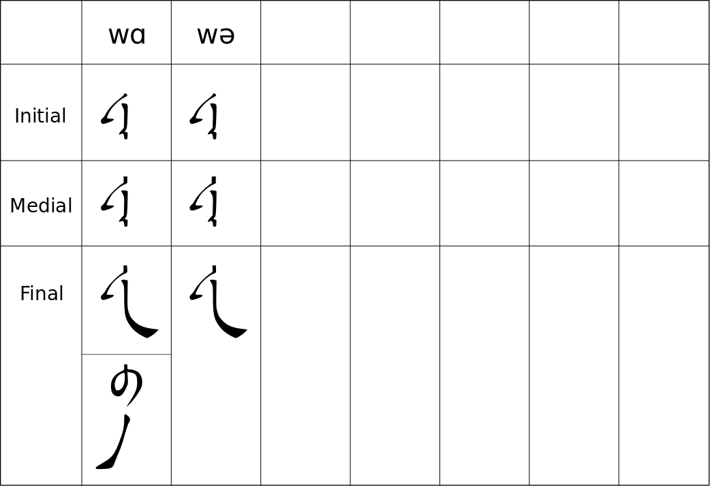

<AudioPlayerSeek src="/audio/sounds-16w.mp3" />

Whole alphabet - male voice

<AudioPlayerSeek src="/audio/sounds-all-male.mp3" />

Whole alphabet - female voice

<AudioPlayerSeek src="/audio/sounds-all-female.mp3" />

Alphabet song

<AudioPlayerSeek src="/audio/alphabet-song.mp3" />

## Final Consonants
Not all syllables in Mongolian end in vowels. There are nine consonants that can come at the end of syllables. They are called cushion letters. The first four below are called soft cushion letters. The next five are called hard cushion letters. Since these consonants can appear either in middle of a word or at the end of a word, there are only two ways of writing them.

### Soft Cushion Final Consonants
The first final consonant we will look at is the /n/ sound. You will notice that it is missing the little dot on the left that makes /n/ distinctive when it is at the beginning of a syllable. Without the dot it looks deceptively like an /ɑ/ or [ə](http://en.wikipedia.org/wiki/Mid-central_vowel). If you count the little "teeth" carefully, though, you will find that there is an extra one. That's the /n/.

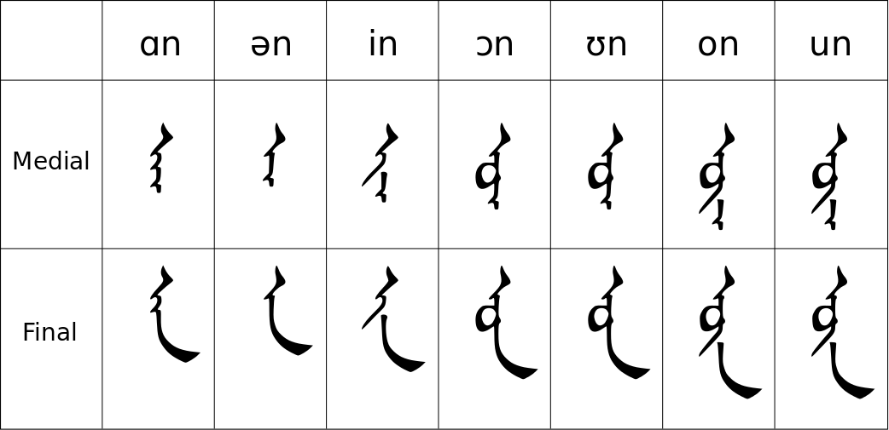

<AudioPlayerSeek src="/audio/sounds-17-n-final.mp3" />

The final /m/ still has the little tail on the right so it is pretty easy so recognize.

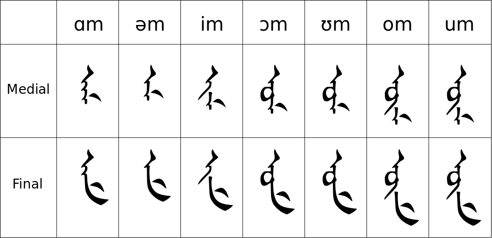

<AudioPlayerSeek src="/audio/sounds-18-m-final.mp3" />

The Mongolian final /l/ is definitely different than the English final "l". You have to leave your tongues flatter and kind of slur the sound out of the sides of your tongue. But listen to our teachers, and just try to say it how they do.

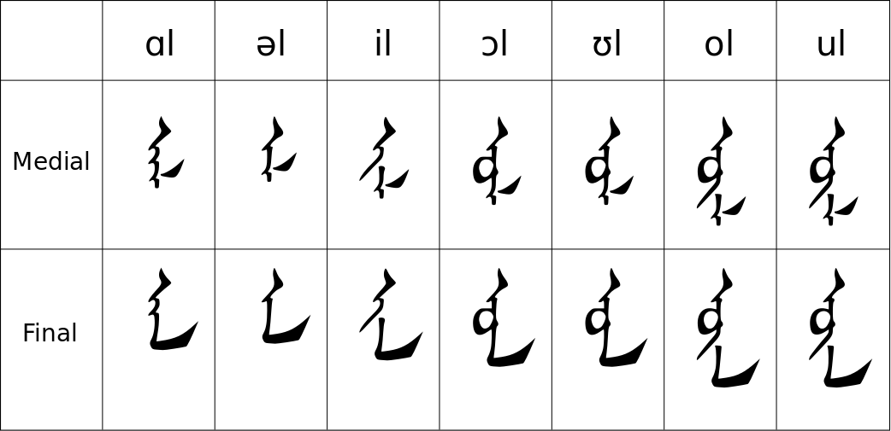

<AudioPlayerSeek src="/audio/sounds-19-l-final.mp3" />

This next one is the same as the "ng" sound of English. The IPA symbol is written /ŋ/.

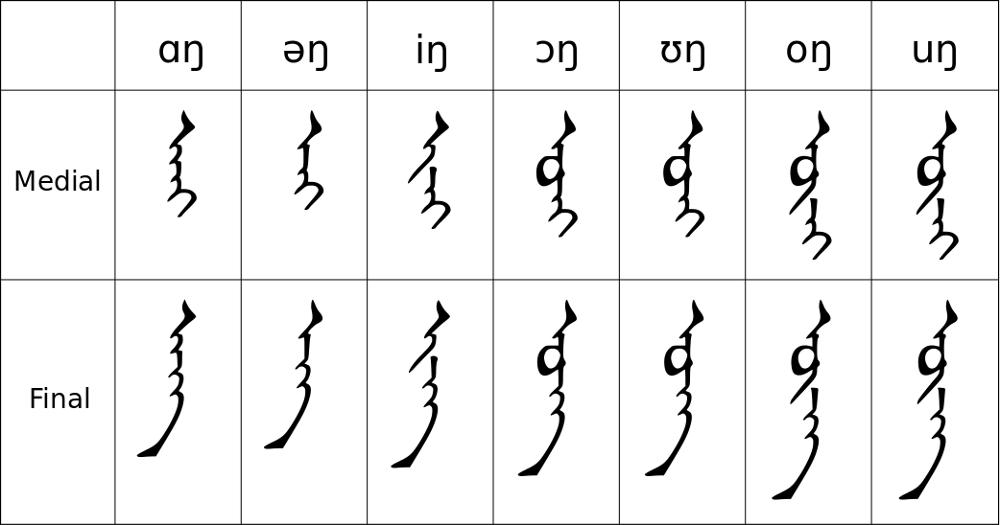

<AudioPlayerSeek src="/audio/sounds-20-ng-final.mp3" />

### Hard Cushion Final Consonants
The final /b/ in Mongolian often seems to let some air out, so that it sounds a little less sharp than the English "b", even like a "v" or "w" sometimes. At other times the final /b/ sounds more like a final English "p".

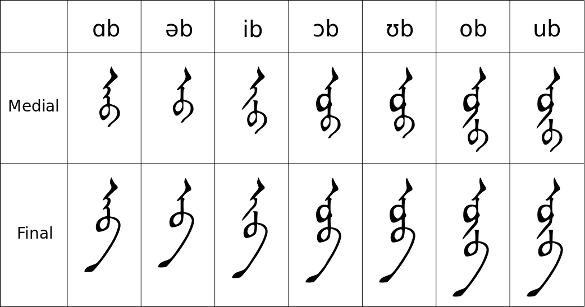

<AudioPlayerSeek src="/audio/sounds-21-b-final.mp3" />

Sometimes ɑ's, ə's, g's, and x's can make a lot of little bumps in a long word. If it is a new word we have to count them carefully to know what we've got. Notice that the final /g/ is written differently when following masculine or feminine vowels. Since /i/ is neutral the /g/ could be written either way after it. It depends on whether the entire word is masculine or feminine.

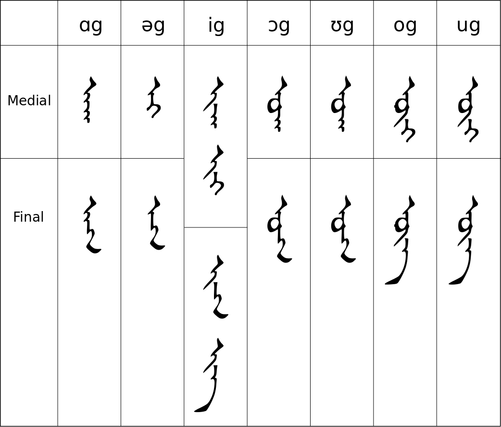

<AudioPlayerSeek src="/audio/sounds-22-g-final.mp3" />

Notice the difference in the final Mongolian /r/ from the final English "r" (of America or Britain).

<AudioPlayerSeek src="/audio/sounds-23-r-final.mp3" />

The next one is the final /s/ sound. Be careful not to mistake the written form for a /g/ at the end of a word. It is a little bigger than the final /g/.

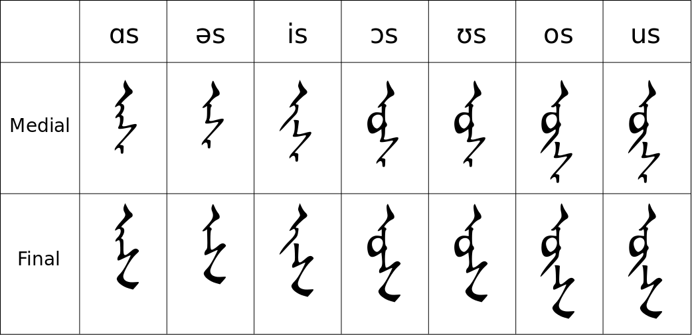

<AudioPlayerSeek src="/audio/sounds-24-s-final.mp3" />

To me sometimes the final Mongolian /d/ sounds more like a /t/, but then, I'm used to the American English "d" with it's long vowel sound in front. The writing is a little hard to recognize, too, because it looks like it could be /ɔn/ or /ʊn/. There has to be another vowel before the final /d/, though, so that is a clue that there isn't an /n/ here.

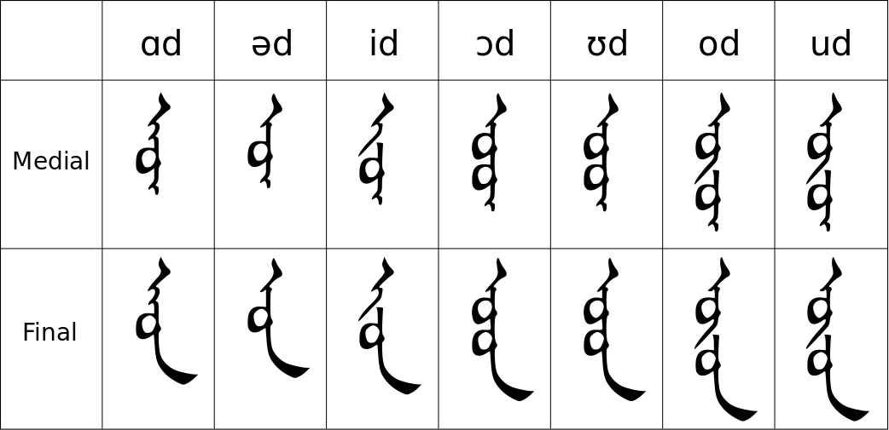

<AudioPlayerSeek src="/audio/sounds-25-d-final.mp3" />

The vowels can also be followed by another "i" or "o" vowel. This can create new vowel sounds or diphthongs (one vowel that slides into another vowel). In the recording our teachers say them all as diphthongs (except for /i/), but /ɑi/ often becomes /æ/ or /e/ and /ɔi/ often becomes /œ/. To to the [pronunciation page](/lessons/basics/pronunciation/) to hear these new vowel sounds.

As we learned on the pronunciation page, Mongolian vowels can be long or short. Often words that are written with double vowels or with a /g/ are said with a long vowel sound.

First we will look at the final /i/.

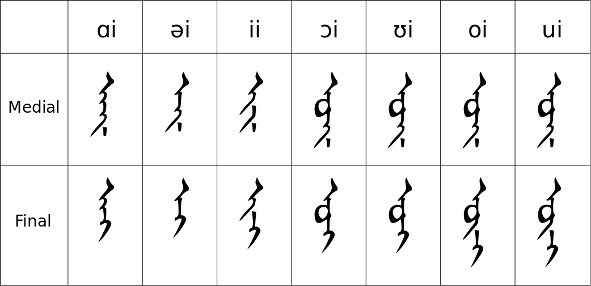

<AudioPlayerSeek src="/audio/sounds-26-diphthongs-with-i.mp3" />

Here is the final "o".

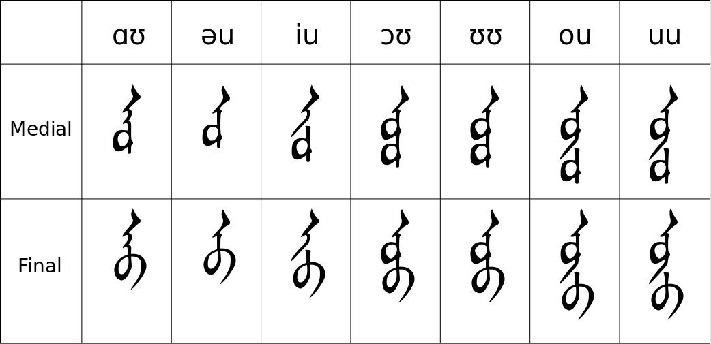

<AudioPlayerSeek src="/audio/sounds-27-diphthongs-with-u.mp3" />

## Letters for Foreign Words
Every language borrows words from other languages. It is a lot easier than creating new words. The problem, though, is that languages usually don't share all of the same sounds. That makes writing those sounds a little tricky. The letters above are used to write the sounds of Mongolian words, but they aren't flexible enough to express some of the sounds found in other languages. For that purpose there are a few more letters that are used.

Although we don't have a special chart for the second vowel /ə/, you will notice that it looks different in these charts than it does in the ones above. This is the version of /ə/ used to write foreign words. This is convenient because it is easy to distinguish it from the /ɑ/ that way. The pronunciation is still the same.

I mentioned before that /p/ and /w/ are often used to write foreign words. Let's take another look at /w/ as it is used to transcribe foreign words. It is used to substitute for a "v" from languages like English. Also note the similarity in writing to the foreign /ə/. The /w/ isn't a very common sound in Mongolian so I don't know if all of these syllables actually occur but I will include the full chart for completeness. The "full chart" for the foreign letters just uses five vowels.

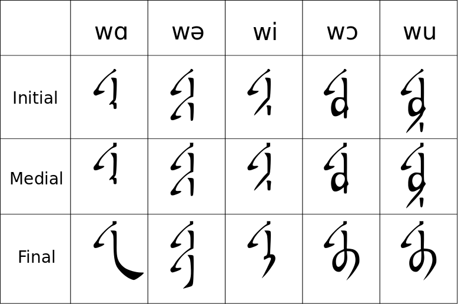

<AudioPlayerSeek src="/audio/sounds-28-w-foreign.mp3" />

Here is the first of the letters that is normally considered a foreign letter, the letter for the /f/ sound. Note the similarity to /p/.

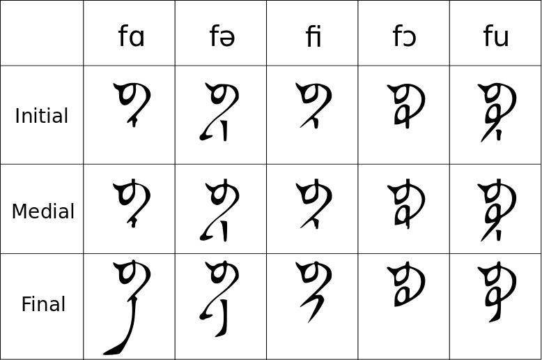

<AudioPlayerSeek src="/audio/sounds-29-f-foreign.mp3" />

The next one is /k/. Note the similarity to the feminine /g/.

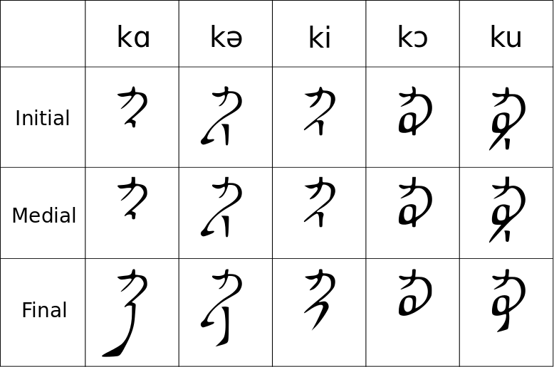

<AudioPlayerSeek src="/audio/sounds-30-k-foreign.mp3" />

For the next two sounds, you will notice the similarity in writing to the /ʧ/ we studied already. This one is /ts/.

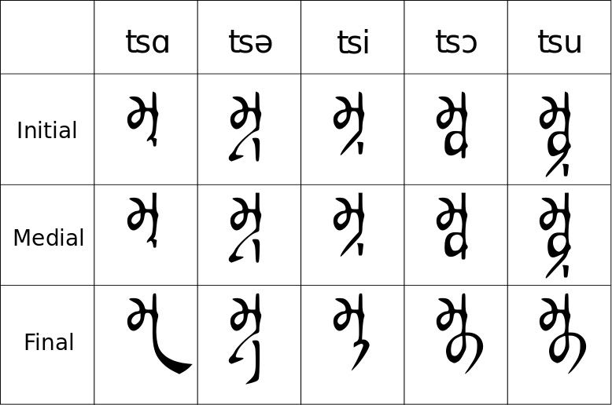

<AudioPlayerSeek src="/audio/sounds-31-ts-foreign.mp3" />

The next one is /dz/. Because neither this one nor /ts/ are used very often and because they are written nearly alike, it is easy to forget which is which. (It is for me, anyway.) I hope as we study more I will remember these basics a little better.

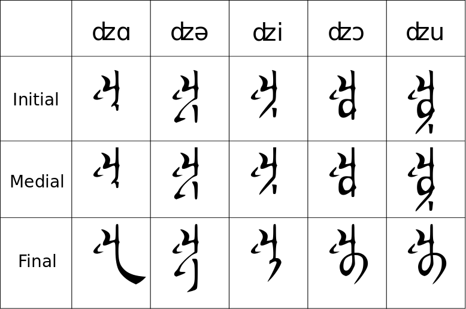

<AudioPlayerSeek src="/audio/sounds-32-dz-foreign.mp3" />

This is the /h/ sound for writing foreign words. According to our teachers, it is pronounced the same as the /x/ sound. It seems to me that it is unnecessary to have a whole new letter, but I suppose there is a a historical reason for it. I am using "h" here just to differentiate it from /x/.

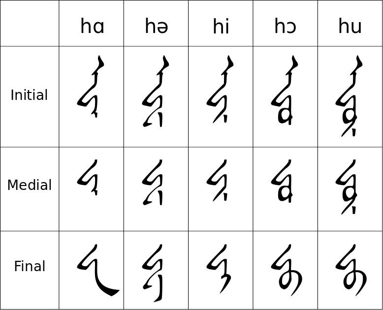

<AudioPlayerSeek src="/audio/sounds-33-h-foreign.mp3" />

As you can see from the nearly empty chart /ɬ/ isn't used very much. Apparently it is used mostly for writing Tibetan words. (Lhasa, for instance.) Our teachers tell me that it is pronounced the same as the normal Mongolian /l/ that we studied above.

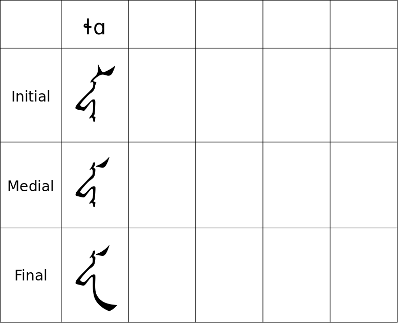

<AudioPlayerSeek src="/audio/sounds-34-l-foreign.mp3" />

The *Mongolian in Seven Weeks* book writes this next one as /[ʐ](http://en.wikipedia.org/wiki/Voiced_retroflex_sibilant)/ in IPA so that is what I am using. It is used for writing the Chinese "r".

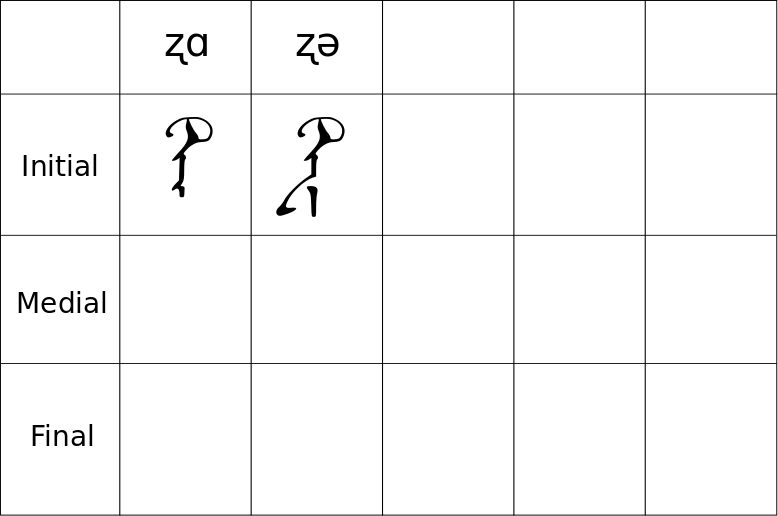

<AudioPlayerSeek src="/audio/sounds-35-r-foreign.mp3" />

There are just a few more special forms that are used to write the Chinese syllables ri, chi, and zhi. The labels are the Chinese pinyin, not the phonetic alphabet.

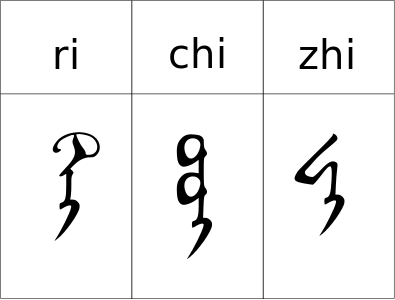

<AudioPlayerSeek src="/audio/sounds-36-ri-chi-zhi.mp3" />

Finally! We've studied all of the letters and sounds! Keep coming back and reviewing them (check out the Anki flashcards [Anki flashcards](/resources/anki-flashcards/)), but don't feel like you have to master them all before going on to [lesson one](/lessons/lesson-1/). As we hear the sounds and see the letters in context we will continue to improve in our pronunciation and understanding of the written words.

## Comments

**London Park** - August 1, 2013 at 5:05 am

Hello!

Thanks for posting this, I find it is hard to find resources to learn Mongolian on the internet except through Chinese sites, but even those weren’t quite as in depth. Although I do have a question. I learned the Cyrillic alphabet first and I thought that Mongolian had alot of consonant combinations however you say that there are not often consonants written together in Mongolian. Is that only in writing in the traditional script, or is it also in the pronunciation that there aren’t usually consonant combinations? If it is not common even in pronunciation is that true also of the Mongolia dialect as I see alot of consonants together in the Cyrillic alphabet.

Thanks for the tips! And if you have any advice for a beginner of learning the language let me know I could use the help.

Thanks alot, London Park.

> **Suragch** - August 6, 2013 at 12:15 am
> 
> Hello, London Park.
> 
> Good question about consonant combinations. It is definitely just the traditional writing that doesn’t usually use consonant clusters in the same syllable. Spoken Mongolian uses them all the time. 
> 
> Traditional written Mongolian actually does frequently have two adjacent consonants if one is at the end of the first syllable and the other is at the beginning of the second syllable. You can see this in the word for student: /sʊrə̌gʧ/. In spoken Mongolian (and Cyrillic) the /g/ and the /ʧ/ sounds are together in the same syllable, but in traditional written Mongolian they are in separate syllables: sʊ + rʊg + ʧi. 
> 
> 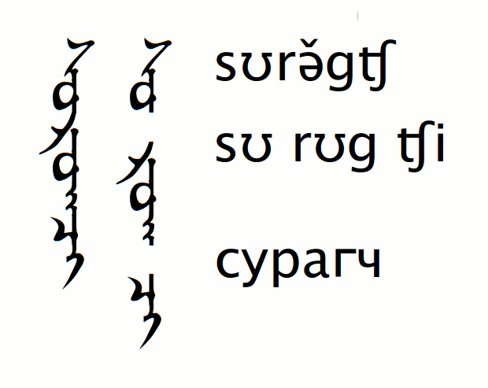
> 
> The exception to the rule is when foreign words are written in traditional Mongolian. Take the word France, for example. The first written syllable has a consonant cluster of /fr/. Interestingly enough, my dictionary says the pronunciation is /fɑrɑːnʦ/, with the /f/ and the /r/ in two separate syllables. I imagine it depends on how quickly you say it.
> 
> 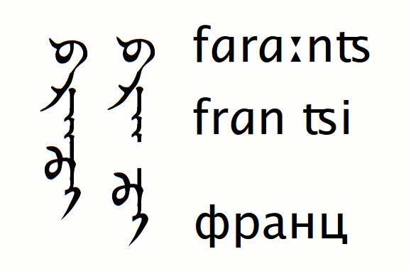

> **Hai** - October 4, 2015 at 2:08 pm
> 
> I guess [fɑrɑːnʦ] is correct as in Mongolian it’s already illegal to pronounce r without a vowel (rf. Sanskrit loanword Rasiyan is pronounced Ar[a]shaan), not to mention pronounce r with a consonant before (illegal+illegal, illegal twice!). 
> 
> All our teachers tried to pronounce r in the initial position per your request. They cannot make them correct and the pronunciations result in an English r. So you wrote:
> “Although you can’t tell here, in many words it sounds more like the flap or trilled “r” of Spanish.”
> But it’s not that in Mongolian when an r occurs in initial position it’s identical to the English r but that an r in initial position simply does not exist!
> 
> Same applies to [fɑrɑːnʦ]. When you pronounce it “quickly” as you suggested it does not become [frɑːnʦ]. Instead, it will result in an English [fɹɑːnʦ], or more terrible, a Chinese r, [fɻɑːnʦ], or even more terrible, a French r, [f-ugh-a:nts].
> 
> Let me make an analogy, claiming one can not tell the difference between a Mongolian r and an English r when the Mongolian r appears in the initial position is like claiming one can not tell the difference between a Mongolian ng and an English n when the Mongolian ng appears in the initial position. Nga nge ngi… See, there’s really no difference between ng and n.

> **Hai** - October 4, 2015 at 2:12 pm
> 
> Found the IPA symbol. By French [f-ugh-a:nts] I meant /fɣɑːnʦ/~/fʁɑːnʦ/.

---

**Suragch** - August 6, 2013 at 12:27 am

I’m not very far along in learning Mongolian myself, but as far as learning languages goes, I think the key is lots of comprehensible input. That means lots of listening and reading to things that are not too difficult in the beginning stages. I think this site can provide the listening practice, but I would like to find or make some material for the reading practice. Something like a graded reader that starts at zero would be nice.

> **London Park** - August 10, 2013 at 5:54 am
> 
> Thank you so much for the help! That makes alot of sense and helps me alot in learning to read and speak this language. I find the language so interesting and it is very unique from many languages. I think your suggestions are good and I will take your advice. I haven’t seen past lesson 1 yet but may I suggest a second section for grammar if you feel it is necessary, because I read often Mongolian has complex grammar like polite verb endings and noun cases and variations in verb suffixes and endings. Is that true? If it is it would certainly be possible to learn but might be very useful to have plenty of extra explanation for the grammar, right? Also I was curious does the dialect or dialects used in Inner Mongolia have enough similarities to Mongolian dialect to be easily mutually understood? So if I study one dialect can I still understand for the most part the other ones?

> **Suragch** - August 10, 2013 at 12:28 pm
> 
> Mongolian is a very unique language, especially it’s vertical writing system. I’ve heard it proudly said, other languages are lying down but Mongolian is standing up.
> 
> About grammar, yes, I think more grammar explanations would be useful. You will find that starting with Lesson 2 there is a brief grammar section at the end of each lesson. After reading your comment, though, it made me realize that I should add a grammar reference section to the website. So check back for updates on that.
> 
> I will copy your question about dialects to the [forum](http://www.studymongolian.net/forum/speaking-listening-and-pronunciation/mongolian-dialects-1/) so that it can be more easily found by others. The short answer, though, is yes, Inner Mongolians and Outer Mongolians can generally understand each other.

---

**jose silva** - April 7, 2014 at 9:05 am

i would like to see handwritting . thank you.

> **Suragch** - April 7, 2014 at 2:03 pm
> 
> Actually, the font used here is a handwriting font. Besides the differences in personal style, it looks like how people would write. But for your reference, here is a photo of an unedited handwritten draft of [Lesson 10](http://www.studymongolian.net/lessons/lesson-10/).
> 
> 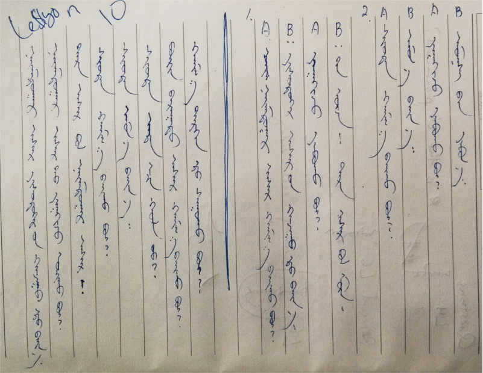
> 
> Printing, on the other hand, does look different, although if you know the handwritten forms you can probably make out the letters ok. Someday I would like to add the printed forms of all of the letters of the Mongolian alphabet to this page. For now here is a sample from a recent printing of the *Secret History of the Mongols:*
> 
> 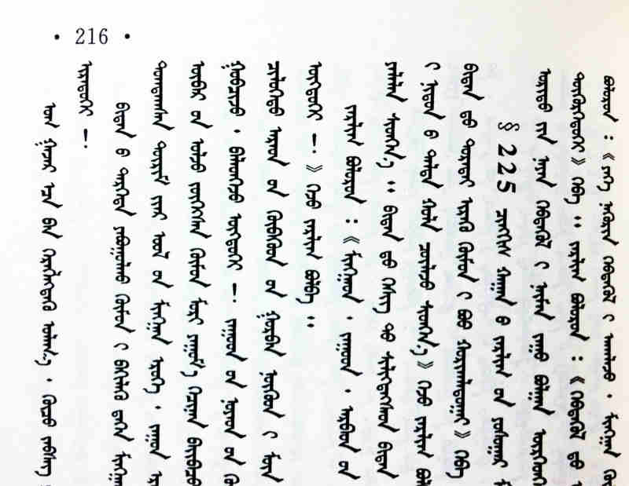

---

**London Park** - July 21, 2014 at 4:24 am

Hello!

How have you been? Long time no see! I was reviewing the Mongolian script and when listening to the first dipthong chart it sounded like there were only 6 dipthongs read aloud rather than all 7. Was I hearing wrong? Also I am having alot of trouble recognizing the differences between ɔ, ʊ, o, and u. Especially ʊ and o. They sound almost exactly the same to me. Haha. Could you explain the difference? Also I find the handwritten and typed examples of the Mongol script you posted on your comment very helpful and insightful. Could you please tell me what letter that is in the first word in the second column from the right, the first letter that looks like a little circle on the right of the stem. I keep seeing it everywhere in the printed form of Mongolian and don’t know which letter that is. Haha. Thank you so much.

> **Suragch** - July 25, 2014 at 2:14 pm
> 
> Thanks for letting me know about the chart. I’ll have to go back and fix that sometime. The pronunciation here is a little contrived, anyway, because it is out of context. See the Pronunciation page for better examples of how diphthongs are pronounced in real life.
> 
> I also had lots of trouble differentiating the four “o” vowels in the beginning. It comes with practice. It might help you to practice the Anki Flashcards for Traditional Mongolian Alphabet – Listening. You can find them under resources. It is hard to describe in writing the difference but that makes me think I should put up pictures of mouth shapes sometime.
> 
> The letter you referred to is a “t” or “d” in its initial form. (I don’t know that particular word myself, so without looking it up in a dictionary I can’t tell you which of the two it is.)

---

**London Park** - July 29, 2014 at 7:26 am

Oh okay! So you are saying the dipthongs colloquially and depending on where the speaker is from may be pronounced various ways so even the chart is not the only way I should learn the dipthongs’ pronunciation, right?

Yeah! The o vowels are so hard. But I am sure I will figure it out. Thanks for the help and yes! A mouth chart would be very useful!
Oh okay! Yeah that looks alot different in the text form as opposed to hand writing, I didn’t recognize it at all. Haha. Thank you again! So will there be new lessons after lesson 10? I haven’t gotten past lesson 7 yet but I look forward to any future lessons too. 🙂

> **Suragch** - July 29, 2014 at 10:16 am
> 
> I’m saying the pronunciation of the written diphthongs here are somewhat contrived not because of dialect but because they are out of context, that is, they are not in a word. For example, when in a word, /ɑ/ + /i/ usually becomes /æ/ rather than /ai/ (as they are pronounced here). The same goes for /ɔ/ and /i/ becoming /œ/ rather than /ɔi/. Our teachers were just trying to pronounce the written diphthongs carefully rather than think about how they usually sound in actual words.
> 
> I have lessons recorded up through lesson 19 currently but I have not made the time to put them online yet. It takes about 10 hours each to edit the audio and write explanations. Let me know when you are nearly done with lesson 10 and I will try to stay ahead of you. 
> 
> Recently I have been spending my spare time working on an Android phone app to send messages in traditional Mongolian. Hopefully it will be ready by the end of summer.

---

**Stefan** - August 26, 2015 at 5:15 am

Hello,

I’ve been looking all over the net for the correct pronunciation of “Subutai” and “Baghatur” in Middle Mongolian (spoken at the time of the Empire) and modern Mongolian. I am mostly interested in the Middle Mongolian pronunciation. Could you please help me with this?

Also, what do you think is the most accurate Latin transcription of this legendary general’s name and nickname? I’ve seen so many: Subutai, Subotai, Subetei, Subetai, Tsubotai, Tsubodai, Tsubetei, Tsubatai and Baghatur, Ba’atur, Bagatur, Baghadur, Bahadur, Batur, Baatar.

Thank you,

Stefan

> **Suragch** - August 26, 2015 at 11:11 pm
> 
> I’m afraid this question is too academic for me. As far as pronunciation goes, I suggest you get in contact with a professor of one of the Mongolian Universities. For spelling, it is unfortunate that there is no standard. As a general rule, I follow Wikipedia spelling for famous individuals and names since it has a large number of editors.

> **Caner can orta** - August 29, 2015 at 8:45 am
> 
> Baghatur could be written as bagadur or bagatur in middle mongol or maybe in altaic. I think so because it is a common word in turkish also, bahadır. The letter g, in mongol, is erased, or it became a non pronouncing letter, and in turkish it became the letter ğ or h.
> For example translation to turkisg of the word saen in mongol is sağlam.
> Looking from this angle it looks reasonable. It could derived from bag, meaning vine yard or to look.
> I dont have any idea for subotai. But at least i know that it cant contain letter o and y. It could be sabatai maybe.
> Sorry for my english but i would really like to talk these subjects later again, when i can talk properly in daytime :).

---

**Hai** - October 4, 2015 at 1:37 pm

In my opinion, you can learn some Ordos dialect and Daur language as many of the words are pronounced exactly as how they’re written. 

However, always keep in mind that a dialect that is archaic on some factors will be corrupted in some other factors. If you compare Khalkha, Chakhar and Khorchin-Kharchin, you’ll realize that for some syllable combinations Khalkha is the most archaic pronunciation while for others Khorchin-Kharchin represents the most archaic pronunciation. Chakhar, however, never represents the most archaic pronunciation unless it’s either identical to Khalkha or Khorchin-Kharchin because Chakhar always stays in the middle of Khalkha and Khorchin-Kharchin. Nevertheless it’s still good to set Chakhar the standard pronunciation to balance all Mongolian dialects (it’s equidistant from all Central Mongolian dialects).

---

**Hai** - October 4, 2015 at 2:47 pm

For the second question, Vladimircov-Poppe-Mostaert-Cleaves transliteration can be used to transcribe Classical Mongolian. However, had there be any loan word from Sanskrit, Tibetan, Chinese, English, Russian, or Todo Mongolian, this transliteration method fails. In such cases, you can use the Joint Sino-Mongolian Transliteration which always works, nevertheless the Joint Sino-Mongolian Transliteration does not reflect Classical Mongolian well enough (this transliteration is a compromise between modern Chakhar-Khalkha and Classical Mongolian and strictly based on the Mongolian Unicode block). 

Below is an incomplete scheme of Joint Sino-Mongolian Transliteration: [https://zh.wikipedia.org/wiki/%E4%B8%AD%E8%92%99%E8%81%94%E5%90%88%E8%BD%AC%E5%86%99](https://zh.wikipedia.org/wiki/%E4%B8%AD%E8%92%99%E8%81%94%E5%90%88%E8%BD%AC%E5%86%99)

---

**Hai** - October 4, 2015 at 2:30 pm

Thanks a lot for your effort in promoting Mongolian! I have a question about the Chinese r. Is there anyway to write the Chinese r in the medial position? In Altai language the Sanskrit loanword Rasiyan is not pronounced [ɑrʃɑːn] but pronounced [ɑrʒɑːn]. To transcribe this word in Mongolian, I guess the only legal way is to use the Chinese r for [ʒ] if one do not want to use Ali Gali characters. The problem is how one can write the Chinese r in the medial position correctly.

---

*Do you have a comment or question that would be helpful for others here? Copy the link to this page and [email me](/contact/) your comment or question.*