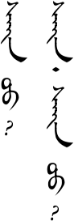

# Lesson 1

## Suggested Study Method
Besides the key sentences, most of the dialogs below do not have English translations. Don't let that scare you off. Listen to the dialog first and then find the new words in the vocabulary section towards the end of the lesson. Then go back to the dialog and listen again. The word order will be different than English, but you should be able to figure out the meaning. If you really can't figure it out, then ask me in the comment area at the bottom of this page. Also leave a comment if you find (or think you have found) a mistake. I'm sure there are a few!

After you get through the lesson, then try to say the words and sentences that are in the practice section. If you have trouble with them then go back to the section of the lesson that talks about it. Some of the practice sentences require you to make new combinations that were not precisely in the lesson. Do your best to guess how you would say it. If you are unsure then leave a comment.

Review is very important for retaining what you have learned. At the very end of the lesson there is a place to download the audio for the whole lesson. Listen to old lessons throughout the day while you are doing other things. Don't just listen mindlessly, but actively think about the meaning of what you are hearing. There is also a great flashcard program called Anki that uses spaced repetition to review and teach vocabulary. When I finish making some decks I will put them up so that you can use them, too.

## Key Sentences

| | | |
|---|---|---|
| sæːn bæːn ʊː? | How are you? | <AudioPlayer src="/audio/key-1.mp3" /> |
| sæːn ʊː? | How are you? | <AudioPlayer src="/audio/key-2.mp3" /> |
| sæːn bæːnɑː. | I'm doing well. | <AudioPlayer src="/audio/key-3.mp3" /> |
| sæːn. | Good. | <AudioPlayer src="/audio/key-4.mp3" /> |

## Dialogs

### One

<AudioPlayerSeek src="/audio/L1-D2.mp3" />

- A: sæːn bæːn ʊː?
- B: sæn. tɑ sæːn bæn ʊː?

### Two

<AudioPlayerSeek src="/audio/L1-D1.mp3" />

- A: sæːn ʊ?
- B: sæːn. sæːn ʊː?

### Notes

"sæːn bæːn ʊː?" literally means "Are you well?" It is the most common way to greet someone in Mongolian. It is like saying, "Hello," or, "Hi. How's it going?" in English.

The subject (you) is commonly omitted. However, B in Dialog 1 adds it. "tɑ" is the polite way to say "you". Since we are just beginning, we will error on the side of politeness by using "tɑ" in most of our dialogs.

If it appears that the IPA symbols in the dialogs are not displaying correctly, you may need to install a Unicode font on your computer. [You can get directions here.](http://www.unicode.org/help/display_problems.html) If the traditional (vertical script) Mongolian does not display you may need to update your browser to a version that supports svg images.

## Substitution

<AudioPlayerSeek src="/audio/L1-S1.mp3" />

________ sæːn ʊː?

- tɑː
- tɑːnə̌r
- tɑːnæː ɑːb əːʤ ʧin |

## Expansion

### One

<AudioPlayerSeek src="/audio/L1-E1.mp3" />

- tɑː sæːn ʊː?
- sæːn bæːnɑː
- tɑːnæː ɑːb əːʤ ʧin sæːn ʊː?
- sæːn bæːnɑː

### Two

<AudioPlayerSeek src="/audio/L1-E2.mp3" />

- tɑ ɔʧn ʊː?
- ɔʧnɔː
- ɑːb əːʤ ʧin ɔʧn ʊː?
- təd ɔʧnɔː

### Notes:

The subject pronouns (I, you, your, they) are optional when they are understood.

## Vocabulary

| | | |
|---|---|---|
| sæːn | <AudioPlayer src="/audio/L1-V-good.mp3" /> | good |
| bæːnɑː | <AudioPlayer src="/audio/L1-V-have.mp3" /> | have, be |
| ʊː | <AudioPlayer src="/audio/L1-V-question-part.mp3" /> | question particle |
| tɑː | <AudioPlayer src="/audio/L1-V-you.mp3" /> | you (polite) |
| tɑːnə̌r | <AudioPlayer src="/audio/L1-V-you-all.mp3" /> | you (plural) (That's "y'all" for all y'all Texans out there.) |
| tɑːnæː | <AudioPlayer src="/audio/L1-V-your-polite.mp3" /> | your (polite) |
| ɑːb | <AudioPlayer src="/audio/L1-V-father.mp3" /> | father |
| əːʤ | <AudioPlayer src="/audio/L1-V-mother.mp3" /> | mother |
| ʧin | <AudioPlayer src="/audio/L1-V-your.mp3" /> | your |
| təd | <AudioPlayer src="/audio/L1-V-they.mp3" /> | they |
| ɔʧnɔː | <AudioPlayer src="/audio/L1-V-go.mp3" /> | go |

## Practice
How do you say the following words:
- good
- father
- go
- mother
- you
- they
- your

How do you say the following sentences:

- Hello.
- How are you?
- I'm fine.
- How are your parents?
- They're doing well.
- Are you going?
- Are your father and mother going?

If you were able to say most of these things correctly then you are ready to go on to [lesson two](/lessons/lesson-2/). If not, then keep practicing! You can also download the audio for the whole lesson so that you can practice listening while driving to work. Click the three-dot menu at the right of the audio player below and choose "Download".

<AudioPlayerSeek src="/audio/Main-lesson-1.mp3" />

If you have any questions about this lesson or if you notice a mistake, then please leave a comment below. If I don’t know the answer myself, then I will ask our teachers.

---

## Comments

**Jason** on August 21, 2013 at 8:47 am

Great website!

I have been studying the Khalkha dialect of the country of Mongolia, and
 I’m struck by the degree of similarity. The vowels have shifted a bit, 
but the difference between the two seems less than that of American and 
British English pronunciations.

> **Hai** March 25, 2015 at 8:21 am
>
> Definitely. When choosing the standard language for Mongolian, the Chinese chose Xulun Hoh, which is among the closest to Khalkha dialect. Other Inner Mongolian dialects, such as Horqin, which the vast majority of Mongolian speakers in China speak, have a greater level of vowel shift. Khalkha, however, possesses a more intense i->ya vowel shift than most other Mongolian dialects.

---

**Bruno** on September 22, 2013 at 3:34 pm

Thanks a lot for making these lessons for us! I love studying 
new languages, and found out about mongolian writing a few days ago. In 
my opinion, it’s the most beautiful writing I’ve seen! Now I’m trying to
 learn some words, the sounds, and how to write in this script. I’m from
 Brazil, might even visit Mongolia someday!

---

**Alusi** on October 20, 2013 at 9:16 am

Hi, every helpful site. I am Mongolian from Hulunbuir,but I can’t read or write anymore. Your website helps heaps! Thank you.

---

**Mathieu** on October 21, 2013 at 1:18 am:
Very nice website. It’s very useful.

I have just a question : why is the question particle “uu” not written with the same initial “u” as in the writting lesson ?

Thanks

> **Suragch** October 25, 2013 at 7:23 pm
>
> Great questions. I’m including an image below to make it more clear for other readers. So you are asking, why is the /ʊː/ (or ʊʊ) question particle written as it is on the left and not as it seems like it should be on the right? Isn’t it missing the top?
>
> 
>
> The best I can say is that this is an exception to the the normal writing rules. I don’t know of any other words that begin with ʊ which are missing the top like this. I suppose the answer lies hundreds of years back in history when someone wanted to save a few pen strokes for writing this common particle. By the way, according to my dictionary, the written form on the right is also a word. It means “Oh”, as in something you would say after you made a realization.

> **Emyr** September 21, 2014 at 8:36 pm
>
> The Chinese sound ‘chi’ is also written with an initial ‘gedesü’—like uu—again missing the initial ‘titim’ (crown), as in the Mongolian spelling of ‘dian chi’ 电池. But represents a different sound.
>
> Great site!

---

**P'naantan** on October 22, 2013 at 10:50 am

bayarlalaa!! I could find only marginal resources to learn 
mongolian online in english so let me just say bi chamd khairtai for 
choosing to do this, as it will make learning the language easier and 
more structured for me. how long have you been studying?

> **Suragch** October 25, 2013 at 7:29 pm
>
> I’ve been studying off and on for a long time, but I also need something systematic like this to make some real progress. It is still slow going for me, though. I imagine that if you are diligent you could catch up with me in a few months or less.

---

**Agiimaa** on December 2, 2013 at 9:02 am

Hi! This is a wonderful site! I am Inner Mongolian myself and 
I’m so glad to know that there are people learning Mongolian in 
traditional script. Bayarlalaa!

---

**Khaliun** on December 14, 2013 at 2:45 am

Hey, I’m an Outer Mongolian, it’s quite sad how here we use 
cyrillic… This site is really cool, I’m studying abroad so it’s a great 
way to study my own language. Thank you so much! It’s amazing how there 
are so many people learning Mongolian script. Bayarlalaa!

---

**batoor** on January 1, 2014 at 8:58 am:
Hi,

I am a Hazara and people say we are Mongolians. i would love to learn
 mongolian and visit Mongolia. i am glad I found these webpages. thank 
you!

> **Erdene**
> October 4, 2014 at 1:31 pm
>
> Hi
>
> I’m from Mongolia, but not from inner Mongolia. Your name is looks like Mongolian name. Batoor is by Mongolian ‘Baatar’, meaning is ‘Hero’ by English. I heard that many Mongolian solders left in Afghanistan several hundred years ago, but couldn’t comeback to own homeland and mixed up with native people. Then now people calling you Hazara people. Hope you will visit to your homeland soon.

---

**Jill** on January 26, 2014 at 7:45 pm:

James and I are using some of your audio recordings these days 
while our tutors are out of town. Thanks for making all these resources 
available. And, by the way, I love the shout out to Texans above.

---

**Olkhonud** on February 17, 2014 at 9:41 am:

Hi, thank u for the site. It’s great. I’m from Southern 
Mongolia, and very glad to know that so many people like learning 
mongolian.  It’s not easy to learn the language because of the 
differences between written and spoken in Inner Mongolia. When you’re 
bored to learn it, u can listen to the mongolian folk songs . Never give
 up! Good luck and happy language learning.

---

**Michae** on April 22, 2014 at 7:37 am:

Why are you not using the Cyrillic alphabet for these lessons. 
It’s much easier than the traditional one and it’s the standard in 
Mongolia.

> **Suragch** April 23, 2014 at 7:44 pm
>
> I agree that the Cyrillic would be much easier to learn and use. Believe me, I know. Here in Inner Mongolia, though, the traditional script is the standard. All of the Mongolians here use it and none of my teachers even know how to write in Cyrillic. Also, I think the traditional script is rather beautiful and worth the extra effort it takes to learn. Anyway, for these reasons this site is dedicated to Mongolian as it is written and spoken in Inner Mongolia. Check out the links page for some good sites that use Cyrillic to teach Mongolian.

> **Hai** March 25, 2015 at 8:13 am
>
> And Mongolian script are transdialectal to some degree.

---

**Michael** on August 11, 2014 at 9:11 pm:

I’m still tossing between learning the Khalkha dialect and Inner
 Mongolian… I would rather be able to speak to people in Outer Mongolia,
 but the script is just so much more beautiful.  Agh.

---

**Xiaoyu** on September 30, 2014 at 10:33 am

Hey! This website is amazing!  I am from Hohhott, my family has 
lost Mongolian language from my generation. I have been oversea for 
years, the further from home, the more I feel it is my responsibility to
 keep our own language and culture continuing.  You are doing an awesome
 job! Well done! Hope more inner Mongolians could do the same!

---

**JC Zhang** on March 1, 2015 at 6:31 pm

非常好,这个网站太优秀了，以后会继续学习。 Very good!I come from Qiqihar,China.When I
 go to Hohhot last month,I think Mongolian is beautiful and I want to 
learn it.Thanks the website!

---

**Yilun Ma** on November 23, 2015 at 3:24 pm:

Very good website, but i think that GOOD is ᠰᠠᠢᠨ

> **Suragch** March 2, 2016 at 8:11 pm
>
> I was originally trying to make the script look more like handwriting, but I should probably go back and make the second tooth longer. Thank you for your comment.

---

**Daniele** on March 12, 2016 at 4:48 pm:

Very interessing but what’s about cyrillic alphabet?
 I think that if an european person would like to learn mongolian 
leanguage it would be better to start with cyrillic in order to 
understand easly sounds and the corresponding words.
What do you think about it? =)

> **Suragch** May 3, 2016 at 2:15 pm
>
> Yes, the Cyrillic alphabet would be easier for a European person to learn. However, this site teaches Mongolian as it is spoken an written in Inner Mongolia. The Cyrillic script is used in Outer Mongolia and Russia. Most Inner Mongolians cannot read or write Cyrillic.

---

**Juan Emilio** on May 19, 2016 at 3:09 am:
Hello! Thank you very much for all the lessons! I’m a calligrapher and I always wanted to learn this scripts!

I only have two questions
– what does the final  dot (•) or double dot (••) means? I saw that in 
the word wikipedia they also use that dot.. But I can figure out the 
purpose 

– and the second one is: who are I al supposed to write the (an) with
 the litrlw shape to the right? Os there a way to see it in a more 
conventional typography?

 Thank you!!

> **Suragch** May 23, 2016 at 10:37 am
>
> The final dot (᠂) is like a comma in English, and the double dot (᠃) is like a period (full stop).

---

**Ryu** on September 23, 2016 at 2:16 pm:

Thanks, really useful website, I am Manchurian, it’s extremely 
easy for me to start to learn Mongolian, we use same alphabet, even the 
greeting ways are really similar, we also say si Saiyuun? but we don’t 
use a be/have word after that, is that necessary for Mongolian? or can 
just say sain oo, which one is more common?

> **Suragch** December 8, 2016 at 3:33 pm
>
> That’s interesting to hear from a Manchurian. Thanks for your comment.
>
> In my experience, “sain oo” and “sain bain oo” are used more or less equally often. “Sain oo” seems to me to be a little more informal.

---

**Brittany** on April 19, 2018 at 9:45 pm:

Do you have any printable version of this?

> **Suragch**: April 20, 2018 at 2:01 pm
>
> Not currently, but that is a good idea.

---

**NBG** on July 24, 2020 at 12:00 am:

Hey! A really good page for learning mongol. Congrats from Spain.

I hope this page continue working.

---

**Angela Zheng** on September 22, 2020 at 11:57 am:

Hi, thank you so much for making this amazing website. When we 
try to write the Mongolian characters, is it okay to just copy what’s 
shown on the computer? Because often what’s typed can look quite 
different from the written version of a language.

> **Suragch** November 8, 2020 at 1:14 pm
>
> The font used in the lessons is a handwriting font, so it’s ok to copy how it looks in the lessons.

---

**Claude** on November 4, 2023 at 4:28 pm:

Hello, I am a senior  student learning classical Mongolian at 
Bern University Switzerland. My problem with Inner Mongolian is the 
modern pronunciation which of course doesn’t correspond to traditional 
writing, which makes it somehow more complicated for me to learn the 
modern pronunciation. For instance when I read the word for hero I tend 
to read ” boGatur ” instead of ” baatar ” which makes it quite funny 
with Inner Mongolian speakers, as if I was speaking Middle English 
instead of Modern English or 18thc. French rather than modern one. Do 
other students meet with this problem ? I guess I should spend some time
 in Inner Mongolia but as a 69 y.o person I have some mobility problems.
 I fear such a journey might just remain a dream. Thank you anyway for 
this beautiful and quite helpful site. It is a true pleasure to learn 
the language with you.

> **Suragch** February 24, 2024 at 8:09 am
>
> Everyone learning traditional Mongolian has to deal with the problem of the spelling not matching the modern pronunciation. After reading a lot of words you can start to see a pattern, but it is still something that takes time.

---

**Tongalaga** on April 15, 2025 at 2:25 am:

Thanks a lot for these lessons.

Perhaps there are some typos in “sæːn” and “bæːnɑː”. The element for “i”
 at the middle of the word should have two long sticks, instead of one 
short and one long.

> **Suragch** June 27, 2025 at 7:11 pm
>
> You're right. I need to update the images but it's so much work to do it that I haven't gotten around to it.