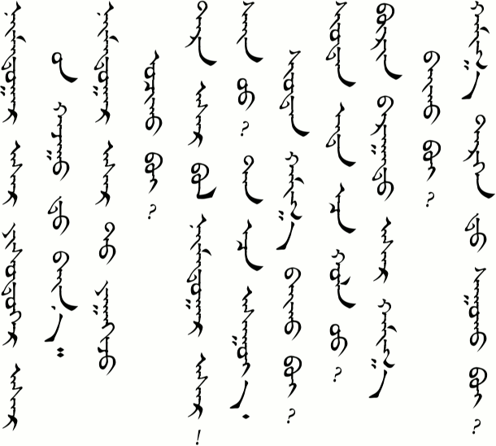
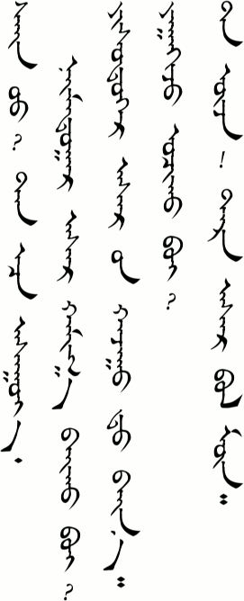
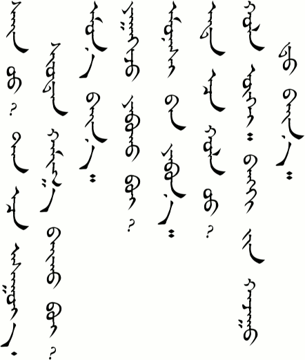
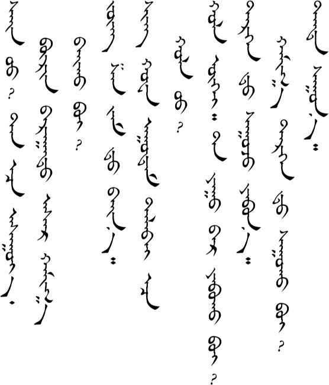
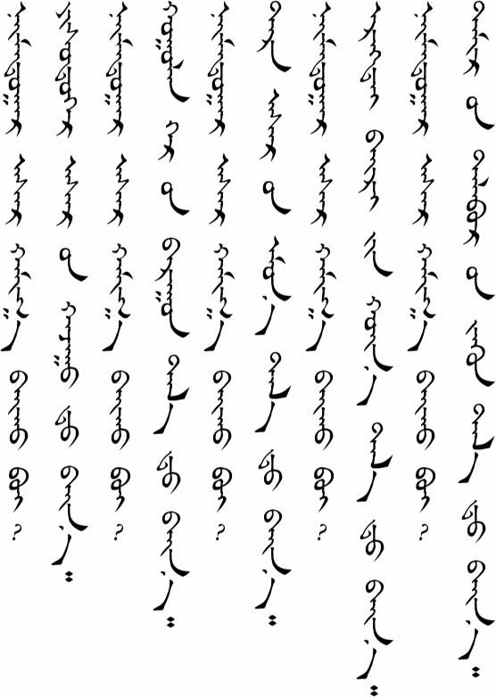
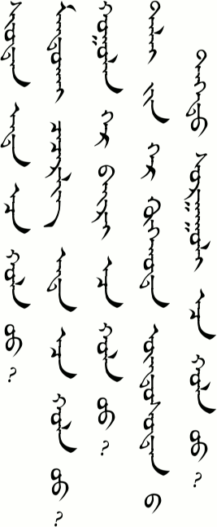
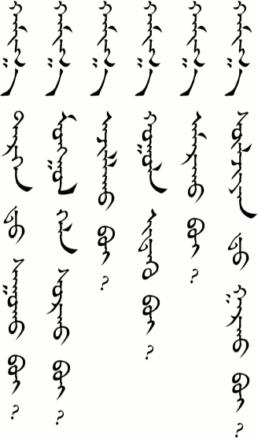
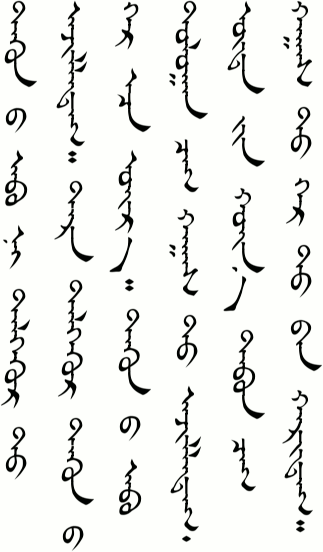
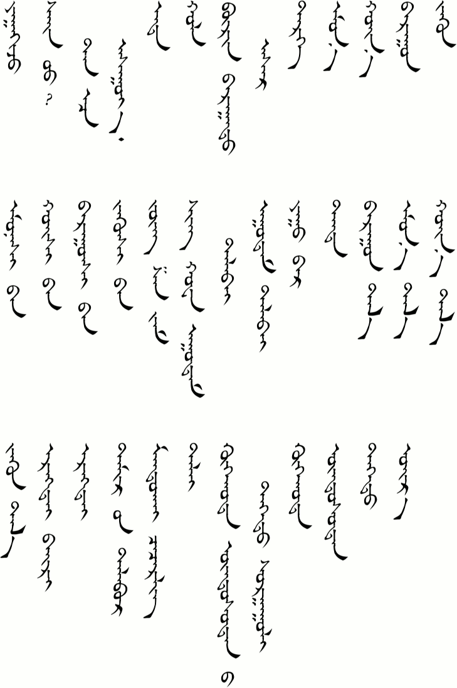

# Lesson 10

## Key Sentences

| Mongolian | English | Audio |
| :--- | :--- | :--- |
| næːmdʊgɑːr ɑsə̌r jisdʊgɑːr ɑsə̌r in xɑʤʊːd bæːnɑː | Building 8 is next to building 9. | <AudioPlayer src="/audio/L10-K1.mp3" /> |
| næːmdʊgɑːr ɑsə̌r t jɑːʤ ɔʧə̌x be? | How do you get to building 8? | <AudioPlayer src="/audio/L10-K2.mp3" /> |
| tər ɑsə̌r bɔl næːmdʊgɑːr ɑsə̌r | That building is building 8. | <AudioPlayer src="/audio/L10-K3.mp3" /> |
| sæːn ʊː    tɑnɑːs ɑsʊːjɑː    ʃʊːdə̌n xɑː bæːx be? | Excuse me, where is the post office? | <AudioPlayer src="/audio/L10-K4.mp3" /> |
| ʃʊːdə̌n ənd əːs xɔl ʊː? | Is the post office far from here? | <AudioPlayer src="/audio/L10-K5.mp3" /> |
| burə̌n bɑrɑːd ɑsə̌r xɑː bæːx be? | Where is the department store? | <AudioPlayer src="/audio/L10-K6.mp3" /> |
| xɑː tərgə̌n t sʊːx be? | Where is the bus stop? | <AudioPlayer src="/audio/L10-K7.mp3" /> |

## Dialogs

### One

<AudioPlayerSeek src="/audio/L10-D1.mp3" />

- A: sæːn ʊː    tɑnɑːs ɑsʊːjɑː    næːmdʊgɑːr ɑsə̌r xɑː bæːx be?
- B: jisdʊgɑːr ɑsə̌r in xɑʤʊːd bæːnɑː
- A: jɑːʤ ɔʧə̌x be?
- B: tɑː uʤəː    tər ɑsə̌r bɔl mon

### Two

<AudioPlayerSeek src="/audio/L10-D2.mp3" />

- A: sæːn ʊː    tɑnɑːs ɑsʊːjɑː    ʃʊːdə̌n xɑː bæːx be?
- B: omə̌n bæːnɑː
- A: jɑːʤ jæbə̌x be?
- B: omə̌nʃ əːn jæbnɑː
- A: ənd əːs xɔl ʊː?
- B: xɔl ugue    bæŋk in xɑʤʊːd bæːn

### Three

<AudioPlayerSeek src="/audio/L10-D3.mp3" />

- A: sæːn ʊː    tɑnɑːs ɑsʊːjɑː    burə̌n bɑrɑːd ɑsə̌r xɑː bæːx be?
- B: ʤuŋ ʃɑn ʤɑm t bæːn
- A: ʃinxwɑ uːdə̌m tælbæː gɑːs xɔl ʊː?
- B: xɔl ugue    tɑː juː gəːr jæbə̌x be?
- A: tərgə̌n t sʊːʤ jæbnɑː    xɑː tərgə̌n t sʊːx be?
- B: tənd sʊːnɑː

:::note Notes

- In Dialog One, B said /tɑː uʤəː/. The root verb plus a long vowel is how to make a command. Adding the long vowel makes it more polite than just using the root verb. It is not as formal as the /-ɑːræː/-əːreː/ ending that we studied before, though.
- Also in Dialog one, we have /bɔl mon/. We've seen both of these words before and both of them mean "to be". Putting them together like this apparently stresses that something "is". It is similar to 就是 in Chinese.
- Zhongshan Road and Xinhua Square are both in the city of Hohhot. The Chinese names are said with a Mongolian pronunciation.

:::

## Substitution

### One

<AudioPlayerSeek src="/audio/L10-S1.mp3" />

- A: næːmdʊgɑːr ɑsə̌r xɑː bæːx be?
- B: \_________________ t bæːn

---
- jisdʊgɑːr ɑsə̌r in xɑʤʊː
- xɔːlə̌n gər in bɑrʊːn tɑl
- tər ɑsə̌r in omə̌n tɑl
- ərə̌gte bæːr in xœːn tɑl
- tæmə̌r in tɑlbə̌r in ʤuːn tɑl

---

### Two

<AudioPlayerSeek src="/audio/L10-S2.mp3" />

_______  _______ ɑːs/əːs xɔl ʊː?

---
- ʃʊːdə̌n
- mɑndxɑi ʧiʧirlə̌g
- xɔːlə̌n gər
- dælæː gin gər

---
- ənd
- ənd
- bæːr
- xoxxɔt undə̌sne dəːd sʊrgʊːl

---

### Three

<AudioPlayerSeek src="/audio/L10-S3.mp3" />

xɑː \________-x be?

---
- tərgə̌n t sʊː-
- mɔŋgə̌l xəl sʊr-
- ɑʤə̌l-
- xɔːl id-
- ɑmə̌r-
- sulʤəːn t gɑr-

---

:::note Notes

- See the Grammar section for a more detailed description of how directions are used in Mongolian.
- In Substitution Two, the pattern for "Is X far from Y?" is quite different in Mongolian than it is in English. Note that is is like saying "X Y from far?" It seems strange at first, but with practice you will get used to it. This pattern with /ɑːs/əːs/ is also often used to make comparisons. For example, "Is X taller than Y?"

:::

## Expansion

<AudioPlayerSeek src="/audio/L10-E1.mp3" />

tuːneː ɑːb n dəlguːr t ɑʤə̌ldə̌g    tər dəlguːr tuːneː gər əːs œr    tuːneː ɑːb dɔlɔːn ʧɑg xɑgsə̌ d ɑʤə̌ldə̌g    ud in xœːn tɑbə̌n ʧɑg xɑgsə̌ d gər təːn xærdə̌g

## Vocabulary

| Mongolian | English | Audio |
| :--- | :--- | :--- |
| jɑːʤ | how | <AudioPlayer src="/audio/L10-V-how.mp3" /> |
| sæːn ʊː tɑːnɑːs ɑsʊːjɑː | Excuse me. Could I ask... | <AudioPlayer src="/audio/L10-V-excuseme.mp3" /> |
| ənd | here | <AudioPlayer src="/audio/L10-V-here.mp3" /> |
| xɔl | far | <AudioPlayer src="/audio/L10-V-far.mp3" /> |
| burə̌n bɑrɑːd ɑsə̌r | department store (building) | <AudioPlayer src="/audio/L10-V-department-store.mp3" /> |
| tərə̌g | vehicle (car, bus, cart, etc.) | <AudioPlayer src="/audio/L10-V-vehicle.mp3" /> |
| omə̌n | in front, before you; south | <AudioPlayer src="/audio/L10-V-front.mp3" /> |
| xœːn | back, behind you; north | <AudioPlayer src="/audio/L10-V-back.mp3" /> |
| bɑrʊːn | right, west | <AudioPlayer src="/audio/L10-V-right.mp3" /> |
| juːn | left, east | <AudioPlayer src="/audio/L10-V-left.mp3" /> |
| omə̌nʃ əːn (omə̌gʃ əːn) | forward, to the south (direction) | <AudioPlayer src="/audio/L10-V-front-direction.mp3" /> |
| xœːʃ ɔːn | back, to the north (direction) | <AudioPlayer src="/audio/L10-V-back-direction.mp3" /> |
| bɑrʊːnʃ ɑːn | to the right, west (direction) | <AudioPlayer src="/audio/L10-V-right-direction.mp3" /> |
| juːnʃ əːn | to the left, east (direction) | <AudioPlayer src="/audio/L10-V-left-direction.mp3" /> |
| ʤuŋ ʃɑn ʤɑm | Zhongshan Road | <AudioPlayer src="/audio/L10-V-zhongshan-road.mp3" /> |
| ʃin xwɑ uːdə̌m tælbæː | Xinhua Square | <AudioPlayer src="/audio/L10-V-xinhua-square.mp3" /> |
| uːdə̌m tælbæː | city square, wide open area commonly found in Chinese cities, usually tiled and having statues and shrubs | <AudioPlayer src="/audio/L10-V-square.mp3" /> |
| juː gəːr | by what, how | <AudioPlayer src="/audio/L10-V-by-what.mp3" /> |
| tənd | there | <AudioPlayer src="/audio/L10-V-there.mp3" /> |
| bɑrʊːn tɑl | west side | <AudioPlayer src="/audio/L10-V-west.mp3" /> |
| omə̌n tɑl | south side | <AudioPlayer src="/audio/L10-V-south.mp3" /> |
| xœːn tɑl | north side | <AudioPlayer src="/audio/L10-V-north.mp3" /> |
| ʤuːn tɑl | east side | <AudioPlayer src="/audio/L10-V-east.mp3" /> |
| ərə̌gte bæːr | boy's dorm | <AudioPlayer src="/audio/L10-V-boys-dorm.mp3" /> |
| ərə̌gte | male | <AudioPlayer src="/audio/L10-V-male.mp3" /> |
| tæmə̌r in tɑlbə̌r | sports ground | <AudioPlayer src="/audio/L10-V-sports-ground.mp3" /> |
| mɑndxɑi ʧiʧirlə̌g | Mandukhai Park, a park north of Inner Mongolia University in Hohhot. Mandukhai was a famous Mongolian Queen. | <AudioPlayer src="/audio/L10-V-mandukhai-park.mp3" /> |
| dælæː | Dalai (name meaning “sea”) | <AudioPlayer src="/audio/L10-V-dalai.mp3" /> |
| xoxxɔt undə̌sne dəːd sʊrgʊːl | Hohhot Nationality College, a provincial level college with a high percentage of Mongolian students and faculty. Many subjects are taught in Mongolian. | <AudioPlayer src="/audio/L10-V-hohhot-nationality-college.mp3" /> |
| xoxxɔt | Hohhot, the capital city of Inner Mongolia Autonomous Region in China. The name means “blue city”. | <AudioPlayer src="/audio/L10-V-hohhot.mp3" /> |
| undə̌stə̌n | ethnicity, (often translated “nationality” in China) | <AudioPlayer src="/audio/L10-V-nationality.mp3" /> |
| dəːd | upper, high | <AudioPlayer src="/audio/L10-V-upper.mp3" /> |
| œr | close, near | <AudioPlayer src="/audio/L10-V-close.mp3" /> |

## Grammar

### Directions

Directions can be a little confusing in Mongolian. This is partly because there are a couple words in English for each direction word in Mongolian. /bɑrʊːn/ can be "right" or "west". /juːn/ can be "left" or "east". /omə̌n/ can be "south" or "front". /xœːn/ can be "north" or "back". (/omə̌n/ and /xœːn/ can also be "before" and "after", as you may recall from their use in the words for "morning" and "afternoon".)

This is even more confusing for Westerners, since most of us are map oriented when telling direction. The top of the map is north. The bottom of the map is south. West is on the left side and east is on the right side. I mean, right? How is it that there is just one word in Mongolian that means both "right" and "west"?!

Let me try to give an explanation that makes sense to me. Mongolians (as well as the Chinese) are south oriented. They live in the Northern Hemisphere and the sun makes a big arc across the southern sky. For this reason it is natural face south. Buildings that have southern windows or doors can maximize the amount of light that they receive. (I'm not sure about Mongolian, yet, but in Chinese, the compass points south rather than north.) And if you are facing south, then west actually *is* to the right and east is to the left. South is in front and north is to your back.

Here are the basic direction words and their pronunciation:

| Mongolian | English |
| :--- | :--- |
| bɑrʊːn | right, west |
| juːn | left. east |
| omə̌n | front, south |
| xœːn | back, north |

<AudioPlayerSeek src="/audio/L10-G1.mp3" />

If you are "going" in some direction, then Mongolian adds a /-ʃ/ to the end of the direction word. (You are probably starting to realize now that a lot of Mongolian grammar is about adding suffixes to the end of words.)

| Mongolian | English |
| :--- | :--- |
| bɑrʊːnʃ | (going) to the right, (going) to the west |
| juːnʃ | (going) to the left. (going) to the east |
| omə̌gʃ (omə̌nʃ) | (going) to the front, (going) to the south |
| xœːʃ | (going) to the back, (going) to the north |

<AudioPlayerSeek src="/audio/L10-G2.mp3" />

For some reason, which I will ask my teachers about later (update: I asked but I still don't know why), you usually add the reflexive suffix (ɑːn/əːn) after the "going in some direction" words. So here they are:

| Mongolian | English |
| :--- | :--- |
| bɑrʊːnʃ ɑːn | (going) to the right, (going) to the west |
| juːnʃ əːn | (going) to the left. (going) to the east |
| omə̌nʃ oːn (omə̌gʃ əːn) | (going) to the front, (going) to the south |
| xœːʃ ɔːn | (going) to the back, (going) to the north |

<AudioPlayerSeek src="/audio/L10-G3.mp3" />

Now the questions that I have is, what if you are not facing south? Let's say you're facing north. If I tell you to go /bɑrʊːnʃ ɑːn/, are you going to go to your right (which is east) or are you going to go west (which is to your left)?

Our teachers' explanation seemed to make sense. They said it depends on the verb you are using. If I say to *go* /bɑrʊːnʃ ɑːn/, then it is understood that you should go west. But if I say *turn* /bɑrʊːnʃ ɑːn/, the implied meaning is to turn right, as in the direction of your right hand, no matter which way you are facing. And if I say to *meet* you in /omə̌n t/ of the building, then you should wait in front of the main door, even if that door is on the north side of the building.

| Mongolian | English |
| :--- | :--- |
| bɑrʊːnʃ ɑːn jæb | go west |
| juːnʃ əːn jæb | go east |
| omə̌gʃ əːn jæb | go south |
| xœːʃ ɔːn jæb | go north |
| bɑrʊːnʃ ɑːn ərə̌g | turn right |
| juːnʃ əːn ərə̌g | turn left |
| ʊrə̌gʃ ɑːn jæb | go straight |
| bʊʧɑːd jæb | go back |
| ɑsə̌r in omə̌n ʊːlʤjɑː | meet in front of the building |
| ɑsə̌r in ɑr t ʊːlʤjɑː | meet in back of the building |
| ɑsə̌r in omə̌n tɑl t ʊːlʤjɑː | meet on the south side of the building |
| ɑsə̌r in xœːn tɑl t ʊːlʤjɑː | meet on the north side of the building |

<AudioPlayerSeek src="/audio/L10-G4.mp3" />

## Practice

How do you say the following words:

- how
- here
- there
- far
- near
- department store
- east
- west side
- north
- (going in the) south (direction)
- city square
- boy's dorm
- sport's ground
- Hohhot
- ethnicity

How do you say the following sentences:

- Building 6 is next to building 5.
- How do you get to building 12?
- That building is building 8.
- Excuse me, where is Hohhot Nationality College?
- Is Dalai's home far from here?
- It's not far.
- Where can I get a bus?
- How do you go to work?
- It is on the east side of the post office.

Review by saying the following:

- Have a good trip.
- Please sit down.
- Let's have breakfast at 7:30 in the morning.
- She is watching TV at home.
- What does your mother do?
- I'm going to an Internet cafe.
- I don't know that person.
- Are you tired, teacher?
- How are you?

If you were able to say most of these things correctly then you are ready to go on to [lesson 11](/lessons/lesson-11). If not, then keep practicing! You can also download the audio for the whole lesson so that you can practice listening while jogging around the lake. Just right-click the link below and choose "Save Link As..." to download.

If you have any questions about this lesson or if you notice a mistake, then please leave a comment below. If I don't know the answer myself, then I will ask our teachers.

## Comments

**Bathrobe** on December 3, 2013 at 10:25 pm

I kept coming up against words I’ve never seen!

Burə̌m bɑrɑːd ɑsə̌r is a new one, although the meaning is clear if you look up the components (I think the first word should be burə̌n, with the ‘n’ assimilated to the following ‘b’). It’s basically a calque on Chinese 百貨. In Mongolia a department store is simply called ikh delguur (big store).

Tərgə̌n t threw me too. Tərə̌g just means ‘vehicle’; I guess it’s been abbreviated from the full form ni:tin maʃin tərə̌g. Mongolia of course uses avtobus (shortened to avtos).

> **Suragch** on December 5, 2013 at 8:57 pm
> 
> Thanks for your comment. I went back and changed /burə̌m/ to /burə̌n/. That was an astute observance on the the Chinese 百货. We are basing our dialogs on a Chinese textbook and in the dialog it was 百货楼. Because we are working from the Chinese, there is a tendency for the Mongolian dialogs to become a little more “Chinese” than they need to be, whether it be in vocab or grammar. We make a conscious effort to modify the dialogs to better fit Mongolian, but every now and then my teachers realize, oh, we don’t say it like that in Mongolian. I imagine a few things have slipped by, through. I have no idea if /burə̌n bɑrɑːd ɑsə̌r/ is one of them. I’ll have to ask.
> 
> At the same time, though, I want learn the Mongolian that is actually spoken in Inner Mongolia. And being in China, that means it is “Mongolian with Chinese characteristics”. I had to convince my teachers in a later lesson that I really did want to say 雪碧 and 可乐 and not just /ʊmdɑːn/, even though it meant just using the Chinese words with Mongolian pronunciation. Although I often hear Chinese words thrown into Mongolian sentences, my teachers are always reluctant to teach me to talk like that.
> 
> > **Bathrobe** on December 12, 2013 at 11:43 pm
> >
> > Burə̌n bɑrɑːd ɑsə̌r is in the dictionary so it’s probably a bona fide Mongolian word, in Inner Mongolia at least. There are a lot of differences in vocabulary from Mongolia, including a lot of calques on Chinese in Inner Mongolian. But there are also a lot of Chinese calques and borrowings in the Mongolian of Mongolia, too. (My favourites are tsagaan nogoo vs baicaa and hoolin ger vs guanz).
> >
> > It’s best to treat them like the differences between British and American vocabulary without worrying what might or might not have been borrowed from Chinese. Unless, of course, language in the textbook has been overly influenced by Chinese. The problem is that it’s not just the textbooks that have been influenced. The language itself has been influenced by Chinese. When they ask you yaruu yu?, this is a direct translation of 忙吗？ I’m not sure that they say it much in Mongolia.

**Suragch** on December 14, 2013 at 10:44 pm

Bathrobe: “It’s best to treat them like the differences between British and American vocabulary without worrying what might or might not have been borrowed from Chinese.”

That’s a good way of looking at it.

**Martin** on February 21, 2015 at 7:36 pm

Thank you for this course on Mongolian. The use of the International phonetic alphabet makes it very difficult to search for words in the dictionary as the IPA transliteration often varies for the same word on this site. For example ʤʊrgɑː is sometimes written here with a “j”. Would it be possible to use a standard transliteration (such as the Vladimirtsov-Mostaert system) or even better the cyrillic version of the words as well as the vertical script.

> **Suragch** on February 21, 2015 at 8:53 pm
>
> I agree that the dictionary is inconvenient to use. It is something I would like to improve in the future. And sorry about the typos. Anytime you notice an inconsistency if you can send me an email or message with their specific location I will fix them. That would also help others who use this site.
>
> I’m not planning to change the IPA transcription, but in the future I may add the Vladimirtsov-Mostaert system for Romanized word spellings. Both of these systems are used in the 蒙汉词典 (Mongolian-Chinese Dictionary) put out by Inner Mongolia University Publishing House, which is my standard.