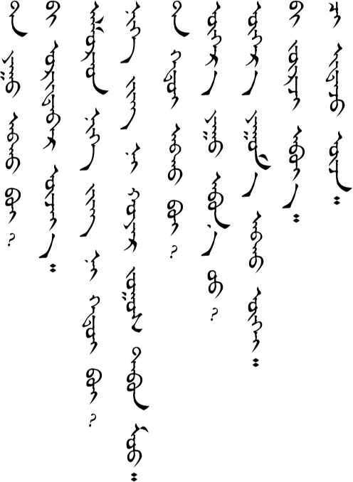
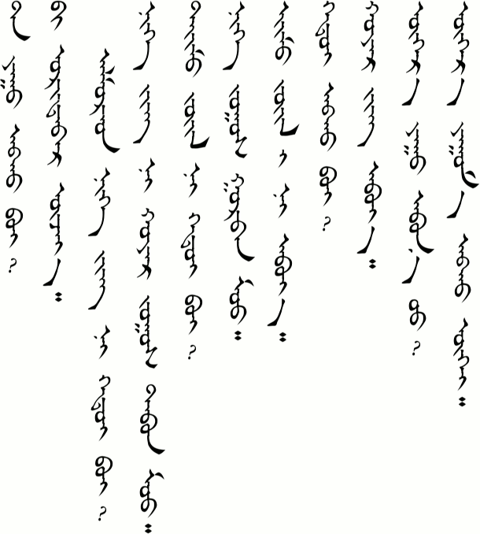
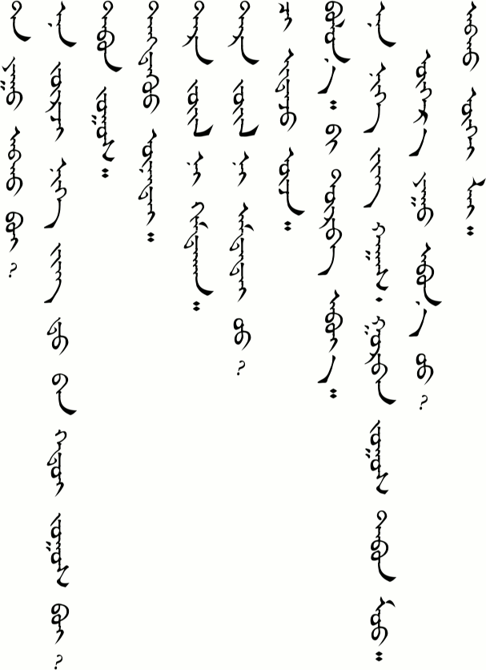
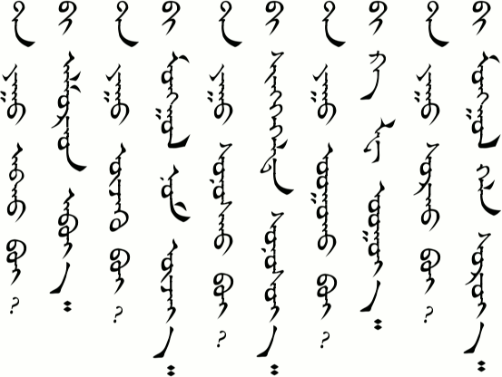
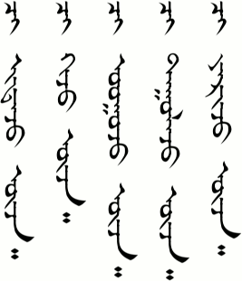
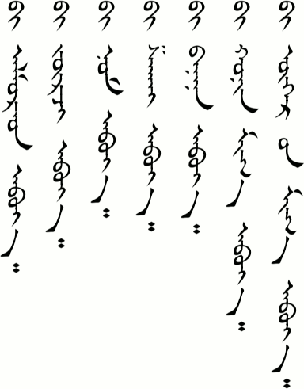
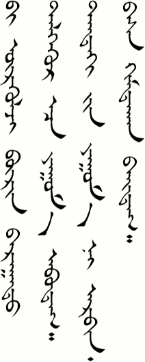
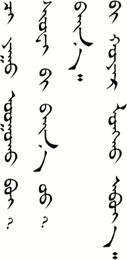
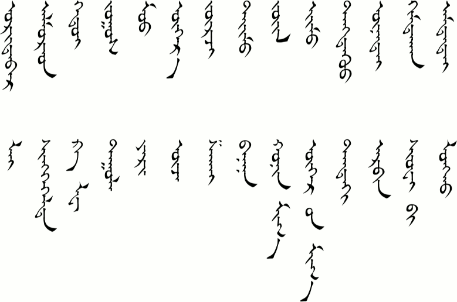
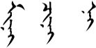

# Lesson 11

### Key Sentences

| | | |
| :--- | :--- | :--- |
| tɑː yuː ɑbə̌x be? | What would you like to buy? | <AudioPlayer src="/audio/L11-K1.mp3" /> |
| biː ʊrdɑːr uʤjəː | I’m just looking. | <AudioPlayer src="/audio/L11-K2.mp3" /> |
| ɑlə̌mə̌rə̌d nəg ʤiŋ n hədiː be? | How much do apples cost per jin? | <AudioPlayer src="/audio/L11-K3.mp3" /> |
| nəg jiŋ n xɔjə̌r jɔːs tɑbə̌n mʊː | One jin is two yuan and five mao. | <AudioPlayer src="/audio/L11-K4.mp3" /> |
| tɑː xədiː ɑbə̌x be? | How many do you want? | <AudioPlayer src="/audio/L11-K5.mp3" /> |
| oːr juː ɑbnʊː? | Do you want anything else? | <AudioPlayer src="/audio/L11-K6.mp3" /> |
| oːr im ɑb gue | I don’t want anything else. | <AudioPlayer src="/audio/L11-K7.mp3" /> |
| biː jurʤ ɑbjɑː | I’ll get some tangerines. | <AudioPlayer src="/audio/L11-K8.mp3" /> |
| ʧi idə̌ʤ uʤ | Have a taste. | <AudioPlayer src="/audio/L11-K9.mp3" /> |

### Dialogs

#### One

<AudioPlayerSeek src="/audio/L11-D1.mp3" />

Beginning with this lesson I will no longer add the phonetic transcription to the dialogs. Focus on reading the traditional script and listening to how things are pronounced in the recordings.

#### Two

<AudioPlayerSeek src="/audio/L11-D2.mp3" />

:::note
I think a lot of people say *pingguo* (the Chinese word for apple) rather than ɑlə̌mə̌rə̌ld, but I’m not completely sure. All the tutors I have had have been consistent about one thing. They don’t like to use Chinese words when they are teaching me Mongolian. I want to speak like people do in everyday life. I think it is natural that Mongolian should borrow words from Chinese since Chinese is spoken by almost everyone. (What would English be without borrowed words?) But I think Mongolians are afraid of loosing their mother tongue and feel bad when they don’t know or use the Mongolian word. The older generation scolds them for using Chinese words when they talk. Tongliao Mongolians are also looked down on because they use more Chinese words in their sentences that other Mongolians. I guess I’ll just learn the pure Mongolian way of speaking first and then pick up the common ways of saying things as I listen to people talking.

As I understand it the grammar particle *lei* word in the last sentence signifies a change. She already got some tangerines, but now she doesn’t want anything *else*. For those of you who know Chinese, I think it is used similarly to the Chinese 了 as it is used in 不要了.
:::

### Substitution

#### One

<AudioPlayerSeek src="/audio/L11-S1.mp3" />

#### Two

<AudioPlayerSeek src="/audio/L11-S2.mp3" />

#### Three

<AudioPlayerSeek src="/audio/L11-S3.mp3" />

:::note
Modern words like cola just don’t exist in Mongolian and so we see it borrowed from Chinese here, *kele* 可乐.

In Substitution 2 we see the word uʤ. It literally means “see” but here it is used to mean “try.”
:::

### Expansion

#### One

<AudioPlayerSeek src="/audio/L11-E1.mp3" />

#### Two

<AudioPlayerSeek src="/audio/L11-E2.mp3" />

:::note
*Xuebi* (雪碧) is another word that can’t help being borrowed. It is the Chinese for Sprite.

Notice that /ɑbjɑː/ (the last word) can also be pronounced /ɑbiː/.
:::

### Vocabulary

| | | |
| :--- | :--- | :--- |
| ʊrdɑːr | first | <AudioPlayer src="/audio/L11-V-first.mp3" /> |
| ɑlə̌mə̌rə̌d | apple | <AudioPlayer src="/audio/L11-V-apple.mp3" /> |
| xədiː | how much, how many | <AudioPlayer src="/audio/L11-V-how-much.mp3" /> |
| ʤɔːs | money | <AudioPlayer src="/audio/L11-V-money.mp3" /> |
| mʊː | mao (one tenth of a Chinese yuan) | <AudioPlayer src="/audio/L11-V-mao.mp3" /> |
| oːr | other | <AudioPlayer src="/audio/L11-V-other.mp3" /> |
| ʤurʤ | tangerine | <AudioPlayer src="/audio/L11-V-tangerine.mp3" /> |
| tiːm | that | <AudioPlayer src="/audio/L11-V-that.mp3" /> |
| ʤuil | kind | <AudioPlayer src="/audio/L11-V-kind.mp3" /> |
| iːm | this | <AudioPlayer src="/audio/L11-V-this.mp3" /> |
| dəŋduː | too | <AudioPlayer src="/audio/L11-V-too.mp3" /> |
| unteː | expensive | <AudioPlayer src="/audio/L11-V-expensive.mp3" /> |
| xæmtxə̌n | cheap | <AudioPlayer src="/audio/L11-V-cheap.mp3" /> |
| ɑmttæː | delicious | <AudioPlayer src="/audio/L11-V-delicious.mp3" /> |
| leː | grammar particle | <AudioPlayer src="/audio/L11-V-lei.mp3" /> |
| ʃiŋgə̌ld | recording | <AudioPlayer src="/audio/L11-V-recording.mp3" /> |
| kələ | cola (from Chinese 可乐) | <AudioPlayer src="/audio/L11-V-cola.mp3" /> |
| dʊːl- | to sing | <AudioPlayer src="/audio/L11-V-sing.mp3" /> |
| jær- | to speak | <AudioPlayer src="/audio/L11-V-say.mp3" /> |
| uʤ- | to see, to try | <AudioPlayer src="/audio/L11-V-try.mp3" /> |
| ʃɑxɑi | shoes | <AudioPlayer src="/audio/L11-V-shoes.mp3" /> |
| bɑnɑnɑ | banana | <AudioPlayer src="/audio/L11-V-banana.mp3" /> |
| xœnə̌n mɑx | mutton, lamb | <AudioPlayer src="/audio/L11-V-mutton.mp3" /> |
| uxriːn mɑx | beef | <AudioPlayer src="/audio/L11-V-beef.mp3" /> |
| təndə̌x | over there | <AudioPlayer src="/audio/L11-V-there.mp3" /> |
| ærbə̌n | many | <AudioPlayer src="/audio/L11-V-many.mp3" /> |
| ʃuebiː | Sprite (from Chinese 雪碧) | <AudioPlayer src="/audio/L11-V-sprite.mp3" /> |
| lɔŋx | bottle | <AudioPlayer src="/audio/L11-V-bottle.mp3" /> |

### Grammar

#### The Tricky “Ni”

In today’s lesson we saw “ni” quite a few times. It is the third word in the list below. The three are /min/, /ʧin/, and /ni/ (usually pronounced /n/).

They go after the noun and in English they are usually translated “my”, “your”, and “his/her/its” respectively. However, Kullmann and Tserenpil in *Mongolian Grammar* say that they shouldn’t be considered possessive pronouns, but rather expressing the relationship between the noun and the person (p. 106). Don’t ask me what that means. I thought that’s what a possessive pronoun was for.

We saw ʧin all the way back in Lesson One as “tɑːnæː ɑːb əːʤ **ʧin** sæːn ʊː?” The ʧin seemed kind of redundant to me because tɑːnæː already means “your.” I guess that’s where “expressing the relationship” comes in. Anyway, in today’s lesson in Dialog One we had “ɑlə̌mə̌rə̌d nəg jiŋ **n** hədiː be?” I understand that it means “How much is one jin (half a kilogram) of apples?”  but I’m having trouble grasping what the “ni” is referring to. It connects “one jin” with a his/her/its. Whose “one jin” is it? The apple’s? The fruit seller’s? Or the pile of fruit from which it came? I’m leaning toward the latter, but I will need to update this later with a better explanation and more examples.

### Practice

How do you say the following words:

- money
- tangerine
- how much
- other
- expensive
- cheap
- delicious
- speak
- sing
- mutton
- beef

How do you say the following sentences:

- How much do apples cost per jin?
- What would you like to buy?
- How many do you want?
- I want five.
- Do you want anything else?
- I don’t want anything else.
- What do you want to drink?
- I’ll have a Sprite.
- Try to sing.
- I’d like some beef.

Review by saying the following:

- How are your parents?
- I’m not busy.
- Is she a teacher?
- I’m going back home.
- How many people are in your family?
- I study at Inner Mongolia University.
- I get up at 6:30, too.
- Let’s have breakfast at 7:30 in the morning.
- I don’t know.
- Excuse me, where is the post office?
- Go straight.
- Where can I get on the Internet?

If you were able to say most of these things correctly then you are ready to go on to [Lesson 12](/lessons/lesson-12). If not, then keep practicing! You can also download the audio for the whole lesson so that you can practice listening on your flight to China. Click the three-dot menu at the right of the audio player below and choose "Download".

<AudioPlayerSeek src="/audio/Main-lesson-11.mp3" />

---

## Comments

*Do you have a comment or question that would be helpful for others here? Copy the link to this page and [email me](/contact/) your comment or question.*

**Bathrobe** on May 19, 2015 at 10:57 pm

Well, I didn’t notice that you were back!

Two things:

1. You give /oːr im ɑb gue/ for “I don’t want anything else”, but your recording features a strong velar fricative /x/, that is, it sounds more like /oːr im ɑx gue/. But /x/ doesn’t seem right here for /b/ because they’re two different sounds. In addition, grammatically it’s supposed to be “ɑbǎx gue”. Therefore, my personal feeling is that what has happened here is that the /b/ has been weakened so much that it’s almost inaudible while /x/ is very strong. But I do think /b/ is still there, as a very faint /w/ sound after the /ɑ/. So I feel that technically it should be /oːr im ɑwx gue/.

2. You express puzzlement over the “ni”. I don’t blame you. I think it’s one of the trickiest areas of Mongolian grammar. My own interpretation is that here it means something like ‘apples, one jin of them’.

Another example: gar tærx bɔl xuni: ʧʊxǎl erdə̌n jum. gar ni aʤil xi:n, tærx ni jum sətgə̌n. (The hands and brain are important treasures of people. Their hands do work, their brains think of things.) Here ni appears to mean ‘of them’, ‘their’.

I’ve also seen “ni” used in other contexts where it seemed like it was like a recapitulation of the subject. For instance, in English you can say, “Me and my dog, we’re great friends”, where “we” recapitulates “me and my dog” (or “You see that guy and girl, they’re lovers”, where “they” recapitulates “that guy and girl”). Well, in Mongolian it seems to me that “ni” may be used to form a kind of break between the subject and the predicate, by recapitulating the subject of the sentence and grammatically preparing you to launch into the predicate. I haven’t got any convincing examples at hand, but many times I’ve felt that “ni” serves no other purpose than to summarise what went before. In this sense, the sentence above could be restated as: “The hands and brain are important treasures of people. The hands, they do work, the brain, it thinks of things.” But this is just a feeling I have. I don’t think anyone’s done a really convincing linguistic analysis of “ni”.

**Dabus** on August 8, 2015 at 10:31 am

Thank you for good job!

I saw you struggled with ‘ni’. As a korean, I understand you because no postposition word of subject in Western(please forgive me if it is wrong^^). In our grammar like Mongolian, there are nominative postpositional words. By the way, please check ‘the Sainbeno book’part 2 and page 14 as well as TEE series book1 ‘the Abundant life’ page 149, 1st question in Mongolian. You can see grammar and example♥.