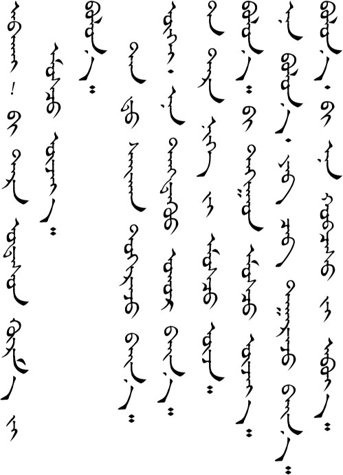
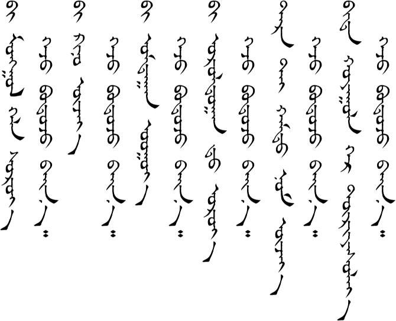

# Lesson 12

## Key Sentences

| Mongolian | English | Audio |
| :--- | :--- | :--- |
| təŋgə̌r huitə̌rʤeː | The weather is cold. | <AudioPlayer src="/audio/L12-K1.mp3" /> |
| bi nəg xobə̌ŋ dəːl ɑbiː gəʤ bæːnɑː | I'm going to get a cotton padded <em>deel</em>. | <AudioPlayer src="/audio/L12-K2.mp3" /> |
| gærə̌g iːn odə̌r ɔʧjɑː bɔln ʊː? | Let's go on Sunday, ok? | <AudioPlayer src="/audio/L12-K3.mp3" /> |
| gærə̌g iːn odə̌r hun dənduː ɔlə̌n | There are too many people on Sunday. | <AudioPlayer src="/audio/L12-K4.mp3" /> |
| bi tər ʊtsə̌n xurm iː omsə̌ʤ uʤləː | Let me try on that sweater. | <AudioPlayer src="/audio/L12-K5.mp3" /> |
| bɔlnɔː | Ok. | <AudioPlayer src="/audio/L12-K6.mp3" /> |
| bi ʊmdɑːn ʊːi gəʤ bɔdə̌ʤ bæːn | I want to drink a beverage. | <AudioPlayer src="/audio/L12-K7.mp3" /> |

## Dialogs

### One

<AudioPlayerSeek src="/audio/L12-D1.mp3" />

### Two

<AudioPlayerSeek src="/audio/L12-D2.mp3" />

:::note Notes
Have we talked about the /iː/? The word it follows is the object of the verb. Sometimes it is left out when talking about something in general, but it is especially used when referring to a specific object. We see this in /bi ən xɔbʧə̌s iː ɑbjɑː/. I'll get *this* article of clothing.
:::

## Substitution

### One

<AudioPlayerSeek src="/audio/L12-S1.mp3" />

### Two

<AudioPlayerSeek src="/audio/L12-S2.mp3" />

:::note Notes
- gəʤ bæːnɑː can also be pronounced gəʤinɑː
- As I understand it, gəʤ bæːn expresses the speakers intent to do something, whereas bɔdə̌ʤ bæːn is more thinking about or wanting to do something. gəʤ itself is some sort of connecting word.
:::

## Expansion

### One

<AudioPlayerSeek src="/audio/L12-E1.mp3" />

:::note Notes
Here we can see how to say you don't want to do something.
:::

## Vocabulary

| Mongolian | English | Audio |
| :--- | :--- | :--- |
| xuitə̌r | to become cold | <AudioPlayer src="/audio/L12-V-cold.mp3" /> |
| təŋgə̌r | weather, sky | <AudioPlayer src="/audio/L12-V-weather.mp3" /> |
| xobə̌n dəːl | cotton padded deel (Mongolian robe) | <AudioPlayer src="/audio/L12-V-coat.mp3" /> |
| gəʤ | grammatical connecting word | <AudioPlayer src="/audio/L12-V-geju.mp3" /> |
| ɔlə̌n | many | <AudioPlayer src="/audio/L12-V-many.mp3" /> |
| ʊtsə̌n xorə̌m | sweater | <AudioPlayer src="/audio/L12-V-sweater.mp3" /> |
| omə̌s | to wear | <AudioPlayer src="/audio/L12-V-wear.mp3" /> |
| ʊmdɑːn | drink, beverage | |
| bɔd | to think, to want | <AudioPlayer src="/audio/L12-V-think.mp3" /> |
| təgbə̌l | well then, in that case | |
| ɑbxɑi | Miss, Ma'am | <AudioPlayer src="/audio/L12-V-miss.mp3" /> |
| tœxə̌r | to suit, to be suitable | |
| ɔxə̌r | short | <AudioPlayer src="/audio/L12-V-short.mp3" /> |
| dexɑːd | again | <AudioPlayer src="/audio/L12-V-again.mp3" /> |
| jɑb ʧɑb | just (right), perfectly | <AudioPlayer src="/audio/L12-V-perfect.mp3" /> |
| tɑːr | to be right, correct | |
| xʊbʧə̌s | clothes | <AudioPlayer src="/audio/L12-V-clothes.mp3" /> |
| ʊrə̌ldɑːn | competition | <AudioPlayer src="/audio/L12-V-competition.mp3" /> |
| ɔr | to enter | <AudioPlayer src="/audio/L12-V-enter.mp3" /> |
| xɑmt | together | <AudioPlayer src="/audio/L12-V-together.mp3" /> |
| durəːsə̌l | to rent | <AudioPlayer src="/audio/L12-V-rent.mp3" /> |
| mɑneːd | our place, our house | <AudioPlayer src="/audio/L12-V-ourplace.mp3" /> |
| gɑdə̌ʃ gɑr | to go out | <AudioPlayer src="/audio/L12-V-goout.mp3" /> |
| niləːd | quite, very | <AudioPlayer src="/audio/L12-V-very.mp3" /> |
| mɑʃ | much, very | <AudioPlayer src="/audio/L12-V-much.mp3" /> |
| jɑdə̌r | to be tired | <AudioPlayer src="/audio/L12-V-tired.mp3" /> |
| dəmeː | (not) so, very | <AudioPlayer src="/audio/L12-V-notvery.mp3" /> |
| biʃ | not, no | <AudioPlayer src="/audio/L12-V-not.mp3" /> |

---

## Comments

*Do you have a comment or question that would be helpful for others here? Copy the link to this page and [email me](/contact/) your comment or question.*

---

**Sakura** on May 9, 2017 at 12:25 pm

Your website has been so amazingly helpful and i can’t thankyou enough for the helpful audio as well. I see you last updated in 2015. I wonder where you are now, i really hope you can come back to updating this website again. There’s is so much to know.

> **Suragch** on May 11, 2017 at 3:15 pm
>
> I actually have the lessons all recorded through lesson 20. It takes about 10 hours of work to do the editing for every lesson, though, so I haven’t gotten around to it. For the past couple years I’ve spent more of my time developing Mongolian cell phone software like the Chimee app. I’m also continuing my own private Mongolian study. It helps to know that people like you are actually using the lessons so hopefully that will be a motivation to get some more out.
> 
> You can view the unfinished lessons by typing the lesson number in the page address. For example, lesson 13 is [http://www.studymongolian.net/lessons/lesson-13/](http://www.studymongolian.net/lessons/lesson-13/). When I finish the lessons I will add links in the menu.

---

**Pierre** on January 11, 2020 at 7:24 pm

Could someone remind me what the verb ending “TanelchilaaD UG” mean? (Expansion drill, last word) Thk u