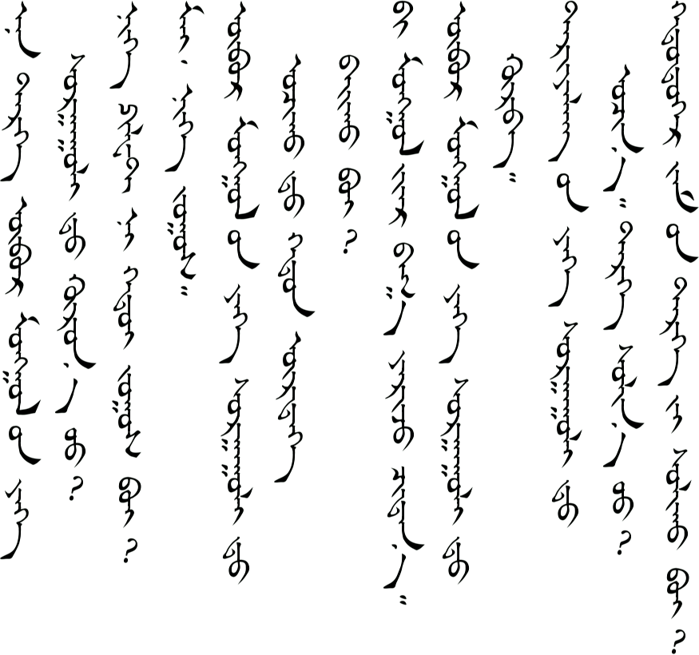
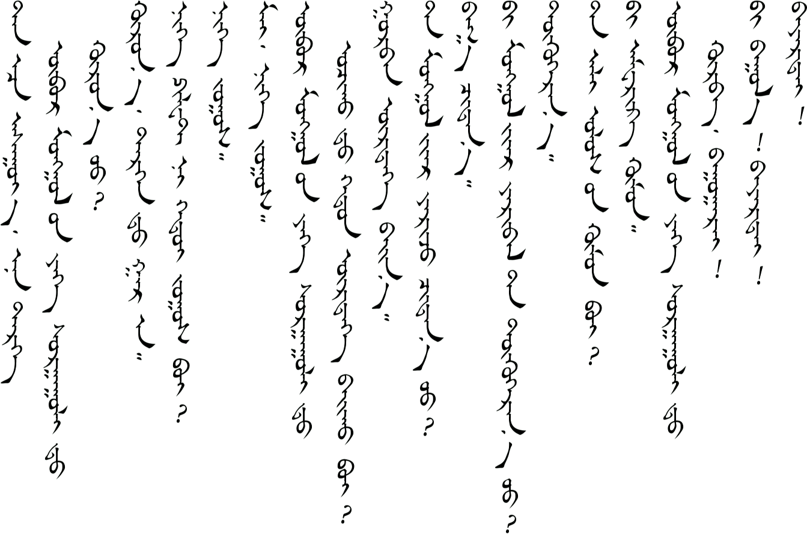
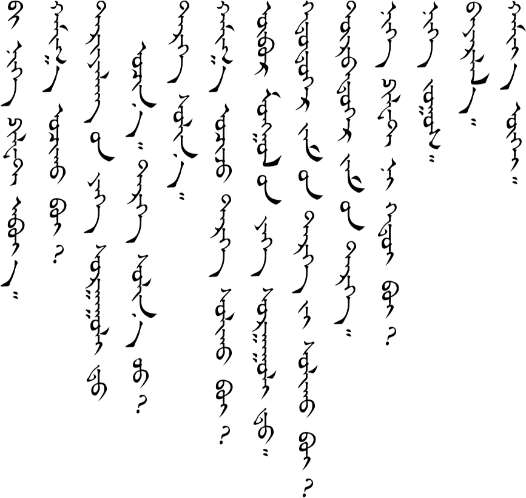
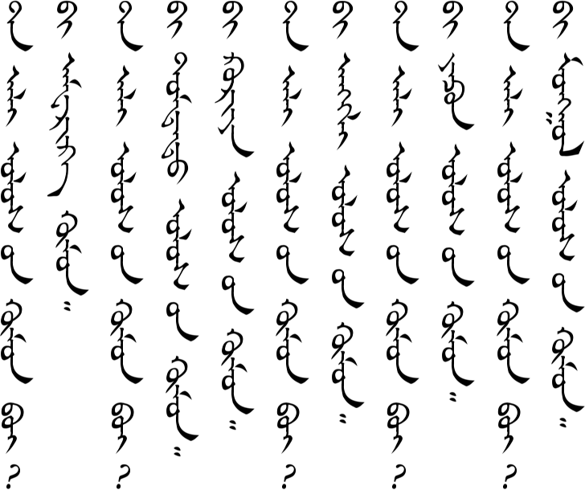
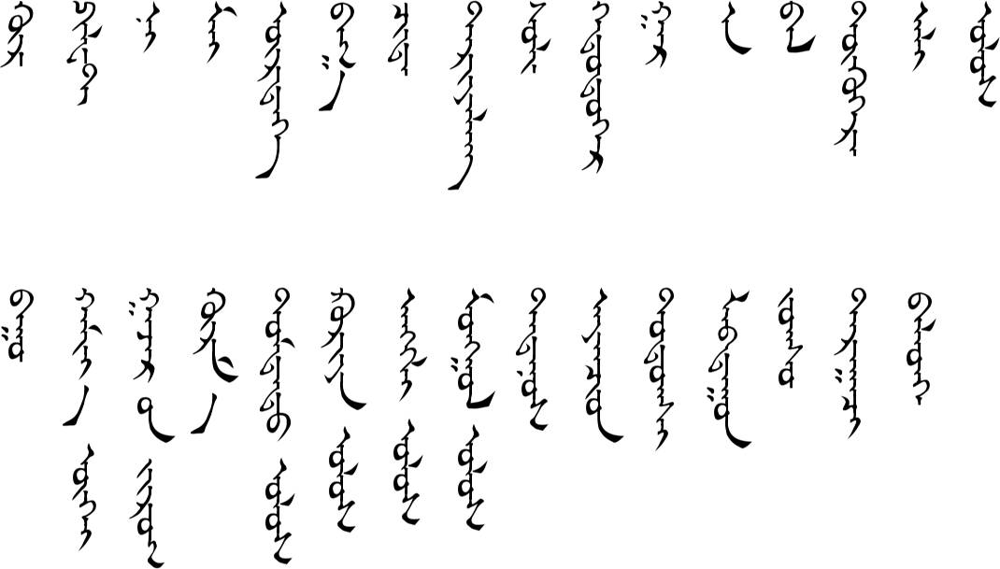

# Lesson 13

## Key Sentences

| Mongolian | English | Audio |
| --- | --- | --- |
| ən tərəg obə̌r mɔŋgɔl iːn jix sʊrgʊːld xurn ʊː? | Does the bus go to Inner Mongolia University? | <AudioPlayer src="/audio/L13-K1.mp3" /> |
| nəg biletən xədiː ʤɔːs we? | How much does one ticket cost? | <AudioPlayer src="/audio/L13-K2.mp3" /> |
| mæː nəg ʤɔːs | Here you go. Here is one yuan. | <AudioPlayer src="/audio/L13-K3.mp3" /> |
| obə̌r mɔŋgɔl iːn jix sʊrgʊːld ɔʧxəd hədən ortoː bæːx we? | How many (bus) stops are there on the way to Inner Mongolia University? | <AudioPlayer src="/audio/L13-K4.mp3" /> |
| biː mɔŋgɔl ɔːr bɑg jærə̌ʤ ʧædnɑː | I can speak Mongolian a little. | <AudioPlayer src="/audio/L13-K5.mp3" /> |
| obə̌r mɔŋgɔl iːn jix sʊrgʊːld xurbəː | We have arrived at Inner Mongolia University. | <AudioPlayer src="/audio/L13-K6.mp3" /> |
| tɑrɑːlə̌ŋgiːn jix sʊrgʊːld ɔʧnɔː tərə̌g sœln ʊː? | I'm going to the Agricultural University. Do I have to change buses? | <AudioPlayer src="/audio/L13-K7.mp3" /> |
| xəddʊgɑːr ʤɑm iːn tərə̌g iː sœlə̌x we? | Which bus number to do have to change to? | <AudioPlayer src="/audio/L13-K8.mp3" /> |

## Dialogs

### One

<AudioPlayerSeek src="/audio/L13-D1-bus.mp3" />

<AudioPlayerSeek src="/audio/L13-D1.mp3" />

Although this is not part of the actual lesson, here the the repeated content of the bus recording for your information. The different station names are substituted where Inner Mongolia University occurs here.

<AudioPlayerSeek src="/audio/L13-D1-bus-sentences.mp3" />

### Two

<AudioPlayerSeek src="/audio/L13-D2.mp3" />

## Substitution

### One

<AudioPlayerSeek src="/audio/L13-S1.mp3" />

### Two

<AudioPlayerSeek src="/audio/L13-S2.mp3" />

### Three

<AudioPlayerSeek src="/audio/L13-S3.mp3" />

### Four

<AudioPlayerSeek src="/audio/L13-S4.mp3" />

## Expansion

### One

<AudioPlayerSeek src="/audio/L13-E1.mp3" />

## Vocabulary

| Mongolian | English | Audio |
| --- | --- | --- |
| xur | to arrive | <AudioPlayer src="/audio/L13-V-arrive.mp3" /> |
| biled | ticket | <AudioPlayer src="/audio/L13-V-ticket.mp3" /> |
| n, ni | its, grammar particle | <AudioPlayer src="/audio/L13-V-ni.mp3" /> |
| mæ, mai | here you go | <AudioPlayer src="/audio/L13-V-hereyougo.mp3" /> |
| ortoː | station, (bus) stop | <AudioPlayer src="/audio/L13-V-station.mp3" /> |
| bɑg | small, little | <AudioPlayer src="/audio/L13-V-small.mp3" /> |
| ʧæd | can, to be able to | <AudioPlayer src="/audio/L13-V-can.mp3" /> |
| tærɑːlə̌ŋ | agriculture, farming | <AudioPlayer src="/audio/L13-V-agriculture.mp3" /> |
| sœl | switch, change | <AudioPlayer src="/audio/L13-V-switch.mp3" /> |
| xəddugəːr | which number | <AudioPlayer src="/audio/L13-V-whichnumber.mp3" /> |
| gɑr | to get on | <AudioPlayer src="/audio/L13-V-geton.mp3" /> |
| ɑː | grammar particle, makes a command more polite | <AudioPlayer src="/audio/L13-V-aa.mp3" /> |
| bɑl, bəl | if (verb ending) | <AudioPlayer src="/audio/L13-V-if.mp3" /> |
| toxoːr | to understand | <AudioPlayer src="/audio/L13-V-understand.mp3" /> |
| æl | which | <AudioPlayer src="/audio/L13-V-which.mp3" /> |
| ʊlə̌s | country, nation | <AudioPlayer src="/audio/L13-V-country.mp3" /> |
| bʊː | to get off | <AudioPlayer src="/audio/L13-V-getoff.mp3" /> |
| xɑmɑːgui | no problem, you're welcome | <AudioPlayer src="/audio/L13-V-noproblem.mp3" /> |
| gɑʤə̌r iː ʤʊrə̌g | map | <AudioPlayer src="/audio/L13-V-map.mp3" /> |
| xurə̌m | jacket, coat | <AudioPlayer src="/audio/L13-V-coat.mp3" /> |
| dʊmdə̌d ʊlə̌s | China (Middle Country) | <AudioPlayer src="/audio/L13-V-china.mp3" /> |
| kʊrijɑː ʊlə̌s | South Korea | <AudioPlayer src="/audio/L13-V-southkorea.mp3" /> |
| æŋgə̌l ʊlə̌s | England, UK | <AudioPlayer src="/audio/L13-V-england.mp3" /> |
| mɔŋgə̌l ʊlə̌s | Mongolia | <AudioPlayer src="/audio/L13-V-mongolia.mp3" /> |
| tədnuːs | they | <AudioPlayer src="/audio/L13-V-they.mp3" /> |
| ɑjɑnʧid | passengers | <AudioPlayer src="/audio/L13-V-passengers.mp3" /> |
| dɔtə̌gʃ | inward | <AudioPlayer src="/audio/L13-V-inward.mp3" /> |
| lɑbdʊːn | steady, stable, firm | <AudioPlayer src="/audio/L13-V-steady.mp3" /> |
| dɑrɑːʧ | next | <AudioPlayer src="/audio/L13-V-next.mp3" /> |
| bəldxə | to prepare, to get ready | <AudioPlayer src="/audio/L13-V-prepare.mp3" /> |

:::note
"ticket" should be "b", not "p".
:::

If you have any questions about this lesson or if you notice a mistake, then please leave a comment below. If I don't know the answer myself, then I will ask our teachers.

## Comments

**Suragch** on March 6, 2018 at 12:38 am

I’m making these latter lessons (13+) public now, but I haven’t included grammar explanations. If there is something you don’t understand, then ask a question. I will either answer in the comments or add a grammar explanation above.