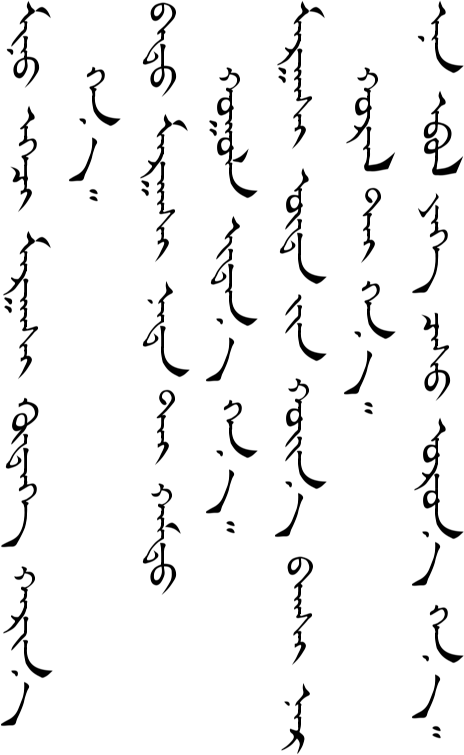

# Lesson 14

## Key Sentences

| Mongolian | English | Audio |
| --- | --- | --- |
| bi ʤɔːs ugue bɔlsə̌n | I ran out of money. | <AudioPlayer src="/audio/L14-K1.mp3" /> |
| sɔnsxə̌lɑːr bæŋkə̌d ʤɔːs sœlʤ bɔlən gənəː | I hear you can exchange money at the bank. | <AudioPlayer src="/audio/L14-K2.mp3" /> |
| ənd ʤɔːs sœlʤ bɔln ʊː? | Can I exchange money here? | <AudioPlayer src="/audio/L14-K3.mp3" /> |
| tɑː yɛmə̌r ʤɔːs sœlə̌x be? | What kind of money are you exchanging? | <AudioPlayer src="/audio/L14-K4.mp3" /> |
| tɑː ʤɔːs iːn tɔː gɔːn biʧəːreː | Please write the amount of money. | <AudioPlayer src="/audio/L14-K5.mp3" /> |
| tɔːlʤ uʤ | Count and see. | <AudioPlayer src="/audio/L14-K6.mp3" /> |
| iŋgəʤ biʧbə̌l tɑːrn ʊː? | Is it correct if I write it like this? | <AudioPlayer src="/audio/L14-K7.mp3" /> |

## Dialogs

### One

<AudioPlayerSeek src="/audio/L14-D1.mp3" />

### Two

<AudioPlayerSeek src="/audio/L14-D2.mp3" />

## Substitution

### One

<AudioPlayerSeek src="/audio/L14-S1.mp3" />

### Two

<AudioPlayerSeek src="/audio/L14-S2.mp3" />

### Three

<AudioPlayerSeek src="/audio/L14-S3.mp3" />

## Expansion

<AudioPlayerSeek src="/audio/L14-E1.mp3" />

## Vocabulary

| Mongolian | English | Audio |
| --- | --- | --- |
| sɔnsə̌xlɔːr | (I) hear that | <AudioPlayer src="/audio/L14-V-hear.mp3" /> |
| gənəː | it is said | <AudioPlayer src="/audio/L14-V-said.mp3" /> |
| sœl | exchange (money) | <AudioPlayer src="/audio/L14-V-exchange.mp3" /> |
| tɔː | number, amount | <AudioPlayer src="/audio/L14-V-number.mp3" /> |
| tɔːl | to count | <AudioPlayer src="/audio/L14-V-count.mp3" /> |
| mɑrk | Mark | <AudioPlayer src="/audio/L14-V-mark.mp3" /> |
| iŋgə̌ʤ | like this | <AudioPlayer src="/audio/L14-V-likethis.mp3" /> |
| bur | all | <AudioPlayer src="/audio/L14-V-all.mp3" /> |
| ʤɑr | to spend, to use | <AudioPlayer src="/audio/L14-V-spend.mp3" /> |
| bɑr | to finish | <AudioPlayer src="/audio/L14-V-finish.mp3" /> |
| dɔːlə̌r | dollar | <AudioPlayer src="/audio/L14-V-dollar.mp3" /> |
| ɑrd iːn ʤɔːs | RMB (people's money) | <AudioPlayer src="/audio/L14-V-rmb.mp3" /> |
| togrə̌g | Unit of money in Mongolia and also used at times for unit of money in China (yuan) | <AudioPlayer src="/audio/L14-V-togrog.mp3" /> |
| nɑd | me | <AudioPlayer src="/audio/L14-V-me.mp3" /> |
| xʊrə̌l | meeting | <AudioPlayer src="/audio/L14-V-meeting.mp3" /> |
| obə̌l | winter | <AudioPlayer src="/audio/L14-V-winter.mp3" /> |
| ʧɑs | snow | <AudioPlayer src="/audio/L14-V-snow.mp3" /> |
| ɔr | to fall (rain, snow) | <AudioPlayer src="/audio/L14-V-fall.mp3" /> |
| xærʊːl | to answer | <AudioPlayer src="/audio/L14-V-answer.mp3" /> |
| tælə̌b | to put | <AudioPlayer src="/audio/L14-V-put.mp3" /> |
| tuːn iː | him/her (object of verb) | <AudioPlayer src="/audio/L14-V-him.mp3" /> |
| xuljəː | to wait | <AudioPlayer src="/audio/L14-V-wait.mp3" /> |
| lɑ | grammar particle | <AudioPlayer src="/audio/L14-V-la.mp3" /> |

:::note
If you have any questions about this lesson or if you notice a mistake, then please leave a comment below. If I don’t know the answer myself, then I will ask our teachers.
:::