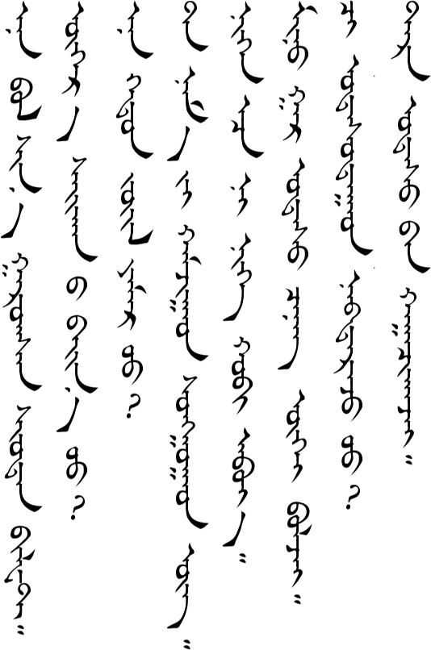
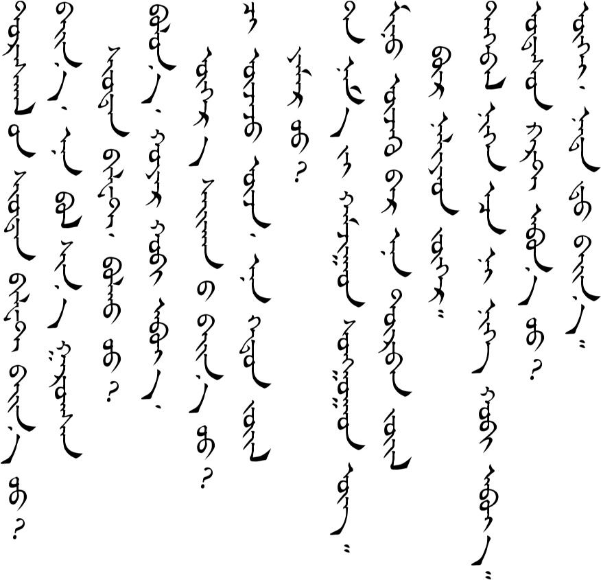
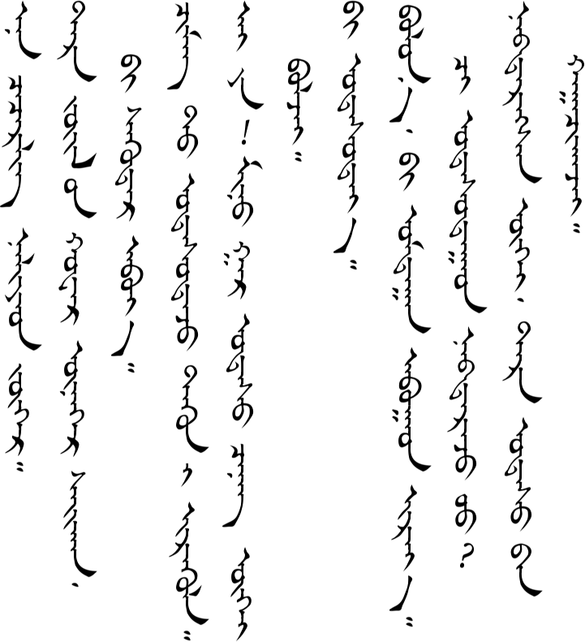
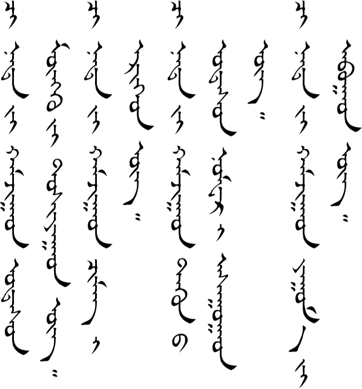
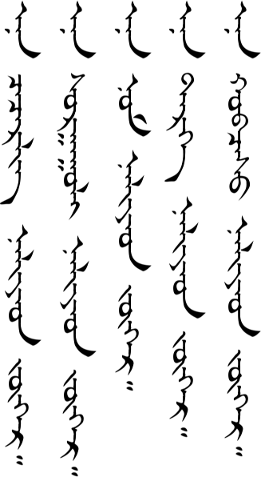
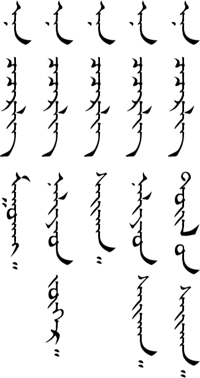
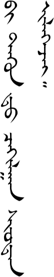
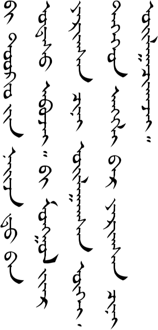
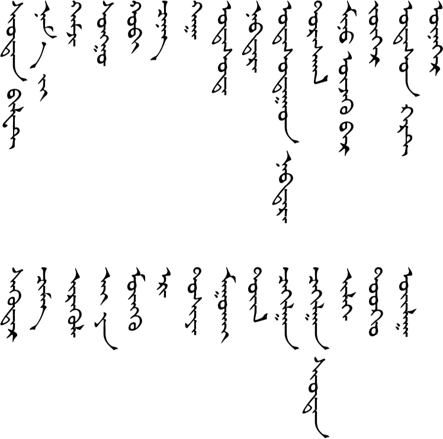

# Lesson 15

## Key Sentences

| | | |
| :--- | :--- | :--- |
| ən bɔl ʃin gɑrsə̌n ʃʊːdə̌n bələt | This is a new stamp that just came out. | <AudioPlayer src="/audio/L15-K1.mp3" /> |
| oːr sæːxə̌n e bæːn ʊː | Do you have any other nice ones? | <AudioPlayer src="/audio/L15-K2.mp3" /> |
| ən xədə̌n ʤuil jæmə̌r ʊː | How about these kinds? | <AudioPlayer src="/audio/L15-K3.mp3" /> |
| tɑː næmæg xɑmʤɑːd sʊŋgɑːd ug | Can you help me choose? | <AudioPlayer src="/audio/L15-K4.mp3" /> |
| nign əːs n nig xœb ɑbiː | I'll get one of each kind. | <AudioPlayer src="/audio/L15-K5.mp3" /> |
| miniː gɑr ʊtə̌s ʧənə̌gui bɔlʤe | My phone is dead. | <AudioPlayer src="/audio/L15-K6.mp3" /> |
| ʧi ʊtə̌sdɑːd nəbdə̌rʤ ʊː | Did you get a hold (of sb) (on the phone)? | <AudioPlayer src="/audio/L15-K7.mp3" /> |
| tər ʊtsɑː xɑːʧə̌xʤe | Her phone is off. | <AudioPlayer src="/audio/L15-K8.mp3" /> |

## Dialogs

### One

<AudioPlayerSeek src="/audio/L15-D1.mp3" />

### Two

<AudioPlayerSeek src="/audio/L15-D2.mp3" />

## Substitution

### One

<AudioPlayerSeek src="/audio/L15-S1.mp3" />

### Two

<AudioPlayerSeek src="/audio/L15-S2.mp3" />

### Three

<AudioPlayerSeek src="/audio/L15-S3.mp3" />

## Expansion

### One

<AudioPlayerSeek src="/audio/L15-E1.mp3" />

### Two

<AudioPlayerSeek src="/audio/L15-E2.mp3" />

## Vocabulary

| | | |
| :--- | :--- | :--- |
| ʃʊːdə̌n bələ̌t | postage stamp | <AudioPlayer src="/audio/L15-V-stamp.mp3" /> |
| nɑmæːg | me (object of verb) | <AudioPlayer src="/audio/L15-V-me.mp3" /> |
| xɑmʤ | to help | <AudioPlayer src="/audio/L15-V-help.mp3" /> |
| sʊŋg | to choose | <AudioPlayer src="/audio/L15-V-choose.mp3" /> |
| xœb | set, portion (measure word) | <AudioPlayer src="/audio/L15-V-set.mp3" /> |
| ʧinə̌g | electrical charge | <AudioPlayer src="/audio/L15-V-charge.mp3" /> |
| xɑː | to turn off, to close | <AudioPlayer src="/audio/L15-V-off.mp3" /> |
| ʊtə̌sd | to call (on the phone) | <AudioPlayer src="/audio/L15-V-call.mp3" /> |
| nəbtə̌r | to go through | <AudioPlayer src="/audio/L15-V-through.mp3" /> |
| ʊtə̌sdɑːd nəbtə̌r | to get a hold of (sb on the phone) | <AudioPlayer src="/audio/L15-V-getthrough.mp3" /> |
| dʊrsxɑːl | commemorative | <AudioPlayer src="/audio/L15-V-commemorative.mp3" /> |
| miniː uʤxəːr | in my opinion | <AudioPlayer src="/audio/L15-V-opinion.mp3" /> |
| ʤugəːr | ok, fine | <AudioPlayer src="/audio/L15-V-fine.mp3" /> |
| ʊtsə̌n kɑrt | sim card? | <AudioPlayer src="/audio/L15-V-sim.mp3" /> |
| unxəːr | really | <AudioPlayer src="/audio/L15-V-really.mp3" /> |
| suːdə̌r | photo | <AudioPlayer src="/audio/L15-V-photo.mp3" /> |
| ʧimə̌g | Chimeg (a common girl's name) | <AudioPlayer src="/audio/L15-V-chimeg.mp3" /> |
| iruːl | to have sb come | <AudioPlayer src="/audio/L15-V-come.mp3" /> |
| ɑijɑː | Oh, no. (like Chinese 哎呀) | <AudioPlayer src="/audio/L15-V-aiya.mp3" /> |
| moŋg | money, silver | <AudioPlayer src="/audio/L15-V-money.mp3" /> |
| ər | to look for | <AudioPlayer src="/audio/L15-V-look.mp3" /> |
| dʊʃjɑː | to pay | <AudioPlayer src="/audio/L15-V-pay.mp3" /> |
| mʊːxɑi | ugly | <AudioPlayer src="/audio/L15-V-ugly.mp3" /> |
| tœːl | extreme | <AudioPlayer src="/audio/L15-V-extreme.mp3" /> |
| ʧæxə̌gɑːn | electricity | <AudioPlayer src="/audio/L15-V-electricity.mp3" /> |
| ʧæxə̌gɑːn ʃʊːdə̌n | email | <AudioPlayer src="/audio/L15-V-email.mp3" /> |
| ilgəː | to send | <AudioPlayer src="/audio/L15-V-send.mp3" /> |
| tɔːkjʊː | Tokyo | <AudioPlayer src="/audio/L15-V-tokyo.mp3" /> |
| œːlə̌g | to understand | <AudioPlayer src="/audio/L15-V-understand.mp3" /> |

If you have any questions about this lesson or if you notice a mistake, then please leave a comment below. If I don't know the answer myself, then I will ask our teachers.