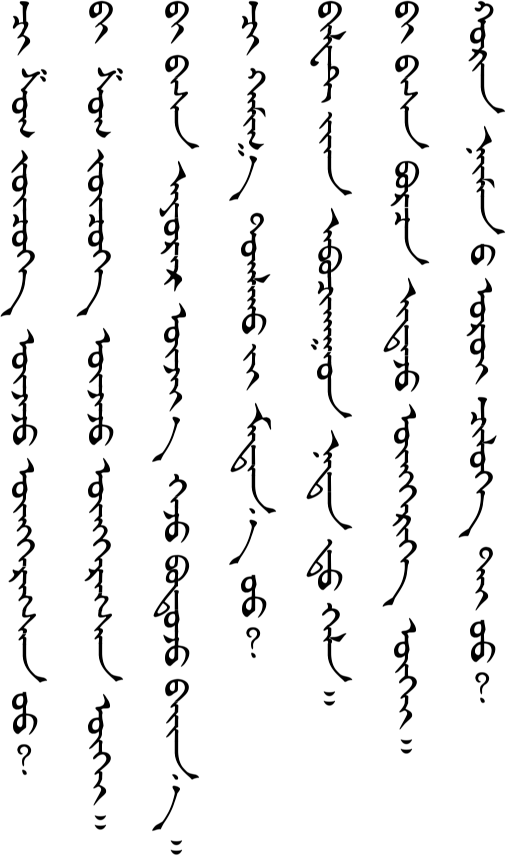
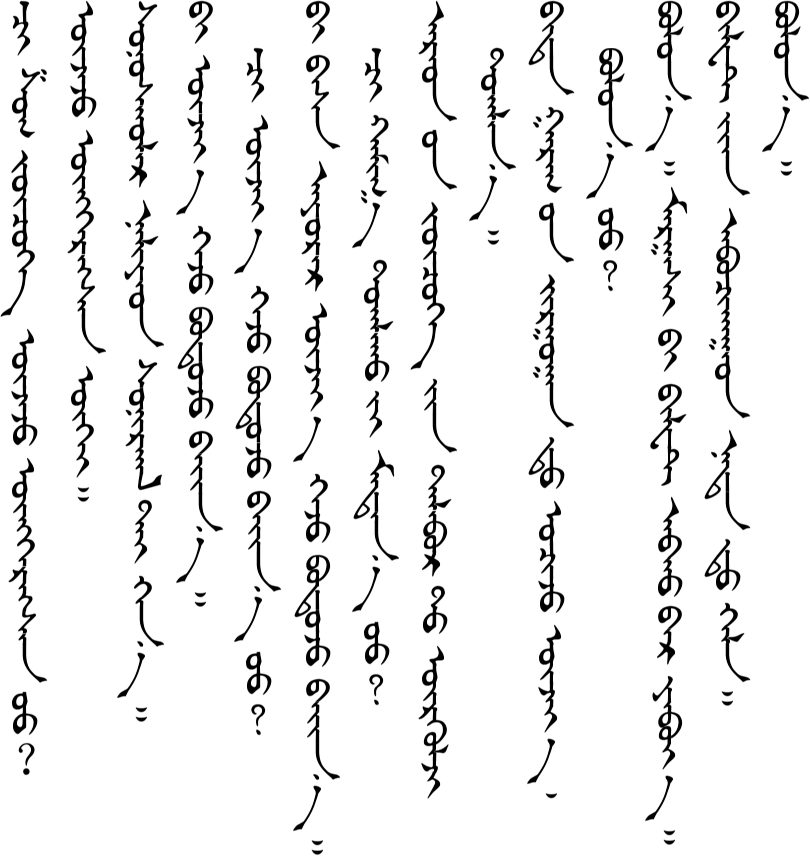
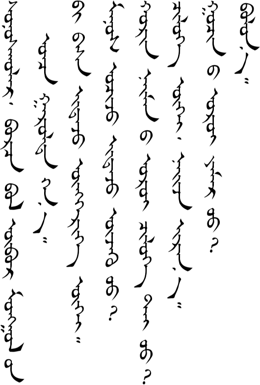
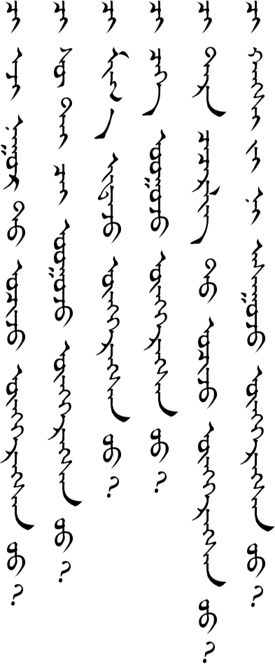
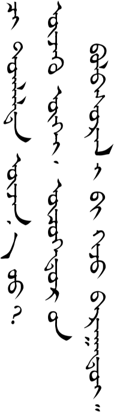
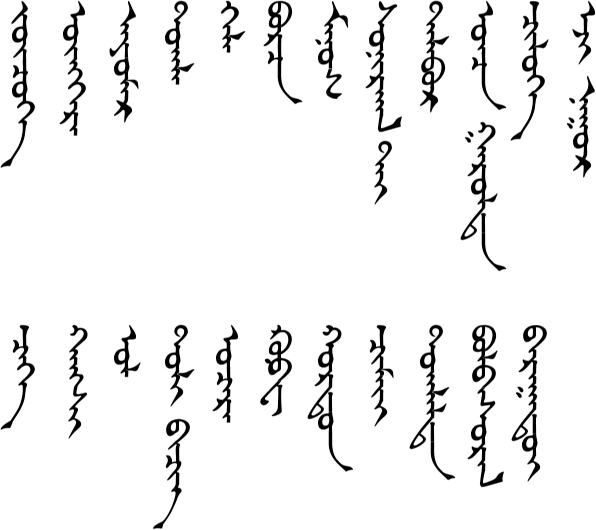

# Lesson 16

## Key Sentences

| | | |
| --- | --- | --- |
| ʧi ʃɔg ʤuʤə̌g uʤə̌ʤ oŋgə̌rsə̌n ʊː? | Have you ever seen a funny play? | <AudioPlayer src="/audio/L16-K1.mp3" /> |
| bi ʃɔg ʤuʤə̌g uʤə̌ʤ oŋgə̌rsə̌n gue | I've never seen a funny play. | <AudioPlayer src="/audio/L16-K2.mp3" /> |
| bi bɑs æːmɑr uʤiː gəʤ bɔdʤ bæn | I really want to see it, too. | <AudioPlayer src="/audio/L16-K3.mp3" /> |
| ʧi xɑː tɔgə̌lx iː mədn ʊː? | Do you know where it's playing? | <AudioPlayer src="/audio/L16-K4.mp3" /> |
| biləːt əːn ɑbʧɑːd nɑdə̌d xəl | Let me know after you get the tickets. | <AudioPlayer src="/audio/L16-K5.mp3" /> |
| bi bɑs bɔrʧ idə̌ʤ oŋgə̌rəː gue | I haven't eaten dried meat yet, either. | <AudioPlayer src="/audio/L16-K6.mp3" /> |
| xœrə̌n næmn e œrœː ʧoloː te ʊː? | Do you have time on the evening of the 28th? | <AudioPlayer src="/audio/L16-K7.mp3" /> |

## Dialogs

### One

<AudioPlayerSeek src="/audio/L16-D1.mp3" />

### Two

<AudioPlayerSeek src="/audio/L16-D2.mp3" />

## Substitution

### One

<AudioPlayerSeek src="/audio/L16-S1.mp3" />

### Two

<AudioPlayerSeek src="/audio/L16-S2.mp3" />

## Expansion

### One

<AudioPlayerSeek src="/audio/L16-E1.mp3" />

### Two

<AudioPlayerSeek src="/audio/L16-E2.mp3" />

## Vocabulary

| | | |
| --- | --- | --- |
| ʤuʤə̌g | drama | <AudioPlayer src="/audio/L16-V-drama.mp3" /> |
| oŋgə̌r | to pass, to have done something | <AudioPlayer src="/audio/L16-V-pass.mp3" /> |
| æːmɑr | really, very | <AudioPlayer src="/audio/L16-V-very.mp3" /> |
| tɔgə̌l | to perform, to play | <AudioPlayer src="/audio/L16-V-perform.mp3" /> |
| xəl | to say, to tell | <AudioPlayer src="/audio/L16-V-say.mp3" /> |
| bɔrʧ | dried meat | <AudioPlayer src="/audio/L16-V-meat.mp3" /> |
| mɑnʊs | we | <AudioPlayer src="/audio/L16-V-we.mp3" /> |
| sœnə̌rxə̌ltæː | interesting | <AudioPlayer src="/audio/L16-V-interesting.mp3" /> |
| tɑlbə̌r | hall, place | <AudioPlayer src="/audio/L16-V-hall.mp3" /> |
| ɔnʧ gɑrə̌ld | specialty product | <AudioPlayer src="/audio/L16-V-specialty.mp3" /> |
| ʧoloː | free time | <AudioPlayer src="/audio/L16-V-time.mp3" /> |
| əːʤ nʊːr | Ejinuur Lake (in Xilingol) | <AudioPlayer src="/audio/L16-V-lake.mp3" /> |
| ʧəgəː | fermented mare's milk/yogurt | <AudioPlayer src="/audio/L16-V-fermented.mp3" /> |
| xɑŋʃ | price (from Chinese 行市) | <AudioPlayer src="/audio/L16-V-price.mp3" /> |
| ɔl | receive, get, find | <AudioPlayer src="/audio/L16-V-receive.mp3" /> |
| tœl biʧig | dictionary | <AudioPlayer src="/audio/L16-V-dictionary.mp3" /> |
| ʊʧə̌r | to meet, to run into | <AudioPlayer src="/audio/L16-V-meet.mp3" /> |
| kɔːf | coffee | <AudioPlayer src="/audio/L16-V-coffee.mp3" /> |
| xʊrdə̌n | quickly, fast | <AudioPlayer src="/audio/L16-V-quickly.mp3" /> |
| ʧæmæː | you (casual) (verb object) | <AudioPlayer src="/audio/L16-V-you.mp3" /> |
| tɔgə̌lə̌ld | performance | <AudioPlayer src="/audio/L16-V-performance.mp3" /> |
| bɔlə̌bsə̌rə̌l | practice | <AudioPlayer src="/audio/L16-V-practice.mp3" /> |
| bɑrɑːdeː | not yet finished | <AudioPlayer src="/audio/L16-V-unfinished.mp3" /> |

---

## Comments

*Do you have a comment or question that would be helpful for others here? Copy the link to this page and [email me](/contact/) your comment or question.*
