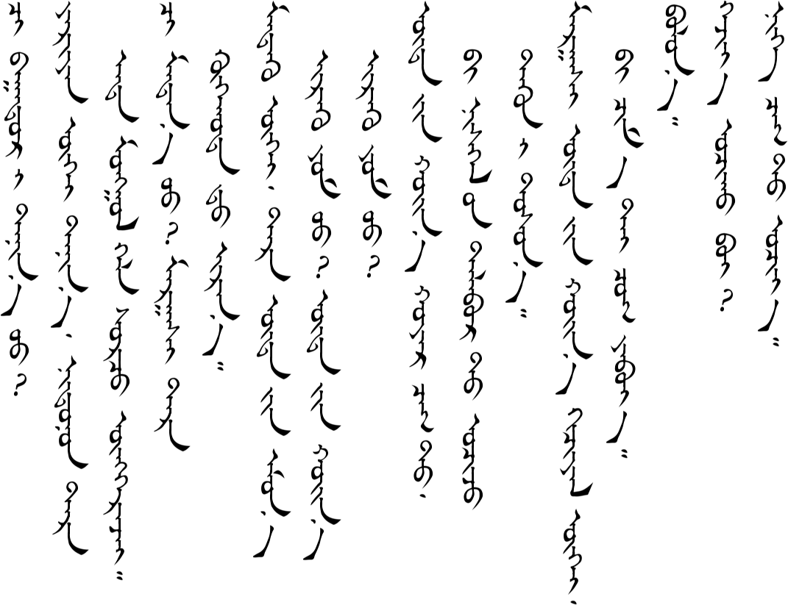
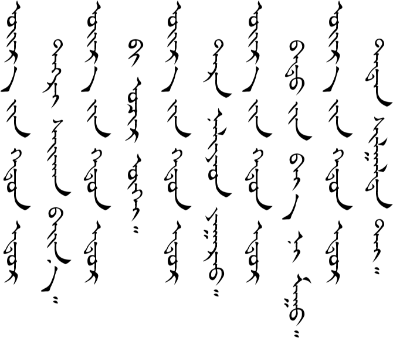
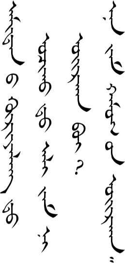
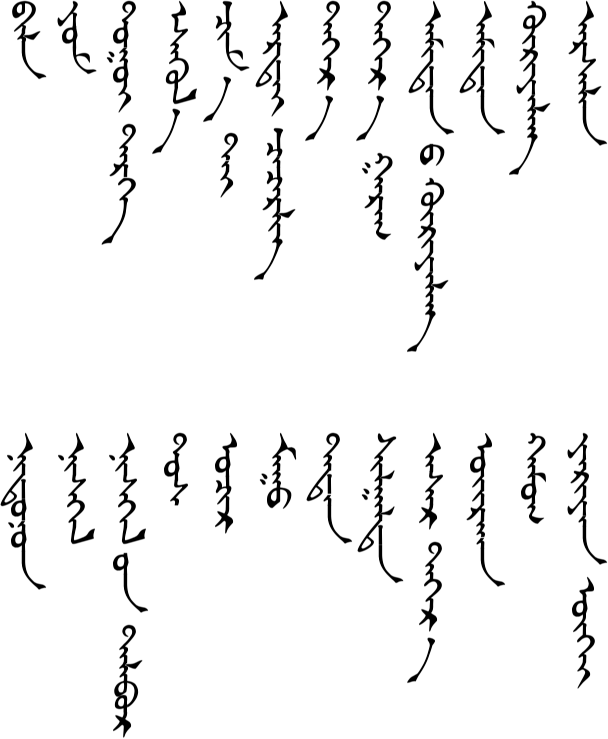

# Lesson 17

## Key Sentences

| Mongolian | English | Audio |
| --- | --- | --- |
| œːr iːn xədə̌n odə̌r təŋgə̌r sæːxɑn bæːn | The weather has been nice these last few days. | <AudioPlayer src="/audio/L17-K1.mp3" /> |
| xəduːl gɑrɑːd nɑːdjɑː | Let's go on an outing. (Let's go out and play.) | <AudioPlayer src="/audio/L17-K2.mp3" /> |
| xɑː ɔʧə̌ʤ nɑːdə̌x bileː | Where should we go (play)? | <AudioPlayer src="/audio/L17-K3.mp3" /> |
| juːgəːr jæbx im bœː | How are we going to get there? | <AudioPlayer src="/audio/L17-K4.mp3" /> |
| dʊgeː tərg əːr jæbjɑː | Let's go by bicycle. | <AudioPlayer src="/audio/L17-K5.mp3" /> |
| tər ud iːn omə̌n irx im ʊː əsgul ud iːn xœn irx im ʊː | Are they going to come in the morning or in the afternoon? | <AudioPlayer src="/audio/L17-K6.mp3" /> |
| biː ʧɑm tæː ʧʊg jæbjɑː | I'll go with you. | <AudioPlayer src="/audio/L17-K7.mp3" /> |

## Dialogs

### One

<AudioPlayerSeek src="/audio/L17-D1.mp3" />

### Two

<AudioPlayerSeek src="/audio/L17-D2.mp3" />

## Substitution

### One

<AudioPlayerSeek src="/audio/L17-S1.mp3" />

### Two

<AudioPlayerSeek src="/audio/L17-S2.mp3" />

## Expansion

### One

<AudioPlayerSeek src="/audio/L17-E1.mp3" />

### Two

<AudioPlayerSeek src="/audio/L17-E2.mp3" />

## Vocabulary

| Mongolian | English | Audio |
| --- | --- | --- |
| biləː | question grammar particle | <AudioPlayer src="/audio/L17-V-bile.mp3" /> |
| jʊm | grammar particle | <AudioPlayer src="/audio/L17-V-yom.mp3" /> |
| dʊgʊi tərə̌g | bike | <AudioPlayer src="/audio/L17-V-bike.mp3" /> |
| əsgul | or | <AudioPlayer src="/audio/L17-V-or.mp3" /> |
| ʧɑmtæː | with you (familiar you) | <AudioPlayer src="/audio/L17-V-withyou.mp3" /> |
| dəːr | upper, on, above | <AudioPlayer src="/audio/L17-V-above.mp3" /> |
| dəːr gɑrə̌g | last week | <AudioPlayer src="/audio/L17-V-lastweek.mp3" /> |
| æmtn eː xurə̌lə̌ŋ | zoo | <AudioPlayer src="/audio/L17-V-zoo.mp3" /> |
| ɑmtə̌n | animal | <AudioPlayer src="/audio/L17-V-animal.mp3" /> |
| xurə̌lə̌ŋ | a recreational area of land | <AudioPlayer src="/audio/L17-V-area.mp3" /> |
| jærɑːŋ gui | of course, it goes without saying | <AudioPlayer src="/audio/L17-V-ofcourse.mp3" /> |
| nædnə̌n | last year | <AudioPlayer src="/audio/L17-V-lastyear.mp3" /> |
| nisgə̌l | airplane | <AudioPlayer src="/audio/L17-V-plane.mp3" /> |
| nisgə̌l iːn tɑlbə̌r | airport | <AudioPlayer src="/audio/L17-V-airport.mp3" /> |
| tɔs | to pick sb up at, meet sb at (the airport, etc.) | <AudioPlayer src="/audio/L17-V-meet.mp3" /> |
| mʊː | bad | <AudioPlayer src="/audio/L17-V-bad.mp3" /> |
| tədə̌n | they | <AudioPlayer src="/audio/L17-V-they.mp3" /> |
| ʃælgə̌lt | exam | <AudioPlayer src="/audio/L17-V-exam.mp3" /> |
| ɑsə̌r dəːr | upstairs | <AudioPlayer src="/audio/L17-V-upstairs.mp3" /> |
| œːrxə̌n | close, near | <AudioPlayer src="/audio/L17-V-close.mp3" /> |
| xɑmə̌g | the most | <AudioPlayer src="/audio/L17-V-most.mp3" /> |

---

## Comments

*Do you have a comment or question that would be helpful for others here? Copy the link to this page and [email me](/contact/) your comment or question.*