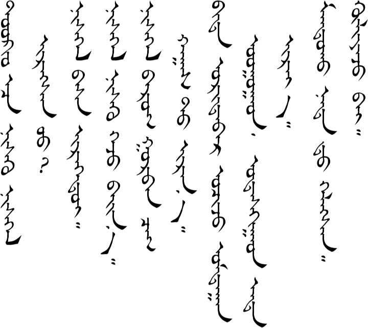
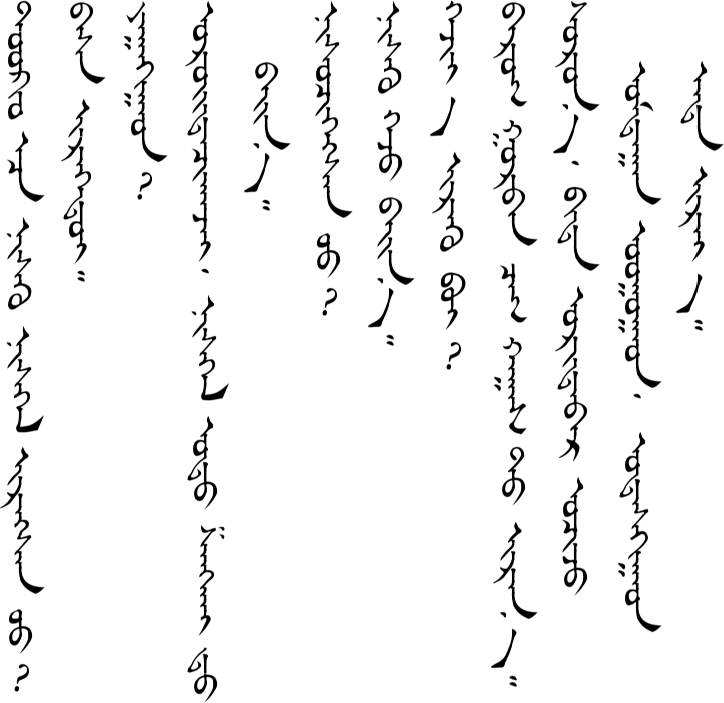
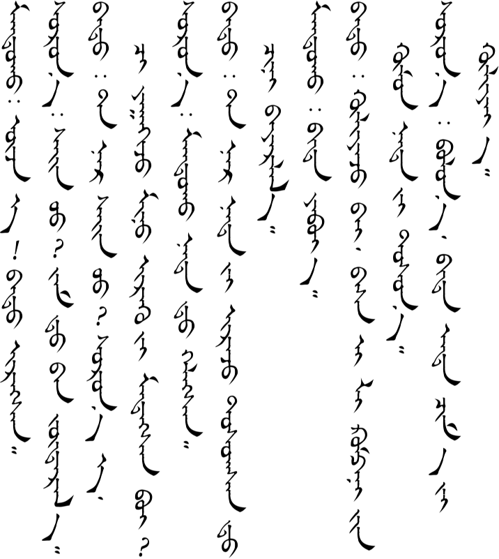
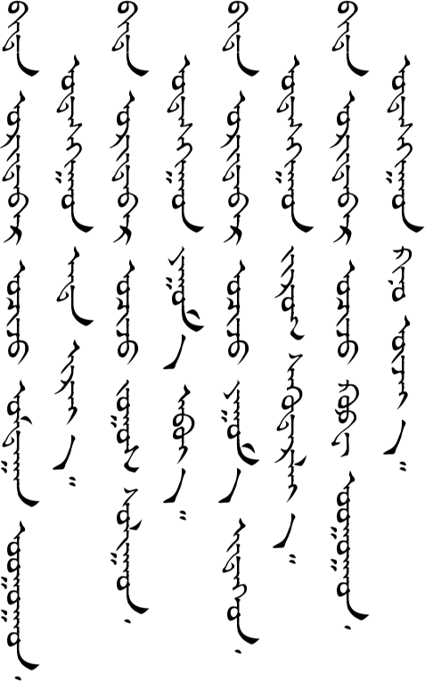

# Lesson 18

*This lesson is incomplete. If you've studied all the way to this point and would like to see the finished lesson, [contact me](/contact/) and maybe that will be enough motivation for me to get it done.*

## Key Sentences

| Mongolian | English | Audio |
| --- | --- | --- |
| tɔːkjʊ gɔːs nisə̌x nisgə̌l irsn ʊː | Has the plane flying from Tokyo arrived? | <AudioPlayer src="/audio/L18-K1.mp3" /> |
| nisgə̌l bɑs irəːdei | The plane hasn't arrived yet. | <AudioPlayer src="/audio/L18-K2.mp3" /> |
| nisgə̌l nisə̌x gəʤ bæːn | The plane is about to take off. | <AudioPlayer src="/audio/L18-K3.mp3" /> |
| nisgə̌l bɑrə̌g gʊrbə̌n ʧɑg xɑgsə̌d irnəː | The plane will arrive at about 3:30. | <AudioPlayer src="/audio/L18-K4.mp3" /> |
| bid ʊrdɑːr ɔʧə̌ʤ ʊmdɑːn ʊgɑːd ʊdə̌sxigəːd ənd irjəː | Let's go have a drink and then come back here in a little while. | <AudioPlayer src="/audio/L18-K5.mp3" /> |
| mɑndə̌x nɑdə̌d xəlsən | Mandah told me. | <AudioPlayer src="/audio/L18-K6.mp3" /> |
| xuljəːʤ bæː | Wait a second. | <AudioPlayer src="/audio/L18-K7.mp3" /> |

## Dialogs

### One

<AudioPlayerSeek src="/audio/L18-D1.mp3" />

### Two

<AudioPlayerSeek src="/audio/L18-D2.mp3" />

## Substitution

### One

<AudioPlayerSeek src="/audio/L18-S1.mp3" />

### Two

<AudioPlayerSeek src="/audio/L18-S2.mp3" />

### Three

<AudioPlayerSeek src="/audio/L18-S3.mp3" />

## Expansion

### One

<AudioPlayerSeek src="/audio/L18-E1.mp3" />

### Two

<AudioPlayerSeek src="/audio/L18-E2.mp3" />

---

## Comments

*Do you have a comment or question that would be helpful for others here? Copy the link to this page and [email me](/contact/) your comment or question.*