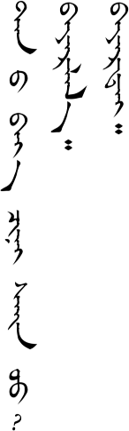
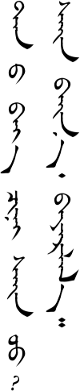
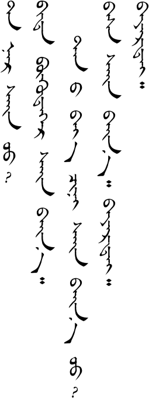
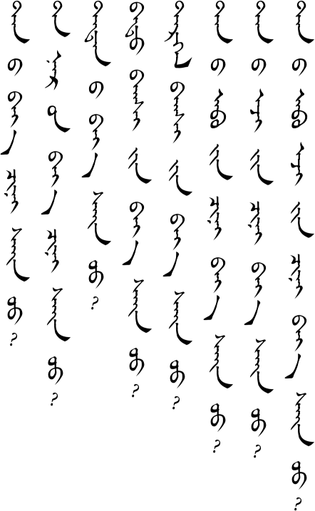
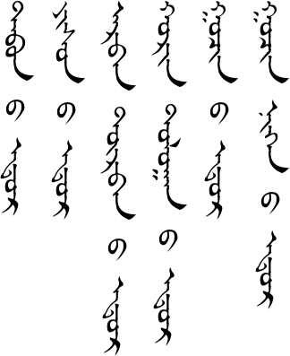
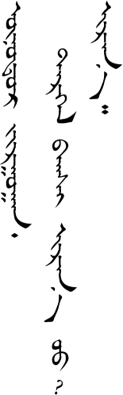
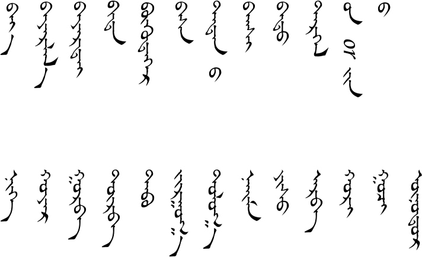
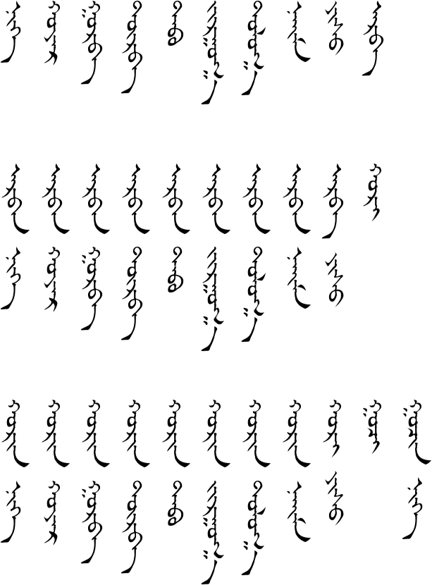
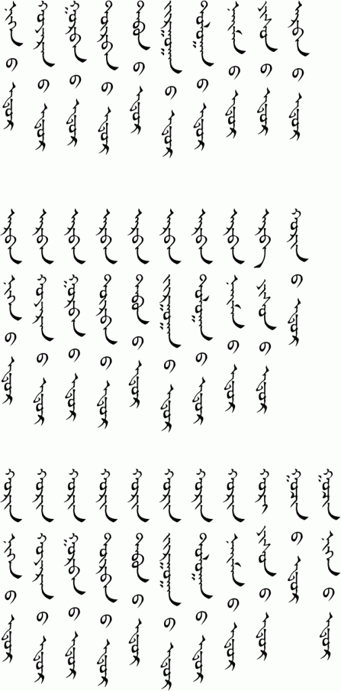
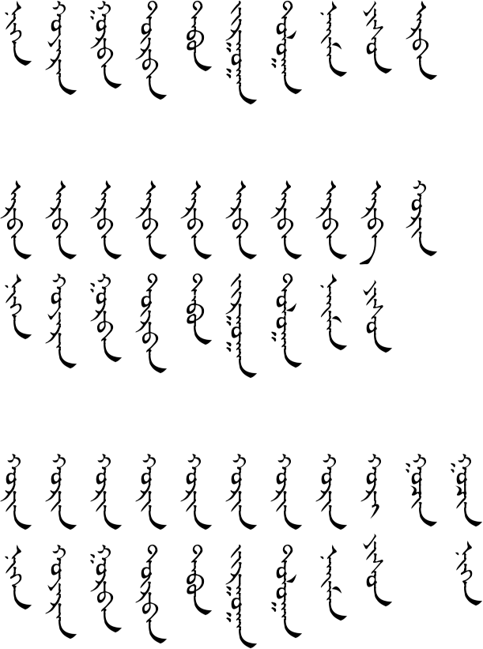

# Lesson 2

## Key Sentences

| tɑːnæː bəj ʧin sæːn ʊː? | How is your health? | <AudioPlayer src="/audio/L2-K1.mp3" /> |
|---|---|---|
| bɑjə̌rllɑː | Thank you | <AudioPlayer src="/audio/L2-K2.mp3" /> |
| bɑjirtæː | Goodbye | <AudioPlayer src="/audio/L2-K3.mp3" /> |

## Dialogs

### One

<AudioPlayerSeek src="/audio/L2-D1.mp3" />

- A: tɑːnæː bəj ʧin sæːn ʊː?
- B: sæːn bænɑː bɑjə̌rllɑː

### Two

<AudioPlayerSeek src="/audio/L2-D2.mp3" />

- A: tɑːnə̌r sæːn ʊ?
- B: bid bugdəːr sæːn bæːnɑː tɑːnæː bəj ʧin sæːn bæːn ʊː?
- A: bɑs sæːn bæːnɑː bɑjirtæː
- B: bɑjirtæː

> **Notes**
>
> "tɑːnæː bəj ʧin sæːn ʊː?" literally means "Is your body well?" The meaning is your health and general well-being, though.
> 
> The root word for both "thank you" and "goodbye" is bɑyə̌r, which means happiness.

## Substitution

<AudioPlayerSeek src="/audio/L2-S.mp3" />

________ sæːn ʊː?

- tɑːnæː bəj ʧin
- tɑːnə̌r iːn bəj ʧin
- tədnæː bəj
- bɑtʊː bɑgʧ iːn bəj
- tərgə̌l bɑgʧ iːn bəj
- tɑːnæː ɑːb iːn ʧin bəj
- tɑːnæː əːʤ iːn ʧin bəj
- tɑːnæː ɑːb əːʤ iːn ʧin bəj

> **Notes:**
> 
> Both /iːn/ and /næː/ endings make a word possessive. Which one is used depends on the word it follows.
> 
> Remember that the /ʧin/ emphasizes the meaning of "your".

## Expansion

### One

<AudioPlayerSeek src="/audio/L2-E1.mp3" />

- tɑbnæː odə̌r
- jisnæː odə̌r
- ɑrbə̌n dorbə̌næː odə̌r
- xœrə̌n dɔlɔːnæː odə̌r
- gʊʧə̌næː odə̌r
- gʊʧə̌n nəgnæː odə̌r

### Two

<AudioPlayerSeek src="/audio/L2-E2.mp3" />

- A: onoːdə̌r ʤʊrgɑːn tərgə̌l bɑgʧ irn uː
- B: irnəː

> **Notes:**
> 
> Expansion one tells how to make the days of the month. The /næː/ sound is put between the number and "day" to refer to the day of the month. However, in spoken Mongolian a simple /n/ sound after the number can also be used to mean the day (as in Expansion 2).

## Vocabulary

| Mongolian | Audio | English |
|---|---|---|
| bəj | <AudioPlayer src="/audio/L2-V-body.mp3" /> | body |
| bɑjə̌rllɑː | <AudioPlayer src="/audio/L2-V-thanks.mp3" /> | thank you |
| bɑjirtæː | <AudioPlayer src="/audio/L2-V-bye.mp3" /> | goodbye |
| bid | <AudioPlayer src="/audio/L2-V-we.mp3" /> | we |
| bugdəːr | <AudioPlayer src="/audio/L2-V-everybody.mp3" /> | everybody |
| bɑs | <AudioPlayer src="/audio/L2-V-also.mp3" /> | also |
| tədnæː | <AudioPlayer src="/audio/L2-V-their.mp3" /> | their |
| bɑgʃ | <AudioPlayer src="/audio/L2-V-teacher.mp3" /> | teacher |
| bɑt | <AudioPlayer src="/audio/L2-V-batu.mp3" /> | Batu (a common boy's name) |
| tərgə̌l | <AudioPlayer src="/audio/L2-V-tergel.mp3" /> | Tergel (a common girl's name) |
| iːn | <AudioPlayer src="/audio/L2-V-possessive-iin.mp3" /> | possessive particle (like "apostrophe s" in English) |
| næː | <AudioPlayer src="/audio/L2-V-possessive-nae.mp3" /> | possessive particle (like "apostrophe s" in English) |
| nəg | <AudioPlayer src="/audio/L2-V-1.mp3" /> | one |
| xɔjə̌r | <AudioPlayer src="/audio/L2-V-2.mp3" /> | two |
| gʊrə̌b | <AudioPlayer src="/audio/L2-V-3.mp3" /> | three |
| dorə̌b | <AudioPlayer src="/audio/L2-V-4.mp3" /> | four |
| tɑb | <AudioPlayer src="/audio/L2-V-5.mp3" /> | five |
| ʤʊrgɑː | <AudioPlayer src="/audio/L2-V-6.mp3" /> | six |
| dɔlɔː | <AudioPlayer src="/audio/L2-V-7.mp3" /> | seven |
| næːm | <AudioPlayer src="/audio/L2-V-8.mp3" /> | eight |
| jis | <AudioPlayer src="/audio/L2-V-9.mp3" /> | nine |
| ɑrə̌b | <AudioPlayer src="/audio/L2-V-10.mp3" /> | ten |
| xœr | <AudioPlayer src="/audio/L2-V-20.mp3" /> | twenty |
| gʊʧ | <AudioPlayer src="/audio/L2-V-30.mp3" /> | thirty |
| oːdə̌r | <AudioPlayer src="/audio/L2-V-day.mp3" /> | day |
| onoːdə̌r | <AudioPlayer src="/audio/L2-V-today.mp3" /> | today |

## Grammar

### Numbers

An /n/ sound is often added between words that are related. Thus, in the word eleven, which is "ten one", the /ɑrə̌b/ (ten) becomes /ɑrə̌bə̌n/ or just /ɑrbə̌n/.

Listen to the differences:

<AudioPlayerSeek src="/audio/L2-G1.mp3" />

| 10 | ɑrə̌b |
|---|---|
| 11 | ɑrbə̌n nəg |
| 20 | xœr |
| 21 | xœrə̌n nəg |
| 30 | gʊʧ |
| 31 | gʊʧə̌n nəg |

Listen to all the numbers from one to thirty-one.

<AudioPlayerSeek src="/audio/L2-G2.mp3" />

When talking about a day of the month, the number and the word "day" are connected by making the number possessive. The 11th day (of the month) is literally said like "eleven's day" or "the day of eleven". Listen to the days of the month:

<AudioPlayerSeek src="/audio/L2-G4.mp3" />

As mentioned in the note above, the word "day" is optional in spoken Mongolian. However, there is still an /n/ sound at the end of the number. Listen to the days of the month when said without the word "day":

<AudioPlayerSeek src="/audio/L2-G3.mp3" />

## Practice

How do you say the following words:

- goodbye
- all
- thank you
- their
- also
- today
- we
- body
- the numbers 1 through 31
- the days of the month 1 through 31

How do you say the following sentences:

- How is your health?
- How is your parents' health?
- How Teacher Smith's health?
- Today is the 3rd.
- Today is the 15th.
- Today is the 30th.
- Today is the 31st.
- Thank you.
- Goodbye.

If you were able to say most of these things correctly then you are ready to go on to [lesson three](/lessons/lesson-3/). If not, then keep practicing! You can also download the audio for the whole lesson so that you can practice listening while washing the dishes. Click the three-dot menu at the right of the audio player below and choose "Download".

<AudioPlayerSeek src="/audio/Main-lesson-2.mp3" />

If you have any questions about this lesson or if you notice a mistake, then please leave a comment below. If I don't know the answer myself, then I will ask our teachers.

## Comments

**Uuree** on November 22, 2013 at 2:28 am

Sain uu,
What a lot of work! Ene site chin ih taalagdlaa. Bi ch bas huuchin mongol bichig sergeej surahad duhum yum, Bayarlalaa

> **Suragch** on November 22, 2013 at 10:59 pm
>
> Bayarlalaa. I wish I could reply to you properly in Mongolian but my Mongolian is still pretty bad. If you find any mistakes then please let me know.

**Jenny Ulziisaikhan** on November 18, 2014 at 4:54 pm

kewl, its so amazing . When i was high school i learned Mongolian script. i will suggest this site to my friends who wanna learn Mongolian script.
Маргааш би Монгол бичиг хэл соёлын талаар гадаад хүүхдүүдэд хичээл заах юм. Мартсанаа эргэж санахад их тус боллоо. Баярлалаа

**Hai** on October 4, 2015 at 12:46 pm

Dear Suragch,
I have some complaint about the spelling used in these lessons, say [bɑjə̌rllɑː] and [bɑjirtæː]. In Mongolian there’s no real difference between [ɑ̯] and [ə̯] as those vowels are supposed to be very weak but according to the vowel harmony [ɑ̯] should be used here. Using of extraordinary [ə̯] may bring extra difficulty to the learner.

Also, I cannot hear any difference between the sound [bɑjə̯r-] and [bɑji̯r-] used in the article. Is there any point to artificially make the already distinct written and spoken Mongolian more distinct?

What’s more, even if they are distinct, should [bɑjɪ̯r-] be used instead of [bɑji̯r-]? I assume this tutorial is based on the standard pronunciation of Mongolian.

Either way thank you again for your effort on promoting Mongolian learning.

> **Hai** on October 4, 2015 at 3:21 pm
>
> Weird enough the pronunciations depicted in those symbol looks like Khorchin-influenced Chakhar one.

**Ariel Galazzi** on December 5, 2017 at 9:50 pm

Hello! I’m in a problem…

in the Expansion 2 say:  
A: tərgə̌l bɑgʧ irn uː  
B: irnəː

what’s the meaning of “irn u:” and “irnəː”

I’m really grateful with the website, and I’d like to receive an answer! thanks

> **Suragch** on December 7, 2017 at 1:18 pm
>
> “tərgə̌l bɑgʧ irn uː” means “Is Teacher Tergel going to come?”
> “irnəː” means “Yes, he/she will come.
>
> The verb root “ir-” means “to come” and the “n” (or “nəː”) suffix indicates that it is the future tense. The “uː” particle makes it a question.

**Jeremy** on January 22, 2020 at 2:25 pm

I agree with the first comment above, ‘what a lot of work!’ Thanks so much my friend. This is helping me so much. I can’t wait to impress my Mongolian script teacher in Ulaanbaatar next lesson! This will make homework much more enjoyable and fruitful.

**Hana** on July 8, 2024 at 11:52 am

Hi Suragh,

I like this webpage a lot, thanks. Please, would it be possible to write (take apart into pieces) all the vocabularies in the way you did in the very first lesson, e.g. that it would be possible to download it as a pdf, because it is very difficult for me to recognise the letters from each other when they are joined together. I am not native speaker, but I would like to study Mongolian language in traditional Mongolian script, because when I tried in Cyrillic then I do not understand at all why something is written differently and completely differently spoken. Thanks a lot.

> **Suragch** on March 4, 2025 at 10:58 am
>
> I’m probably not going to get around to updating the lessons so that they words are all divided by syllable, though I admit that would be useful. I can only recommend that you check out the writing lesson.

> **Hana** on March 16, 2025 at 7:50 pm
>
> Dear Suragch,
> thank you a lot for your answer. Yes, it would be great if you could update, because it would be very useful. I have just bought a completely new book about classical Mongolian writing , but anyway I would greatly appreciate if you update. Thank you again. Nice day.