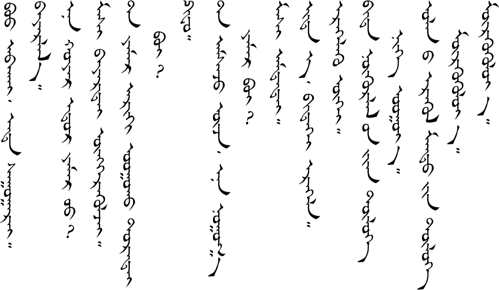

# Lesson 20

*This lesson is incomplete. If you've studied all the way to this point and would like to see the finished lesson, [contact me](/contact/) and maybe that will be enough motivation for me to get it done.*

## Key Sentences

## Dialogs

### One

### Two

## Substitution

### One

### Two

## Expansion

### One

### Two

---

## Comments

*Do you have a comment or question that would be helpful for others here? Copy the link to this page and [email me](/contact/) your comment or question.*