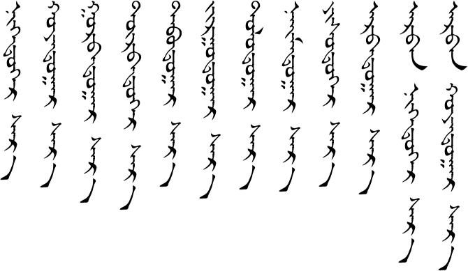

# Lesson 3

## Key Sentences

| Mongolian | English | Audio |
|---|---|---|
| tɑː jɑːrʊː jʊː? | Are you busy? | <AudioPlayer src="/audio/L3-K1.mp3" /> |
| tɑːnæː ɑʤə̌l jɑːrʊː jʊː? | Is your work busy? | <AudioPlayer src="/audio/L3-K2.mp3" /> |
| jɑːrʊː | (I’m) busy. | <AudioPlayer src="/audio/L3-K3.mp3" /> |
| biː jɑːrʊː gue | I’m not busy. | <AudioPlayer src="/audio/L3-K4.mp3" /> |
| biː tiːm jɑːrʊː gue | I’m not too busy. | <AudioPlayer src="/audio/L3-K5.mp3" /> |

---

## Dialogs

### One

<AudioPlayerSeek src="/audio/L3-D1.mp3" />

- A: sæːn ʊː?
- B: sæːn sæːn ʊː?
- A: tɑːnæː ɑʤə̌l jɑːrʊː jʊː?
- B: jɑːrʊː tɑː jɑːrʊː jʊː?
- A: biː tiːm jɑːrʊː gue

### Two

<AudioPlayerSeek src="/audio/L3-D2.mp3" />

- Student 1: sæːn ʊ?
- Student 2: bɑgʧ sæːn ʊ?
- Teacher: tɑːnə̌r sæːn ʊː?
- Student 2: sæːn bɑgʧ jɑːrʊː jʊː?
- Teacher: jɑːrʊː tɑːnʊːs jɑːrʊː jʊː?
- Student 2: biː jɑːrʊː gue
- Student 1: biː bɑs jɑːrʊː gue

### Three

<AudioPlayerSeek src="/audio/L3-D3.mp3" />

- A: sæːn ʊ, tərgə̌l?
- B: sæːn
- A: tɑːnæː ɑːb əːʤ iːn ʧin bəj sæːn ʊ?
- B: təd budəːr əːn sæːn bɑjə̌rllɑː

:::note
As you recal, /ʊː/ is a question particle. However, here it has become /jʊː/. That’s because it follows a long vowel sound. If the /j/ wasn’t added, it would be difficult to distinguish the question particle from the word.
:::

---

## Substitution

### One

<AudioPlayerSeek src="/audio/L3-S1.mp3" />

bɑgʧ ________ ʊː?
- jɑːrʊː
- sæːn
- jɑdə̌rʤiːn

### Two

<AudioPlayerSeek src="/audio/L3-S2.mp3" />

- A: tɑːnæː ________ iːn ʧin bəj sæːn ʊː?
- B: təd bugdəːr əːn sæːn bæːnɑː

- ɑːb əːʤ
- ɑx əgʧ
- duː nɑr

:::note Notes:
- No “and” is needed between “father and mother” and “older brother and older sister”.
- /duː/ means younger brother, but when it is plural it can just refer to a younger siblings. The /nar/ in /duː nɑr/ makes it plural. If you want to specifically say a younger sister, you can say /œxə̌n duː/ or /xuːxə̌n duː/.
:::

---

## Expansion

### One

<AudioPlayerSeek src="/audio/L3-E1.mp3" />

- nəgdʊgɑːr sɑr
- xɔjə̌rdʊgɑːr sɑr
- ʤʊrgɑːdʊgɑːr sɑr
- ɑrbə̌n xɔjə̌rdʊgɑːr sɑr

### Two

<AudioPlayerSeek src="/audio/L3-E2.mp3" />

- onoːdə̌r ɑrbə̌n sɑr iːn gʊʧə̌n nəg næː oːdə̌r
- mɑrgɑːʃ ɑrbə̌n nəgə̌n sɑr iːn nəg næː oːdə̌r
- ən ʤil xɔjə̌r mæŋg ɑrbə̌n gʊrbə̌n ɔn
- dɑrɑː ʤil xɔjə̌r mæŋg ɑrbə̌n dorbə̌n ɔn

:::note Notes:
- Adding /dugɑːr/ to a number makes it an ordinal (first, second, third, etc.).
- The months are pretty easy to learn in Mongolian because the are just First Month, Second Month, Third Month, and so on rather than January, February, March….
- When just saying the name of the month, you have to add the /dʊgɑːr/ to the number. However, when you combine the month with a day (as in Expansion 2), you just use the number with an /n/.
:::

---

## Vocabulary

| Mongolian | Audio | English |
|---|---|---|
| jɑːrʊː | <AudioPlayer src="/audio/L3-V-busy.mp3" /> | busy |
| ɑʤə̌l | <AudioPlayer src="/audio/L3-V-work.mp3" /> | work, job |
| ugue | <AudioPlayer src="/audio/L3-V-without.mp3" /> | not, without |
| tiːm | <AudioPlayer src="/audio/L3-V-really.mp3" /> | really |
| biː | <AudioPlayer src="/audio/L3-V-i.mp3" /> | I |
| tɑːnʊːs | <AudioPlayer src="/audio/L3-V-you-plural.mp3" /> | you (plural) |
| bugdəːr əːn | <AudioPlayer src="/audio/L3-V-everybody.mp3" /> | everybody |
| jɑdə̌rʤiːn | <AudioPlayer src="/audio/L3-V-tired.mp3" /> | tired |
| ɑx | <AudioPlayer src="/audio/L3-V-older-brother.mp3" /> | older brother |
| əgʧ | <AudioPlayer src="/audio/L3-V-older-sister.mp3" /> | older sister |
| duː | <AudioPlayer src="/audio/L3-V-younger-brother.mp3" /> | younger brother |
| duː nɑr | <AudioPlayer src="/audio/L3-V-youngersiblings.mp3" /> | younger siblings |
| œxə̌n duː | <AudioPlayer src="/audio/L3-V-younger-sister1.mp3" /> | younger sister |
| xuːxə̌n duː | <AudioPlayer src="/audio/L3-V-younger-sister2.mp3" /> | younger sister |
| nəgdʊgɑːr | <AudioPlayer src="/audio/L3-V-1st.mp3" /> | first |
| xɔjə̌rdʊgɑːr | <AudioPlayer src="/audio/L3-V-2nd.mp3" /> | second |
| gʊrə̌bdʊgɑːr | <AudioPlayer src="/audio/L3-V-3rd.mp3" /> | third |
| dorə̌bdʊgɑːr | <AudioPlayer src="/audio/L3-V-4th.mp3" /> | fourth |
| tɑbdʊgɑːr | <AudioPlayer src="/audio/L3-V-5th.mp3" /> | fifth |
| ʤʊrgɑːdʊgɑːr | <AudioPlayer src="/audio/L3-V-6th.mp3" /> | sixth |
| dɔlɔːdʊgɑːr | <AudioPlayer src="/audio/L3-V-7th.mp3" /> | seventh |
| næːmdʊgɑːr | <AudioPlayer src="/audio/L3-V-8th.mp3" /> | eighth |
| jisdʊgɑːr | <AudioPlayer src="/audio/L3-V-9th.mp3" /> | ninth |
| ɑrə̌bdʊgɑːr | <AudioPlayer src="/audio/L3-V-10th.mp3" /> | tenth |
| sɑr | <AudioPlayer src="/audio/L3-V-month.mp3" /> | month |
| mɑrgɑːʃ | <AudioPlayer src="/audio/L3-V-tomorrow.mp3" /> | tomorrow |
| ən | <AudioPlayer src="/audio/L3-V-this.mp3" /> | this |
| dɑrɑː | <AudioPlayer src="/audio/L3-V-next.mp3" /> | next |
| ʤil | <AudioPlayer src="/audio/L3-V-year2.mp3" /> | year |
| ɔn | <AudioPlayer src="/audio/L3-V-year1.mp3" /> | year (used after an actual year) |
| doʧ | <AudioPlayer src="/audio/L3-V-40.mp3" /> | forty |
| tæb | <AudioPlayer src="/audio/L3-V-50.mp3" /> | fifty |
| ʤir | <AudioPlayer src="/audio/L3-V-60.mp3" /> | sixty |
| dɑl | <AudioPlayer src="/audio/L3-V-70.mp3" /> | seventy |
| nɑj | <AudioPlayer src="/audio/L3-V-80.mp3" /> | eighty |
| jir | <AudioPlayer src="/audio/L3-V-90.mp3" /> | ninety |
| ʤʊː | <AudioPlayer src="/audio/L3-V-100.mp3" /> | hundred |
| mæŋg | <AudioPlayer src="/audio/L3-V-thousand.mp3" /> | thousand |

---

## Grammar

### More Numbers

Here are the numbers that we learned before with a few more added in.

<AudioPlayerSeek src="/audio/L3-G0-numbers.mp3" />

### Ordinal Numbers

The /dʊgɑːr/ ending is added to each number to make it an ordinal. Listen again:

<AudioPlayerSeek src="/audio/L3-G1.mp3" />

- 1st
- 2nd
- 3rd
- 4th
- 5th
- 6th
- 7th
- 8th
- 9th
- 10th

Listen to the 12 months.

<AudioPlayerSeek src="/audio/L3-G2.mp3" />

Listen to all the days in January and February.

<AudioPlayerSeek src="/audio/L3-G3.mp3" />

Listen to the names of the years from 1970 to 2020.

<AudioPlayerSeek src="/audio/L3-G4.mp3" />

They were talking pretty fast so I asked our teachers to speak more slowly. Here is 1995 again.

<AudioPlayerSeek src="/audio/L3-G5.mp3" />

---

## Practice

How do you say the following words:
- tired
- busy
- work
- older sister
- January
- younger sister
- December
- second
- younger brother
- older brother
- March
- fifth
- all the days of September
- your birthday
- this year
- next year
- the year 2013
- the year 2015

How do you say the following sentences:
- Are you busy, teacher?
- Is your work busy?
- I'm not busy.
- It's 2014 this year.
- Tomorrow is December 25.

Review by saying the following:
- How is your health?
- How are you?
- Today is the 30th.
- Thank you.
- Goodbye.

If you were able to say most of these things correctly then you are ready to go on to [lesson four](/lessons/lesson-4/). If not, then keep practicing! You can also download the audio for the whole lesson so that you can practice listening while walking in the park. Click the three-dot menu at the right of the audio player below and choose "Download".

<AudioPlayerSeek src="/audio/Main-lesson-3.mp3" />

If you have any questions about this lesson or if you notice a mistake, then please leave a comment below. If I don't know the answer myself, then I will ask our teachers.

---

## Comments

**London Park** on November 19, 2013 at 9:32 pm

Hey!

Thanks for another lesson. I am learning so much. And numbers are hard but you teach good! And by the way I can’t figure out what the word is in the numbers section after “Jo” one hundred, it says “Jo boget neg”. I know the first word is one hundred and the last one is one, but what is the one pronounced like boget? Please help. Thank you bye bye.

> **Suragch** on November 20, 2013 at 10:52 am
>
> Good question. The new words that appear in the Grammar section I don’t usually put in the vocabulary list. This one should be, though. You will see it again in Lesson 5, and it is in the vocabulary list there.
>
> Anyway, /bogoːd/ basically means “and” when it is used with a number. It is used for 101, 102, 103, 104, 105, 106, 107, 108, and 109 to indicate the zero between the hundred’s place and the one’s place. Same thing for 201, 304, 702, 1001, etc.

**Martin** on February 17, 2015 at 5:24 pm

There appears to be an error in the transliteration of the last 2 sentences of Expansion 2 namely

ən ʤil xɔjə̌r mæŋg ɑrbə̌n gʊrbə̌n ɔn
dɑrɑː ʤil xɔjə̌r mæŋg ɑrbə̌n dorbə̌n ɔn

Shouldn’t these two sentences end in

gʊrə̌bdʊgɑːr ɔn
dorə̌bdʊgɑːr ɔn
?

> **Suragch** on February 19, 2015 at 10:40 pm
>
> I don’t think there is a problem with the transliteration. That is, I think I wrote it as our teachers said it. However, it sounds like your question is more of a grammatical one. Are you saying, shouldn’t the years end with the ordinal -dʊgɑːr suffix? That would make it the two thousand and thirteenth year and the two thousand and fourteenth year, which would make sense in a way. As far as I know, though, that is not how years are said. (But it is how months are said, as we learned in the grammar section.)