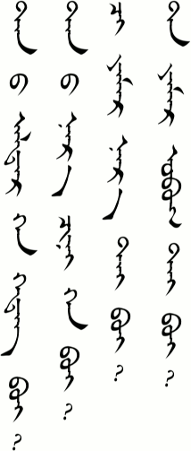
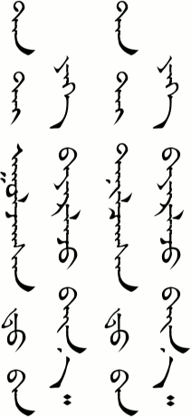

# Lesson 4

## Key Sentences

| Mongolian | English | Audio |
| --- | --- | --- |
| biː tɑnɑː gədə̌gə | I’m Tana. | <AudioPlayer src="/audio/L4-K1.mp3" /> |
| tɑntæː ʊːlʤsə̌n dɑːn jix bɑjə̌rlʤ bæːn | It’s nice to meet you. | <AudioPlayer src="/audio/L4-K2.mp3" /> |
| tɑnæː nər ʧin xən be | What is your name? | <AudioPlayer src="/audio/L4-K3.mp3" /> |
| tər bɑgʃ biʃ tər bɔl sʊrə̌gʧ | He’s not a teacher. He’s a student. | <AudioPlayer src="/audio/L4-K4.mp3" /> |
| mɑrgɑːʃ ʊːlʤjɑː | See you tomorrow. | <AudioPlayer src="/audio/L4-K5.mp3" /> |

## Dialogs

### One

<AudioPlayerSeek src="/audio/L4-D1.mp3" />

-   A: biː tɑnɑː gədə̌gə tɑnæː nər ʧin xən be
-   B: biː bɑːtə̌r gədə̌gə tɑntæː ʊːlʤsə̌n dɑːn jix bɑjə̌rlʤ bæːn
-   A: biː bɑs bɑjə̌rlʤ bæːn

### Two

<AudioPlayerSeek src="/audio/L4-D2.mp3" />

-   Student 1: bɑgʃ, tɑnæː ɑldə̌r xən be
-   Teacher: biː bɑt gədə̌g ʧiː jɑmə̌r nər tæː be?
-   Student 1: biː tɑnɑː gədə̌gə
-   Teacher: tər bɑgʃ mon ʊː?
-   Student 1: tər bɑgʃ biʃe tər bɔl sʊrə̌gʧ

:::note
Sometimes a vowel sound is added to the end of a word. Compare /bæːn/ and /bæːnɑː/, /biʃ/ and /biʃe/, /bɑgʃ/ and /bɑgʃɑ/. This doesn’t change the meaning of the word, though it may change the emphasis or feeling. Don’t let that final vowel stop you from finding the correct meaning in the dictionary.
:::

## Substitution

### One

________ ʊːlʤjɑː

-   mɑrgɑːʃ
-   dɑrɑː gærə̌g
-   dɑrɑː sɑr
-   dɑrɑː ʤil
-   xɔyə̌r mæŋg ɑrbə̌n dɔlɔː ɔn æ jʊrgɑːn sɑr iːn ɑrbə̌n næːm næ odə̌r

<AudioPlayerSeek src="/audio/L4-S1.mp3" />

### Two

A: tər \_\_\_\_ mon ʊː?
B: tər \_\_\_\_ biʃe tər bɔl \_\_\_\_

| | |
| :-- | :-- |
| <ul><li>bɑgʃ</li><li>əmʧ</li><li>tɑnæː œxə̌n duː ʧin</li><li>ʧiniː næːʤ ʧin</li></ul> | <ul><li>sʊrə̌gʧ</li><li>ʧɑgdɑː</li><li>miniː næːʤ</li><li>miniː ɑx</li></ul> |

<AudioPlayerSeek src="/audio/L4-S2.mp3" />

### Three

bi \_\_\_\_\_ tænnɑː

-   tɑnig
-   ʧɑmə̌g
-   tərig
-   tər sʊrə̌gʧ ig
-   tɑnɑː g
-   tədnæː bɑgʃ ig
-   ən hun ig

<AudioPlayerSeek src="/audio/L4-S3.mp3" />

:::note
- Be sure to say both n’s in /tennɑː/. It is more like a long /n/. This is the word for “know,” as in “I know somebody.” There is a different word we will learn for when we want to say we “know” some bit of knowledge.
- The /ig/ is used to connect the verb and its object. We will learn more about that some other time. For now we can just learn to say these sentences. It can be pronounced /ig/, /i/, or /g/ depending on the speaker and the word it follows.
:::

## Expansion

### One

There are a lot of ways to ask what somebody’s name is. It will help to become familiar with them so that you can understand when someone asks you.

<AudioPlayerSeek src="/audio/L4-E1.mp3" />

| | |
| :-- | :-- |
| tɑnæː ɑldə̌r xən gədəg be? | This is probably the best one to use for when you want to be polite. /ɑldə̌r/ is a very respectful word for name. |
| tɑnæː nər ʧin xən be? | This is also a polite way of asking. |
| ʧiː jɑmə̌r nər tæː be? | This is a more casual ways of asking. If you were asking a child their name your could use this one. /ʧiː/ is the casual form of “you.” |
| tɑ jɑmə̌r ɔbə̌g tæː be? | /ɔbə̌g/ means family name. However, many Mongolians do not have or use a family name. |

Here are a couple ways to say “My name is Tana.” If it confuses you to know more than one way to say something then just skip this section. You only need to know one way to say it anyway.

<AudioPlayerSeek src="/audio/L4-E2.mp3" />

-   bi tɑnɑː gədə̌gə
-   miniː nər tɑnɑː gədə̌gə

And here are a couple ways to say “Nice to meet you.” The second one is more like “Nice to know you.”

<AudioPlayerSeek src="/audio/L4-E3.mp3" />

-   tɑntæː ʊːlʤsə̌n dɑːn jix bɑjə̌rlʤ bæːn
-   tɑntæː tænə̌lsə̌n dɑːn jix bɑjə̌rlʤ bæːn

### Two

<AudioPlayerSeek src="/audio/L4-E4.mp3" />

-   A:  bi tər hun ig tæn ugue tər xən gədəg be?
-   B:  tər tɑnɑː gədə̌g
-   A:  tər ɑmerə̌k hun mon ʊː?
-   B:  mon tər bɔl ɑmerə̌k hun

:::note Notes:
Here is another example of a word with and without a vowel sound at the end: /gədə̌g/ and /gədə̌gə/. Same meaning, just a variety in pronunciation.
:::

## Vocabulary

| Mongolian | Audio | English |
| :-- | :-- | :-- |
| tɑnɑː | <AudioPlayer src="/audio/L4-V-tana.mp3" /> | Tana (a common girl’s name) |
| gədə̌g | <AudioPlayer src="/audio/L4-V-called.mp3" /> | called |
| tɑntæː | <AudioPlayer src="/audio/L4-V-withyou.mp3" /> | with you (polite) |
| ʊːlʤ- | <AudioPlayer src="/audio/L4-V-meet.mp3" /> | meet |
| dɑːn | <AudioPlayer src="/audio/L4-V-daan.mp3" /> | grammar particle (that is the technical term for I don’t know exactly what it does yet) |
| jix | <AudioPlayer src="/audio/L4-V-big.mp3" /> | big, very |
| bɑjə̌rlʤ bæːn | <AudioPlayer src="/audio/L4-V-happy.mp3" /> | happy |
| nər | <AudioPlayer src="/audio/L4-V-name.mp3" /> | name |
| xən | <AudioPlayer src="/audio/L4-V-who.mp3" /> | who |
| be, bœ | <AudioPlayer src="/audio/L4-V-boi.mp3" /> | question particle (used with wh- question words) |
| tər | <AudioPlayer src="/audio/L4-V-heshe.mp3" /> | he, she, it |
| bɔl | <AudioPlayer src="/audio/L4-V-is.mp3" /> | is, are |
| sʊrə̌gʧ | <AudioPlayer src="/audio/L4-V-student.mp3" /> | student |
| bɑːtə̌r | <AudioPlayer src="/audio/L4-V-baatar.mp3" /> | Baatar (common boy’s name) |
| ɑldə̌r | <AudioPlayer src="/audio/L4-V-respectedname.mp3" /> | name (respectful) |
| ʧiː | <AudioPlayer src="/audio/L4-V-youcasual.mp3" /> | you (casual) |
| jɑmə̌r | <AudioPlayer src="/audio/L4-V-whatkind.mp3" /> | what, what kind of |
| tæː | <AudioPlayer src="/audio/L4-V-with.mp3" /> | with |
| mon | <AudioPlayer src="/audio/L4-V-ismon.mp3" /> | to be, yes |
| əmʧ | <AudioPlayer src="/audio/L4-V-doctor.mp3" /> | doctor |
| ʧɑgdɑː | <AudioPlayer src="/audio/L4-V-police.mp3" /> | policeman, policewoman |
| miniː | <AudioPlayer src="/audio/L4-V-my.mp3" /> | my |
| næːʤ | <AudioPlayer src="/audio/L4-V-friend.mp3" /> | friend |
| tæn- | <AudioPlayer src="/audio/L4-V-know.mp3" /> | know (a person) |
| tɑnig | <AudioPlayer src="/audio/L4-V-youobject.mp3" /> | you (polite) (verb object) |
| ʧɑmə̌g | <AudioPlayer src="/audio/L4-V-youcasualobject.mp3" /> | you (casual) (verb object) |
| tərig | <AudioPlayer src="/audio/L4-V-himher.mp3" /> | him, her, it (verb object) |
| xun | <AudioPlayer src="/audio/L4-V-person.mp3" /> | person |
| ɔbə̌g | <AudioPlayer src="/audio/L4-V-familyname.mp3" /> | family name |
| ɑmerə̌k | <AudioPlayer src="/audio/L4-V-america.mp3" /> | America |
| tænə̌l- | <AudioPlayer src="/audio/L4-V-knowmeet.mp3" /> | to know, meet |

## Grammar

### Verbs

From what I know so far, verbs are going to give us a lot of trouble. Mongolian verbs are going to make Spanish verb conjugation look like child's play. But I'm hoping that if we focus on the speaking we will gradually pick up how the verbs work as we need it. Anyway, we need to know a little bit about verbs now.

Mongolian verbs have a stem or root that doesn't change. However, various suffixes are added to the root to change the tense or meaning. We have seen a little of this already. For example, /ɔʧ-/ is the root of the verb "go." Adding the /-nɔː/ suffix we get /ɔʧnɔː/, which means "will go."

From now on, rather than adding every single form of a verb to the dictionary, we will just add the root with a hyphen after it. That way you will know it is a verb. You can then add the endings as you learn them. In today's vacabulary we had /ʊlʤ-/, /tæn-/, and /tænə̌l-/.

## Practice

How do you say the following words:

-   meet
-   who
-   happy
-   very
-   she
-   you (casual)
-   your (casual)
-   what kind of
-   know
-   America

How do you say the following sentences:

-   What is your name?
-   My name is ….
-   Nice to meet you.
-   She's not a policewoman. She is a doctor.
-   See you next week.
-   Is she your younger sister?
-   Is he a teacher?
-   I know that teacher.

Review by saying the following:

-   How is your health?
-   I'm not busy.
-   How are you?
-   Is your work busy?
-   Today is the 11th.
-   Thank you.
-   It's 2011 this year.
-   Goodbye.

If you were able to say most of these things correctly then you are ready to go on to [lesson five](/lessons/lesson-5). If not, then keep practicing! You can also download the audio for the whole lesson so that you can practice listening while walking the dog. Click the three-dot menu at the right of the audio player below and choose "Download".

<AudioPlayerSeek src="/audio/Main-lesson-4.mp3" />

If you have any questions about this lesson or if you notice a mistake, then please leave a comment below. If I don't know the answer myself, then I will ask our teachers.

---
## Comments

**London Park** on November 21, 2013 at 2:55 am

In line seven of substitution two in this lesson, it has “ʧiniː næːʤ ʧin” is the “ʧiniː” and “ʧin” a different word or different spelling? I didn’t quite understand this sentence. Can you help? Thanks!

> **Suragch** on November 21, 2013 at 1:02 pm
>
> Yes, they are different words with different spellings. If you find them in the traditional script in Substitution Two, you can see that /ʧiniː/ is written “ʧi-nu”, while /ʧin/ is written “ʧi-ni”.
>
> In English both of these words are translated “your” so this phrase sounds a little redundant to us. However, the way these two words are used in Mongolian is different, and even the meaning is slightly different. /ʧiniː/ is used pretty much like the English “your” is used. (Of course, we have to remember that is is the informal way of saying “your”, as opposed to the polite form /tɑːnæː/.) It goes in front of a noun. It is in the same category as /miniː/ (my) and /tuːneː/ or /tərneː/ (his/her/its). /ʧiniː/ stresses that “you” possesses the noun that follows.
>
> /ʧin/, on the other hand, goes after a noun. And although we have to translate it as “your” in English, it stresses the *relationship* to that “you” has with the noun, not that “you” possesses it. Other words in the same category are /min/ (my) and /n/ (his, her, its).
>
> This all deserves its own grammar explanation some day.

**London Park** on November 25, 2013 at 3:33 am

That makes alot of sense! Thanks. It reminds me of saying 我妹妹 and 我妈妈， in Chinese instead of saying 我的妈妈，我的。。。 because you don’t possess the people 的 is not needed.

**Aurele** on March 20, 2017 at 2:10 pm

Hello!
Great job for these lesson, thanks a lot it is very helpful :).
I am going to Mongolia soon and I want to learn the basic to be able to communicate a little. It is very hard so far, especially pronunciation…
I just realize there are many ways of saying the same thing. For example just to say “you” there is (so far)
-tɑː
-tɑːnə̌r
-tɑːnʊːs
-tɑnig
-ʧɑmə̌g
Is it really important to learn them all, or to speak the basic just knowing the first 2 is enough?
Thanks a lot

> **Suragch** on March 21, 2017 at 1:18 pm
>
> They are all import eventually for grammatical reasons, but I imagine you could get by with just “tɑ:” to begin with. Also, if you are going to the country of Mongolia, you should know that this site teaches Mongolian as it is spoken in Inner Mongolia (China). There are some differences in pronunciation and vocabulary with Outer Mongolia. (“tɑ:” is the same, though.)

**London Park** on September 29, 2017 at 4:56 am

Hello!
Long time no see and I hope you have been well.
I was just reviewing some lessons from your website here after an unfortunately long absence from studying the traditional script. Although I have been still studying Mongolian of Mongolia fairly frequently. It really is interesting to see the differences in the two regions’ ways of speaking.
I also wanted to ask you, in Substitution 1 of this lesson, the second to last word: odor, seems to be spelled differently than in the previous lessons. I was wondering if I am being confused with reason or is there a logical explanation of the spelling change?
Thanks again for this website, its really great.

> **Suragch** on September 30, 2017 at 4:09 pm
>
> I’m pretty sure I must have been sleeping when I wrote that. It’s wrong. Thank your for pointing it out. It should be “edur”.