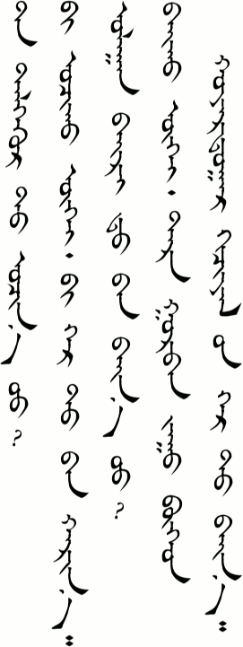

# Lesson 5

## Key Sentences

| Mongolian | English | Audio |
|---|---|---|
| tər xən be? | Who is he/she? | <AudioPlayer src="/audio/L5-K1.mp3" /> |
| biː tænə̌lʧʊːlʤ ogjəː | Let me give an introduction. | <AudioPlayer src="/audio/L5-K2.mp3" /> |
| tɑː xɑː ɔʧə̌x be? | Where are you going? | <AudioPlayer src="/audio/L5-K3.mp3" /> |
| ʤɑŋ bɑgʃ gər təːn bæːn ʊː? | Is Teacher Zhang at home? | <AudioPlayer src="/audio/L5-K4.mp3" /> |
| biː ʤɑŋ bɑgʃ iːn sʊrə̌gʧ n bæːnɑː | I’m Teacher Zhang’s student. | <AudioPlayer src="/audio/L5-K5.mp3" /> |
| dɔtə̌gʃ mœrə̌l | Come in. | <AudioPlayer src="/audio/L5-K6.mp3" /> |

## Dialogs

### One

<AudioPlayerSeek src="/audio/L5-D1.mp3" />

- A: ʊlɑːn tər xən be?
- B: biː tænə̌lʧʊːlʤ ogjəː tər bɔl miniː ɑx
- C: tɑːntæː ʊːlʤsə̌n dɑːn tɔŋ bɑjə̌rlʤ bæːn miniː nər tomə̌rəː gədə̌gəː
- A: biː bɑs tɑːntæː ʊːlʤsə̌n dɑːn tɔŋ bɑjə̌rlʤ bæːnɑː
- C: tɑː xɑː ɔʧə̌x be?
- A: biː bəːʤiŋ jix sʊrgʊːlt ɔʧnɔː tɑːnʊːs xɑː ɔʧə̌x be?
- C: biːd dəlguːrt ɔʧnɔː
- A: bɑjirtæː
- C: bɑjirtæː
- B: bɑjirtæː

### Two

<AudioPlayerSeek src="/audio/L5-D2.mp3" />

- A: ʤɑŋ bɑgʃ gər təːn bæːn ʊː?
- B: bæːnɑː tɑː ʧin?
- A: biː ʤɑŋ bɑgʃ iːn sʊrə̌gʧ in bæːnɑː miniː nər tomə̌rəː gədə̌gəː tɑː ʧin?
- B: biː ʤɑŋ bɑgʃ iːn xuːxə̌n bæːnɑː miniː nər ʃiɑʊjiŋ gədə̌gəː dɔtə̌gʃɔː mœrə̌l
- A: bɑjə̌rllɑː

:::note Notes
I try to write the dialogs in IPA based on either the dictionary pronunciation or how I hear our teachers speaking. Usually these are the same, but sometimes they differ. The word /dɔtə̌gʃ/ is one such example. It means "towards the interior". In the two times we have seen it so far this lesson, the pronunciation has been different and neither one seems to be the same as the dictionary's IPA rendering. I can't hear the /g/, for example. I don't think this is because our teachers are saying it wrong. Rather, they are showing the way some sounds get dropped or changed in spoken Mongolian. This happens a lot in English, too. Think about the sentence "What do you want to do?" and how it is frequently said /wə də jə wɑnə du?/. At any rate, don't base your pronunciation on what is written here; try to mimic our teachers as best you can.

/tɑː ʧin?/ means "And you?"

/ʃiɑʊjiŋ/ is the Mongolian pronunciation of a Chinese name. Many Mongolians in Inner Mongolia have Chinese names. This is especially prevalent in areas like Tongliao, which have been more heavily influenced by Chinese culture.
:::

## Substitution

### One

- A: tɑː xɑː ɔʧə̌x be?
- B: biː ________t ɔʧnɔː

*   bəːʤiŋ jix sʊrgʊːl
*   dəlguːr
*   bæːr
*   xəʧəːl iːn ger
*   sulʤəːn bɑːr

<AudioPlayerSeek src="/audio/L5-S1.mp3" />

### Two

_______ gər təːn bæːn ʊː?

*   ʤɑŋ bɑgʃ
*   tɑnæː ɑːb
*   tɑnæː əːʤ
*   tɑnæː œxə̌n duː

<AudioPlayerSeek src="/audio/L5-S2.mp3" />

:::note Notes:
We will talk more about the /t/ in the grammar section below.

/bæːn/ is a very multi-purpose verb in Mongolian and is used in many situations, as you have already seen. It can mean "to have" or "to be"
:::

## Expansion

### One

- A: tɑː dəlguːrt ɔʧn ʊː?
- B: biː ɔʧə̌x gue biː gər təːn xæːrnɑː
- A: ʊlɑːn bæːr tɑːn bæn u?
- B: bæːx gue tər gʊrbə̌n ʤʊː bogoːd xɔjə̌rdʊgɑːr xəʧəːl iːn gərt bæːnɑː

<AudioPlayerSeek src="/audio/L5-E1.mp3" />

:::note Notes:
As we have seen before, adding /ugue/ or /gue/ to the end of a verb makes to negative.

/bogoːd/ means "and". It is used in numbers that have zeros in them. We should probably have a lesson about this some time. Here the meaning is "classroom number 302".
:::

## Vocabulary

| Mongolian | English | Audio |
|---|---|---|
| tænə̌lʧʊːl- | to introduce | <AudioPlayer src="/audio/L5-V-introduce.mp3" /> |
| og- | to give | <AudioPlayer src="/audio/L5-V-give.mp3" /> |
| xɑː | where | <AudioPlayer src="/audio/L5-V-where.mp3" /> |
| ʤɑŋ | Zhang 张 (a common Chinese family name) | <AudioPlayer src="/audio/L5-V-zhang.mp3" /> |
| gər | home | <AudioPlayer src="/audio/L5-V-home.mp3" /> |
| təːn, tɑːn | grammar particle (signifying location and belonging) | <AudioPlayer src="/audio/L5-V-teentaan.mp3" /> |
| dɔtə̌gʃ mœrə̌l | Come in | <AudioPlayer src="/audio/L5-V-comein.mp3" /> |
| ʊlɑːn | Ulaan (a common girl's name meaning red) | <AudioPlayer src="/audio/L5-V-red.mp3" /> |
| tomə̌rəː | Temur (a common boy's name meaning iron) | <AudioPlayer src="/audio/L5-V-temure.mp3" /> |
| tɔŋ | very | <AudioPlayer src="/audio/L5-V-very.mp3" /> |
| bəːʤiŋ | Beijing | <AudioPlayer src="/audio/L5-V-beijing.mp3" /> |
| sʊrgʊːl | school | <AudioPlayer src="/audio/L5-V-school.mp3" /> |
| jix sʊrgʊːl | university | <AudioPlayer src="/audio/L5-V-university.mp3" /> |
| dəlguːr | store | <AudioPlayer src="/audio/L5-V-store.mp3" /> |
| bæːr | dormitory | <AudioPlayer src="/audio/L5-V-dorm.mp3" /> |
| xuːxə̌n | daughter, girl | <AudioPlayer src="/audio/L5-V-daughter.mp3" /> |
| ʃiɑʊjiŋ | Xiaoying 小英 (a Chinese name) | <AudioPlayer src="/audio/L5-V-xiaoying.mp3" /> |
| xəʧəːl iːn ger | classroom | <AudioPlayer src="/audio/L5-V-classroom.mp3" /> |
| sulʤəːn bɑːr | internet cafe | <AudioPlayer src="/audio/L5-V-internetcafe.mp3" /> |
| xær- | to return, to go back | <AudioPlayer src="/audio/L5-V-return.mp3" /> |
| bogoːd | and | <AudioPlayer src="/audio/L5-V-and.mp3" /> |

## Grammar

### Location

English uses prepositions like "in" and "at" to express location. These are placed before the noun. However, Mongolian puts its location word after the noun. In spoken Mongolian this is just at /t/ sound added to the end of a noun. In written Mongolian, though, it is a separate word.

| English | Mongolian |
|---|---|
| home | gər |
| at home | gərt |
| dorm | bæːr |
| in the dorm | bært |
| store | dəlguːr |
| to the store | dəlguːrt |

This same /t/ sound in Mongolian can also express direction and would be translated as "to" in English. It just depends on the context.

| English | Mongolian |
|---|---|
| I'm *at* the store. | biː dəlguːrt bæːnɑː |
| I'm going *to* the store. | biː dəlguːrt ɔʧnɔː |

### Belonging

Two other grammar words that we saw this lesson were /təːn/ and /tɑːn/. There are actually the same word, but are just pronounced differently because of the words that they follow. /təːn/ is actually a combination of two different Mongolian words: /t/ + /ɑːn/. The /t/ is the location or direction particle that we just talked about. The /ɑːn/ (or /əːn/) shows that the preceding noun belongs to the subject. (I think. This is how I understand it so far anyway.) Let's look at some examples:

| English | Mongolian |
|---|---|
| Is Ulaan in the dorm? | ʊlɑːn bæːrt bæn u? |
| Is Ulaan in *her* dorm? | ʊlɑːn bæːr tɑːn bæn u? |
| Is Mr. Zhang going to the house? | ʤɑŋ bɑgʃ gərt ɔʧn ʊː? |
| Is Mr. Zhang going to *his* home? | ʤɑŋ bɑgʃ gər təːn ɔʧn ʊː? |

It seems like there are are lot of words and ways to express belonging in Mongolian. I'm sure it will make more sense the more we interact with it.

## Practice

How do you say the following words:

*   introduce
*   where
*   home
*   very
*   Beijing University
*   store
*   dormitory
*   classroom
*   internet cafe
*   return

How do you say the following sentences:

*   Come in.
*   Let me give an introduction.
*   Where are you going?
*   Who is she?
*   Who are you?
*   Is Ulaan at home?
*   I’m Teacher Zhang’s student.
*   I'm going to the internet cafe.
*   I'm going home.
*   Temur is in his dorm.

Review by saying the following:

*   How are you?
*   How are your parents?
*   Today is August 15th, 1981.
*   Thank you.
*   Is your work busy?
*   What is your name?
*   Nice to meet you.

If you were able to say most of these things correctly then you are ready to go on to [lesson six](/lessons/lesson-6/). If not, then keep practicing! You can also download the audio for the whole lesson so that you can practice listening while climbing a mountain. Click the three-dot menu at the right of the audio player below and choose "Download".

<AudioPlayerSeek src="/audio/Main-lesson-5.mp3" />

---

## Comments

*Do you have a comment or question that would be helpful for others here? Copy the link to this page and [email me](/contact/) your comment or question.*

---

**Bathrobe** on September 25, 2013 at 6:50 pm

Her pronunciation of /dɔtə̌gʃɔː/ isn’t just lacking the /g/.

1. She is pronouncing the /d/ very close to a /t/.

2. She is also running the /tə̌/ and the final /gʃɔː/ together.

To my ear, the end result is a pronunciation something like /tɔʃʃɔː/.

> **Suragch** on September 26, 2013 at 9:04 pm
>
> You’re right. Good observation. I have discovered one problem in making these lessons is in what to do when the spoken form varies. I would like to have the IPA follow the pronunciation as closely as possible, but when it varies too much (as in this example) then people can no longer recognize it enough to find it in the vocab list or dictionary.
>
> (For other readers of this comment, Bathrobe is talking about the pronunciation at the end of Dialog Two. By the way, check out Bathrobe’s excellent Mongolian writing summary at http://www.cjvlang.com/Writing/writmongol/mongolalpha.html)

---

**zamiin hun** on March 22, 2015 at 4:34 pm

ene hoyor abyaalagchiin heleh bur adilgui baina shu! ta hen be ? geh ed emegdtenii ta heni be ? geh met arbin baina shu. za amjilt

> **Suragch** on March 23, 2015 at 12:10 pm
>
> Both of our teachers come from Xilingol, Inner Mongolia. They do have slightly different accents from each other, but I have found these differences to be minor. In less standard dialect areas of Inner Mongolia the pronunciation differences are even greater, so being able to recognize and adapt to the differences is an important part learning Mongolian. Something I would like to add in the future are dialect samples from across the Mongol speaking world.

---

**ssMongol** on March 21, 2023 at 1:15 am

Excuse me，Why we cant read words and texts with Lesson 18 till Lesson 20.

> **Suragch** on October 27, 2023 at 9:06 am
>
> Sorry, I never finished those lessons.