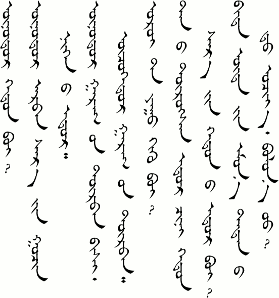
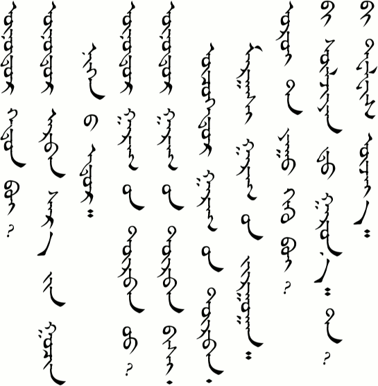
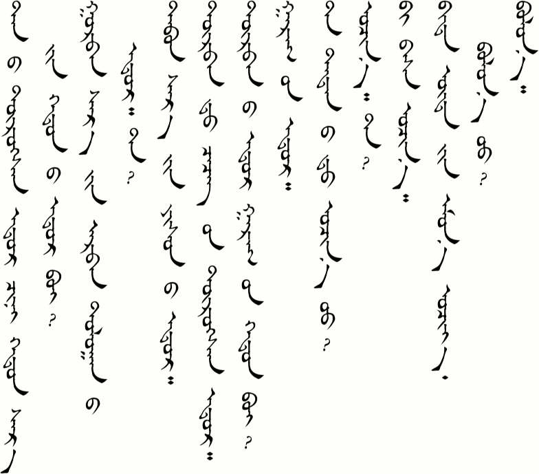
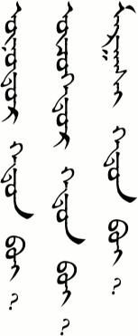
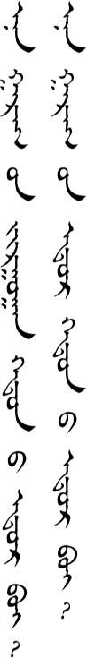
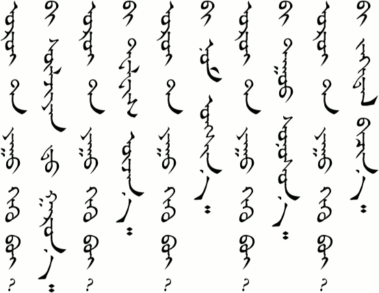
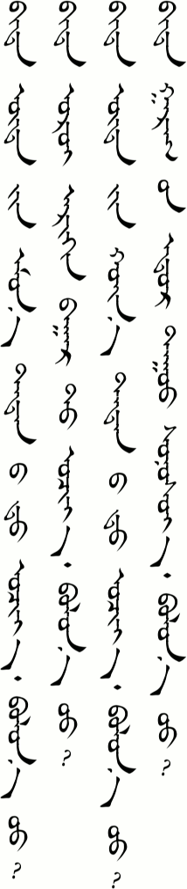
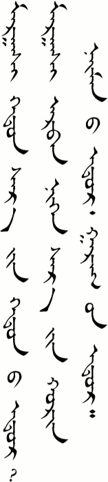
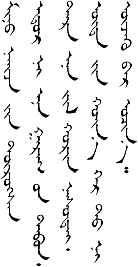
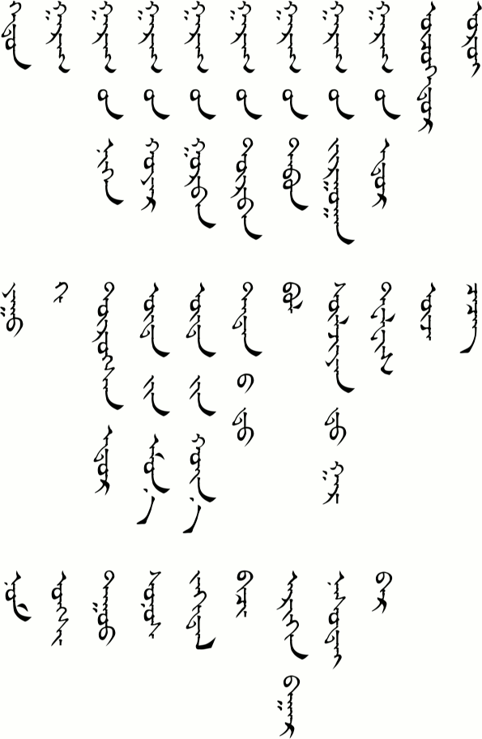

# Lesson 6

## Key Sentences

| | | |
| :--- | :--- | :--- |
| onoːdə̌r xədə̌n be? | What is the date today? | <AudioPlayer src="/audio/L6-K1.mp3" /> |
| onoːdə̌r ɑrbə̌n sɑr iːn gʊʧə̌n nəg næː odə̌r | Today is October 31. | <AudioPlayer src="/audio/L6-K2.mp3" /> |
| onoːdə̌r gærə̌g iːn dorbə̌n biʃəː oʧə̌gdə̌r gærə̌g iːn dorbə̌n | Today isn't Thursday. Yesterday was Thursday. | <AudioPlayer src="/audio/L6-K3.mp3" /> |
| œrœː tɑː juː xiːx be? | What are you going to do this evening? | <AudioPlayer src="/audio/L6-K4.mp3" /> |
| tɑnæː torsə̌n odə̌r ʧin xədə̌n sɑr iːn xədnæː odə̌r be? | What month and day is your birthday? | <AudioPlayer src="/audio/L6-K5.mp3" /> |
| bid ud iːn omə̌n tədnæːd ɔʧjɔː bɔln ʊː? | Let's go to their place in the morning, okay? | <AudioPlayer src="/audio/L6-K6.mp3" /> |

## Dialogs

### One

<AudioPlayerSeek src="/audio/L6-D1.mp3" />

- A: onoːdə̌r xədə̌n be?
- B: onoːdə̌r ɑrbə̌n sɑr iːn gʊʧə̌n nəg næː odə̌r
- A: onoːdə̌r gærə̌g iːn dorbə̌n uː?
- B: onoːdə̌r gærə̌g iːn dorbə̌n biʃəː oʧə̌gdə̌r gærə̌g iːn dorbə̌n mɑrgɑːʃ gærə̌g iːn ʤʊrgɑːn
- A: œrœː tɑː juː xiːx be?
- B: biː sulʤəːnt gɑrnɑː tɑː?
- A: biː təlwə̌s uʤnəː

### Two

<AudioPlayerSeek src="/audio/L6-D2.mp3" />

- A: tɑnæː torsə̌n odə̌r ʧin xədə̌n sɑr iːn xədnæː odə̌r be?
- B: gurbə̌n sɑr iːn ɑrbə̌n dɔlɔː næː odə̌r tɑː?
- A: tɑbə̌n sɑr iːn jus næː odə̌r
- B: dorbə̌nt ʧiʧig iːn torsə̌n odə̌r
- A: dorə̌b næː odə̌r gærə̌g iːn xədə̌n be?
- B: gærə̌g iːn odə̌r
- A: tɑː tədnæːd ɔʧn ʊː?
- B: ɔʧə̌n tɑː?
- A: biː bɑs ɔʧnɔː
- B: bid ud iːn omə̌n ɔʧjɔː bɔln ʊː?
- A: bɔlnɔː

:::note Notes
/xədə̌n/ (or /xədnæː/ or /xəd/) is the word for "how many". It is used with questions about numbers.

Like the months, the days of the week are easy in Mongolian. Monday is "week + 1", Tuesday is "week + 2", and so on. Sunday is the exception. It can be said "week + 7" but is usually said "week + day".
:::

## Substitution

### One

_________ xədə̌n be?

- onoːdə̌r
- oʧə̌gdə̌r
- mɑrgɑːʃ

<AudioPlayerSeek src="/audio/L6-S1.mp3" />

### Two

_________ xədnæː odə̌r be?

- ən gærə̌g iːn ʤʊrgɑːn
- ən gærə̌g iːn odə̌r

<AudioPlayerSeek src="/audio/L6-S2.mp3" />

### Three

A: œrœː tɑː juː xiːx be?
B: biː \_\_\_\_\_\_\_\_\_

- sulʤəːn gɑrə̌n
- təlwə̌s uʤə̌n
- nɔm ʊŋʃə̌n
- dʊː sɔnsə̌n
- ʤæxtə̌l biʧə̌n

<AudioPlayerSeek src="/audio/L6-S3.mp3" />

### Four

bid \_\_\_\_\_\_\_\_\_ bɔln ʊː?

- ud iːn omə̌n tədnæːd ɔʧjɔː
- œrœː ærxə̌n bɑːrt ɔʧjɔː
- ud iːn xœːn tədnæːd ɔʧjɔː
- gærə̌g iːn odə̌r dʊː sɔnsjɔː

<AudioPlayerSeek src="/audio/L6-S4.mp3" />

:::note Notes:
As you can see in Substitution 3, the /-n/ verb ending can be used to say what you are going to do in the future.

The /-jɔː/ ending (or /-jɑ, -jə, -ju, etc. as the case may be) can be used to make a suggestion, as in "Let's do something." We can see this in Substitution 4.
:::

## Expansion

### One

- A: mɑrgɑːʃ xədə̌n sɑr iːn xədnæː odə̌r gɑrə̌g iːn xədə̌n be?
- B: mɑrgɑːʃ ɑrbə̌n nəgə̌n sɑr iːn xœrə̌n næːm næː odə̌r gærə̌g iːn odə̌r

<AudioPlayerSeek src="/audio/L6-E1.mp3" />

### Two

miniː næːʤ iːn torsə̌n odə̌r ən gærə̌g iːn tɑbə̌n tər ən jil xœrə̌n nɑs tæː ud iːn xœːn gər təːn uʤə̌x ər ɔʧnɔː

<AudioPlayerSeek src="/audio/L6-E2.mp3" />

:::note Notes:
/ər/ is another grammar word. Let's not worry about it now. It will come up again later. (Besides, I don't understand it enough yet to explain it well anyway. )
:::

## Vocabulary

| | | |
| :--- | :--- | :--- |
| xədə̌n | <AudioPlayer src="/audio/L6-V-howmany.mp3" /> | how many |
| gærə̌g | <AudioPlayer src="/audio/L6-V-week.mp3" /> | week |
| gærə̌g iːn nəgə̌n | <AudioPlayer src="/audio/L6-V-monday.mp3" /> | Monday |
| gærə̌g iːn xɔjə̌rə̌n | <AudioPlayer src="/audio/L6-V-tuesday.mp3" /> | Tuesday |
| gærə̌g iːn gʊrbə̌n | <AudioPlayer src="/audio/L6-V-wednesday.mp3" /> | Wednesday |
| gærə̌g iːn dorbə̌n | <AudioPlayer src="/audio/L6-V-thursday.mp3" /> | Thursday |
| gærə̌g iːn tɑbə̌n | <AudioPlayer src="/audio/L6-V-friday.mp3" /> | Friday |
| gærə̌g iːn ʤʊrgɑːn | <AudioPlayer src="/audio/L6-V-saturday.mp3" /> | Saturday |
| gærə̌g iːn odə̌r | <AudioPlayer src="/audio/L6-V-sunday.mp3" /> | Sunday |
| oʧə̌gdə̌r | <AudioPlayer src="/audio/L6-V-yesterday.mp3" /> | yesterday |
| œrœː | <AudioPlayer src="/audio/L6-V-evening.mp3" /> | evening |
| juː | <AudioPlayer src="/audio/L6-V-what.mp3" /> | what |
| xiː- | <AudioPlayer src="/audio/L6-V-do.mp3" /> | to do |
| torsə̌n odə̌r | <AudioPlayer src="/audio/L6-V-birthday.mp3" /> | birthday |
| ud iːn omə̌n | <AudioPlayer src="/audio/L6-V-morning.mp3" /> | morning |
| ud iːn xœːn | <AudioPlayer src="/audio/L6-V-afternoon.mp3" /> | afternoon |
| tədnæːd | <AudioPlayer src="/audio/L6-V-theirplace.mp3" /> | their place (house) |
| bɔl- | <AudioPlayer src="/audio/L6-V-is.mp3" /> | to be okay |
| sulʤəːnt gɑr- | <AudioPlayer src="/audio/L6-V-getonline.mp3" /> | get online |
| təlwə̌s | <AudioPlayer src="/audio/L6-V-tv.mp3" /> | TV |
| uʤ- | <AudioPlayer src="/audio/L6-V-see.mp3" /> | see, watch, look, visit |
| ʧiʧigə | <AudioPlayer src="/audio/L6-V-qiqig.mp3" /> | QIqige (a common girl's name meaning "flower") |
| nɔm | <AudioPlayer src="/audio/L6-V-book.mp3" /> | book |
| ʊŋʃ- | <AudioPlayer src="/audio/L6-V-read.mp3" /> | read |
| dʊː | <AudioPlayer src="/audio/L6-V-song.mp3" /> | song |
| sɔnə̌s- | <AudioPlayer src="/audio/L6-V-listen.mp3" /> | listen |
| ʤæxtə̌l | <AudioPlayer src="/audio/L6-V-letter.mp3" /> | letter |
| biʧ- | <AudioPlayer src="/audio/L6-V-write.mp3" /> | write |
| ærxə̌n bɑːr | <AudioPlayer src="/audio/L6-V-bar.mp3" /> | bar, tavern |
| nɑstæː | <AudioPlayer src="/audio/L6-V-age.mp3" /> | age, years old, old |
| ər | <AudioPlayer src="/audio/L6-V-ber.mp3" /> | grammar particle |

## Grammar

### Word Order

By now you have probably already noticed that the verbs come last in the sentence. If the verb has an object then the object goes in front of the verb. If we were to use the same order in English then we would get sentences like

- I food eat.
- I book read.
- I letter write.
- I friend visit.

Of course, in English this is poor grammar, but in Mongolian it is perfectly fine. In fact, to use the English grammatical order in Mongolian would be be wrong. They say that Koreans and Japanese can learn Mongolian fairly easily because their grammar is similar. For native English speakers it doesn't feel natural at first, but with practice we can get used to it, too.

See Substitution 3 above for examples of this word order.

## Practice

How do you say the following words:

- how many
- what
- days of the week
- yesterday, today, tomorrow
- morning, afternoon, evening
- birthday
- age
- do
- read
- watch
- listen
- visit
- book
- song
- letter

How do you say the following sentences:

- What day (of the week) is today?
- What day (of the month) was yesterday?
- Tomorrow is Friday.
- When is your birthday?
- What are you doing tonight?
- Let's watch TV, okay?
- Are you going to their place?
- What day is Sunday?
- Answer the above questions.

Review by saying the following:

- Let me give an introduction.
- How are your parents?
- I’m going to the internet cafe tomorrow.
- Hello.
- Are your parents busy?
- Where are you going?
- Goodbye.

If you were able to say most of these things correctly then you are ready to go on to [lesson seven](/lessons/lesson-7/). If not, then keep practicing! You can also download the audio for the whole lesson so that you can practice listening while going to school. Click the three-dot menu at the right of the audio player below and choose "Download".

<AudioPlayerSeek src="/audio/Main-lesson-6.mp3" />

---

## Comments

*Do you have a comment or question that would be helpful for others here? Copy the link to this page and [email me](/contact/) your comment or question.*

**London Park** on November 22, 2013 at 7:23 am

I know I keep asking alot of questions but that is a way to learn. I was wondering since the verbs go at the end of the sentence why did bol go before the another word in the sentence a couple of lessons ago, as in “Bi bagsh bishe, bi bol suregsh”. Thanks.

> **Suragch** on November 22, 2013 at 10:55 pm
>
> Questions are good. If you have a question about something then other people do, too. And I get to learn a little more by trying to answer it.
>
> I had to look this one up in my grammar book. I guess /bɔl/ isn’t technically considered a verb. It is a connecting particle (or Focus Particle, as my grammar book says.). It connects the subject of the sentence with its complement. It functions similarly to the English linking verb “to be”. However, unlike “is, am, are”, you can’t conjugate /bɔl/. (There is a similar verb /bɔl-/ (to become) and that one can be conjugated at the end of the sentence.)

**London Park** on November 23, 2013 at 5:39 am

Thank you so much! That makes alot more sense. Also in the vocabulary list it has bɔl meaning to be okay. How do you tell the difference between that and bɔl to become?

> **Suragch** on November 23, 2013 at 1:41 pm
>
> The verb /bɔl-/ can mean “okay” or “to become” depending on the context. It is a commonly used verb with a few different meanings. I forgot that in our lessons so far it has only meant “okay”.

**Kino Hasumi** on May 7, 2020 at 4:12 pm

Hi, thanks for your effort on this online course, I really learned a lot!
Just 1 question, when we say “to read a book”, why say “nɔm ʊŋʃə̌n” instead of “nɔmig ʊŋʃə̌n”? I thought nɔm should be the object here.

> **Suragch** on August 20, 2020 at 1:21 pm
>
> As I understand it, when talking about reading a book in general you say “nɔm ʊŋʃə̌n” but if you were talking about a specific book, like this book, you’d say “ən nɔmig ʊŋʃə̌n”.