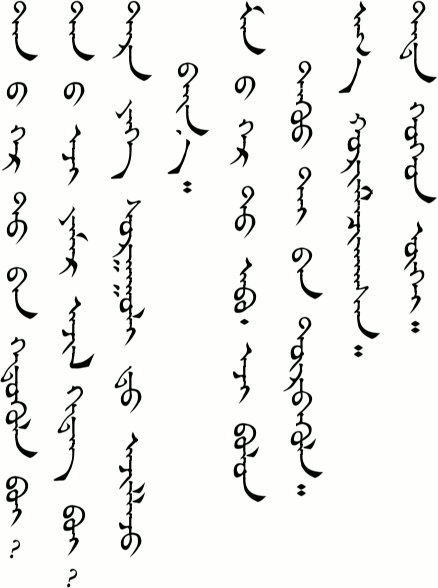
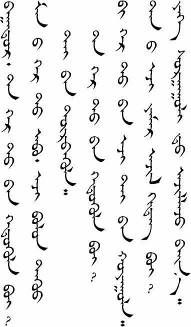
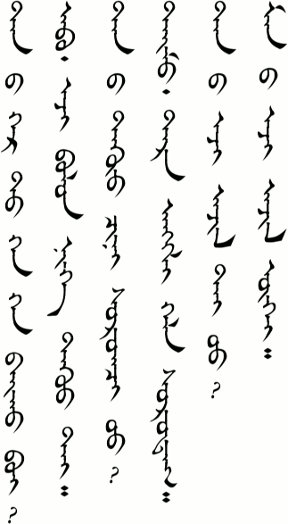
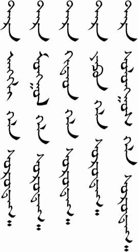
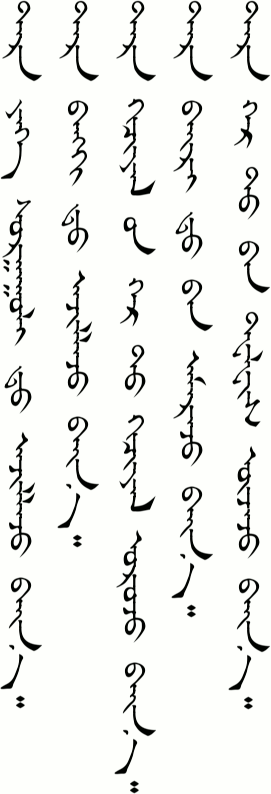
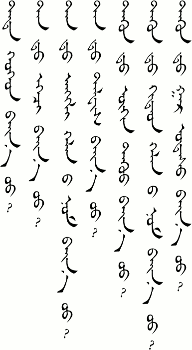
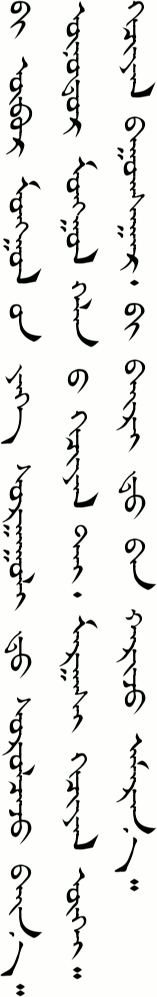
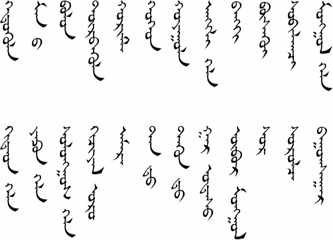
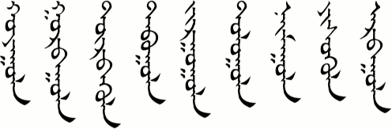
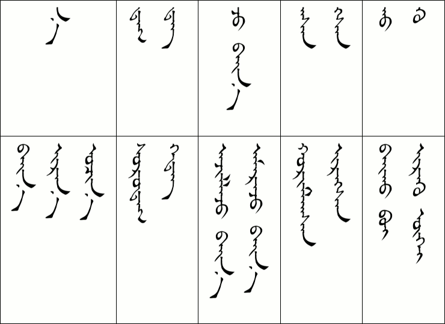

# Lesson 7

## Key Sentences

| Mongolian | English | Audio |
|---|---|---|
| tɑːnæː gər təːn xəduːl be? | How many people are in your family? | <AudioPlayer src="/audio/L7-K1.mp3" /> |
| tɑːnæː əːʤ yɑmə̌r ɑʤə̌l xiːdə̌g be? | What does your mother do? | <AudioPlayer src="/audio/L7-K2.mp3" /> |
| tər jix sʊrgʊːl t ɑʤə̌lʤ bæːn | She works at a university. | <AudioPlayer src="/audio/L7-K3.mp3" /> |
| mɑnæː gər t ɑːb əːʤ bɔlə̌n duː tæː gəːn dorbuːl | There are four people in my family: my father, my mother, my younger brother, and me. | <AudioPlayer src="/audio/L7-K4.mp3" /> |
| ɑx xœrə̌mə̌lʧə̌xsə̌n | My older brother is married. | <AudioPlayer src="/audio/L7-K5.mp3" /> |
| təd xuːxəd ugue | They don't have any children. | <AudioPlayer src="/audio/L7-K6.mp3" /> |

## Dialogs

### One

<AudioPlayerSeek src="/audio/L7-D1.mp3" />

- A: bɑːtə̌r tɑː gər təːn həduːl be?
- B: mɑnæː gər t ɑːb əːʤ bɔlə̌n duː tæː gəːn dorbuːl tɑː gər təːn həduːl be?
- A: biː gər təːn əːʤ tæː gəːn xɔjʊːl
- B: tɑːnæː əːʤ yɑmə̌r ɑʤə̌l xiːdə̌g be?
- A: jix sʊrgʊːl t ɑʤə̌lʤ bæːn

### Two

<AudioPlayerSeek src="/audio/L7-D2.mp3" />

- A: tɑːnæː gər t xən xən bæːx be?
- B: ɑːb əːʤ bɔlə̌n nəg duː tæː
- A: tɑːnæː duː ʧin sʊrə̌gʧ ʊː
- B: tiːm tər æŋgə̌l xəl sʊrdə̌g
- A: tɑːnæː əːʤ ɑʤə̌l tæː jʊː
- B: mɑnæː əːʤ ɑʤə̌l ugue

### Three

<AudioPlayerSeek src="/audio/L7-D3.mp3" />

- A: tɑːnæː gər t xən xən bæːx be?
- B: mɑnæː gər t ɑːb əːʤ əgʧ tæː gɑːn bæːn
- A: tɑːnæː əgʧ ɑʤə̌l tæː jʊː?
- B: ɑʤə̌l tæː tər bæŋk d ɑʤə̌lʤ bæːn tɑːnæː ɑx ʧin yɑmə̌r ɑʤə̌l xiːdə̌x be?
- A: tər bɔl əmʧ
- B: tər xœrə̌mə̌lʧə̌xsə̌n ʊː?
- A: tər xœrə̌mə̌lʧə̌xsə̌n tərnæː busgue n sœblə̌gʧ
- B: təd xuːxəd tæː jʊː?
- A: ugue

:::note Notes

- /xəduːl/ is the word for "how many" when talking about the total number of people.
- When a question word is repeated (as /xən xən/ is in dialog 2 and 3) it means that you should list all the answers. "*Who all* is in your family?"

:::

## Substitution

### One

tər \_\_\_\_\_\_\_\_\_ sʊrdə̌g

- æŋgə̌l həl
- mɔŋgə̌l həl
- xetə̌d (getə̌d) xəl
- jɔpə̌n xəl
- sɔlə̌ŋgə̌s həl

<AudioPlayerSeek src="/audio/L7-S1.mp3" />

### Two

tər \_\_\_\_\_\_\_\_\_ \_\_\_\_\_\_\_\_\_\_ʤ bæːn

- jix sʊrgʊːl t
- bænk d
- xəʧəːl iːn gər d
- bæːr dɑːn
- gər təːn

- ɑʤə̌l-
- ɑʤə̌l- \*\*\*
- xəʧəːl ɔr-
- ɑmə̌r-
- təlwə̌s uʤ-

<AudioPlayerSeek src="/audio/L7-S2.mp3" />

### Three

\_\_\_\_\_\_\_\_\_ \_\_\_\_\_\_\_\_\_ tæː jʊː? \*\*\*

- təd

- xuːxəd

### Four

\_\_\_\_\_\_\_\_\_ \_\_\_\_\_\_\_\_\_ bæːn ʊː?

- təd
- tɑːnd
- tɑːnd
- tɑːnd
- tuːnd
- tuːnd
- tuːnd

- xuːxəd
- əgʧ
- æŋgə̌l xəl næː nɔm
- təlwə̌s
- œxə̌n duː
- xetə̌d xəl næː nɔm
- gɑr ʊtə̌s

<AudioPlayerSeek src="/audio/L7-S3.mp3" />

:::note Notes:

- You may notice that sometimes our teachers pronounce certain words slightly differently from each other. They also sometimes pronounce the same word differently in different situations. Some of this is due to trying to say things clearly for us. Some of it is also apparently due to dialectical differences. Although Xilingol is considered the standard for Mongolian in Inner Mongolia, many people from Xilingol at times pronounce the /x/ like a /g/. You can hear this in /xetə̌d/ as it is pronounced in the first substitution set above. But notice how they say in for the vocabulary list below. The dictionary lists it is as /x/ so that is generally what I will write. But a reminder again: copy what our teachers say, not what I write. It won't hurt you to say /getə̌d/.
- There are two ways to ask if someone has something. One uses /tæː jʊː/ and the other uses /bæːn ʊː/. As I currently understand it, /tæː jʊː/ is more commonly used with people (as in "Do you have a brother?") However, I need to ask our tutors again when they get back. I will also have them record us some more examples.
- \*\*\* rerecord

:::

## Expansion

### One

1.  biː obə̌r mɔŋgə̌l iːn jix sʊrgʊːl d sʊrə̌lʧə̌ʤ bæːn
2.  onoːdə̌r mɔŋgə̌l xəl næː xəʧəːl tæː mɑrgɑːʃ xəʧəːl ugue
3.  xəʧəːl bʊːsɑːr biː bæːr dɑːn xærʤ ɑmə̌rnɑː

<AudioPlayerSeek src="/audio/L7-E1.mp3" />

:::note Notes:
Pay attention to the verb roots to get the meaning, but also notice the verb endings.
:::

## Vocabulary

| Mongolian | Audio | English |
|---|---|---|
| xəduːl | <AudioPlayer src="/audio/L7-V-howmany.mp3" /> | how many in all |
| ɑʤə̌l- | <AudioPlayer src="/audio/L7-V-work.mp3" /> | to work |
| mɑnæː | <AudioPlayer src="/audio/L7-V-my.mp3" /> | my, our |
| bɔlə̌n | <AudioPlayer src="/audio/L7-V-and.mp3" /> | and |
| dorbuːl | <AudioPlayer src="/audio/L7-V-fourofus.mp3" /> | four in all |
| xœrə̌mə̌l- | <AudioPlayer src="/audio/L7-V-marry.mp3" /> | to get married |
| xuːxəd | <AudioPlayer src="/audio/L7-V-child.mp3" /> | children |
| xɔjʊːl | <AudioPlayer src="/audio/L7-V-twoofus.mp3" /> | two in all |
| æŋgə̌l xəl | <AudioPlayer src="/audio/L7-V-english.mp3" /> | English |
| bæŋk | <AudioPlayer src="/audio/L7-V-bank.mp3" /> | bank |
| busgue | <AudioPlayer src="/audio/L7-V-woman.mp3" /> | wife |
| sœblə̌gʧ | <AudioPlayer src="/audio/L7-V-nurse.mp3" /> | nurse |
| mɔŋgə̌l həl | <AudioPlayer src="/audio/L7-V-mongolian.mp3" /> | Mongolian |
| xetə̌d xəl | <AudioPlayer src="/audio/L7-V-chinese.mp3" /> | Chinese |
| jɔpə̌n xəl | <AudioPlayer src="/audio/L7-V-japanese.mp3" /> | Japanese |
| sɔlə̌ŋgə̌s həl | <AudioPlayer src="/audio/L7-V-korean.mp3" /> | Korean |
| xəʧəːl ɔr- | <AudioPlayer src="/audio/L7-V-haveclass.mp3" /> | to have class |
| ɑmə̌r- | <AudioPlayer src="/audio/L7-V-rest.mp3" /> | to rest |
| tɑːnd | <AudioPlayer src="/audio/L7-V-toyou.mp3" /> | to you (polite) |
| tuːnd | <AudioPlayer src="/audio/L7-V-tohim.mp3" /> | to him, to her |
| gɑr ʊtə̌s | <AudioPlayer src="/audio/L7-V-cell.mp3" /> | cell phone |
| obə̌r mɔŋgə̌l | <AudioPlayer src="/audio/L7-V-innermongolia.mp3" /> | Inner Mongolia |
| sʊr- | <AudioPlayer src="/audio/L7-V-study1.mp3" /> | to study |
| sʊrə̌lʧ- | <AudioPlayer src="/audio/L7-V-study2.mp3" /> | to study |
| bʊː- | <AudioPlayer src="/audio/L7-V-finishclass.mp3" /> | to finish (class) |

## Grammar

### All of us

In this lesson we saw the question word /xəduːl/, meaning "how many in all". We already learned that /xəd/ or /hədə̌n/ means "how many". The /-uːl/ ending adds the meaning of "in all". When answering the question, the numbers likewise need the /-ʊːl/ or /-uːl/ endings. From what I understand these are just used with people, but I will ask our teachers about it later. Let's listen to two through ten below.

<AudioPlayerSeek src="/audio/L7-G1.mp3" />

- xɔjə̌rʊːl
- gʊrbʊːl
- doruːl
- tɑbʊːl
- ʤʊrgɑːgʊːl
- dɔlʊːl
- næːmʊːl
- jisuːl
- ɑrbʊːl

You may be wondering why four and nine have the /-uːl/ ending while the others have the /ʊːl/ ending. It is because of vowel harmony. You will recall that /ɑ/, /ɔ/, and /ʊ/ are masculine vowels; /ə/, /o/, and /u/ are feminine vowels; and /i/ is a neutral vowel. Since masculine and feminine vowels cannot mix within a single word, when a special ending is added, it must also match the word. Four and nine are feminine words so they take the feminine /-uːl/ ending. The others take the masculine /ʊːl/ ending.

### Verb Endings

Let's look at some frequently used verb endings that we have already come across. There will be many more to learn but these are some of the most common and important. Note that sometimes an extra vowel follows the ending. This does not change the meaning.

| Ending | Meaning | Example |
|---|---|---|
| -n | future tense. Somebody will do something. | bæːn, bæːnɑː, irnəː, ɔʧnɔː |
| -də̌g | present tense. Somebody does something regularly.. | sʊrdə̌g, gədə̌gəː |
| -ʤ bæːn (-ʤiːn) | present progressive tense. Somebody is doing something now. | aʤə̌lʤ bæːn, ɑmə̌rʤ bæːn, aʤə̌lʤiːn, ɑmə̌rʤiːnɑː |
| -sə̌n | past tense. Somebody did something. Something is finished. | xœrə̌mə̌lsə̌n, irsə̌n |
| -x | infinitive tense. "to do" something. It is often used when adding some other word after the verb. | bæːx be, irə̌x gue |

## Practice

How do you say the following words:

- how many in all
- four of us
- two of us
- three of us
- children
- bank
- wife
- nurse
- names of five languages
- to rest
- to study
- Inner Mongolia
- cell phone

How do you say the following sentences:

- How many people are in your family?
- Who all are they?
- What does your father do?
- My brother works at the bank.
- There are five people in my family: my father, my mother, my older sister, my younger brother, and me.
- Are you married?
- My younger sister doesn't have any children.
- I study Mongolian.
- My friend studies Japanese at Inner Mongolia University.
- My mother is resting at home.
- Do you have a younger brother?
- Does the policeman have an older sister?
- Does your mother have a TV?

Review by saying the following:

- How are you?
- Goodbye
- See you tomorrow.
- Thank you.
- What is your name?
- What day is it tomorrow?

If you were able to say most of these things correctly then you are ready to go on to [lesson eight](/lessons/lesson-8/). If not then keep practicing. You can also download the audio for the whole lesson so that you can practice listening while fixing your car. Click the three-dot menu at the right of the audio player below and choose "Download".

<AudioPlayerSeek src="/audio/Main-lesson-7.mp3" />

---

## Comments

*Do you have a comment or question that would be helpful for others here? Copy the link to this page and [email me](/contact/) your comment or question.*

---

**Roddy** on June 16, 2014 at 2:58 pm

Mongolian has a very unique vocabulary like the word for Korea is Solongos (Солонгос, according to wiktionary). In Mongolian, rainbow is solongo (солонго, according to wiktionary). Please, I want to know how this is spelled in Traditional Mongolian, too. 😀

As for China, Khyatad (Хятад in Khalka dialect) or xetə̌d seems to come from Khitan, a non-Chinese people who founded the Liao dynasty that ruled the northern part of China for quite some time and for some reason, became the source of the name for China, Cathay.

Very interesting. ^_^ I want to learn more