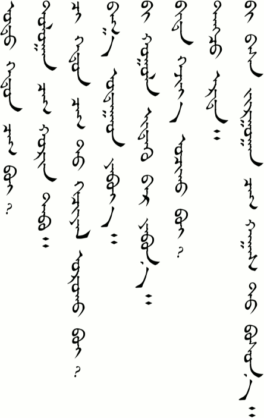
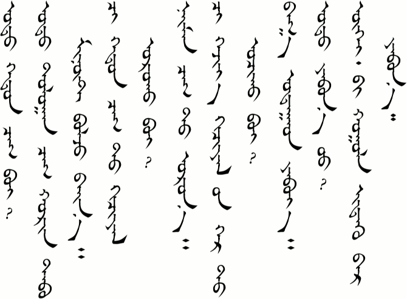
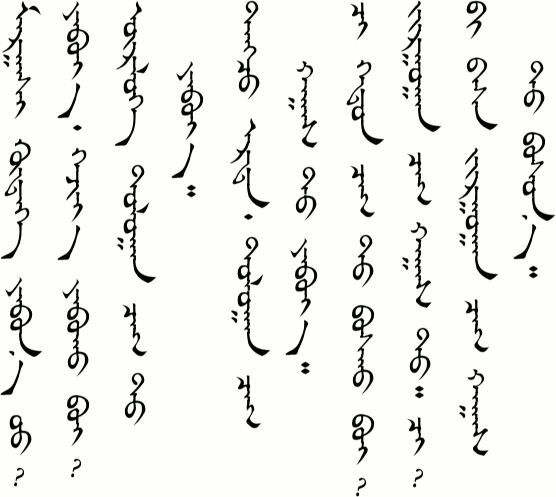
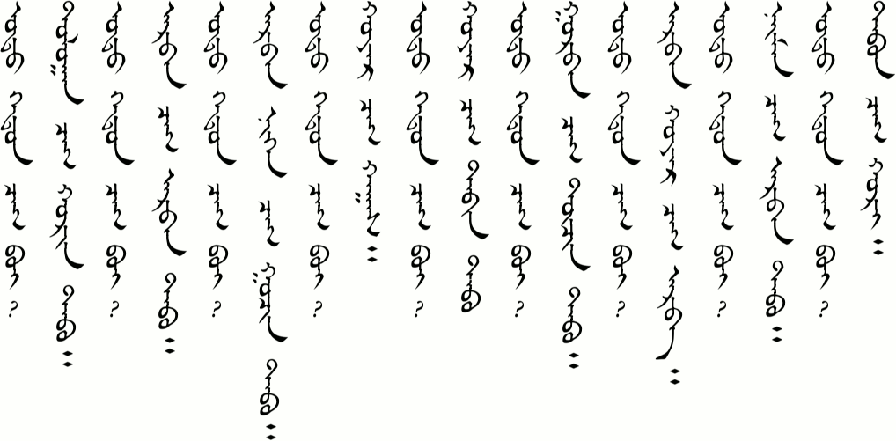
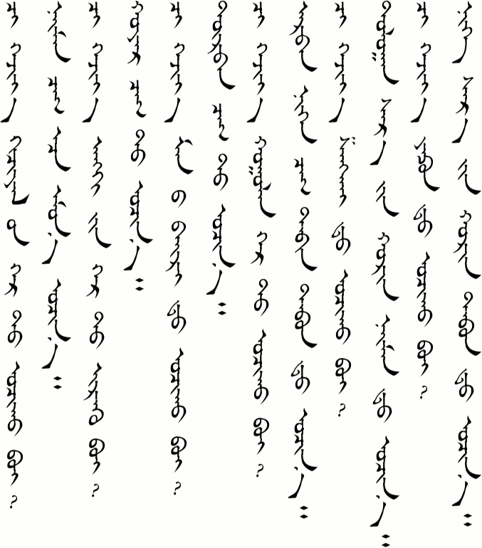
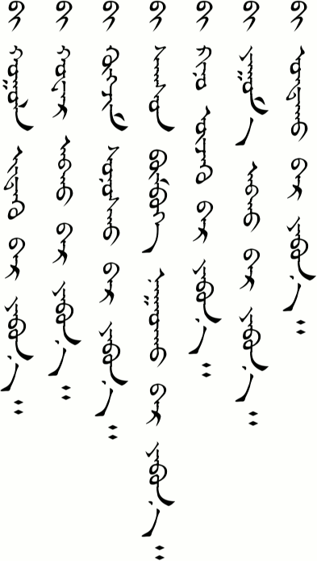
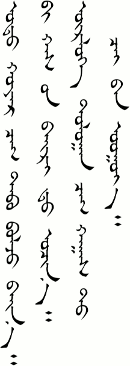
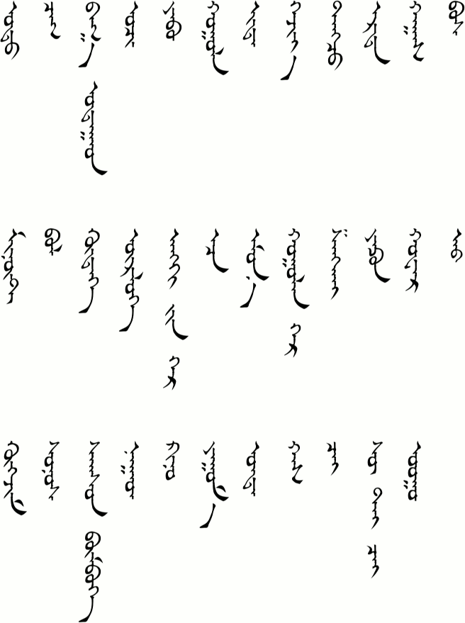
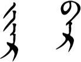

# Lesson 8

## Key Sentences

| Mongolian | English | Audio |
| --- | --- | --- |
| ɔdɔː xədə̌n ʧɑg be? | What time is it? | <AudioPlayer src="/audio/L8-K1.mp3" /> |
| dɔlɔːn ʧɑg xœrə̌n tɑb | It's 7:25. | <AudioPlayer src="/audio/L8-K2.mp3" /> |
| ʧiː xədə̌n ʧɑg t xəʧəːl ɔrə̌x be? | What time do you have class? | <AudioPlayer src="/audio/L8-K3.mp3" /> |
| bɑg ʊdɑːd jæbjɑː | I'll go soon. | <AudioPlayer src="/audio/L8-K4.mp3" /> |
| biː xɔːl idx əːr jæbnɑː | I'm on my way to eat. | <AudioPlayer src="/audio/L8-K5.mp3" /> |
| bid xəʤəː ɔʧə̌x be? | When are we going to go? | <AudioPlayer src="/audio/L8-K6.mp3" /> |
| dɑːʤ ərt | That's too early. | <AudioPlayer src="/audio/L8-K7.mp3" /> |
| biː bɑs ʤʊrgɑːn ʧɑg xɑgsə̌ d bɔsnɔː | I get up at 6:30, too. | <AudioPlayer src="/audio/L8-K8.mp3" /> |

### Dialogs

#### One

<AudioPlayerSeek src="/audio/L8-D1.mp3" />

- A: ɔdɔː xədə̌n ʧɑg be?
- B: ɔdɔː dɔlɔːn ʧɑg xœrə̌n tɑb menuːt bɔlʤ bæːnɑː
- A: ʧiː xədə̌n ʧɑg t xəʧəːl ɔrə̌x be?
- B: næːmə̌n ʧɑg t ɔrnɔː
- A: ʧiː xəʤəː xəʧəːl in gər ɔʧə̌x be
- B: bɑg ʊdɑːd jæbjɑː
- A: ɔdɔː jæbn ʊː?
- B: ugue biː xɔːl idx əːr jæbnɑː

#### Two

<AudioPlayerSeek src="/audio/L8-D2.mp3" />

- A: mɑrgɑːʃ xodoː jæbn ʊː?
- B: jæbjɑː xəʤəː jæbə̌x be?
- A: ogloː dɔlɔːn ʧɑg t jæbjɑː
- B: dɑːʤ ərt dɔlɔːn ʧɑg xɑgsə̌ d jæbjɑː
- A: ʧiː xədə̌n ʧɑg bɔsə̌x be?
- B: jʊrgɑːn ʧɑg xɑgsə̌ d ʧiː?
- A: biː bɑs jʊrgɑːn ʧɑg xɑgsə̌ d bɔsnɔː

:::note
The word for "half" is actually /xɑgə̌s/ but when it is followed by a t/d the pronunciation changes to /xɑgsə̌d/. This sort of word blending happens frequently in Mongolian.

/ɔʧ-/ and /jæb-/ both mean "go". As I understand it, though, /jæb-/ has more of the meaning of walking somewhere----like the difference in Chinese between 去 and 走.
:::

### Substitution

#### One

<AudioPlayerSeek src="/audio/L8-S1.mp3" />

- A: ɔdɔː xədə̌n ʧɑg be?
- B: \_\_\_\_\_\_ ʧɑg \_\_\_\_\_\_\_\_\_\_\_

:::info
- 7:25
- 10:15
- 11:35
- 2:30
- 2:55
- 3:45
- 12:10
- 8:15
- 5:20
:::

#### Two

<AudioPlayerSeek src="/audio/L8-S2.mp3" />

- A: ʧiː xəʤəː \_\_\_\_\_\_\_\_\_ t ɔʧə̌x be?
- B: \_\_\_\_\_\_\_\_\_\_\_\_\_ t ɔʧnɔː

:::info
| A | B |
| :--- | :--- |
| <ul><li>xəʧəːl in gər</li><li>æŋg in gər</li><li>mɑnæː bæːr</li><li>xɔːlə̌n gər</li><li>ʃɑŋxæː</li><li>jɑpə̌n (jɑfə̌n)</li></ul> | <ul><li>næːmə̌n ʧɑg ɑːs omə̌n</li><li>xɔjə̌r ʧɑg</li><li>dorbə̌n ʧɑg</li><li>ɑrbə̌n nəgə̌n ʧɑg tæbə̌n tɑbən</li><li>dɔlɔːn sɑr in xœrə̌n næːmə̌n</li><li>nəg sɑr in xœrə̌n tɑbə̌n</li></ul> |
:::

#### Three

<AudioPlayerSeek src="/audio/L8-S3.mp3" />

biː \_\_\_\_\_\_\_\_ jæbnɑː

:::info
- xɔːl idx əːr
- xwɑːr ɑbx ɑːr
- xogʤə̌m sɔnsx ɔːr
- sɑgsə̌n bombə̌g nɑːdx ɑːr
- kenʊː uʤx əːr
- jim ɑbx ɑːr
- ʊntx ɑːr
:::

:::note Notes:
It is optional to use the word "minute" at the end when saying the time.

The /əːr/ɑːr/ɔːr/ grammar particle is a case suffix that can generally be translated as "by". However, in Substitution Three it shows the purpose for which the speaking is "going." If you look at the Mongolian script you will notice that there is only one written form for this word here (bɑr/bər). The pronunciation changes based on the vowels used in the previous word. This is because of vowel harmony in Mongolian. If the previous verb uses /ə/, /i/, or /u/, then the pronunciation is /əːr/. If the previous verb uses /ɑ/ or /ʊ/, then the pronunciation is /ɑːr/. If the previous verb uses /ɔ/, then the pronunciation is /ɔːr/. And if the previous verb were to use /o/, then the pronunciation would be /oːr/. I am writing these with the long vowel sounds (əːr/ɑːr/ɔːr/oːr) because that seems to be what all the textbooks and grammar books (as well as the Cyrillic spelling) say. However, I should note that our teachers say that these are short and not long sounds (ər/ɑr/ɔr/or). Indeed, when spoken in a sentence, they are not excessively long, so don't lengthen them more than they should be. This is another reminder to base our pronunciation on what we hear rather than what we read.
:::

### Expansion

<AudioPlayerSeek src="/audio/L8-E1.mp3" />

- ɔdɔː xɔjə̌r ʧɑg tɑb bɔlʤ bæːn biː xɑs in bæːr t ɔʧnɔː
- ogloː dɔlɔːn ʧɑg xɑgsə̌ d ʧæː gɑːn ʊːjɑː

:::note Notes:
/bɔlʤ bæːn/ is commonly used when talking about the current time. It literally means something like "The time is now becoming...."

When /ɑːn/ follows a long vowel a /g/ is added to give /gɑːn/. As we learned in [lesson 5](/lessons/lesson-5#grammar), /ɑːn/ usually shows belonging. However, it is still a little unclear to me how it is used here. I'll probably come back some day and update this, but if you know now then leave a comment below.

Mongolians say "drink morning tea" rather than "eat breakfast." Tea means milk tea (/suː tæː ʧæː/). Contrary to how it sounds, there is eating involved. Cold mutton or beef is cut off the bone and warmed in the hot tea. Millet, bread, butter, and cheese are also often added to the milk tea. It might help you to think of it more like soup rather than tea, especially since the milk tea itself is slightly salty rather than sweet.
:::

### Vocabulary

| Mongolian | English | Audio |
| --- | --- | --- |
| ɔdɔː | now | <AudioPlayer src="/audio/L8-V-now.mp3" /> |
| ʧɑg | time, hour | <AudioPlayer src="/audio/L8-V-time.mp3" /> |
| bɑg ʊdɑːd | soon | <AudioPlayer src="/audio/L8-V-soon.mp3" /> |
| ɔʧ- | to go (to some destination) | <AudioPlayer src="/audio/L8-V-go.mp3" /> |
| jæb- | to go | <AudioPlayer src="/audio/L8-V-walk.mp3" /> |
| xɔːl | food | <AudioPlayer src="/audio/L8-V-food.mp3" /> |
| id- | to eat | <AudioPlayer src="/audio/L8-V-eat.mp3" /> |
| xəʤəː | when | <AudioPlayer src="/audio/L8-V-when.mp3" /> |
| dɑːnʤ | too, very | <AudioPlayer src="/audio/L8-V-too.mp3" /> |
| ərt | early | <AudioPlayer src="/audio/L8-V-early.mp3" /> |
| xɑgə̌s | half | <AudioPlayer src="/audio/L8-V-half.mp3" /> |
| bɔs- | to get up | <AudioPlayer src="/audio/L8-V-getup.mp3" /> |
| minʊːt | minute | <AudioPlayer src="/audio/L8-V-minute.mp3" /> |
| bɔl- | to become | <AudioPlayer src="/audio/L8-V-become.mp3" /> |
| xodoː | countryside | <AudioPlayer src="/audio/L8-V-countryside.mp3" /> |
| ogloː | (early) morning | <AudioPlayer src="/audio/L8-V-morning.mp3" /> |
| æŋg in gər | classroom (homeroom for a set group of students. In China students have the same classmates for every class.) | <AudioPlayer src="/audio/L8-V-classroom.mp3" /> |
| ɑːs, əːs | from (case suffix grammar particle) | <AudioPlayer src="/audio/L8-V-from.mp3" /> |
| omə̌n | before | <AudioPlayer src="/audio/L8-V-before.mp3" /> |
| xɔːlə̌n gər | restaurant, cafeteria | <AudioPlayer src="/audio/L8-V-restaurant.mp3" /> |
| ʃɑŋxæː | Shanghai | <AudioPlayer src="/audio/L8-V-shanghai.mp3" /> |
| jɑpə̌n (jɑfə̌n) | Japan | <AudioPlayer src="/audio/L8-V-japan.mp3" /> |
| xwɑːr | flower | <AudioPlayer src="/audio/L8-V-flower.mp3" /> |
| ɑb- | to get, to buy | <AudioPlayer src="/audio/L8-V-get.mp3" /> |
| xogʤə̌m | music | <AudioPlayer src="/audio/L8-V-music.mp3" /> |
| sɔnə̌s- | to listen | <AudioPlayer src="/audio/L8-V-listen.mp3" /> |
| sɑgsə̌n bombə̌g | basketball | <AudioPlayer src="/audio/L8-V-basketball.mp3" /> |
| nɑːd- | to play | <AudioPlayer src="/audio/L8-V-play.mp3" /> |
| kenʊː | movie | <AudioPlayer src="/audio/L8-V-movie.mp3" /> |
| jim | thing | <AudioPlayer src="/audio/L8-V-thing.mp3" /> |
| ʊnt- | to sleep | <AudioPlayer src="/audio/L8-V-sleep.mp3" /> |
| xɑs | Has (name) | <AudioPlayer src="/audio/L8-V-has.mp3" /> |
| ʧæː | tea | <AudioPlayer src="/audio/L8-V-tea.mp3" /> |
| suː tæː ʧæː | milk tea | <AudioPlayer src="/audio/L8-V-milktea.mp3" /> |
| ʊː- | to drink | <AudioPlayer src="/audio/L8-V-drink.mp3" /> |

### Grammar

#### Changes in Word Pronunciation

In the Dialog notes above we saw that the word /xɑgə̌s/ ("half") was pronounced /xɑgsə̌d/ in the context of a sentence, and that this type of pronunciation change in words often happens in Mongolian. Let's look at some more examples here.

| Original | Pronunciation change |
| :--- | :--- |
| xɑgə̌s (half) | xɑgsə̌ d (at the half) |
| ʊlə̌s (country) | ʊls ɑːs (from the country) |
| nɑːdə̌x (to play) | nɑːdx ɑːr ("by" playing) |
| ɑbə̌x (to get) | ɑbx ɑːr ("by" getting) |
| uʤə̌x (to see) | uʤx əːr ("by" seeing) |

<AudioPlayerSeek src="/audio/L8-G1.mp3" />

Notice that it seems to happen when there is an indistinct vowel (/ə̌/) in the final syllable and it is followed by some grammar particle. The /ə̌/ disappears and the final consonant is blended with the next word.

#### How Something is Done

In the Substitution section notes above I talked about the /əːr/ɑːr/ɔːr/oːr/ grammar particle a little. Let's look at it a little more here. It is called a case suffix, specifically the Instrumental Case. The meaning generally tells how something is done.

There are four different pronunciations (ɑːr/əːr/ɔːr/oːr) based on the pronunciation of the word it follows. In addition to these four, a /g/ is added between the words if the preceding word ends in a long vowel or diphthong. Let's look at some examples (being out of context, though, I'm not sure about the accuracy of the English translations):

| Mongolian | English |
| :--- | :--- |
| ɑbx ɑːr | in order to get sth |
| ərd əːr | |
| idx əːr | in order to eat |
| mɔd ɔːr | by wood |
| ʊntx ɑːr | in order to sleep |
| moŋg oːr | by silver |
| uʤx əːr | in order to see |
| mœr ɔːr | by horse |
| ærə̌x ɑːr | by alcohol |
| xuː gəːr | by way of the son |
| dʊgʊi gɑːr | by bike |

<AudioPlayerSeek src="/audio/L8-G2.mp3" />

Although, there are four pronunciations, there are only two written forms (ijɑr/ijər or bɑr/bər). These are based on whether the preceding word ends in a vowel or a consonant. (See [Spelling Rules](/resources/grammar/spelling#instrumental-case) for more detail.) You can see the written forms below. Today's lesson only used the bɑr/bər form. I say bɑr/bər because it is impossible to tell from the written form whether the vowel is an /ɑ/ or an /ə/. Vowel harmony with the previous word can make it clear, though.

As I said, the meaning is generally for telling how something is done. Various prepositions like "by", "of", or "though" can be used to express the meaning. Let's look at some examples.

| Mongolian | English |
| :--- | :--- |
| biː nisgə̌l əːr irsə̌n | I came by plane. |
| biː dʊgʊi gɑːr jæbsə̌n | I went by bicycle. |
| ən ig mɔd ɔːr xiːsə̌n | It is made of wood. |
| ən ig gɑr ɑːr ɑːn xiːsə̌n | It is made by hand. |
| mʊːr ʧɔŋx ɔːr usə̌rə̌ŋ gɑrə̌b | The cat jumped through the window. |

<AudioPlayerSeek src="/audio/L8-G3.mp3" />

### Practice

How do you say the following words:

- now
- hour
- soon
- to eat
- food
- when
- to go (both words)
- early
- half
- countryside
- before
- restaurant
- to get
- music
- to listen
- basketball
- to play
- movie
- sleep
- milk tea
- to drink

How do you say the following sentences:

- What time do you have class?
- What time is it now?
- It is 5:30 now.
- It is 4:23 now.
- It is seven o'clock in the morning.
- When are you going to go to Beijing?
- I'll go on September 1st.
- I'm on my way to play basketball.
- I'm on my way to study Mongolian.

Review by saying the following:

- How are your parents?
- Today is the sixth.
- My name is Tana.
- I'm going to the store.
- What are you going to do this evening?
- There are four people in my family: my father, my mother, my younger brother, and me.
- Do you have a TV?

If you were able to say most of these things correctly then you are ready to go on to [Lesson 9](/lessons/lesson-9). If not, then keep practicing! You can also download the audio for the whole lesson so that you can practice listening while walking in the park. Click the three-dot menu at the right of the audio player below and choose "Download".

<AudioPlayerSeek src="/audio/Main-lesson-8.mp3" />

---

## Comments

*Do you have a comment or question that would be helpful for others here? Copy the link to this page and [email me](/contact/) your comment or question.*