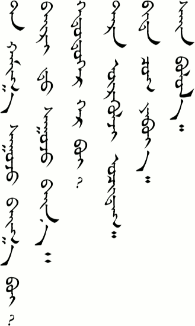
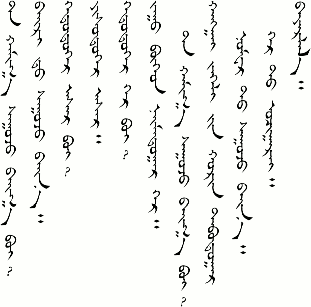
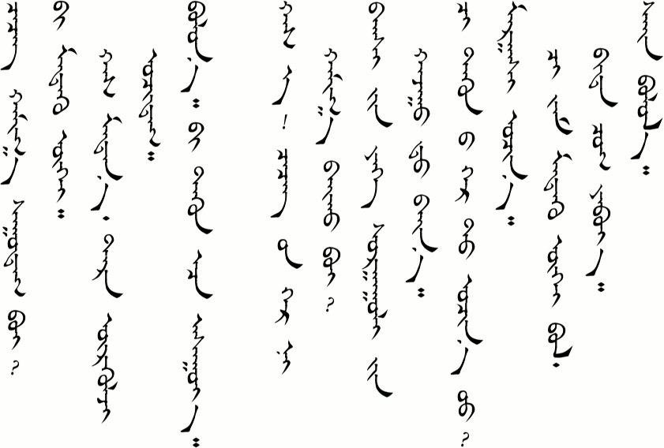
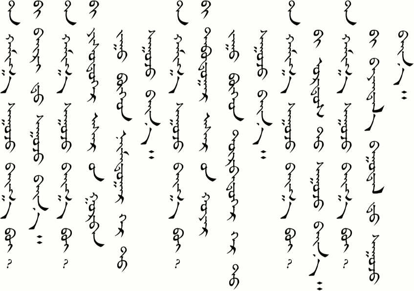
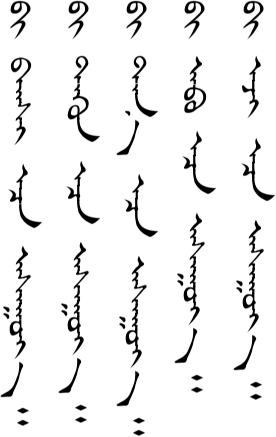
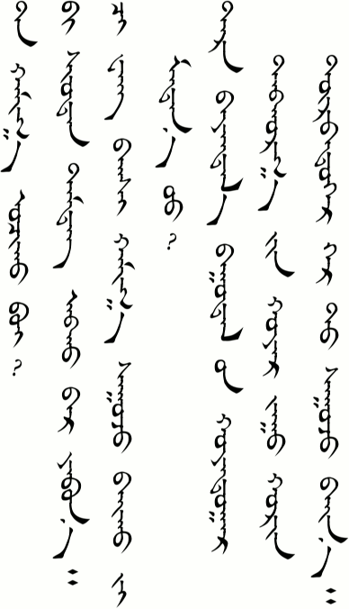
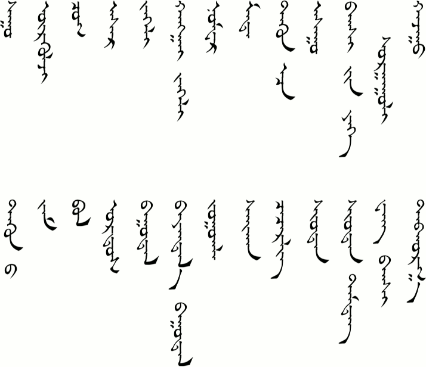

# Lesson 9

- [Lesson 9](#lesson-9)
  - [Key Sentences](#key-sentences)
  - [Dialogs](#dialogs)
    - [One](#one)
    - [Two](#two)
  - [Substitution](#substitution)
    - [One](#one-1)
    - [Two](#two-1)
    - [Three](#three)
    - [Four](#four)
  - [Expansion](#expansion)
  - [Vocabulary](#vocabulary)
  - [Grammar](#grammar)
    - ["From"](#from)
    - ["If"](#if)
  - [Practice](#practice)

## Key Sentences

| Mongolian | English | Audio |
|---|---|---|
| tɑː xɑː sʊːʤ bæːgɑː be? | Where do you live? | <AudioPlayer src="/audio/L9-K1.mp3" /> |
| bæːr t sʊːʤ bæːnɑː | (I) live in the dorms. | <AudioPlayer src="/audio/L9-K2.mp3" /> |
| xədʊːgɑːr gər be? | Which room? | <AudioPlayer src="/audio/L9-K3.mp3" /> |
| tər urgə̌lʤ ɔʧdə̌g | He/she goes often. | <AudioPlayer src="/audio/L9-K4.mp3" /> |
| bid ʧʊg jæbjɑː | Let’s go together. | <AudioPlayer src="/audio/L9-K5.mp3" /> |
| sæːn bɔllɔː | That would be great. | <AudioPlayer src="/audio/L9-K6.mp3" /> |

## Dialogs

### One

<AudioPlayerSeek src="/audio/L9-D1.mp3" />

- A: tɑː xɑː sʊːʤ bæːgɑː be?
- B: bæːr t sʊːʤ bæːn
- A: xədʊːgɑːr ɑsə̌r be?
- B: jisdʊgɑːr ɑsə̌r
- A: xədʊːgɑːr gər be?
- B: ʤʊː bogə̌d næːmdʊgɑːr gər tɑː xɑː sʊːʤ bæːgɑː be?
- A: xɑːŋgæː ʤəːl in xœrə̌n tɑbdʊgɑːr nɔmə̌r sʊːʤ bæːn gər t ɔʧɔːrœː
- B: bɑjə̌rllɑː

### Two

<AudioPlayerSeek src="/audio/L9-D2.mp3" />

- A: ʧiʧig xɑː sʊːdə̌g be?
- B: biː mədə̌gue xɑs mədnəː tər urgə̌lʤ ɔʧdə̌g
- A: bɔlnɔː biː tuːn əːs ɑsʊːjɑː
- A: xɑsɑː ʧiʧg in gər n xɑː bæːx be?
- C: bɑgʃ in jix sʊrgʊːl in xɑʤʊːn t bæːn
- A: ʧiː tuːneː gər t ɔʧn ʊː?
- C: mɑrgɑːʃ ɔʧnɔː ʧiː jɑm mədə̌xgue bɔl bid ʧʊg jæbjɑː
- A: sæːn bɔllɔː

:::note

- `/bæːgɑː/` is a conjugation of `/bæː-/` (to be, to have). I don't really know what this ending does yet, but as you can see it is used when asking a location. Notice that the answer still uses the `/bæːn/` that we have often come across before. (But note that `/xɑː bæːx be?/` is also used to ask location.)
- `/ɔʧɔːrœː/` is a conjugation of `/ɔʧ-/` (to go) and a new ending `/-ɔːrœː/`. This verb form shows politeness and is like saying "please." You might hear the phrase "Please *come* to my house" more often in real life, but because both speakers in Dialog One are not at home, A invites B to *go* to his house.
- Notice that when talking *to* someone, a long vowel is often used at the end of a name. We can see this here with `/xɑsɑː/` and in the past we have seen `/ʧiʧigəː/`. However, when talking *about* someone, the long final vowel can be dropped, as in `/xɑs/` and `/ʧiʧig/`.

:::

## Substitution

### One

<AudioPlayerSeek src="/audio/L9-S1.mp3" />

- A: tɑː xɑː sʊːʤ bæːgɑː be?
- B: biː ______ t sʊːʤ bæːn(ɑː)

- bæːr
- jisdʊgɑːr ɑsə̌r in gʊrə̌b ʤʊː bogoːd næːmdʊgɑːr gər
- tɑbdʊgɑːr ɑsə̌r in xɔjə̌r ʤʊː bogoːd dorə̌bdʊgɑːr gər
- ɔrdə̌s
- bɑjə̌ntɑl bʊːdə̌l

### Two

<AudioPlayerSeek src="/audio/L9-S2.mp3" />

**______-ɑːræː/ɔːrœː/əːreː**

- ʤɔːglɔːrœː
- sʊːgɑːræː
- ʧæː ʊːgɑːræː
- sæːxə̌n ʊntɑːræː
- sæːn jæbɑːræː
- gər t irəːreː
- nɔm ʊŋʃɑːræː

### Three

<AudioPlayerSeek src="/audio/L9-S3.mp3" />

tər urgə̌lʤ ______ t ɔʧdə̌g

- ʧəʧg in gər
- ʧiʧirlə̌g
- ʃʊːdə̌n
- xɑs in bæːr
- mɑnæː sʊrgʊːl

### Four

<AudioPlayerSeek src="/audio/L9-S4.mp3" />

biː ______ ɑsʊːjɑː

- bɑgʃ ɑːs
- tuːn əːs
- tɑnɑː gɑːs
- ɑːb ɑːs
- əːʤ əːs

:::note Notes:

- `/gər/` has a lot of meanings. In Substitution One it means "room" or "apartment." It can also mean "home," "house," "family," or "yurt." Of course, these are all related, but it goes to show how widely this word is used.
- The names of people and places in Mongolian are often formed from two different words. We can see that in Substitution One with the hotel name `/bɑjə̌ntɑl/`. `/bɑjə̌n/` means "rich" and `/tɑl/` means "grassland" or "steppe."
- Substitution Two uses the `/ɑːræː/ɔːrœː/əːreː/` verb ending. This can be translated as "Please do something."
- Are you having as much trouble pronouncing `/urgə̌lʤ/` as I am?
- Substitution Four. In Mongolian you don't "ask somebody," you "ask from somebody."

:::

## Expansion

<AudioPlayerSeek src="/audio/L9-E1.mp3" />

- A: tɑː xɑː ɔʧə̌x be?
- B: biː ʃʊːdə̌n təmdə̌g ɑbx ɑːr jæbnɑː
- A: ʧiː wɑːŋ bɑgʃ xɑː sʊːʤ bæːx i mədn uː?
- B: tər bɑjə̌ntɑl bʊːdə̌l in xɔjə̌rdʊgɑːr dɑbxə̌rg in xɔjə̌r ʤʊː xœrə̌n dorə̌bdʊgɑːr gər t sʊːʤ bæːnɑː

:::note Notes:

Notice how the question "Where is Teacher Wang staying?" is changed to "Do you know where Teacher Wang is staying?"

:::

## Vocabulary

| Mongolian | English | Audio |
|---|---|---|
| sʊː- | to sit, to live or stay somewhere | <AudioPlayer src="/audio/L9-V-sit.mp3" /> |
| urgə̌lʤ | always | <AudioPlayer src="/audio/L9-V-always.mp3" /> |
| ʧʊg | together | <AudioPlayer src="/audio/L9-V-together.mp3" /> |
| ɑsə̌r | building | <AudioPlayer src="/audio/L9-V-building.mp3" /> |
| ʤəːl | street | <AudioPlayer src="/audio/L9-V-street.mp3" /> |
| xɑːŋgæː ʤəːl | Hangai Street | <AudioPlayer src="/audio/L9-V-hangaistreet.mp3" /> |
| nɔmə̌r | number | <AudioPlayer src="/audio/L9-V-number.mp3" /> |
| məd- | to know (sth) | <AudioPlayer src="/audio/L9-V-know.mp3" /> |
| tuːn əːs | from him/her | <AudioPlayer src="/audio/L9-V-fromhim.mp3" /> |
| ɑsʊː- | to ask | <AudioPlayer src="/audio/L9-V-ask.mp3" /> |
| bɑgʃ in jix sʊrgʊːl | Teachers' University (Normal University) | <AudioPlayer src="/audio/L9-V-teacherscollege.mp3" /> |
| xɑʤʊː | next to | <AudioPlayer src="/audio/L9-V-nextto.mp3" /> |
| tuːneː | his/her | <AudioPlayer src="/audio/L9-V-his.mp3" /> |
| ʤɑm | road, way | <AudioPlayer src="/audio/L9-V-road.mp3" /> |
| bɔl | if | <AudioPlayer src="/audio/L9-V-if.mp3" /> |
| ɔrdə̌s | Ordos (the region of Inner Mongolia within the bend of the Yellow River) | <AudioPlayer src="/audio/L9-V-ordos.mp3" /> |
| bʊːdə̌l | hotel | <AudioPlayer src="/audio/L9-V-hotel.mp3" /> |
| bɑjə̌ntɑl bʊːdə̌l | Bayantal (“rich grassland”) Hotel | <AudioPlayer src="/audio/L9-V-bayantalhotel.mp3" /> |
| ʤɔːgə̌l- | to eat or drink (polite) | <AudioPlayer src="/audio/L9-V-pleaseeat.mp3" /> |
| sæːxə̌n | beautiful, good | <AudioPlayer src="/audio/L9-V-beautiful.mp3" /> |
| ʧiʧirlə̌g | park, garden | <AudioPlayer src="/audio/L9-V-park.mp3" /> |
| ʃʊːdə̌n | post office | <AudioPlayer src="/audio/L9-V-postoffice.mp3" /> |
| ʃʊːdə̌n təmdə̌g | postage stamp | <AudioPlayer src="/audio/L9-V-stamp.mp3" /> |
| wɑːŋ bɑgʃ | Teacher Wang | <AudioPlayer src="/audio/L9-V-teacherwang.mp3" /> |
| dɑbxə̌rg | floor (as in 1st, 2nd, etc. level of a building) | <AudioPlayer src="/audio/L9-V-floor.mp3" /> |

## Grammar

### "From"

This is a case suffix in Mongolian. In the traditional script it is always written the same (əʧə), but it is pronounced differently (`/ɑːs/əːs/ɔːs/oːs/`) depending on the word that it follows. The meaning is similar to the English proposition "from." As you saw in today's lesson, though, the usage is different.

Here are some more examples to help you understand the pronunciation and usage a little better.

| Mongolian | English |
|---|---|
| biː ɑːb ɑːs ɑbsə̌n | I got it from father. |
| əːʤ əːs ɑsʊːi | Ask your mother. |
| biːr əːs | from the pen |
| tər hɔt ɔːs irsə̌n | He came from the city. |
| sʊrgʊːl ɑːs | from school |
| moŋg oːs | from the money |
| biː tuːn əːs ondə̌r | I'm taller than him. |
| xœnə̌n nɔːs xœn ɔːs irsə̌n | Wool comes from sheep. |
| ærx ɑːs | from alcohol |
| tɑnɑː gɑːs ɑb | Get it from Tana. |
| biː ɑstrɑliɑ gɑːs irsə̌n | I come from Australia. |

<AudioPlayerSeek src="/audio/L9-G1.mp3" />

Compare the way these are pronounced with how `/əːr/ɑːr/ɔːr/oːr/` is pronounced. (See "How Something is Done" in Lesson 8 [Grammar](/lessons/lesson-8#grammar).) The vowels change in the same way.

### "If"

You might have been confused when you saw that `/bɔl/` was defined as "if" in today's vocabulary. In Lesson 4 we learned that `/bɔl/` meant "is" or "are." The meaning depends on how it is used.

| Mongolian | English |
|---|---|
| tər bɔl sʊrə̌gʧ | She is a student. |
| tər sʊrə̌gʧ bɔl, tər bɑrə̌g bæːr t sʊːdə̌g | If she is a student, she probably lives in the dorms. |

<AudioPlayerSeek src="/audio/L9-G2.mp3" />

Most of the time when "if" is used in a sentence, it is actually made by conjugating the verb. (-bɑl/bəl ending. More on that in a future lesson.) However, when the verb is negative, the "if" (`/bɔl/`) follows the verb as a separate word. The pattern is

`verb` + `/-x/` ending + `/ugue/` + `/bɔl/`.

| Mongolian | English |
|---|---|
| ʧiː jɑm mədə̌xgue bɔl bid ʧʊg jæbjɑː | If you don't know the way, let's go together. |
| tər bɑgʃ ɑːs ɑsʊːx gue bɔl tər mədə̌x gue | If he doesn't ask his teacher, he won't know. |
| ʧiː ɔdɔː idə̌x gue bɔl ʊdə̌l gue olsnoː | If you don't eat now, you will be hungry later. |

<AudioPlayerSeek src="/audio/L9-G3.mp3" />

## Practice

How do you say the following words:

- to stay (somewhere)
- often
- road
- street
- building
- number
- together
- to know
- to ask
- next to
- beautiful
- book
- post office
- park

How do you say the following sentences:

- Where do you live?
- He often goes to the post office.
- I don't know.
- Which room?
- I live in building 5, room 204.
- Please have some tea.
- Bon voyage.
- Let me ask the teacher.
- I live next to the Teachers' University.
- Let’s go together.
- That would be great.
- Sweet dreams.

Review by saying the following:

- I get up at 6:30, too.
- When are you going to go to Shanghai?
- Does Mary have a cell phone?
- John works in a bank.
- I'm going to watch TV.
- Is Ulaan in her dorm?
- Where are you going?
- See you tomorrow.

If you were able to say most of these things correctly then you are ready to go on to [Lesson 10](/lessons/lesson-10). If not, then keep practicing! You can also download the audio for the whole lesson so that you can practice listening while herding your sheep. Click the three-dot menu at the right of the audio player below and choose "Download".

<AudioPlayerSeek src="/audio/Main-lesson-9.mp3" />

If you have any questions about this lesson or if you notice a mistake, then please leave a comment below. If I don't know the answer myself, then I will ask our teachers.