# Books

These are some books that are available in Inner Mongolia. Larger cities should have them, especially Hohhot (second floor of the Culture Market, Xinhua bookstores, Mongolian shops, Mongolian bookstores). Maybe I’ll add more description later but you can browse for now. You have a much better selection if you can also read Chinese.

## Textbooks

  

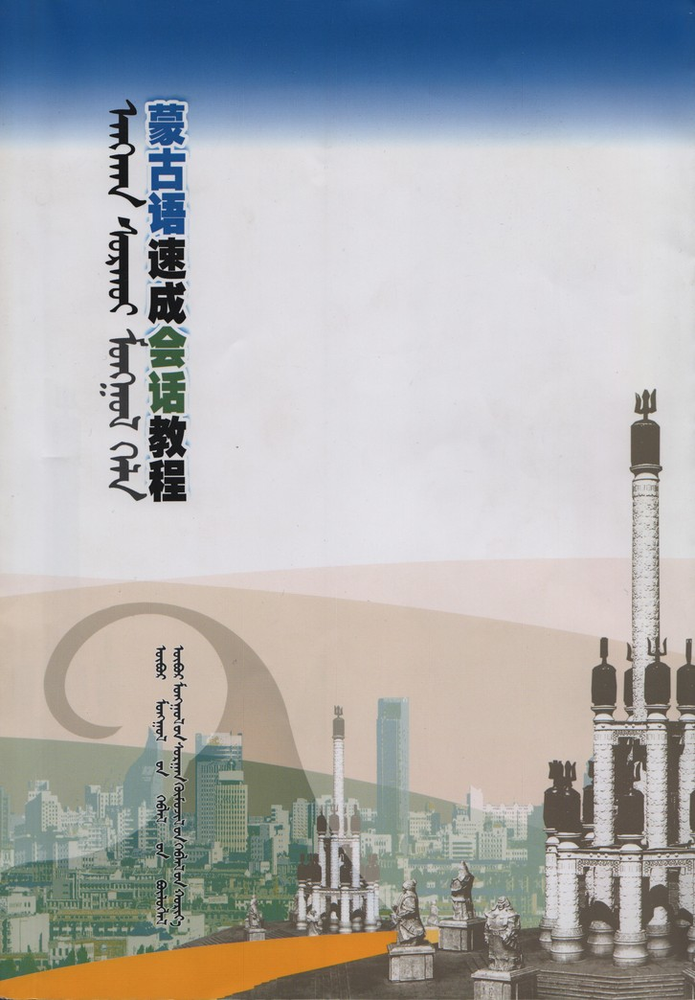

  

  

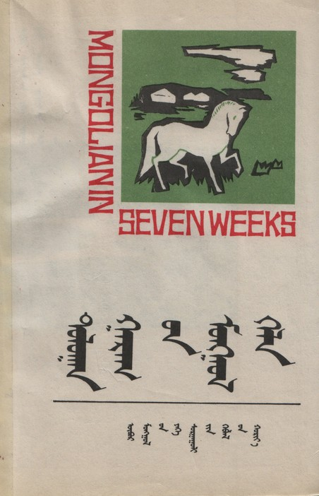

  

## Phrasebooks

  

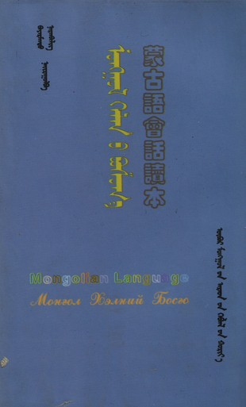

  

  

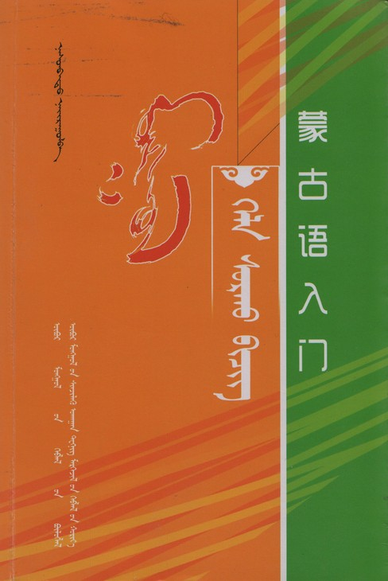

  

  

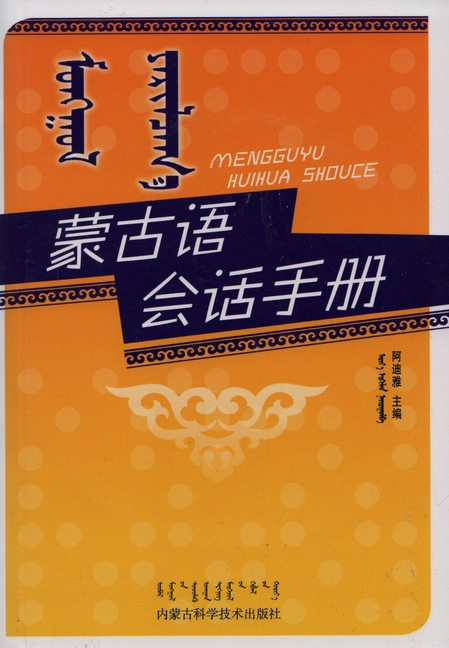

  

## Dictionaries

  

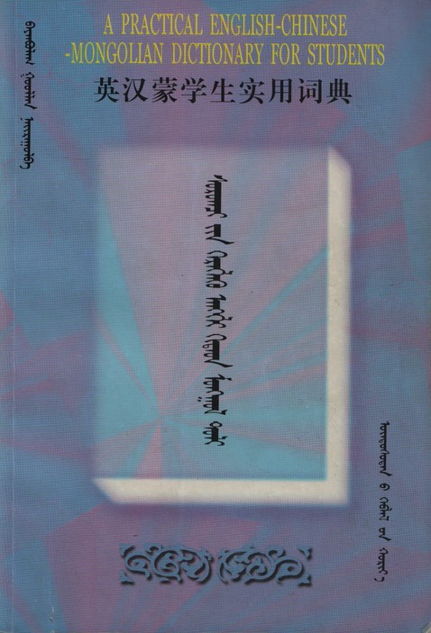

  

  

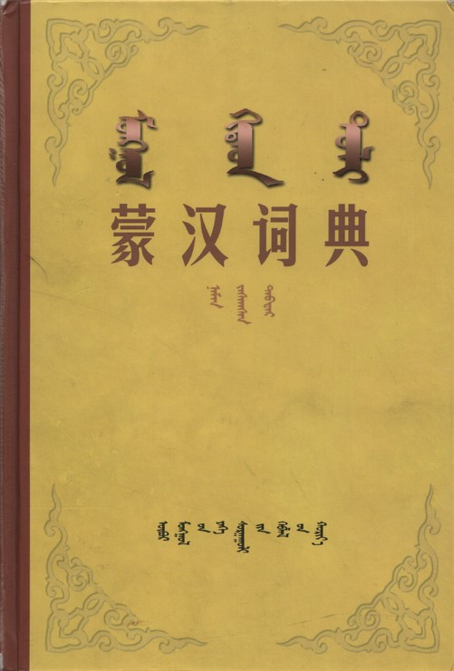

  

  

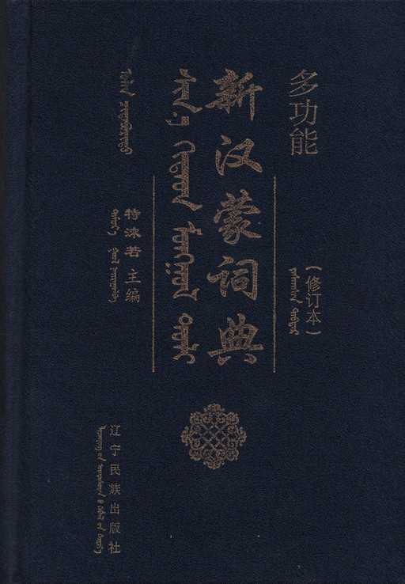

  

  

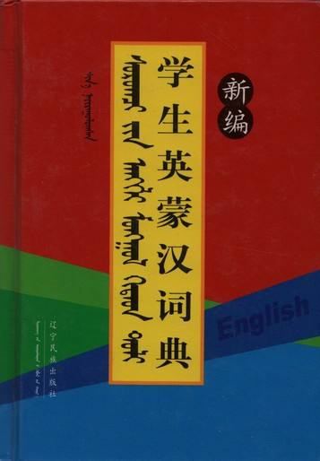

  

  

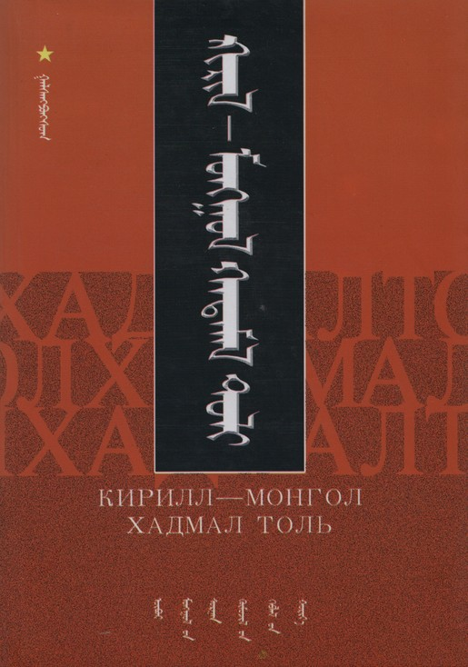

  

## Handwriting practice

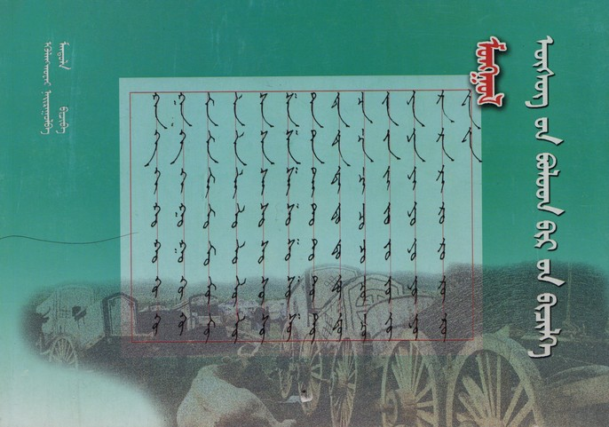

## Children's books

  

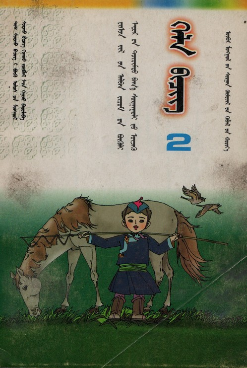

  

  

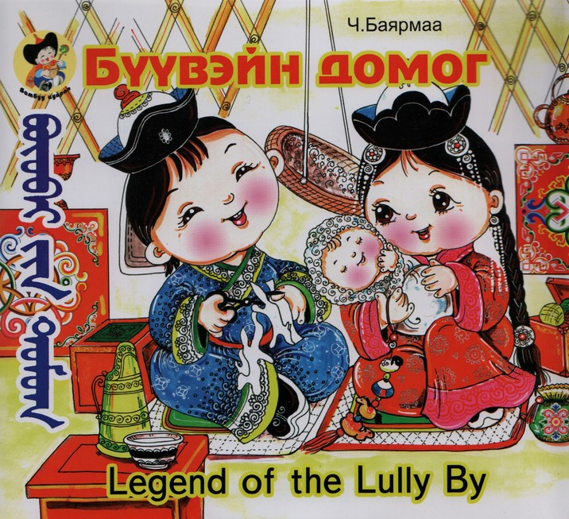

  

  

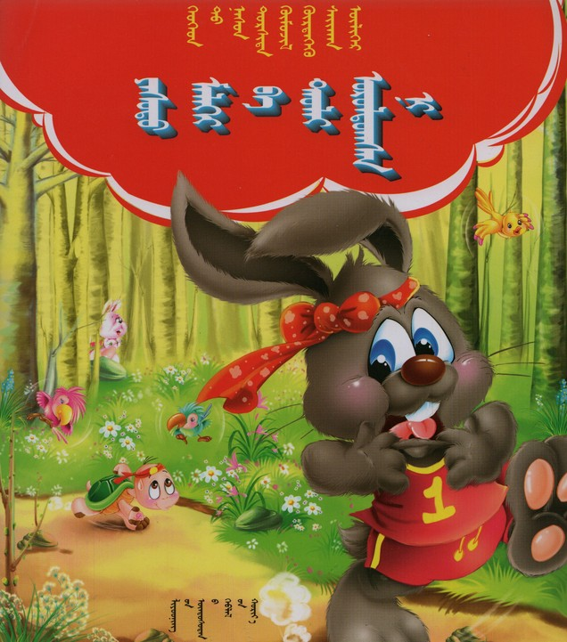

  

