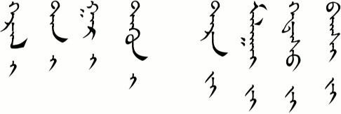

# Spelling

Spoken language changes quickly but written language changes slowly. That can make spelling tricky at times for languages like Mongolian whose written script has been around for hundreds of years. Even so, there are logical rules that you can learn which will help you remember how words should be spelled.

In the first section we will learn some spelling rules for some of the grammar particles that are so common in written Mongolian. If you are like me, then you keep forgetting, so you may want to bookmark this page to come back to in the future.

## Genitive Case – yin/un/u

These grammar case particles function like “of” or “apostrophe s” in English. They show possession.  However, there are three different forms depending on the last letter of the previous word. If the previous word ends in a vowel, then “yin” is used. If the previous word ends in a consonant (besides n), then “un” is used. And if the previous word ends in “n”, then “u” is used.

Here are some examples:

Note that sometimes an “n” is added to a word when making it possessive.

## Dative-Locative Case – du/tu

This case is used to show location or direction. It is similar to the propositions “in,” “at,” and “to” in English. There are two spellings (du/tu) depending on what the final letter of the previous word was. This rule is a little more difficult to remember than the other rules. If the last letter of the previous word is a vowel or one of the consonants “n, m, l, ng,” then the “du” form is used. If the previous word ends in one of the consonants “b, g, d, r, s,” then the “tu” form is used.

Look at the examples and pay careful attention to the last letter of the top words:

Here is something that might help you with this rule. Remember this phrase: “Two big dresses.” The consonants in the words “big dress” are b, g, d, r, s. The word “two” will remind you to use the “tu” form after these consonants. Everything else uses “du.”

## Accusative Case – i/yi

These case particles are used to mark the object of a verb. The spelling rule is very basic. If the previous word ends in a consonant, then use the “i” form. If the previous word ends in a vowel, then use the “yi” form. In other words, match a consonant with a vowel (i) or a vowel with a consonant (y).

See these examples:

## Instrumental Case – iyar/iyer/bar/ber

These particles show the means by which something is done. They are similar to the English prepositions “by” or “through.” The rule is the same as the one above. Match consonant to vowel and vowel to consonant. Specifically, if the previous word ends in a consonant, then add the “iyar/iyer” particle. If the previous word ends in a vowel, then add the “bar/ber” particle.

Here are some examples:

## Reflexive Suffix – iyan/iyen/ban/ben

This suffix shows who or what the previous noun is associated with. That is, it reflects back on the subject of the sentence. The two forms follow the exact same spelling rule as above so I am just going to cut and paste: Match consonant to vowel and vowel to consonant. Specifically, if the previous word ends in a consonant, then add the “iyan/iyen” particle. If the previous word ends in a vowel, then add the “ban/ben” particle.

Compare these examples:

