# Verbs

Verbs are one of the aspects of Mongolian that make it so difficult. There are so many ways to conjugate them and change the meaning by adding suffixes to the root verb. Hopefully this page will help you make some sense of them. I’ll add more as I learn more.

## Infinitive / Future Tense – xʊ/xu

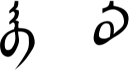

I’m making this verb ending first because it is usually the one you will see in a Mongolian dictionary when you look up a word. (Although, the dictionary on this site just uses the verb root and leaves off this ending because I wanted to try and make it as simple as possible to learn new words.) It is like when we refer to a verb as “to learn” or “to eat” in English.

In a sentence this verb ending shows the future tense. The two written forms are the masculine and feminine forms. The one you use depends on whether the verb root is masculine or feminine. Verbs with this ending do not usually come at the end of a sentence. They are usually followed by another word.

## Present/Future Tense – nɑ/nə

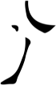

This common verb ending shows the present or future tense. Unlike xʊ/xu above, it does come at the end of a sentence. There is only one written form for both /nɑ/ and /nə/.

## Past Tense – sɑn/sən

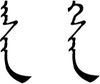

This ending is used to express the past tense. The two forms are the masculine and feminine forms. They have a /g/ when written but it is not pronounced in spoken Mongolian. Verbs with this ending can come at the end of a sentence.

## Past Tense – ʤæː/ʤeː

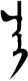

This ending is also used to express the past tense. I’ve had lots of people try to tell me the difference between this and sɑn/sən. Apparently there is one, but it is subtle. For now you can use them interchangeably, though in my experience it seems that ʤæː/ʤeː is not quite as common as sɑn/sən.

## Past Tense – bɑ/bə

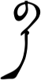

Here is another ending that is used to express the past tense. I couldn’t tell you if there is a difference in meaning from ʤæː/ʤeː and sɑn/sən, but people tell me that bɑ/bə is more written rather than spoken Mongolian.

## Regular action – dɑg/dəg

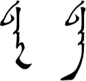

This ending is used to express a regular action or something one is accustomed to, like “I eat every day.” or “I don’t drink alcohol.” The two forms are the masculine and feminine forms. Verbs with this ending can come at the end of a sentence.

## Command – ∅

If you simply use the verb root with no ending at all, then you have a basic command. You can make it softer or more polite, though, by adding a vowel sound or lengthening the vowel at the end. For example, /id/ is an order to “Eat!” but /idəː/ is more like “Please have something to eat.”

## Polite command – ɑːræː/əːreː

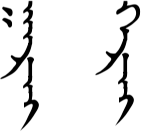

This is a very formal and polite ending for telling someone to do something. It is like saying “please” in English. You can use it when new or honored guests visit your house.

## Progressive Tense – ʤʊ/ʤu bæːnɑ

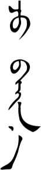

This is like adding “-ing” to a verb in English, as in “I’m running.” or “I’m eating.” In spoken Mongolian it is pronounced /ʤin/ or /ʤinɑː/ʤinəː/.

## Let’s do something – jɑː/jəː

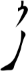

You can use this for things like “Let’s go.” (jɑbjɑː) It can also be used for yourself, like when you are at a restaurant and you tell the waitress that you want a certain food. “I’d like some tea.” (ʧæː ɑbjɑː)

## Haven’t done something (yet) – ɑːgue/əːgue

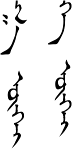

The long vowel can be pronounced ɑː/əː/ɔː/oː depending on the verb. It refers to an action that continues to the present and the /gue/ negates it. So it means that something still hasn’t happened. You can use it to express something like “I still haven’t finished my homework.” or ” I haven’t eaten yet.”

## Completed Action – ʧix

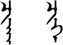

This verb suffix goes in the middle of the verb, not at the end. It emphasizes that the action is finished.

