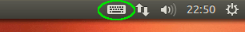

# How to Create a Custom Input Method Editor in Linux

*This article is quite old. I'm not sure if it is still useful but leaving it here for reference.*

## Introduction

An [Input Method Editor (IME)](http://en.wikipedia.org/wiki/Input_method) is just a way to write the special symbols that are used in other languages or writing systems. Of course, if you only need to write a special character occasionally, you can just copy and paste it from [some website](http://unicodelookup.com/) or go to Insert/Special Character… in your word processor (as I do in [LibreOffice](http://www.libreoffice.org/)). But if you need to use these special characters very often, as when writing in another language, then it is a big pain to use those methods. An IME basically just makes shortcut keys for all of the special characters that you want to write. As long as you can remember the shortcuts, you can type the symbols of another language very quickly.

Lots of IMEs have been developed for all of the most commonly used languages in the world and are well supported in Linux. My favorite is [IBus](http://en.wikipedia.org/wiki/Intelligent_Input_Bus), which I use to write in Chinese. [SCIM](http://sourceforge.net/projects/scim/) is another popular one. My problem was that now I wanted to write in traditional Mongolian in [Ubuntu Linux](http://www.ubuntu.com/). There are input methods out there for Windows computers (for example, [Menksoft](http://en.wikipedia.org/wiki/Menksoft_Mongolian_IME) and [MS Word 2007+](http://almas.dip.jp/jAlmas/public/content/mongolfont/en/windows/mngledit.html)), but I couldn’t find anything for Linux. I had made a custom IME for Windows in the past using the [Microsoft Keyboard Layout Creator](http://msdn.microsoft.com/en-us/goglobal/bb964665.aspx), so I was hoping that there was something similar for Linux. Unfortunately, the way to do it was not as simple and well documented. The purpose of this page is to be a tutorial for anyone else wanting to make a custom IME for Linux.

I’ll be using Mongolian IPA ([International Phonetic Alphabet](http://en.wikipedia.org/wiki/International_Phonetic_Alphabet)) as an example, but you should be able to follow the same method to make an IME for any character set. I’ve already used it to create input methods for traditional Mongolian, Mongolian IPA, and English IPA. I’ve also thought about making one for Chinese pinyin letters with tone marks.

## Getting Started

We will be using IBus-Table to make the custom IME. I’m using Ubuntu 12.04 LTS Precise for my operating system, but I imagine this method should work for anything that IBus works on. Be aware that the default folder locations may be different, though.

[Install IBus](http://code.google.com/p/ibus/wiki/Ubuntu)
```bash
sudo apt-get install ibus ibus-clutter ibus-gtk ibus-gtk3 ibus-qt4
```

Install Ibus-Table
```bash
sudo apt-get install ibus-table
```

You can start the IBus setup with the command below. There is nothing to change with in the “ibus-settup” yet since we still haven’t made our own input method, but it is helpful to know where it is. Go ahead and run the command.

```bash
ibus-setup
```

You may get a message that says

```
If you can not use IBus, please open System Menu -> System Settings -> Language Support and set the "Keyboard Input Method" to "ibus", then log out and back in again.
```

Even if you don’t get that message, you should follow those directions. Set the Keyboard Input Method to IBus and then log out and back in. You can also access the IBus preferences now by clicking the new keyboard icon at the top right of the screen. It looks like this in Ubuntu:



By the way, you could also switch to Keyboard Input Method to IBus with the following command:

```bash
im-switch -s ibus
```

But you may have to install it if it isn’t already. Remember to log out and in.

## Create a Custom Table

IBus is setup and so the next step is to make our own custom input method. We will be using the ibus-table engine. The ibus-table developer’s directions are [here](http://code.google.com/p/ibus/wiki/HowToCreateATableForIBusTable). They are a little brief, though, so we will work through them with our real example.

Get the template.txt file and save it somewhere.

```bash
cp /usr/share/ibus-table/tables/template.txt YOUR-DIRECTORY/your-im-name.txt
```

Change `YOUR-DIRECTORY` to whatever path you want. Change your-im-name to the name of your new input method. For me it is MongolianIPA.txt.

Open the file with a text editor. I’m using Gedit. You might need to change the default font to something that shows the symbols you will be typing in. In the box below you can see what the template looks like.

```text
### File header must not be modified
### This file must be encoded into UTF-8.
### This table under LGPL
### comments start with ### not single #
### Derive from the format of SCIM Table, so you can modify the table from
### scim-tables' table
SCIM_Generic_Table_Phrase_Library_TEXT
VERSION_1_0### Begin Table definition.
BEGIN_DEFINITION### License
LICENSE = LGPL### An unique id to distinguish this table among others.
### Use uuidgen to generate this kind of id.
UUID = c9851827-0abe-12ed-8db5-010b9d51ffed### A unique number indicates the version of this file.
### For example the last modified date of this file.
### This number must be less than 2^32.
### Just make your table version-able
SERIAL_NUMBER = 20090218### ICON can be any format as long as your pygtk can recognized
### the most widely ones are "png" and "svg", letter one is recommended
ICON = ibus-table.svg### The default name of this table, this is needed
NAME = Table### The local names of this table, this is optional
NAME.zh_CN = 形码
NAME.zh_HK = 形碼
NAME.zh_TW = 形碼### Description
DESCRIPTION = This is a template engine table for IBus Table.### Supported languages of this table
### sigle "zh_CN" just be recognized as zh_CN,
### but "zh_CN, zh_HK" or more zh_XX will be recognized as zh;
### and "en_US, zh_CN" will be just ignored.
LANGUAGES = zh_CN,zh_SG,zh_TW,zh_HK### The author of this table
AUTHOR = Yu Yuwei <acevery@gmail.com>### Prompt string to be displayed in the status area, CN will be replaced by
### the gettext tools in runtime as 中.
STATUS_PROMPT = CN### Valid input chars.
VALID_INPUT_CHARS = abcdefghijklmnopqrstuvwxyz### Layout
LAYOUT = us### The max number of input keys for every phrase or character.
MAX_KEY_LENGTH = 4

### Use auto_commit mode as default
AUTO_COMMIT = FALSE

### Use full width punctuation by default
DEF_FULL_WIDTH_PUNCT = TRUE
### Not use full width letter by default
DEF_FULL_WIDTH_LETTER = FALSE

### Whether user are allow to define phrase, default is true
### You have to define the word construction rules below.
### For input methods which do not input phrases, set this to False
USER_CAN_DEFINE_PHRASE = TRUE

### Whether support PinYin Mode, default is true.
### this feature is just for Chinese, set it to False if your IM is not
### Chinese.
PINYIN_MODE = TRUE

### If true then the phrases' frequencies will be adjusted dynamically
### according your using frequency.
DYNAMIC_ADJUST = TRUE

### Some characters whose frequencies should be fix all the time, e.g.
### some punctuations
### NO_CHECK_CHARS =

### Rules for constructing user defined phrase
### "ce" stands for "ci equal", a Chinese English :), means "phrase length
### equal to", thus ce2 -> phrase length equal to 2; and "ca" means "phrase
### length equal or above", so ca4 -> phrase length equal or above 4.
### p21 -> the 1st key of 2nd character in the phrase, and so on.
### Each rule separate via ";".
### Example below is a complete rule-set,
### becuase [2,2] ∩ [3,3] ∩ [4,+∞] = [2,+∞], which is the range of length
### of phrase. This have to be satisfied if you need ibus-table to build up
### your own inputed phrase via your daily using.
RULES = ce2:p11+p12+p21+p22;ce3:p11+p21+p22+p31;ca4:p11+p21+p31+p41

END_DEFINITION

### Begin Table data.
### Format of every line whose formated in "input_keys\tphrase\tfreq\n" is an
### entry.
### From left to right, the 1st column are the input key combination that you
### entered via keyboard; the 2nd column are presented character or phrase of
### the key combination you want; the 3rd column are frequency of the character
### or phrase.
BEGIN_TABLE
input_keys	aim_chars	freq
input_keys	aim_chars	freq
input_keys	aim_chars	freq
END_TABlE

### Since some input methods use different table for every character to make
### phrase, such as ZhengMa, they need explict define the goucima (the
### phrase-building code for the given character), the format of every entry is
### "character\tgoucima\n".
### For the input method which just use the full code as word-building code
### just skip this field. The ibus-table will build the codes needed from
### above TABLE.
### if you don't need different word-building code, please comment out the
### next few lines with ###, just like these lines you are look at now.
BEGIN_GOUCI
character_1 goucima_1
character_1 goucima_2
END_GOUCI
```

First let’s make some changes to the default Table Definitions.

Create a new unique id for the table. To do this, run this command in a terminal window.

```bash
uuidgen
```

Copy and paste the output to your-im-name.txt so that

```text
UUID = c9851827-0abe-12ed-8db5-010b9d51ffed
```

or whatever your new id is. (By the way, when you are in the terminal window, you can select text with your mouse and then use Ctrl-Shift-C to copy and Ctrl-Shift-V to paste.)

Change the serial number. You can just make it today’s date in YYYMMDD format. For example:

```text
SERIAL_NUMBER = 20131015
```

Set the name for the icon. You can create a simple svg icon using [Inkscape](http://inkscape.org/). [Here](http://en.flossmanuals.net/inkscape/ch055_creating-icons/) is a tutorial for how to create an icon. [Here](http://inkscapetutorials.wordpress.com/category/icons/) are some more tutorials. If you want to see the icon I made you can get it [here](http://www.studymongolian.net/wp-content/uploads/mongolianipa.svg). I’m sure you can make a much better one, though. Anyway, set the name for the icon in your-im-name.txt. Mine looks like

```text
ICON = mongolianipa.svg
```

Set the default name of the table. Mine is

```text
NAME = MongolianIPA
```

I commented out the local names because I don’t know what they do and I’m not doing anything with Chinese. Mine looks like

```text
### NAME.zh_CN = 形码
### NAME.zh_HK = 形碼
### NAME.zh_TW = 形碼
```

You can write a description for your table. Mine is

```text
DESCRIPTION = Mongolian IPA input engine table for IBus Table.
```

I don’t know exactly what the supported language setting does, but I changed mine to en_US to be safe.

```text
LANGUAGES = en_US
```

You can change the author to your name and email if you want. I didn’t.

```text
AUTHOR = me
```

You can change the status prompt, but I don’t know if I have ever seen it show up. I just didn’t want 中 showing up for my prompt. I made mine “Mipa” for Mongolian IPA.

```text
STATUS_PROMPT = Mipa
```

The next part is important. Enter all of the valid input characters. These are the characters on your keyboard that you will map to your new special symbols. The capital letters allow you to map extra symbols by using the Shift key. I don’t know if I needed all of these buy mine are

```text
VALID_INPUT_CHARS = abcdefghijklmnopqrstuvwxyzABCDEFGHIJKLMNOPQRSTUVWXYZ,.?!1234567890()":;#/
```

For this input method I only am only doing a one-to-one correspondance. That is, I press one key and I want to get one output symbol. So I can make the maximum key length 2. For some reason, when I set it to one I was getting some errors.

```text
MAX_KEY_LENGTH = 2
```

I set auto-commit to true because I don’t want to choose options from a menu. I want to press a key and get my symbol immediately.

```text
AUTO_COMMIT = TRUE
```

The full width punctuation and letters are more used with Chinese, I think, so I set them both to false.

```text
DEF_FULL_WIDTH_PUNCT = FALSE
DEF_FULL_WIDTH_LETTER = FALSE
```

I don’t need users defining custom phrases so I set it to false.

```text
USER_CAN_DEFINE_PHRASE = FALSE
```

I’m not doing Chinese, so I set the pinyin mode to false.

```text
PINYIN_MODE = FALSE
```

Since I am having one-to-one input without choosing anything from a list, I set the dynamic adjust to false. Even in my traditional Mongolian script input method where there are choices, I still left it as false because I want the choices to always be in the same order in the list.

```text
DYNAMIC_ADJUST = FALSE
```

I commented out the rules because I don’t know what they do. Just put ### at the front of the line.

```text
### RULES = ce2:p11+p12+p21+p22;ce3:p11+p21+p22+p31;ca4:p11+p21+p31+p41
```

The next part is where you actually assign values for all of the keys. This is the table data. There are three values on each line and they are separated by tabs. The first value is the input key that you press on the keyboard. For me I am just pressing a single key so they are all single characters. However, you could have a string (as I do with the traditional Mongolian script). The second value is the the output. It is what you get after you finish typing the input. The third value is the frequency. You can map many characters to a single key or string. The IME will then give you a list with choices. The output character or string (aim_chars) with the highest frequency number will be at the top of the list. For me I only have one output matched to each input so I will just set all of the frequencies to one.

You should write everything between BEGIN_TABLE and END_TABlE (sic). The default example is

```text
BEGIN_TABLE
input_keys	aim_chars	freq
input_keys	aim_chars	freq
input_keys	aim_chars	freq
END_TABlE
```

Mine is below. The HTML formatting seems to be replacing the tabs with spaces so don’t just copy and paste. There needs to be actual tabs between the columns. You can get your special characters by cutting and pasting from the web or from your word processor’s Insert Special Character function.

```text
BEGIN_TABLE
a	ɑ	1
A	æ	1
b	b	1
c	ʦ	1
C	tʂ	1
d	d	1
D	ʤ	1
e	ə	1
E	e	1
3	ə̌	1
#	ɛ	1
f	f	1
g	g	1
h	h	1
i	i	1
I	ɪ	1
j	j	1
k	k	1
l	l	1
L	ɬ	1
m	m	1
n	n	1
N	ŋ	1
o	o	1
O	œ	1
9	ɔ	1
p	p	1
q	ʂ	1
Q	ɚ	1
r	r	1
R	ʐ	1
s	s	1
S	ʃ	1
t	t	1
T	ʧ	1
u	u	1
7	ʊ	1
v	v	1
w	w	1
x	x	1
y	y	1
z	ʣ	1
Z	dʐ	1
;	ː	1
:	ː	1
.	.	1
,	,	1
?	?	1
!	!	1
'	'	1
"	"	1
/	/	1
END_TABlE
```

You can download my whole [MongolianIPA.txt](http://www.studymongolian.net/wp-content/uploads/MongolianIPA.txt) file or view it below. If you are going to modify it, then use the download version rather than cutting and pasting so as to avoid any formatting problems with the tabs.

```text
### File header must not be modified
### This file must be encoded into UTF-8.
### This table under LGPL
### comments start with ### not single #
### Derive from the format of SCIM Table, so you can modify the table from
### scim-tables' table
SCIM_Generic_Table_Phrase_Library_TEXT
VERSION_1_1### Begin Table definition.
BEGIN_DEFINITION### License
LICENSE = LGPL### An unique id to distinguish this table among others.
### Use uuidgen to generate this kind of id.
UUID = e2587f55-06ea-417f-a6b8-ae2ccccc8f4c### A unique number indicates the version of this file.
### For example the last modified date of this file.
### This number must be less than 2^32.
### Just make your table version-able
SERIAL_NUMBER = 20130601### ICON can be any format as long as your pygtk can recognized
### the most widely ones are "png" and "svg", letter one is recommended
ICON = mongolianipa.svg### The default name of this table, this is needed
NAME = MongolianIPA### The local names of this table, this is optional
### NAME.zh_CN = 形码
### NAME.zh_HK = 形碼
### NAME.zh_TW = 形碼

### Description
DESCRIPTION = Mongolian IPA input engine table for IBus Table.

### Supported languages of this table
### sigle "zh_CN" just be recognized as zh_CN,
### but "zh_CN, zh_HK" or more zh_XX will be recognized as zh;
### and "en_US, zh_CN" will be just ignored.
LANGUAGES = en_US

### The author of this table
AUTHOR = me

### Prompt string to be displayed in the status area, CN will be replaced by
### the gettext tools in runtime as 中.
STATUS_PROMPT = Mipa

### Valid input chars.
VALID_INPUT_CHARS = abcdefghijklmnopqrstuvwxyzABCDEFGHIJKLMNOPQRSTUVWXYZ,.?!1234567890()":;#/

### Layout
LAYOUT = us

### The max number of input keys for every phrase or character.
MAX_KEY_LENGTH = 2

### Use auto_commit mode as default
AUTO_COMMIT = TRUE

### Use full width punctuation by default
DEF_FULL_WIDTH_PUNCT = FALSE
### Not use full width letter by default
DEF_FULL_WIDTH_LETTER = FALSE

### Whether user are allow to define phrase, default is true
### You have to define the word construction rules below.
### For input methods which do not input phrases, set this to False
USER_CAN_DEFINE_PHRASE = FALSE

### Whether support PinYin Mode, default is true.
### this feature is just for Chinese, set it to False if your IM is not
### Chinese.
PINYIN_MODE = FALSE

### If true then the phrases' frequencies will be adjusted dynamically
### according your using frequency.
DYNAMIC_ADJUST = FALSE

### Some characters whose frequencies should be fix all the time, e.g.
### some punctuations
### NO_CHECK_CHARS =

### Rules for constructing user defined phrase
### "ce" stands for "ci equal", a Chinese English :), means "phrase length
### equal to", thus ce2 -> phrase length equal to 2; and "ca" means "phrase
### length equal or above", so ca4 -> phrase length equal or above 4.
### p21 -> the 1st key of 2nd character in the phrase, and so on.
### Each rule separate via ";".
### Example below is a complete rule-set,
### becuase [2,2] ∩ [3,3] ∩ [4,+∞] = [2,+∞], which is the range of length
### of phrase. This have to be satisfied if you need ibus-table to build up
### your own inputed phrase via your daily using.
### RULES = ce2:p11+p12+p21+p22;ce3:p11+p21+p22+p31;ca4:p11+p21+p31+p41

END_DEFINITION

### Begin Table data.
### Format of every line whose formated in "input_keys\tphrase\tfreq\n" is an
### entry.
### From left to right, the 1st column are the input key combination that you
### entered via keyboard; the 2nd column are presented character or phrase of
### the key combination you want; the 3rd column are frequency of the character
### or phrase.
BEGIN_TABLE
a	ɑ	1
A	æ	1
b	b	1
c	ʦ	1
C	tʂ	1
d	d	1
D	ʤ	1
e	ə	1
E	e	1
3	ə̌	1
#	ɛ	1
f	f	1
g	g	1
h	h	1
i	i	1
I	ɪ	1
j	j	1
k	k	1
l	l	1
L	ɬ	1
m	m	1
n	n	1
N	ŋ	1
o	o	1
O	œ	1
9	ɔ	1
p	p	1
q	ʂ	1
Q	ɚ	1
r	r	1
R	ʐ	1
s	s	1
S	ʃ	1
t	t	1
T	ʧ	1
u	u	1
7	ʊ	1
v	v	1
w	w	1
x	x	1
y	y	1
z	ʣ	1
Z	dʐ	1
;	ː	1
:	ː	1
.	.	1
,	,	1
?	?	1
!	!	1
'	'	1
"	"	1
/	/	1
###	1
END_TABlE

### Since some input methods use different table for every character to make
### phrase, such as ZhengMa, they need explict define the goucima (the
### phrase-building code for the given character), the format of every entry is
### "character\tgoucima\n".
### For the input method which just use the full code as word-building code
### just skip this field. The ibus-table will build the codes needed from
### above TABLE.
### if you don't need different word-building code, please comment out the
### next few lines with ###, just like these lines you are look at now.
### BEGIN_GOUCI
### character_1 goucima_1
### character_1 goucima_2
### END_GOUCI
```

## Install Your Custom Table

After you have created your input method file your have to install it. Be sure to save it in UTF-8 encoding. When you are in the same directory as your your-im-name.txt and your-icon.svg then run the following commands from the terminal:

```bash
sudo ibus-table-createdb -n /usr/share/ibus-table/tables/your-im-table.db -s your-im-name.txt
sudo cp your-icon.svg /usr/share/ibus-table/icons/
```

Of course, change the names of the files to whatever yours are. Then restart IBus with

```bash
ibus-daemon -drx
```

Now go back to the IBus settings. You can run

```bash
ibus-setup
```

or you can click the IBus keyboard icon that we showed earlier and then select Preferences.

Click the “Input Method” tab and check the “Customize active input methods” box. Click the “Select an input method” dropdown list and chose English and then the name of your new input method. (Unfortunately, for how I have it set up now, they all get put under “English”. You could probably change that by playing around with the LANGUAGES setting in your configuration file.) Then click the “Add” button. Close the dialog. Then open some program that you can write in. Click the IBus keyboard icon and you should see your new input method available. Click it and the icon should change into the one for your IM. You should be able to write in your new IME now.

That’s it. Congratulations! You can turn the input method on and off going back to the IBus keyboard icon or pressing Ctrl-Spacebar.

You can also see my <a href="/static/media/Mongol_Unicode.txt" download>file</a> and <a href="/static/media/mongolian.svg" download>icon</a> for traditional Mongolian. (See [this post](http://www.studymongolian.net/technical/how-to-create-linux-input-method-editor/mongolian-unicode-input-editor-for-linux/) for more directions.) The actual traditional Mongolian characters may or may not show up if you don’t have the right font installed. I use the [Mongolian Writing font](http://www.mongolfont.com/en/font/mnglwritingotf.html) from Almas Inc. I use Lucida Sans Unicode for the IPA input methods, but that comes installed with Ubuntu anyway, I think.

Here is the <a href="/static/media/English_IPA.txt" download>file</a> and <a href="/static/media/englishipa.svg" download>icon</a> for the English IPA input method if you are interested. If you don’t like the keys I chose then just switch them around within the configuration file.

## Troubleshooting

I did run in to one difficulty after installing the input method, that I should mention here how to fix. Sometimes after I pressed the spacebar a few times it would automatically start making these extra wide spaces every time I hit the spacebar. After some searching I found a fix for that:

1.  install gconf-editor
    ```bash
    sudo apt-get install gconf-editor
    ```
2.  run gconf-editor from command line
    ```bash
    gconf-editor
    ```
3.  go to /desktop/ibus/Table/(input editor name)
4.  uncheck fullwidth letter box
5.  restart ibus
    ```bash
    ibus-daemon -drx
    ```

**UPDATE**

I recently tried to follow my own directions again on Ubuntu 12.04 32bit and Ubuntu 13.10 64bit and was not successful. This may be related to an update with iBus but I don’t know. If you find the solution please write it in the comments below.

## Other help

[Here](http://www.freedesktop.org/wiki/Software/ScimSupportLanguageNewM17n/) is another site that describes creating an input method with [SCIM](http://en.wikipedia.org/wiki/Smart_Common_Input_Method). That site wasn’t around when I was first trying to figure out how to do this, so I haven’t tried their method. Let me know how they compare if you try it out.

[Here](http://globalizer.wordpress.com/2008/01/21/ime-on-linux/) is a guide for setting up an IME (but not creating a new one).

**Update**: I’ve been learning about the [Graphite](http://scripts.sil.org/cms/scripts/page.php?site_id=projects&item_id=graphite_home) smart font rendering engine for languages with complex scripts. That would make the input method editor significantly more simple but would require creating a smart font (similar to OpenType) for Graphite. One downside is that Graphite is not widely supported. It is supported by Libre/OpenOffice, though, so that might be enough for you. This method would require learning both [Graphite](http://scripts.sil.org/cms/scripts/page.php?site_id=projects&item_id=graphite_home) and probably [FontForge](http://fontforge.org/).

---

## Comments

*Do you have a comment or question that would be helpful for others here? Copy the link to this page and [email me](/contact/) your comment or question.*

---

**[Michael Hines](http://michael.hinespot.com/)** on May 26, 2014 at 12:22 pm

Hi, Did you ever get around to creating the IME for “Pinyin Letters with tone marks”? I could really use that…..

> **Suragch** on May 26, 2014 at 10:43 pm
>
> I never did make one for Pinyin, but it wouldn’t be very hard. You could make the table something like the following:
> ```text
> BEGIN_TABLE
> a1    ā    1
> a2    á    1
> a3    ǎ    1
> a4    à    1
> ...
> END_TABlE
> ```
> Or if you wanted to write the tone number after the word you could make a table with every possible syllable and tone combination (which would obviously be more work, but maybe worth it if you will be using it a lot.)
>
> That might look something like this:
> ```text
> BEGIN_TABLE
> hao1    hāo    1
> hao2    háo    1
> hao3    hǎo    1
> hao4    hào    1
> ...
> END_TABlE
> ```
> Here are all the special characters for your reference (but I just got them from [Chinese-Tools.com](http://www.chinese-tools.com/tools/pinyin-editor.html)):
> ```text
> āáǎàēéěèōóǒòīíǐìūúǔùǖǘǚǜ
> ```

---

**roaming pear** on July 23, 2014 at 11:08 pm

I want to make a a Farsi / Persian keyboard that is a transliteration of the language rather and goes right to left. Can I use this to get that to also work?

> **Suragch** on July 25, 2014 at 1:25 pm
>
> That’s a good question. Unfortunately, I don’t have experience with RTL languages. If anyone reading this does, then please reply.

>> **Victor** on August 13, 2014 at 6:41 pm
>>
>> RTL characters usually take care of that themselves. If you set the IME to input Arabic letters, it will be displayed right to left in most cases, just like if you used an Arabic keyboard.

---

**Popolon** on October 11, 2014 at 8:50 am

Didn’t read the comment, I will try to install it and make an arch package, and perhaps a simple debian package. Perhaps, the best, should be to propose this to ibus author, in a form of a tarball.

> **Suragch** on October 11, 2014 at 10:07 am
>
> Great! As far as Mongolian input on Linux goes, it needs a lot of work. I just needed some basic method for for inputting and displaying Mongolian my Linux computer. I thought the guide would be helpful for other people who are trying to input upsupported languages and character sets.

---

**Popolon** on October 13, 2014 at 8:48 am

OK, I followed your tutorial now, the result doesn’t work for me, but I changed some parameters. Don’t know if the problem is from my changes or from changes of Ibus in one year (oh, just seent the update, ok, no chance, need to dig a little more, but at least your give us some clue of where to go). And a little disappointed, that’s for IPA not traditionnal mongol, but yes that’s probably more complex, due to characters combinations. I suppose (seeing the title of the template), that it was done first for SCIM (simplified chinese input method), an IM that was created for Linux/X11 before Ibus, and growed to accept more methods, that was the base of complex IM before the refactor of iBus.

In 2008, SCIM managed this :
[https://fr.wikipedia.org/wiki/Fichier:SCIM.Input_Method_list.png](https://fr.wikipedia.org/wiki/Fichier:SCIM.Input_Method_list.png)

Ibus have be rebuild several time since, with lot of change. In archlinux that use more recent version of ibus, pinyin method doesn’t work anymore, that’s replaced by libpinyin method.

Here are some informations about few parameters you didn’t understand at the time you wrote this tutorial :

the zh_CN,zh_TW_zh_HK are respectiveley chinese for Mainland China (CN) (but Macao/Hong Kong), simplified, chinese of Taiwan (TW), traditionnal for mandarin, and chinese of HongKong (HK) and Macao, traditionnal for cantonese, with some words changes. There is also zh_SG, chinese of Singapore, simplified too.

```
LANGUAGES = mn_CN,mn_MN
```

This means : mongol (mn) from china (CN), and mongol (mn) from Mongolia (MN).
On ubuntu, adding mongolian language from languages pannel, only add cyrillic one, under the name mn_MN

The command localdef display the list of installed locales :

```
localedef –list-archive
mn_MN
mn_MN.utf8
```

A locale is a set of rule, that set language abilities, but also numerical separator (. for english is , in french for example), clock and date order, units for measurements, etc…

The command `locale` display the actual settings.

> **Suragch** on October 13, 2014 at 8:37 pm
>
> Thanks for the added information. If you look just before the troubleshooting section you can also find the link for the traditional Mongolian IME file.

---

**Popolon** on October 14, 2014 at 7:41 am

Nice, didn’t looked until the end of the article, very sorry.

So, didn’t really understood how to use it for writting and have chinese chars with, I will carefully read tutorial tomorrow to learn how to use it.

But I just noticed, that, on method selection dialog, that’s classed in ‘english’ with your settings, if you simply change the line

```
LANGUAGE = en_US
by
LANGUAGES = mn_CN,mn_MN
```

that goes in mongol section 🙂

---

**[mudri](http://fancyfahu.blogspot.com/)** on April 17, 2015 at 5:11 pm

Since this is a transliteration-style IM, you should have `LAYOUT = default`. This allows non-Qwerty users to type using their layout, but with the new symbols. With `LAYOUT = us` for one-to-one mapping, using IBus is no better (and less portable) than making an XKB layout. Check out [https://github.com/moebiuscurve/ibus-table-others/blob/master/tables/translit.txt](https://github.com/moebiuscurve/ibus-table-others/blob/master/tables/translit.txt).

Also, VALID_INPUT_CHARS should only contain key names with associated mappings. For example, you don’t have any mappings for ‘2’, so it shouldn’t be in VALID_INPUT_CHARS. Otherwise, typing those characters will put the IM into a funny state where everything’s put into a preëdit without being modified until an invalid character is entered.

Finally, RULES is some confusing thing used by Wubi. For example, `ca4:p11+p21+p31+p-11` says “for phrases containing 4 or more characters, the abbreviation is made by taking the first keys pressed in typing the first, second, third and last (-1st) characters”. This works only with USER_CAN_DEFINE_PHRASES, and is indeed irrelevant for this IM.

> **Suragch** on April 17, 2015 at 5:26 pm
>
> Very useful comments. Thank you. Eventually I will get around to making these edits. Until then, other readers please take note.

>> **Nikita** on April 14, 2016 at 3:42 am
>>
>> I also want to make a note: if you want to substitute “=” char, then VALID_INPUT_CHARS parameter should be separated from the value by double “==”, otherwise exception will be rosed on compilation.
>>
>> Here is my “Eastern Armenian Phonetic” table:
>> [https://gist.github.com/anonymous/4bb800f2e77e23797482cd2175703abd](https://gist.github.com/anonymous/4bb800f2e77e23797482cd2175703abd)

---

**a** on August 31, 2015 at 3:27 am

Works for me on Xubuntu 14.04. Made a pinyin input method. Put a copy at github gist ([https://gist.github.com/anonymous/9849593374ca09de5269](https://gist.github.com/anonymous/9849593374ca09de5269)). Thanks for the tutorial!

Added new gist with svg icon at [https://gist.github.com/anonymous/302304d042676074274d](https://gist.github.com/anonymous/302304d042676074274d)

---

**Mycenean** on October 5, 2015 at 5:35 am

Hey, I have used your guide to create an input method for Linear B. Take a look here: [https://github.com/papatrexas/LinearB-inputmethod](https://github.com/papatrexas/LinearB-inputmethod)

---

**Jaakko** on June 26, 2016 at 4:49 pm

Thanks a lot for the quide! It helped me a lot in creating my own layouts! I however tried using your traditional Mongolian layout, and I get some kind of problem with encoding or something. Viewing the mongolian.txt in unicode, I just get chinese characters instead of traditional Mongolian Uighur script. Or is your traditional actually for the Chinese transliteration of Mongolian? So I was just wondering what the problem might be, since I have the font working you suggested and Mongolian unicode works ok otherwise for me. Or if your file is in some original ISO encoding for Mongolian, could you possibly convert it to UTF-8, since I don’t seem to be able to do that right now.

Anyway, thanks a lot for the guide!
Jaakko

> **Suragch** on June 27, 2016 at 12:50 pm
>
> I was having trouble recently with that input method as well. I understand Mongolian Unicode a little better than I did at the time, so I have made a new input method for Mongolian Unicode. The link to the IBus file is updated but I have more detailed instructions in this post: [Mongolian Unicode Input Editor for Linux](http://www.studymongolian.net/technical/how-to-create-linux-input-method-editor/mongolian-unicode-input-editor-for-linux/)

---

**女儿** on November 15, 2020 at 5:58 pm

谢谢 – Thank you! There are not a lot of clear directions about how to do this I could find, and yours helped me get just the IME I wanted