# Mongolian keyboard for macOS

> **Note**: This page has been updated for version 2.0 of the keyboard layout (affecting only the QWERTY Cyrillic keyboard). If you want to update to the new layout, uninstall the previous version first. Some images below may look a little different because I didn’t update them, but they should still be close.

If you want to write in Cyrillic, Macs already have a default keyboard that you can use. Just go to **System Preferences > Keyboard > Input source** and choose **Mongolian** from the add list. The only problem for English speakers is that the layout is completely different than the qwerty keyboard. This article will show you how to install a qwerty style Mongolian Cyrillic keyboard and also a traditional script Mongolian keyboard, both from StudyMongolian.net.

## Installing the keyboard

Right-click [this link](http://www.studymongolian.net/wp-content/uploads/Mongolian_keyboard_2.0.dmg) and save the file to your computer to get the installer. (Or if you’d prefer to install the keyboard layout manually, you can view the source files [here](https://github.com/suragch/mac_keyboard_layouts/tree/master/mongolian).)

After you have downloaded and opened the dmg file, perform the following steps:

1.  Double click **Keyboard Installer.app**.
2.  Drag **Mongolian.bundle** to the **Keyboard Installer** window
3.  Click the picture of the current user on the left.

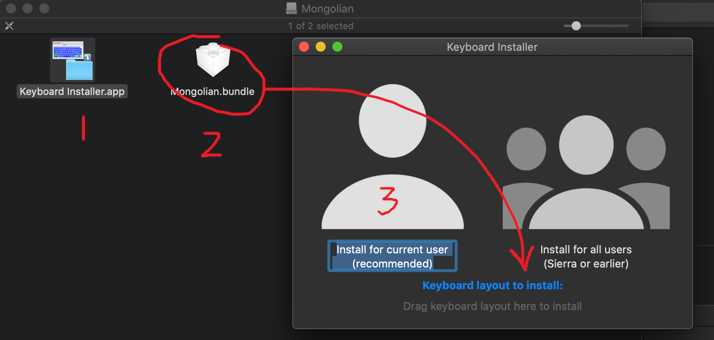

After that log out and then back in to your Mac.

Then go to **System Preferences > Keyboard > Input Source** and click the **+** button.

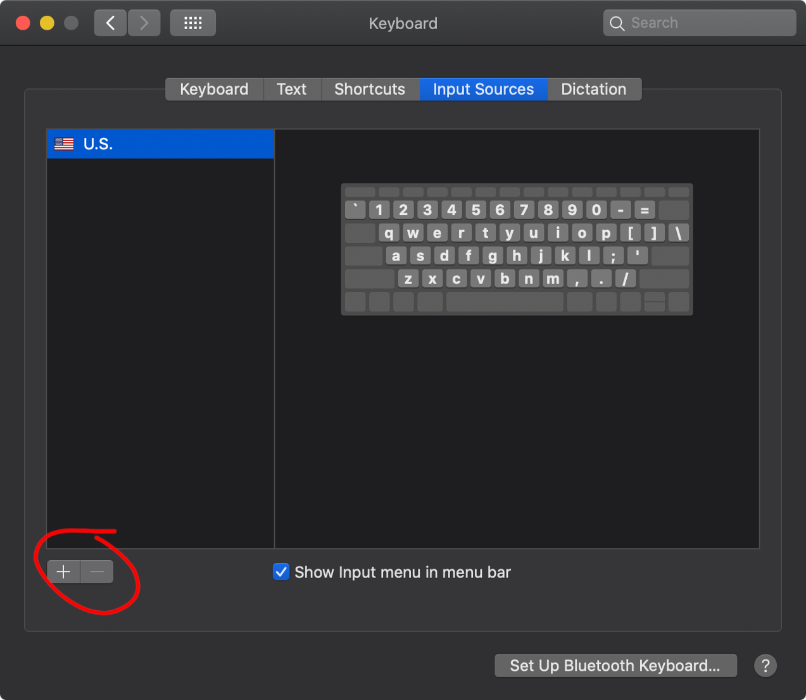

Then type **mongolian** in the search bar. Choose **Mongolian** on the left and **Mongolian (qwerty)** on the right. Then click **Add**.

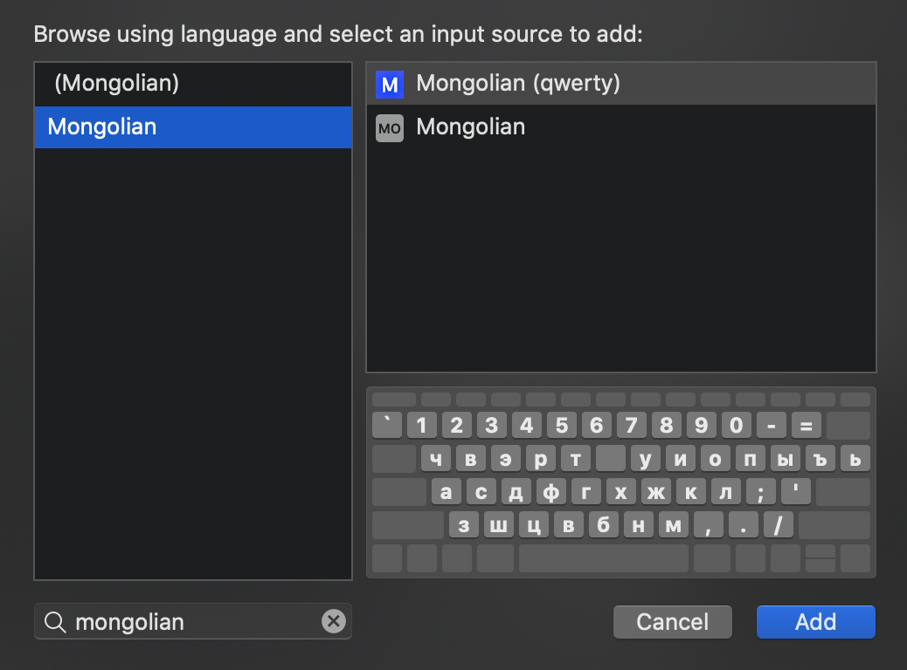

To add the traditional Mongolian keyboard, click **(Mongolian)** on the left and **Mongolian (traditional)** on the right. Then click **Add**.

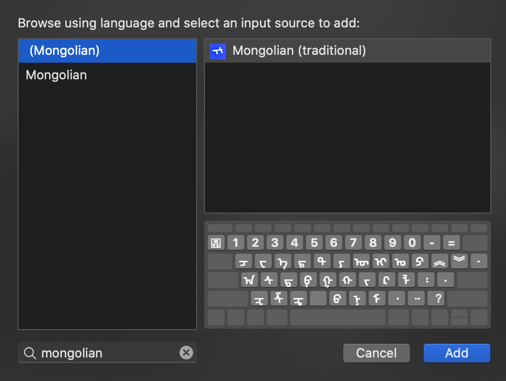

Now you should be able to switch between keyboards from the menu bar:

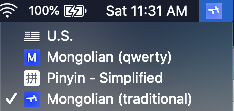

## Traditional Mongolian Keyboard

You have to be a little familiar with Unicode to use this keyboard, but here is the basic layout:

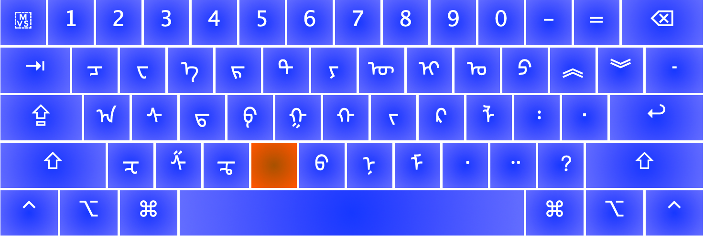

The red key (which is V on your keyboard) is so that you can enter the variation selector keys. For example, V+1 is FVS1, which is useful if you want to write `ᠳ᠋ᠧᠩ` instead of `ᠳᠧᠩ`. Similarly, V+2 is FVS2 and V+3 is FVS3. Also the accent key is MVS, which is useful if you want to write `ᠰᠠᠷ᠎ᠠ` instead of `ᠰᠠᠷᠠ`.

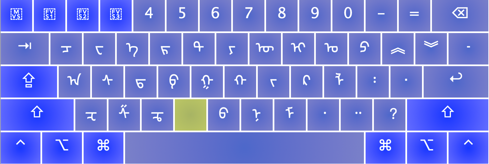

Pressing shift gives you a few other letters that didn’t fit on the main keyboard:

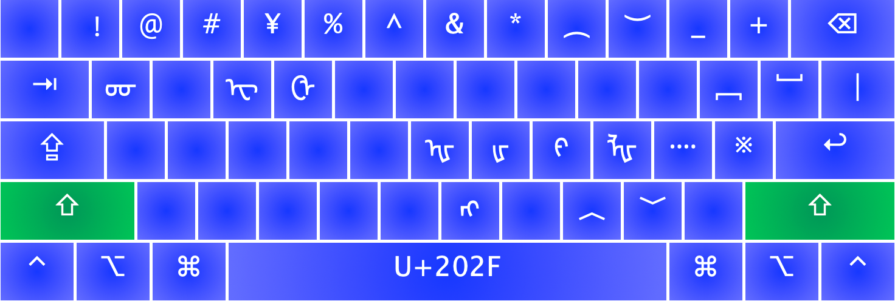

Pressing Shift+Space gives you the narrow non-breaking space (NNBSP) character, which is useful for writing suffix particles like `ᠰᠠᠢᠢᠨ ᠤᠤ` instead of `ᠰᠠᠢᠢᠨ ᠤᠤ`. (The first one should be a correctly formatted uu of sainuu but depending on your computer’s Unicode support, they both might look the same.)

Pressing o without shift gives you the fifth vowel (masculine у) and O with shift gives you the fourth vowel (masculine о). Pressing u without shift gives you the seventh vowel (feminine ү) and U with shift gives you the sixth vowel (feminine ө). There really isn’t a need to use the shift forms since there is never a visual difference, but the option is there for those who care.

Finally, if you want to write the traditional numbers, you can use the Option key:

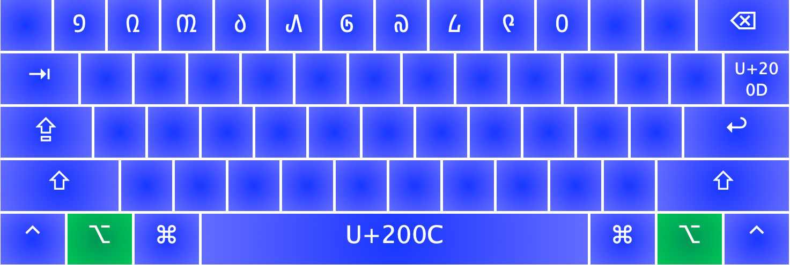

That’s pretty much it. Option+\ is the ZWJ character, but most people probably don’t need that.

Sorry for all the Unicode details. A friend of mine is making a Mongolian Input Editor where you will be able to select words from a list as you type. That won’t need any knowledge of Unicode. I’ll add a link when he finishes it.

If you don’t have a Mongolian font, [this one](http://www.menksoft.com//Portals//_MenkCms//Products//Fonts//MenksoftOpenType1.02//MQG8F02.ttf) from [Menksoft](http://www.menksoft.com/mdls/am/amview.aspx?pid=0&alias=menkcms&iid=168137&mid=15302&wv=U) is good.

If there are any words that you can’t write, you can leave a comment and ask.

## QWERTY Mongolian Keyboard (Cyrillic)

Here is the QWERTY Mongolian keyboard layout for Cyrillic:

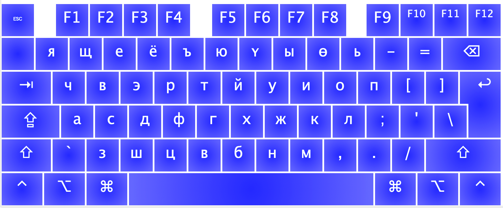

As much as possible I tried to make the Cyrillic correspond to the Latin letters on a keyboard. I used the number keys for some of the extra Mongolian letters. It might help you to remember them if you notice that certain letters are located above related ones. For example, я is above a, e is above э, ү is above у, ө is above o, etc. Two that might be harder to remember are ъ and ь. They are located on the 5 and 0 keys. You can remember that ъ looks a little like a 5 with the top turned backward, and ь looks a little like a 0 if you only look at the bottom loop.

Here’s what you get if you press Shift plus the letter:

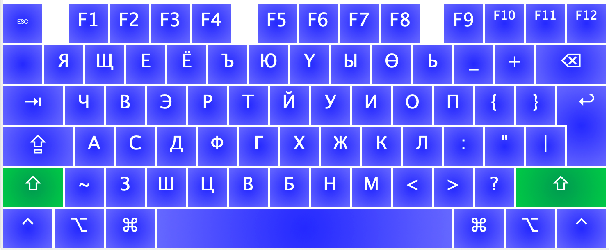

If you need the numbers press the Option key. You even get a few bonus shortcuts:

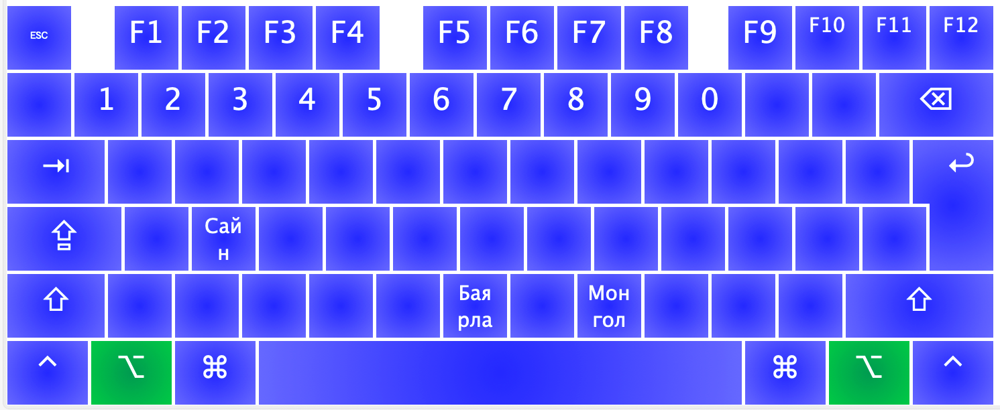

And the symbols can be found with Shift + Option:

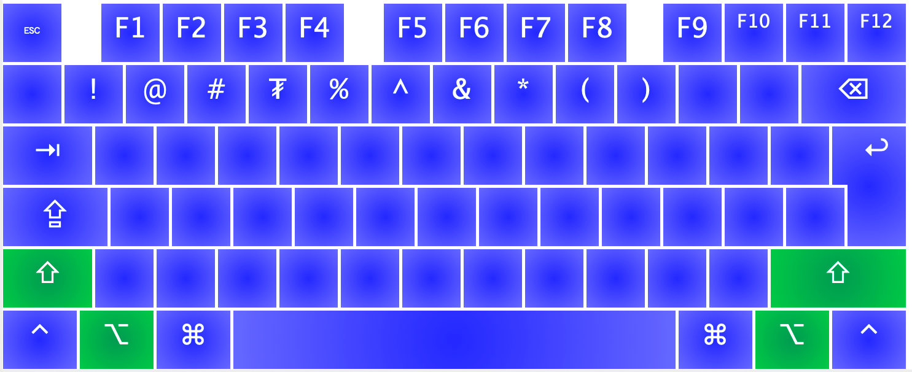

## Standard Mongolian Keyboard (Cyrillic)

If your going to be living in Mongolia for a while, it would probably be worth your time to learn the standard layout for Mongolian keyboards. This is what it looks like:

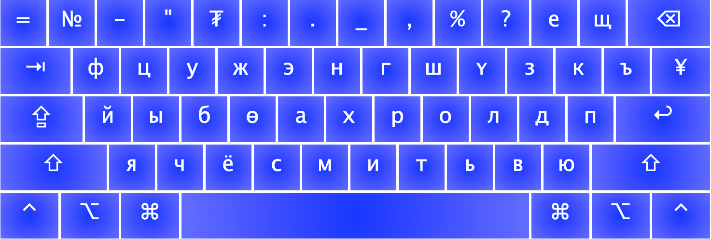

If you don’t like any of the layouts here, you can also make your own. See [these directions for using Ukelele to make keyboard layouts for Mac](https://medium.com/swlh/how-to-make-a-custom-keyboard-for-mac-os-c9f607428372).

If you find bugs in a layout, leave a comment.

---

## Comments

*Do you have a comment or question that would be helpful for others here? Copy the link to this page and [email me](/contact/) your comment or question.* 

---

**сэргэлэн** on February 26, 2024 at 6:39 am

Other URLs could download fonts:
[http://www.mongolfont.com/en/](http://www.mongolfont.com/en/)
[http://oyun.mglip.com/mongolfont/index.aspx](http://oyun.mglip.com/mongolfont/index.aspx) (this one is located inside china mainland, so you may need to VPN to that if you can’t access it)

[http://trans.mglip.com/](http://trans.mglip.com/) (translator for Cyrillic Mongolian and traditional Mongolian)

---

**Shaheen** on April 24, 2025 at 2:13 pm

I’ve got some problem with MVS. I don’t know how to use the MVS button on my MacBook.
I don’t know where I did it wrong, since I tried a + v + mvs / a + mvs / v + mvs +a / copy & paste. Still, I can only get ᠰᠠᠷᠠ, never ᠰᠠᠷ᠎ᠠ.

Can someone tell me where I did it wrong, thx